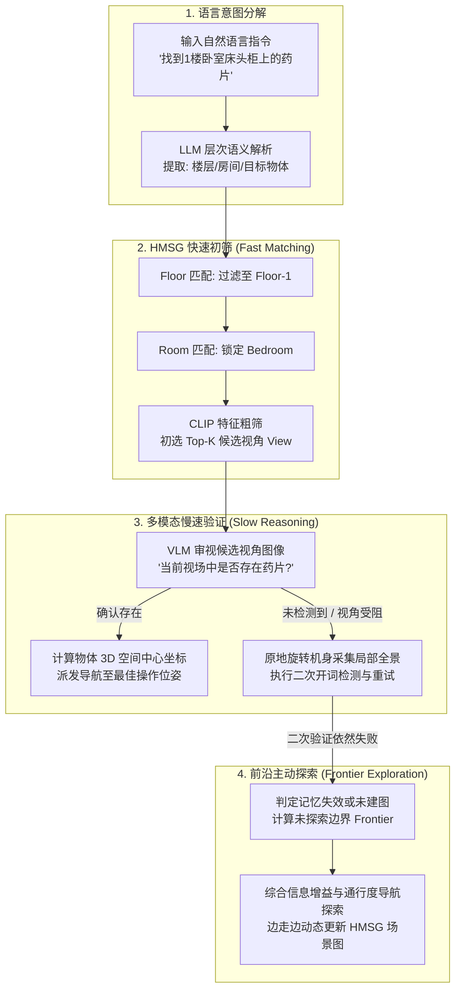
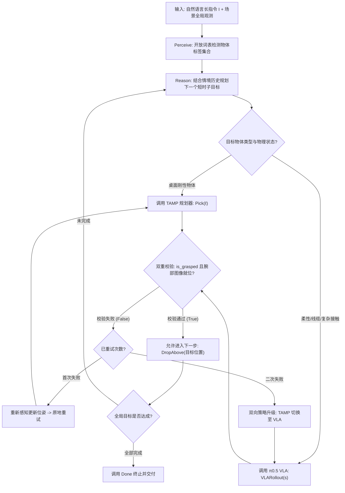
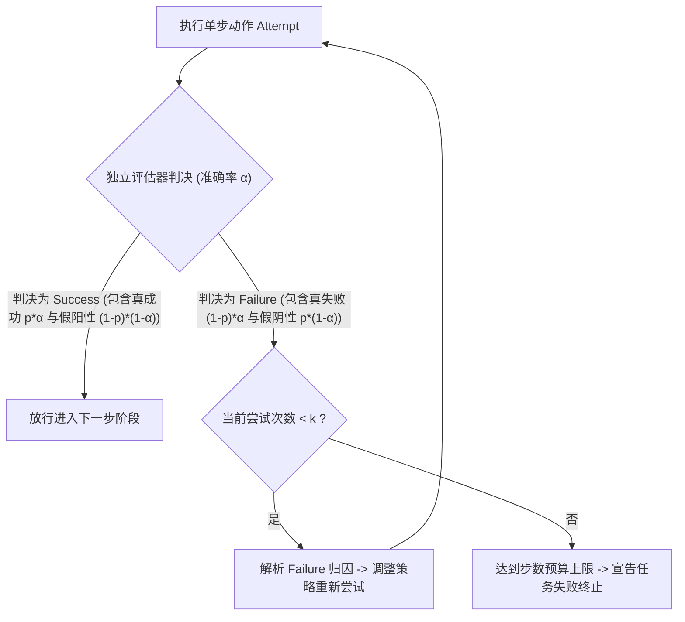
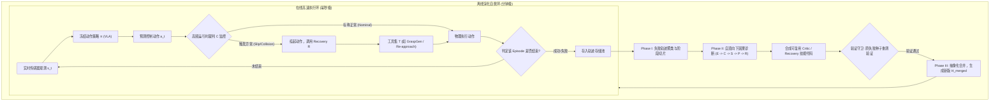
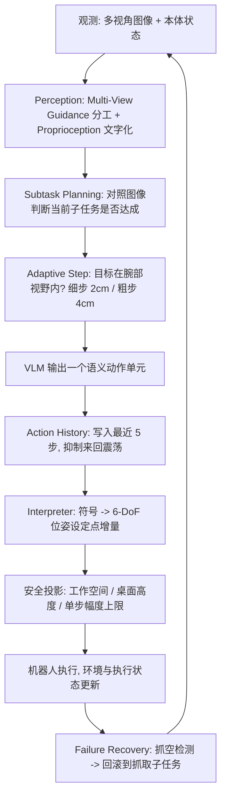

> 本文是 [AI Agent 综述](/AI-Agent-Survey/) 与底层系统架构指南 [具身 Agent Harness 架构综述](/Embodied-Agent-Harness-Survey/) 的配套具身论文精读，系统收录 Embodied Agent（具身智能体）领域的代表性工作与前沿突破。

# 具身智能体经典论文

## 1. HoloAgent-0 (2026) {#holoagent-0}
———统一具身智能体闭环操作系统：解耦异构物理技能，以分层3D多模态空间记忆为物理锚点

📄 **Paper**: [arXiv:2606.23565](https://arxiv.org/abs/2606.23565) · [Code](https://github.com/HorizonRobotics/HoloAgent)

---

### 精华

- **闭环具身运行时架构**：提出面向实体机器人的 Embodied AgentOS 操作系统，将任务规划从单次开环文本生成重构为“观测-检索-行动-监控”的持续闭环，有效填补物理世界的执行不确定性。
- **标准化类型化技能抽象（Typed Skills）**：制定了包含结构化参数、前置条件与运行时心跳状态流的动作规范，将 VLA 抓取、全身运控与主动导航统一封装，屏蔽了异构本体控制器的底层差异。
- **分层多模态场景图（HMSG）**：构建由楼层（Floor）、房间（Room）、视角（View）与物体（Object）组成的四层拓扑结构，巧妙引入“视角层”充当几何坐标与外观推理的桥梁，支撑快慢混合的高效空间检索。
- **开放词表 3D 动态语义建图**：融合多相机神经深度估计与多尺度 SigLIP 特征，结合 3D 实例反投影投影关联算法，在环境发生物理变动时实现局部的轻量级增量刷新。
- **真机异构全栈部署验证**：在 Unitree G1 人形、R1 人形与双臂移动底盘上完成部署，在 ScanNet 语义建图与 HM3D/真机长程导航基准上全面刷新行业指标。

---

### 1. 研究背景/问题

数字世界中的大语言模型智能体依赖结构化的代码或软件接口，具备确定性输入输出、透明的状态转移和可逆的试错成本；然而在物理世界中，机器人的动作执行是连续、不可逆且高度依赖具体机身构型的。由于感知退化、传感器噪声与动态变化，机器人常因环境记忆过时走错房间，或因控制器反馈不全而导致长程任务中断崩溃，这一系统级障碍被称为“具身鸿沟”（Embodiment Gap）。当前具身智能研究往往将 VLA 操作策略、3D 空间表征、全身运动控制和主动导航割裂为单点算法模块，缺乏一个统一的操作系统运行时来调度异构技能、维护持久 3D 空间底座，并基于实时心跳证据驱动故障恢复。

---

### 2. 主要方法/创新点

#### ① 整体框架概述

HoloAgent-0 将长程具身任务组织为一个自闭环的系统工程，整体架构包含三大核心耦合层与一个监控验证层，并通过 ROS2 话题总线实现强类型通信：
- **Embodied AgentOS 运行时层**：接收人类自然语言意图，结合时空记忆将指令编译为带依赖关系的技能图（Skill Graph），并在执行期负责资源调度、执行状态监视与自主重规划。
- **具身技能层（Embodied Skill Layer）**：将底层异构算法和控制器抽象为带有统一接口的类型化技能（Typed Skills），涵盖语音交互、开放词表感知、自主导航（HoloNavi）、双臂操作（HoloBrain）和全身运动（HoloMotion）。
- **具身记忆层（Embodied Memory Layer）**：维护三维公制几何、拓扑导航关系、开放词表 3D 语义体素图，以及由楼层、房间、视角、物体组成的分层多模态场景图（HMSG），同时记录任务进展的时序轨迹。
- **监控与验证层（Monitoring & Verification Layer）**：实时监测技能执行的心跳、置信度与错误模态，向用户提供多模态交互反馈，并在出现不可恢复故障时唤醒 AgentOS 进行动态重规划。

  
<figcaption>HoloAgent-0 闭环端到端运行时架构概览</figcaption>

#### ② 具身技能层与类型化动作抽象（Typed Skills）

在传统大模型工具调用中，智能体通常将底层工具视为黑盒函数，但这在物理机器人上极易导致死锁。为此，HoloAgent-0 提出了结构化的技能抽象契约：
1. **指令规范（Command Schema）**：每个技能显式声明名称、强类型入参、前置条件（Preconditions）以及预期物理后置状态（Expected Effects）。例如操作技能 `pick(object=mug, support=table)` 声明了对抓握物体和支撑平面的前置几何锚定要求。
2. **运行时状态流（Runtime Status Interface）**：执行端不再仅仅返回一个二值化的完成标识，而是通过 ROS2 状态话题持续广播包含进度比例、成功状态、细粒度失败模态（如物体不可达、抓握滑脱、碰撞风险、位姿奇异）、算法置信度、执行延迟以及故障是否可恢复（Recoverability）的结构化追踪数据。

##### 卡点降维 1：数字软件工具调用 vs. 具身类型化技能（Typed Skills）

| 比较维度 | 传统数字智能体工具调用（Software Tool Calling） | HoloAgent-0 具身类型化技能（Embodied Typed Skill） |
|---|---|---|
| **调用性质** | 同步或短时异步 API，输入输出确定、语义边界明确 | 物理世界连续耗时过程，易受动力学噪声、遮挡与传感器漂移干扰 |
| **反馈粒度** | 仅返回最终执行结果或标准报错码 | 持续发布运行时心跳流（包含进度百分比、局部置信度与碰撞风险） |
| **失败模态** | 错误码单一（如 HTTP 404/500），通常无物理副作用 | 细分可恢复与不可恢复模态（如机械臂关节限位、抓握滑动、目标丢失） |
| **恢复机制** | 简单的固定次数异常重试（Retry）或文本报错回传 | 显式暴露可恢复性，驱动 AgentOS 旋转视角重检、导航微调或重新规划 |

> **具体执行流示例**：
> 机器人接收到“把桌上的黄色毛巾放进洗衣篮”指令。
> 1. AgentOS 通过 ROS2 话题下发指令 `pick(object="yellow towel", support="desk")`；
> 2. HoloBrain 操作后端接管控制，在机械臂移动至预抓取位姿时持续回传状态流 `{progress: 40%, status: "in_progress", confidence: 0.88}`；
> 3. 夹爪闭合时触觉与位姿反馈检测到抓空，状态流立即上报 `{progress: 75%, status: "failed", failure_mode: "grasp_slip", recoverability: "recoverable"}`；
> 4. AgentOS 捕捉到可恢复性为真，并未机械重复盲目抓取，而是自动调度感知后端执行视点微调与掩码重估，更新目标物体 3D 边界框后重新发起抓取闭环。

针对不同机身体态，HoloAgent-0 接入了四大专门后端：
- **HoloNavi 空间导航**：承担大范围环境下的目标搜索与路径巡航；
- **HoloBrain 具身操作**：基于通用 VLA 大模型，生成双臂与末端夹爪的末端姿态轨迹，能够自主完成抓取、放置、倒水、折叠衣物等精巧操作；
- **HoloMotion 全身运动**：支持轨迹跟踪模式（用于挥手、鞠躬、握手、跳舞等人机互动动作）和速度控制模式（用于全向行走、转向、紧急避障与摔倒后恢复）；
- **跨机协同能力（Cross-Embodiment Coordination）**：多台异构机器人通过共享的 3D 空间记忆底座与统一步长状态流进行分工，例如轮式移动底盘先行巡检建图并标记目标位置，人形机器人随后精准执行桌面复杂操作。

  
<figcaption>HoloAgent-0 在多样化机器人平台上的真实闭环执行案例（运控、寻物、多机协同、长程折衣）</figcaption>

#### ③ 空间记忆与开放词表 3D 语义建图

空间记忆为机器人的感知与行动提供了统一的公制三维物理底座：
- **统一几何底座**：解耦传感器硬件构型，既支持激光雷达、IMU 与相机紧耦合的公制建图（如 FAST-LIVO），也支持纯视觉的多相机 GeoFlow-SLAM++ 系统。GeoFlow-SLAM++ 借助 3D 基础模型直接从多视角 RGB 图像中预测稠密深度，并通过多相机两阶段光流匹配、点面几何优化与回环词袋检索，在无硬件深度相机的情况下构建高质量度量地图。
- **开放词表语义投影**：在线建图模块将 2D 基础模型的通用语义无缝提升至 3D 点云与体素网格中。

  
<figcaption>HoloAgent-0 开放词表 3D 语义建图与动态场景自适应框架</figcaption>

##### 卡点降维 2：三尺度 SigLIP 语义特征融合与 3D 实例持续关联

在将 2D 特征提升至 3D 空间时，若仅提取单一裁剪区域特征，极易丢失环境上下文；若提取全图特征，又会稀释微小物体的判别度。HoloAgent-0 为此设计了多尺度特征加权融合公式：

$$d = \sum_{i=0}^2 w_i \odot d_i$$

其中 $d_i \in \mathbb R^d$，$w_i \in \mathbb R^d$ 为特征融合权重，$\odot$ 表示阿达玛逐元素积（Hadamard product）。

> **手算特征融合与投影关联的小例子**：
> 假设特征维度简化为 3 维，当前关键帧中检测到一个水杯：
> 1. 提取三个尺度的 SigLIP 嵌入向量：
>    - 全图上下文特征 $d_0 = [0.2, 0.8, 0.1]$（记录了厨房、工作台等大场景信息）；
>    - SAM2 精确分割掩码特征 $d_1 = [0.9, 0.1, 0.3]$（突出水杯的杯体材质与形态）；
>    - 最小外接矩形框特征 $d_2 = [0.7, 0.4, 0.2]$（补充把手和桌面接触边缘细节）；
> 2. 设对应的特征平衡权重向量为 $w_0 = [0.2, 0.2, 0.2]$、$w_1 = [0.5, 0.5, 0.5]$、$w_2 = [0.3, 0.3, 0.3]$；
> 3. 逐元素融合后的最终物体向量为：  
>    $d = (0.2 \times [0.2, 0.8, 0.1]) + (0.5 \times [0.9, 0.1, 0.3]) + (0.3 \times [0.7, 0.4, 0.2]) = [0.70, 0.33, 0.23]$。该向量兼具宏观场景归属与局部外观细节。
> 4. **跨视角 3D 实例关联**：当机器人位移后采集新帧时，系统将已维护的 3D 实例点云 $V_{t-1}$ 通过外参矩阵反向投影回当前相机平面，获得投影预测掩码 $\tilde m_j$。系统计算 $\tilde m_j$ 与当前新分割掩码 $m_k$ 的交并比 $\operatorname{IoU}(m_k, \tilde m_j)$。若交并比大于 0.5，则认定为同一物体并复用唯一实例 ID；若无重叠，则开辟新的 3D 独立实例。

  
<figcaption>跨时间帧 3D 实例反投影投影匹配与持续 ID 追踪机制</figcaption>

#### ④ 分层多模态场景图（HMSG）与快慢混合检索机制

为了兼顾空间范围与感知细粒度，HMSG 将环境信息垂直解耦为四层拓扑结构：
1. **楼层层（Floor）**：记录垂直高度范围与楼层整体语义，粗粒度圈定垂直范围；
2. **房间层（Room）**：包含 2D 多边形几何边界、点云以及房间类型 CLIP 向量，界定功能空间；
3. **视角层（View）**：**HMSG 的核心创新层**。记录机器人历史采样处的 6-DoF 刚体位姿、RGB-D 图像帧以及局部全景描述子；
4. **物体层（Object）**：维护 3D 定向包围盒（3D Oriented BBox）、点云簇与融合后的实例 SigLIP 特征。

  
<figcaption>分层多模态场景图（HMSG）四层结构（楼层-房间-视角-物体）及层级与拓扑边关联</figcaption>

传统场景图直接跨越房间指向离散物体，导致机器人缺乏对真实观测角度与遮挡情况的感知，面对大空间时盲目调用耗时的多模态模型（VLM）更会引发算力崩溃。HMSG 中的“视角层（View）”天然保留了观察者视角与物体的可视链接（Visibility Links），使得系统可以先在公制几何上快速初筛出极少数相关视角，再针对性调用 VLM 进行高质量视觉鉴别。

#### ⑤ HoloNavi 目标导航流水线

基于 HMSG，HoloNavi 导航系统将任务串联为三个环环相扣的执行回路：
1. **分层物体导航（Hierarchical Object Navigation）**：利用语义解析匹配楼层、房间与物体候选，借助分层 CLIP 相似度以毫秒级速度剪枝无关搜索空间；
2. **在线双重验证环（Online Verification Loop）**：当机器人到达候选视点后，实时摄像头画面交由开词检测器与 VLM 双重核验。若初步判定失败，机器人自动原地多角度旋转采集环视视角进行二次重检，确认目标真实坐标后导航至操作安全距；
3. **前沿主动探索环（Frontier Exploration Loop）**：若 HMSG 初始检索落空或在线验证再次失败，系统立即切换至前沿探索模式。根据候选前沿点的信息增益预期、任务语义相关度、可通行性与动力学约束进行综合打分，引导机器人探索未知区域，并在行进中持续执行增量建图与目标嗅探。

  
<figcaption>HoloNavi 物体目标导航全流程：分层语义匹配、在线多重视角验证与前沿增量探索</figcaption>

#### ⑥ 动态时空记忆自适应增量更新（Dynamic Memory Update）

现实世界时刻处于动态演变中。HoloAgent-0 定义了三类触发记忆刷新的核心事件：
- **感知冲突事件**：新传感器数据与既有地图在空间几何或颜色上发生显著偏移；
- **技能操作结果事件**：机器人执行抓取放置（如拿起水杯）使物体脱离原始支撑面，或导航受阻暴露出新障碍物；
- **人类显式反馈事件**：用户通过语音下发了针对房间命名或物体属性的纠错指令。

在执行更新时，记忆层首先利用当前观测在既有几何地图中进行鲁棒重定位，局部清除产生冲突的过期点云与体素，并将新特征融合入局部几何。语义层更新受影响的 3D 实例边界框，HMSG 则**仅对受影响的局部子图进行原位拓扑更新**（重新计算该物体所属房间和可视视角），无需承担重建整张全局场景图的高额开销。

  
<figcaption>动态环境下的局部场景记忆自适应刷新对比（桌面物体移动后局部地图与场景图子图的原位更新）</figcaption>

---

### 3. 核心结果/发现

- **HM3D-ObjNav 仿真基准导航性能跃升**：在无硬件噪声的标准仿真基准下，搭载 AgentOS 闭环的 HoloAgent-Nav 取得了 **82.6% 成功率（SR）** 与 **42.8% 路径长度加权成功率（SPL）**，全面大幅领先业内现有的代表性导航方案，如 MSGNav（74.1% SR / 33.4% SPL）、WMNav（72.2% SR / 33.3% SPL）以及开环状态下的 FSR-VLN（80.8% SR / 41.0% SPL），证实了闭环监控和重试重规划机制能够在保证路径高效性的同时显著提升复杂任务完备率。
- **真实物理公寓长程导航卓越鲁棒性**：在真实室内公寓的多目标寻找评测中，HoloAgent-Nav 在最严格的 Top-1@1.0m 命中标准下达到 **97.70%** 的真实到点率，Top-5 到点率达到 **98.90%**；作为对比，同场景下的知名基线 OK-Robot 仅有 60.92%，HOV-SG 仅有 51.72%，MobilityVLA 仅为 34.48%。更引人注目的是，HoloAgent-Nav 在 1.0m、2.0m 与 3.0m 的不同判定阈值下得分完全一致，说明成功样本皆精准逼近至 1.0m 内的核心操作区，表现出极其稳健的位姿停靠精度。
- **高质量开放词表 3D 语义建图**：在 ScanNet 数据集上，HoloAgent-Memory 以在线（Online）计算模式斩获 **31.58% mIoU** 和 **61.58% 频率加权准确率（f-Acc）**，性能明显压倒其他在线建图算法（如 Open-Fusion 的 18.02% mIoU、Concept-Graph 的 16.29% mIoU），甚至逼近了离线计算的大模型映射算法，为上层智能体提供了坚实准确的高质量语义索引底座。
- **真机多形态复杂长程复合任务落地**：成功在 Unitree G1/R1 双足人形与双臂移动平台上完成了包括“从卧室寻物”、“多机语音协同伴舞引导”以及极具挑战的“长程移动洗衣折叠”（涵盖从移动底盘自主巡航到目标工位、双臂柔性衣物分拣抓取、台面平铺到精细对折）等多项闭环任务。

---

### 4. 局限性

- 目前机器人具身基础模型仍无法单模型无缝覆盖从大范围空间导航、精细双臂操作到全身力矩级运动控制的完整动作频谱，系统对不同物理构型的跨本体迁移仍依赖工程化控制器桥接与动力学调优。
- 业内尚缺乏涵盖操作、多模态导航与全身动态交互的端到端统一长程真机评测基准，且对于大尺度复杂建筑场景，长时序跨视角特征融合的延迟与细粒度几何重建精度仍有进一步提升空间。

## 2. Pigey (2026) {#pigey}
———Addressing the Orchestration Gap in Generalist Robots via Physical Agency

📄 **Paper**: [arXiv:2607.21725](https://arxiv.org/abs/2607.21725)

---

### 精华

- **揭示具身智能的“编排鸿沟”（Orchestration Gap）**：指出当前通用机器人主要瓶颈并非低层运动控制能力的匮乏，而在于缺乏能够统筹感知、规划、校验与恢复的闭环编排架构；单体端到端模型直接提示时极易过拟合与盲目执行，导致性能大幅受限。
- **纯推理期闭环物理 Agent（无需任何新训练）**：构建由前沿视觉语言模型（Frontier VLM）驱动的闭环编排器 Pigey，将复杂长时程指令分解为短时子目标，仅通过高层感知与工具调用组织底层的冻结运动策略，完全无需重新训练或微调低层权重。
- **几何规划（TAMP）与神经策略（$\pi_{0.5}$）互补双后端**：将确定性任务与运动规划（TiPToP）与端到端视觉运动策略（$\pi_{0.5}$）解耦整合——刚性物体使用带几何确定性的抓放规划，可形变物体、接触密集操作或规划受挫时无缝升级到 VLA。
- **传感器与腕部视觉保守双重校验机制**：拆分开环的“抓-放”原子动作，在抓取后利用夹爪宽度传感器（`is_grasped`）结合腕部相机图像进行严格保守校验；若未稳固抓取则立即原地重试或升降级，从根源上杜绝“空夹爪投递”的复合误差。
- **分布外与真机长时程任务性能飞跃**：在强扰动基准 LIBERO-PRO 上将冻结的 $\pi_{0.5}$-LIBERO 零样本成功率从 12.8% 飙升至 53.3%；在真实 DROID 机械臂 30 项复杂长时程评测中达成 97.3% 的总成功率（基线 $\pi_{0.5}$ 仅 16.7%）。

---

### 1. 研究背景/问题

随着大模型与机器人技术的发展，机器人领域普遍倾向于构建庞大的单体式视觉-语言-动作（VLA）模型，期望通过大规模预训练将高层语义理解、常识推理、空间规划、成功检测、异常恢复与底层毫米级电机控制全部揉进同一个神经网络。然而，这种单体式端到端范式面临着难以克服的现实瓶颈：

1. **指令敏感与语义退化**：在端到端策略中，高层自然语言指令常常退化为微弱的先验条件，模型极易陷入对特定训练轨迹的机械记忆，面对场景扰动（如目标位移、遮挡物、目标已被占用）时完全丧失调整能力；
2. **开环执行与复合误差**：现有的代码生成式规划（Code-as-Policies）或传统任务与运动规划（TAMP）往往依赖一次性离线生成，在执行阶段处于开环盲跑状态；一旦中间发生抓取滑脱或碰撞，系统仍按预定轨迹机械推进，最终彻底失败；
3. **编排能力的缺失**：真正的物理通用性要求系统拥有“物理主体性”（Physical Agency）——不仅知道“该做什么”，更要在执行中时刻观察“做成了没有”，并在未成功时主动重试、绕开障碍或变换手段。

**核心问题**：在完全不重新训练或微调底层运动策略的前提下，能否仅通过推理期的闭环物理编排框架，释放预训练冻结策略的全部潜力，跨越通用机器人的“编排鸿沟”？

---

### 2. 主要方法/创新点

Pigey 的核心思路是**控制与编排解耦**：底层仅保留两个冻结的运动执行器（TAMP 规划器与 $\pi_{0.5}$ VLA），上层由前沿 VLM（如 Claude/GPT 等多模态前沿大模型）构成闭环决策大脑，运行“感知（Perceive）→ 推理（Reason）→ 行动（Act）→ 校验（Verify）”的物理执行循环。

  
<figcaption>Pigey 闭环物理 Agent 系统架构：前沿 VLM 作为编排器统筹感知、推理、执行与双重校验，向下路由至冻结的 TAMP 与 VLA 运动后端</figcaption>

#### ① 整体框架概述

Pigey 作为一个封闭循环的具身智能 Agent，在接收到全局长指令 $I$（例如：“有小孩来访——将玩具放在盘子里，危险物品收进盒子里”）后，维护全局上下文历史 $h$。在每一步交互中，VLM 仅选择并调用一个结构化工具（Tool Call），获取物理世界传感器与相机的真实反馈，并据此更新内部状态，直至所有子目标全部达成并调用 `Done` 终止。

系统将原本由单个大模型独自承担的复杂职责拆分为清晰的模块链：
- **开放词表目标感知与空间锚定**：利用开放词汇检测器锁定场景内物体及其标签，限制高层规划的词表空间；
- **任务级长时程记忆**：维护已完成操作、当前夹爪持有物及桌面剩余物品清单；
- **几何与神经双运动后端**：刚性抓放走可解析验证的 TAMP，不规则/接触密集操作走 VLA；
- **保守双重校验与双向升降级引擎**：传感器信号与视觉判定互为兜底，驱动重试、清障与策略切换。

  
<figcaption>Pigey 在真实机器狗/机械臂场景中展现的物理推理能力：演绎推理、安全常识、障碍排除、长时程场景记忆与空间几何堆叠</figcaption>

#### ② 逐模块讲解

- **感知与目标语义锚定（Perceive & Grounding）**
  - **输入**：多视角相机图像（主视角与腕部视角）以及底层机器人关节状态。
  - **处理**：调用开放词汇检测器生成带有边界框和语义标签的物体候选集。这些检测标签严格构成 Pigey 的“受控词表”（Vocabulary），所有抓取或放置操作的参数必须直接引用检测标签。
  - **输出**：结构化场景感知字典，包含物体标签列表、腕部局部高分辨率图以及当前夹爪状态。
  - **设计动机**：杜绝语言模型在物理交互中凭空臆造未见物体名称，将高层模糊概念（如“危险品”、“素食”、“最小的容器”）直接接地到物理场景中已被定位的具体实体。

- **解耦互补的双运动后端（Frozen Motor Backends）**
  - **TAMP 几何后端（`Pick(ℓ)` / `DropAbove(ℓ)`）**：基于 TiPToP 框架构建，负责空间无碰撞运动规划与六自由度几何抓取位姿生成。Pigey 进行了关键重构——将原本打包成单次开环执行的 Pick-and-Place 强行切断为两个独立的工具调用，在抓取与放置之间插入物理校验。
  - **VLA 神经后端（`VLARollout(s)`）**：封装冻结的预训练 $\pi_{0.5}$ 闭环视动作控制模型，接收简短的纯文字子动作描述 $s$（如 `“grasp the cable”`），直接输出连续的高频末端位移和夹爪开合。
  - **协同机制**：桌面平铺的常规刚性物体优先调用 TAMP，获得极高的轨迹确定性；堆叠物体、易形变物体（如线缆、毛绒玩具）或深层容器内的物体，直接交由具备柔顺控制特性的 VLA 求解。

- **保守双重物理校验（Conservative Dual Verification）**
  - **输入**：夹爪内嵌位移传感器读取的布尔量 `is_grasped`，以及动作执行完毕后的手眼（腕部）相机快照。
  - **处理**：硬件传感器用于确认物理夹持间隙是否处于夹取阈值内；前沿 VLM 同时观察手腕相机，判断视野中目标物体是否已被移离原位并处于夹爪中心。
  - **保守合成规则**：两者采取最悲观策略——即使运动后端报告执行完毕，只要 `is_grasped == False` 或视觉显示目标仍在台面上，步骤即刻判定为失败并撤销后续动作。

#### ③ 卡点降维与决策流图

具身智能领域的读者常常困惑：**为什么单体端到端模型（如 $\pi_0$ / $\pi_{0.5}$）在大规模预训练后，依然无法胜任带有扰动的简单抓放？Pigey 的闭环编排究竟改变了什么？**

我们通过自制 Mermaid 决策流图与对比表拆解其内在机制：

为进一步看清 Pigey 对传统机器人控制范式的颠覆，对比表如下：

| 维度 | 端到端单体 VLA（如 $\pi_{0.5}$ / OpenVLA） | 开环代码规划（Code-as-Policies / TiPToP） | 闭环物理 Agent（Pigey 本文） |
|---|---|---|---|
| **控制分工** | 语言理解、规划、校验与运动控制全部耦合于单一大模型 | LLM 生成完整 Python 代码或动作计划，底层开环跑完 | 前沿 VLM 仅负责闭环编排与校验，动作全委托给冻结策略 |
| **执行模式** | 步进自回归，缺乏宏观任务状态反思 | 一次性规划，执行期对物体滑脱与环境变动“失明” | 每次工具调用后必经传感器与视觉双重校验，动态闭环推进 |
| **异常恢复** | 极差（抓空后继续对空夹爪做后续放置动作） | 无（规划失败或执行中断直接抛出异常死机） | 原生支持障碍物移开、放回重抓、TAMP 与 VLA 双向升降级 |
| **训练成本** | 需要数万小时真机轨迹重新微调/后训练 | 无需训练，但依赖理想化仿真环境 | **零微调**，完全利用现成冻结预训练模型与经典规划器 |

> **举个例子（目标位移与抓空恢复）**：
> 假设任务是“把红色杯子放进托盘”。
> - **单体 VLA / 开环规划**：计算出抓取轨迹并直接连贯执行放置。如果在机械臂下探时杯子被碰歪滑脱，机械臂依然会闭合空夹爪移到托盘上方松开，并自认为“任务完成”，最终彻底失败。
> - **Pigey 闭环处理**：
>   1. 执行 `Pick(red_cup)`；
>   2. 机械臂闭合后，夹爪宽度传感器返回 `is_grasped = False`，腕部图像检测到杯子还在原位；
>   3. Pigey 拦截后续 `DropAbove` 动作，记录抓取失败；
>   4. 触发 `Perceive` 重新检测位移后的杯子精确坐标，更新抓取姿态并二次重试；若二次仍未抓稳，则主动将后端升级为具备柔顺容错的 `VLARollout` 实施触觉抓取，最终确保杯子稳妥入盘。

---

### 3. 核心结果/发现

论文在模拟基准 LIBERO-PRO 以及基于真实 Franka 机械臂的 DROID 工作台上进行了系统对比评测，充分验证了推理期物理编排对模型能力的倍增效应。

#### ① LIBERO-PRO 仿真基准评测

LIBERO-PRO 是业内针对复杂长时程桌面操作的高难度扰动测试基准，引入了物体位置调换（Obj. swap）、目标属性变换（Goal swap）以及空间几何扰动（Spatial swap/task）等 6 种严苛扰动套件。

  
<figcaption>LIBERO-PRO 六大扰动套件下的成功率对比：保持底层冻结权重完全不变，仅改变推理编排机制</figcaption>

- **原版 SOTA VLA 性能严重滑坡**：以开环提示直接运行时，即使是目前最顶尖的 $\pi_{0.5}$-LIBERO，在面对微小空间或目标扰动时平均成功率仅有 **12.8%**，且在多个任务中直接归零，证明端到端策略对训练集轨迹产生了严重的过拟合。
- **Pigey 达成 SOTA 突破**：在完全不使用任务特异性记忆、不微调任何权重的零样本设定下，Pigey 将冻结策略的平均成功率一举提升至 **53.3%**，相比原始策略实现了超 4 倍的性能提升，大幅超越了代码生成基线 CaP-Agent0（18.2%）。

#### ② 真实机械臂（DROID）能力测试

在真机实验中，研究团队设置了 8 大核心能力维度的 30 项严苛长时程任务，包括常识推理、条件逻辑、空间推理、清障安全推理、错误主动恢复及长时程记忆恢复等。

  
<figcaption>真实机械臂 DROID 上的 8 类能力探针成功率（%）：底层均运行相同的 π0.5-DROID 权重</figcaption>

  
<figcaption>真机长时程执行与单帧推理链展示：在素食挑选任务中识别非素食并依次放入碗中</figcaption>

- **综合成功率 97.3% vs 16.7%**：直接提示下的 $\pi_{0.5}$-DROID 在需要常识推理、多步逻辑与空间几何的任务上近乎全军覆没（成功率均为 0%），总成功率仅 16.7%；而 Pigey 借助闭环常识编排与回溯校验，在绝大部分类别上均斩获 100% 的满分，总成功率高达 **97.3%**。
- **真机异常恢复实录**：在放置目标被外物占用（如咖啡杯内已有杂物）时，Pigey 能够自主推理出“先取出杂物、放置在旁边、再放入目标物体”的级联恢复逻辑；在盲盒遮挡目标时，能够推断目标处于盒子下方并主动掀盒取物。

---

### 4. 局限性

1. **依赖前沿大模型的视觉理解与推理时延**：由于在每步关键动作后都需要调用云端或高规格 VLM 进行视觉反思与决策重感知，整体任务执行节奏受限于 API 通信与推理吞吐，交互延迟高于单体端到端模型；
2. **底层动作策略的物理极限不可逾越**：编排器虽然能够极大地修复逻辑与抓取时序错误，但若两个底层运动后端（TAMP 求解器与 $\pi_{0.5}$）均由于奇异点、碰撞死锁或物理形变失真而无法生成有效末端轨迹时，上层 Agent 仍然难以无中生有完成物理接触。

---

## 3. Thea (2026) {#thea}
———Towards the Harness of Embodied Agents

📄 **Paper**: [arXiv:2608.11246](https://arxiv.org/abs/2608.11246) · [Code](https://github.com/EIT-HAI/Thea) · [Project Page](https://eit-hai.github.io/thea)

---

### 精华

- **将“代码 Agent Harness 范式”迁移至具身物理世界**：类比软件工程中 Claude Code、Codex 的成功本质在于测试反馈闭环（Harness）而非单体模型本身，指出具身智能实现复杂长时程任务的关键同样在于构建连通物理现实的闭环 Harness 基础设施。
- **补齐物理世界缺失的两大信号基础设施**：软件世界天然具备“读取世界状态”（文件树/AST）与“判断动作结果”（退出码/报错调用栈），而物理世界两者皆无。Thea 创新性提出 **SceneGraph as Context**（场景图即上下文）与 **Evaluation as Exit Codes**（评估器即退出码）两大基石机制，实现物理闭环。
- **严格可靠性理论确立评估准确率 $\alpha$ 的理论上界**：从数学上证明长时程任务开环成功率随步数 $n$ 呈指数几何衰减（$P_{\text{open}} = \prod p_i \to 0$）；闭环 Harness 的纠错上限严格取决于独立评估器的判定准确率 $\alpha$（“Harness 的上限由其判官决定”）。
- **解耦模型与本体的跨平台可移植性**：定义了标准化具身 Profile 与 Tool 抽象契约，模型（LLM/VLM）与硬件本体（双足人型 Unitree G1、仿生人形 Astribot S1、双臂轮式 AgileX Cobot Magic）双向可插拔更换，单套架构通吃跨本体部署。
- **长时程复合任务性能大幅跃升**：在多阶段复杂任务（L1~L3）真实物理评测中，随着任务复杂度与步数攀升，传统端到端策略（ACT、$\pi_{0.5}$、LingBot-VLA）成功率急剧下跌至 30%~40%，而 Thea 在最高难度 L3 仍保持 **87%** 的超高成功率。

---

### 1. 研究背景/问题

编程智能体（Coding Agents，如 Claude Code、SWE-agent）的爆发彻底改变了软件工程。这类系统的成功并未寄托于“一次性写出完美代码”的超人模型，而是源于由编译器、测试框架与 Git 组成的**测试与重试闭环机制（Harness）**——智能体在编写代码后运行测试、捕获堆栈错误、反思修改并反复迭代，直到测试通过。

当研究人员试图将这一高效的 Harness 范式平移到物理世界时，遭遇了本质性的结构鸿沟。软件世界中耗费数十年积累起来的底座支撑在物理世界中全部缺失：
1. **状态无法原生“读取”**：代码世界拥有清晰的文件系统与类型符号；而物理机器人的传感器只吐出混乱非结构化的高维连续点云与图像像素，大模型无法直接将其作为精确的可推理上下文；
2. **动作无法原生“判定”**：运行程序若出错会立即返回明确的非零退出码（Exit Code）与堆栈跟踪（Stack Trace）；但在现实中，机械臂伸手抓取如果抓空、脱手或发生碰撞，物理世界是一片沉默的，既不会返回状态码，也不会主动通知“动作已结束”，导致开环执行中错误无限累积。

**核心问题**：如何在物理世界中构建一套能够提供“持久可读状态”与“精准退出码判定”的具身 Harness，使高层语言/多模态模型能够可靠编排底层异构运动策略，实现长时程任务的闭环自愈？

---

### 2. 主要方法/创新点

Thea 构建了一个将前沿决策模型（Model）与多样化机器人本体（Body）解耦编排的具身闭环 Harness，通过结构化上下文演进、标准化工具接口与独立后置评估器闭合了具身控制回路。

  
<figcaption>Thea 具身 Harness 系统全景：将模型（Model）与本体（Body）完全解耦，通过可调用的工具（Tool）、场景图上下文（Scene graph）与独立评估器（Evaluator）建立感知-行动-校验闭环，并在三种迥异本体上验证</figcaption>

#### ① 整体框架概述

在 Thea 架构中，具身 Agent 由四大核心组件构成：
1. **模型（Model）**：高层大语言/视觉语言模型，仅负责理解任务、阅读动态上下文，并输出结构化工具调用；
2. **本体与工具层（Body & Tools）**：将底层移动导航、机械臂抓取、技能策略（如 ACT、扩散策略、$\pi_0$）统一封装为具备前置检查（Pre-hook）与后置触发（Post-hook）的标准化 Tool；
3. **场景图上下文（SceneGraph as Context）**：从连续感知流中沉淀持久、符号化、带 3D 边界框与拓扑关系的场景图，类比软件工程中的文件系统；
4. **退出码评估器（Evaluation as Exit Codes）**：在每次动作结束后由系统结构化触发的独立视觉评估器，返回三态执行裁决（Success / Failure / In-progress）及失败归因。

  
<figcaption>SceneGraph as Context：将传感器连续多模态观测与评估器确认的动作结果融合为统一符号场景图，生成精简简报（Brief）按轮次刷新注入上下文，支持按需深度查询</figcaption>

#### ② 逐模块讲解

- **SceneGraph as Context（世界状态的可读化）**
  - **输入**：RGB 图像、深度图、LiDAR 点云，以及底层里程计上报的机器人位姿。
  - **处理**：系统利用感知流水线将连续物理空间离散化为包含物体中心坐标、3D 边界框、可见置信度及空间拓扑关系（如 `on(bowl, table)`、`near(robot, table)`、`holding(gripper, cup)`）的动态图结构；只有经过评估器确认为真实成功（Confirmed）的动作结果，才会写入图的拓扑关系变更中。
  - **输出**：每轮决策前将图提炼为高层结构化简报（Scene graph brief）推入刷新上下文（Refreshed context）；模型亦可通过引用 ID（Ref-keyed queries）按需调用工具查询某特定物体的历史高清快照与详细几何属性。
  - **设计动机**：彻底解决长时程多轮交互中上下文被海量连续视频/图像 token 挤爆的问题，赋予大模型类似“阅读项目代码结构树”般的场景理解能力。

- **Evaluation as Exit Codes（动作结果的裁决化）**
  - **触发机制**：由 Harness 在每次操作执行后通过内置后置钩子（Post-hook）强制结构化触发，剥夺底层执行策略“自评自夸”的裁判权。
  - **处理过程**：评估器仅接收当前时刻的视觉观测和该工具声明的后置断言（Post-condition），完全独立于高层决策模型；输出三态判定——`Success`（成功）、`Failure`（失败并附带详细因果解释，如“因末端偏移未抓稳”、“目标被抽屉挡住”）、`In-progress`（动作仍在长时推进中未超时）。
  - **输出**：将裁决与失败归因打包为退出码响应注入对话历史，供决策模型进行针对性重试或方案切换。

  
<figcaption>Evaluation as Exit Codes 触发时序：模型调用 Tool 执行策略，执行结束后由 Harness 后置钩子主动触发独立 Evaluator，产出带失败原因的三态判决反馈给模型</figcaption>

#### ③ 卡点降维与理论推导

**卡点 1：软件 Harness 与具身物理 Harness 究竟如何对应？**

| 维度 | 软件工程 Agent（如 Claude Code / SWE-agent） | 传统机器人控制（单体 VLA / 示教回放） | 具身物理 Harness（Thea） |
|---|---|---|---|
| **状态载体** | 文件系统目录树、AST、文本代码 | 瞬时单帧/多帧连续相机图像像素 | **SceneGraph as Context**（持久化 3D 拓扑符号场景图） |
| **动作输出** | 终端 Shell 命令、文件编辑 Patch | 连续关节角度/末端 6-DoF 轨迹点 | 封装为标准化前/后置 Hook 的语义 Tool（如 `grasp(ref)`） |
| **执行反馈** | 操作系统返回码（Exit 0 / 1）、Stack Trace | 无任何反馈，动作结束即盲目进行下一步 | **Evaluation as Exit Codes**（三态判决 + 结构化失败诊断原因） |
| **纠错机制** | 阅读错误日志，重写代码重新编译 | 无法纠错，抓空后直接空手跑完后续长序列 | 读入失败归因，微调位姿重试或主动搜寻隐藏目标 |

**卡点 2：为什么说“Harness 的上限由其评估器准确率 $\alpha$ 决定”？**

在长时程多步具身任务中，假设一个任务包含 $n$ 个顺序阶段，单步成功率为 $p_i$。
- 在传统的开环模式下，任务成功要求每一步都必须成功：
  $$ P_{\text{open}} = \prod_{i=1}^n p_i $$
- 当 $n$ 较大时（例如 $n=5$），即使单步成功率高达 $p=0.8$，总成功率也会迅速退化到 $0.8^5 \approx 32.8\%$。

Thea 引入了最大重试次数为 $k$ 的检测-重试回路。评估器以准确率 $\alpha$ 做出正确判定，以 $1-\alpha$ 做出误判。论文严格证明，由于评估器存在**假阴性**（把真正成功误判为失败导致多余重试损坏成果）和**假阳性**（把失败误判为成功导致错误向下渗透），系统每步的净通过可靠度直接被 $\alpha$ 锁死：

> **举个例子（可靠性倍增的具体数字）**：
> 设 $n=5$ 步的长时程送物任务，各步底层策略成功率 $p=0.8$：
> - **开环运行**：总成功率仅 $0.8^5 = 32.8\%$；
> - **Thea 闭环（评估器精度 $\alpha=0.95$、允许重试 $k=3$ 次）**：单步在重试与精准放行下的有效可靠性跃升至 $97.6\%$，整个 5 步长任务的总成功率达到 $0.976^5 \approx 88.5\%$，实现了近 **3 倍** 的任务级可靠性增益！

---

### 3. 核心结果/发现

Thea 在多样化硬件平台（Unitree G1 人形机器人、Astribot S1 柔性人形机器人、AgileX Cobot Magic 轮式双臂协作机器人）上开展了全面的真实物理实验验证。

  
<figcaption>跨越不同难度等级（L1 基础操作、L2 空间组合、L3 长时程长距离多阶段交互）的任务成功率对比：随着任务步数拉长，基线模型断崖式下跌，而 Thea 保持卓越的鲁棒性</figcaption>

#### ① 随任务复杂度扩展的绝对优势

评测将任务按时程与阶段复杂度划分为 L1、L2、L3 三级，对比了 ACT、$\pi_{0.5}$、LingBot-VLA-V2、CaP-X、SayCan 等主流单体或分层基线：
- **L1 基础层（短时程单步）**：各基线与 Thea 差距不大，成功率均在 80%~95% 之间；
- **L2 进阶层（含空间重排与多步依赖）**：单体策略开始出现轨迹漂移与抓空失序，成功率降至 55%~80%，Thea 达到 **90%**；
- **L3 终极层（跨房间长距离导航 + 抽屉拉开检索 + 目标物体抓取与送递）**：单体模型（如 $\pi_{0.5}$、LingBot）因累积误差暴跌至 **40%**，SayCan 因缺乏细粒度几何与闭环校验仅为 53%，而 Thea 凭借闭环重试与场景图记忆维持了 **87%** 的成功率。

  
<figcaption>Thea 驱动下涌现的多样化物理智能行为：(a) 跨房间自主取电并递送充电宝；(b) 目标未见时主动拉开抽屉分层检索；(c) 根据评估器反馈的失败原因微调位姿二次抓取；(d) 目标饮料缺货时主动发起人机对话协商替代品；(e) 单套 Harness 跨三种完全不同的机器人本体无缝迁移</figcaption>

#### ② 闭环涌现出的高级物理行为

得益于通用 Harness 架构对工具的动态闭环编排，机器人展现出若干过去单体模型无法实现的高阶涌现行为：
- **主动环境探索（Active Perception）**：在场景图中未检索到充电宝时，模型主动规划出“导航至柜台 → 调用拉抽屉工具 → 俯仰手腕相机观察抽屉内层”的探测链路；
- **针对性故障诊断与纠偏（Diagnosed Recovery）**：当抓取易拉罐因距离过远滑脱时，评估器返回 `“Fail: target slipped due to hand clearance offset”`，模型在下一轮主动生成 `reposition(base, delta=[-0.05, 0])` 调整底座微距离后再次成功抓取；
- **人机协同交互（User Clarification）**：用户要求递送特定矿泉水但桌面仅有果汁与茶饮时，Agent 自主挂起物理执行，通过手机端接口向用户提问协商替代品。

---

### 4. 局限性

1. **场景图维护计算开销与延迟瓶颈**：随着室内探索空间不断扩张，3D 实例点云分割与实时拓扑图合并的计算开销显著增加，可能导致轮次决策出现明显卡顿；
2. **三维遮挡与极端形变下的评估器误判风险**：评估器依赖单视角或手眼相机的视觉反馈，在强反光、细小物体遮挡或极端光照条件下仍可能发生误判，而误判一旦发生将直接限制系统的最终可靠性。

---

## 4. Zetta (2026) {#zetta}
———An Efficient Closed-Loop Embodied Harness for Self-Evolving Physical Intelligence

📄 **Paper**: [arXiv:2608.16590](https://arxiv.org/abs/2608.16590) · [Project Page](https://air-embodied-brain.github.io/zetta)

---

### 精华

- **提出面向自演化物理智能的具身闭环 Harness**：针对端到端单体 VLA/WAM 缺乏执行期微观校正、而传统事后反思（Post-hoc Reflection）难以归因高频物理交互的困境，构建集高频在线裁判、就地异常恢复与离线技能蒸馏于一体的自演化系统 Zetta。
- **结构化可演化 Harness 抽象（$H = \{C, R, T\}$）**：将底层运动策略与高层编排指挥官保持冻结，将 Harness 解耦定义为运行时裁判集合 $C$、恢复动作库 $R$ 与异构工具集 $T$。物理试错经验直接蒸馏为参数化代码模块，随交互轮次自主进化。
- **自顶向下最小干预分层因果诊断**：确立“若高层逻辑能解决，绝不改动底层参数”的核心原则，按优先级自顶向下排查（评估 → 裁判 → 状态 → 规划 → 恢复 → 参数），杜绝过拟合单一用例导致的泛化崩塌。
- **发现具身物理智能的“顿悟时刻”（Robotic "Aha Moment"）**：揭示了具身自演化非线性跃迁的客观规律——初期针对表象的修补使性能处于低位平台期，一旦定位根因并进化出关键的“裁判-恢复”闭环机制，任务成功率呈现瞬间垂直拉升（如从 10% 暴涨至 95%）。
- **软硬件解耦的高通量基础设施 Z-Infra**：设计多节点异构并发基础设施，将环境与模型计算池解耦，实现高达 35.1 episodes/min 的有效采样吞吐（提升 20.6 倍），并大幅缩短 91% 的推理延迟，强力支撑大规模闭环自演化。

---

### 1. 研究背景/问题

尽管视觉-语言-动作（VLA）与世界动作模型（WAM）在大规模数据预训练上取得了显著进展，但在物理世界部署时依然高度脆弱。其根源在于：**物理环境是毫秒级高频演化的连续系统**。物体轻微滑脱、桌面反作用力失衡或微小接触扰动，若未在发生瞬间被感知并纠正，便会迅速引发复合误差级联，最终导致全局任务崩溃。

为了克服这一瓶颈，近年来学术界尝试引入多模态 Agent 进行“事后反思”（Post-hoc Reflection）。然而，传统反思机制在具身物理场景中面临着难以逾越的理论与工程障碍：
1. **信用分配困难（Credit Assignment Problem）**：一次长时程操作失败涉及成百上千个连续控制步，事后事无巨细地让大模型反思，模型根本无法准确推断出到底是第几秒手腕的哪一次微小偏角埋下了祸根；
2. **缺乏就地在线验证环境**：事后反思产生的纠偏假说只能等待下一次完整重跑才能检验，效率极度低下且容易误导；
3. **修补引发过拟合（Over-Parameterized Repair）**：以往的人工调优或简单调参往往针对特定失败用例强行修改底层控制参数，不仅破坏了基座 VLA 的全局语义理解与泛化分布，更在未见环境与新随机种子上造成灾难性性能衰退。

**核心问题**：如何构建一个无需修改底层策略参数、能够实现高频微观在线纠偏，并能将失败物理经验自动升华、持续自主演进的具身闭环 Harness？

---

### 2. 主要方法/创新点

Zetta 提出了一个**在线高频治理与离线自主演化**相咬合的双环物理智能系统，配合硬件解耦的高通量并发基建 Z-Infra，实现了物理策略的自我繁衍与鲁棒进化。

  
<figcaption>Zetta 自演化具身 Harness 全景：高频运行时裁判主导在线动作纠错回路，离线演化 Agent 聚类失败轨迹并蒸馏可复用技能，配合解耦基建 Z-Infra 驱动吞吐倍增与“顿悟时刻”</figcaption>

#### ① 整体框架与双环运行机制

Zetta 将系统清晰划分为两大不可变实体与一个核心演化载体：
- **两项不可变实体**：底层动作策略 $\pi$（冻结的 VLA/WAM 参数，$\nabla_\theta = 0$）与高层编排 Agent $A_{orch}$（多模态决策算子，判定逻辑恒定）；
- **核心演化载体 Harness（$H = \{C, R, T\}$）**：
  - **运行时裁判（Runtime Critics, $C$）**：运行频率高于低层动作策略的高频监控函数，持续扫描实时轨迹片段并生成带故障证据与状态建议的提议 $P_t = \langle e_t, \hat{\sigma}_t \rangle$；
  - **恢复动作库（Recovery Playbook, $R$）**：针对特定故障因果机制的参数化微动作集合；
  - **异构工具集（Heterogeneous Toolset, $T$）**：运动规划器、6-DoF 抓取生成器（GraspGen）与放置稳定器。

系统的运作分为**在线并行 Rollout** 与**离线 Reflection & Evolve 演化周期**：

  
<figcaption>Zetta 演化框架三阶段流程：在线并发采集成功与失败轨迹，离线通过失效画像聚类（Phase I）、分层因果诊断与修复（Phase II）以及跨任务泛化合并（Phase III）更新 Harness</figcaption>

#### ② 逐模块讲解

- **Phase I: 失效画像聚类（Failure Profiling）**
  - **输入**：多线程并发采集的失败轨迹集合，以及对应的标称成功参考轨迹（Nominal baseline）。
  - **处理**：按任务推进的物理阶段（接触前接近、抓取闭合、空间搬运、放置释放）对失败轨迹进行切片，并以成功轨迹为对照基准，聚类出共性的失稳模式。
  - **输出**：结构化失效画像列表，精确定位多起失败的共同阶段分布。

- **Phase II: 分层因果诊断与最小干预修复（Diagnosis & Repair）**
  - **自顶向下诊断层级**：严格遵循六级优先级排查：
    $$ \text{Evaluation} \to \text{Critic} \to \text{State} \to \text{Planning} \to \text{Recovery} \to \text{Parameter} $$
  - **设计动机**：优先通过在高层添加预对齐 Critic 或调用几何规划工具解决问题；严禁直接下潜篡改底层电机关节刚度或微调低层权重，最大限度保全基座模型的开阔泛化性。
  - **验证守卫**：生成的每个代码级修复补丁必须在导致失败的相同随机种子上就地重测，唯有通过验证（Validate Passed）才允许提交。

- **Phase III: Harness 泛化与合并（Harness Generalization）**
  - **处理**：将验证通过的特定种子补丁提升为带抽象参数的通用裁判与恢复逻辑，进行跨用例无冲突合并，打包生成版本化的 $H_{merged}$ 并热重载至在线环境。

  
<figcaption>单次 Rollout 中的裁判-恢复级联干预实录：在搬运中检测到物体脱落立即触发重新接近，检测到无效姿态调用 GraspGen 生成位姿，终末阶段调用平稳放置恢复</figcaption>

#### ③ 卡点降维与自制架构图

**卡点 1：为什么事后反思解决不了物理交互？Zetta 的微观闭环究竟怎么转？**

我们通过 Mermaid 双环机制图清晰呈现 Zetta 在线毫秒级拦截与离线分钟级自演化的解耦协作：

**卡点 2：什么是具身物理智能的“顿悟时刻”（Aha Moment）？**

在具身自演化过程中，很多读者容易误以为策略的成功率会随着交互数据量均匀线性提升。Zetta 揭示了一个极具物理启发的现象：

| 演化阶段 | 修复策略类型 | 典型行为表象 | 成功率表现 | 本质原因 |
|---|---|---|---|---|
| **Round 0 (初始)** | 纯冻结 VLA 开环跑 | 抓空、滑动、末端与桌面硬撞 | 0% ~ 15%（极低） | 缺乏任何物理交互反馈 |
| **Round 1 (初期探索)** | **治标修补**（Symptomatic Fixes） | 放宽时间预算、增大重试次数、调高夹爪闭合阈值 | 5% ~ 15%（**停滞平台期**） | 未触及物理失败根因，错误依然在搬运中爆发 |
| **Round 2 (顿悟时刻)** | **治本修复**（Root-Cause Repair） | 进化出 `Pre-grasp Staging`（前置空间姿态对齐）与 `Grasp Retention Critic`（滑脱高频拦截） | **瞬间飙升至 90% ~ 95%** | 彻底解决了机械臂下探时的视线遮挡与初始法向量错位 |

> **举个例子（红酒瓶放入深盘的顿悟推演）**：
> 任务要求机械臂将直立的红酒瓶平稳放进盘子里。
> - **阶段一（纯 VLA）**：直接向瓶颈扑去，频繁因反光和视角透视偏差撞倒酒瓶，成功率仅 5%；
> - **阶段二（治标尝试）**：演化 Agent 尝试让机械臂在抓取失败后快速退回并调大速度重试，但酒瓶已被撞歪，再次下探必然再次抓偏，成功率始终在 10% 附近徘徊；
> - **阶段三（Aha Moment 顿悟）**：演化 Agent 终于通过因果诊断发现了根本矛盾——“瓶身细长，若不从侧方先建立预对齐姿态，直接俯冲必然触碰瓶口”。于是 Zetta 自动合成了两个协同机制：
>   1. `Pregrasp Staging`：机械臂先在瓶身正前方 5cm 处悬停并展平手腕；
>   2. `Retention Critic`：抬升过程中实时监控末端倾角，一旦滑动立即减速微调。
>   补丁加载后，该任务成功率从 **10% 陡增至 90%**，真正跨越了物理瓶颈！

---

### 3. 核心结果/发现

Zetta 在国际通用具身操作基准 LIBERO-Pro 与 RoboCasa 厨房长时程基准上进行了系统评测，并与最新端到端基线和 Agent 系统展开了全面对比。

  
<figcaption>LIBERO-Pro 上的物理智能“顿悟时刻”（Aha Moment）：初期治标修补使得性能长期处于平缓停滞，一旦定位根因并生成关键裁判-恢复机制，成功率呈台阶式暴增</figcaption>

#### ① 卓越的任务成功率与自演化扩展性

- **LIBERO-Pro 仿真基准**：在最具挑战性的扰动测试中，纯 $\pi_{0.5}$ 策略成功率仅为 34.5%，而 Zetta 经过数轮自主闭环演化，最终将成功率大幅提升至 **90.8%**；
- **RoboCasa 拟真厨房基准**：在复杂的长时程铰链柜门开启、厨电操作与物品规整任务中，基座模型 GR00T 成功率为 73.6%，Zetta 自主演化后达到 **93.6%** 的超高水准；
- **无止境的演化收益**：实验证明随着并发 Rollout 经验池的积累，自演化曲线持续上扬，完全打破了传统固定策略在数据瓶颈下的性能死锁。

  
<figcaption>跨任务零样本技能迁移验证：在源任务（Goal-T8 红酒瓶操作）中沉淀的预抓取、抓取保持与重试技能栈，在未见目标任务（Goal-T2, T6, S3）上实现了免微调即插即用迁移</figcaption>

#### ② 零样本跨任务技能迁移

在单一任务上演化习得的 Critic 与 Recovery 技能并非过拟合孤岛，而是具备强烈的物理通用性：
- 在 RoboCasa 的 `PnP-Stove`（炉灶拾放）上演化出来的对齐接近、掉落重抓及缓冲放置技能栈，零样本迁移至水槽（`PnP-Sink`）任务时，成功率直接由 58% 跃升至 **82%**；迁移至橱柜（`PnP-Cabinet`）时由 62% 提升至 **80%**；迁移至烤面包机（`PnP-Toaster`）时由 72% 提升至 **90%**。

#### ③ Z-Infra 带来的工程效率质变

- **吞吐量提升 20.6 倍**：通过解耦环境仿真节点与模型推理资源池，Z-Infra 在 64 并发下将有效轨迹采样吞吐量从 1.7 episodes/min 飙升至 **35.1 episodes/min**，大幅领先现有基线 7.7~12.8 倍；
- **延迟大幅降低 91%**：端到端决策时延降低 91%（达 11.1 倍加速），从工程底座上彻底破除了大模型 Agent 参与物理实时闭环的时延枷锁。

---

### 4. 局限性

1. **依赖仿真器或数字孪生的可重置性**：离线自主演化需要针对失败随机种子进行多次就地重放与补丁验证，当前在具有可复位特性的仿真与高精度数字孪生环境中表现最为平稳，在完全不可逆损毁的纯现实物理场景下开展自主试错仍具风险；
2. **高频 Critic 代码自动合成的搜索边界**：当面对高度非线性、非刚性的极端复杂流体或布料操作时，自动生成的启发式 Critic 与恢复动作空间难以穷尽所有动力学物理边界。

---

## 5. Show-Harness (2026) {#show-harness}
———Just a VLM Agent Can Play Robots

📄 **Paper**: [arXiv:2609.10522](https://arxiv.org/abs/2609.10522) · [Project Page](https://showlab.github.io/Show-Harness)

---

### 精华

- **提出 Embodied Harness 的"语义动作单元"接口**：把机器人控制改写成一组离散、可解释的语义符号（`MV_FWD` / `ROTATE_CW` / `GRASP` …），VLM 每步只吐一个符号，再由本体专属解释器确定性地落成一小段真实运动——**语义留给模型，度量留给解释器**，两边彻底解耦，模型因此始终对细粒度物理决策负责。
- **同一套接口同时喂饱两端算力**：闭源前沿 VLM 零样本直接开机器人（Cross-Task 89.0%）；2B 开源小模型用 rank-64 LoRA、单卡 H200 两小时以内的微调即可学会同一套动作词表（86.0%）。关键在于语义动作走 VLM 原生词表预测，**不加动作头、不加特殊 token**。
- **"符号 + 增量"带来的免重训适应性**：换精度只改解释器步长（2 cm→1 cm，ZS 60%→80%）、换机器人只换解释器、没见过的 90° 旋转靠重复 6 次 15° 单元组合外推（70% vs $\pi_{0.5}$ 的 20%），全程不动模型参数。
- **揭示接口有效性的真正来源是"明文约定"而非符号名称**：2×2 消融显示任意符号 A–F 配上方向约定仍有 95%，而只给符号不给约定暴跌至 5%；模型自行试探推断出的方向映射仅 23.3% 正确（随机 16.7%），混淆矩阵上左右方向大面积互相镜像。
- **GUMI：把动作词表暴露成网页按键的采数据界面**：人用键盘、computer-use agent 点同一个网页、通用 VLM 直接预测符号，三者共用同一动作空间；无需专用遥操作硬件，一份演示同时可训语义动作策略与连续控制策略，并天然支持跨本体复用与人机混合采集。

---

### 1. 研究背景/问题

基础 VLM 其实已经装下了机器人操作所需的大部分知识（认物体、判空间关系、拆长程目标），但这些知识落不到关节上。现有两条路各有代价：VLA 把 VLM 微调成连续动作回归器，语义被压成一张不可解释的"像素→驱动"映射，换任务、换环境、换本体就得重新采数据；分层/技能库式 agent 则让 VLM 只发子目标或调技能，物理实现交给下游控制器，模型"说了但没看见怎么做"，且每种中间表征都绑着一条精心工程化的 grounding 管线。

作者的判断是：缺的不是模型容量，而是一个**既对 VLM 语义友好、又细到能直接控制物理的动作空间**。

---

### 2. 主要方法/创新点

  
<figcaption>Show-Harness 用一套语义动作接口把前沿 VLM 连到不同机器人本体上：模型只输出 MV_RIGHT 这类符号，动作解释器负责安全边界与步长，再翻译成各自本体的底层指令</figcaption>

#### ① 整体框架概述

Show-Harness 由三块构成：**语义动作接口**（模型面对的动作词表 $$\mathcal A$$）、**本体解释器**（把符号确定性地翻译成机器人运动）、**Embodied Harness 插件循环**（把感知—推理—行动组织成一个可配置的闭环）。此外还配了 **GUMI**——一个把同一套动作词表暴露成网页按键的采数据界面。一句话概括数据流：多视角图像和本体状态先被感知插件整理成上下文，推理插件把任务拆成可视觉验证的子任务并决定这一步用多大步长，VLM 据此吐出**一个**语义动作单元，解释器把它落成一次小位移，执行结果再回流成下一步的观测。

#### ② 语义动作接口：模型只需要认 11 个符号

动作词表 $$\mathcal A$$ 是一组紧凑的语义单元：

- **平移**：`MV_FWD` / `MV_BACK`、`MV_LEFT` / `MV_RIGHT`、`MV_UP` / `MV_DOWN`，方向相对当前选定的参考视角定义；
- **旋转**：`ROTATE_CW` / `ROTATE_CCW`，各自带一个绕转轴（$x$ / $y$ / $z$）；
- **夹爪与终止**：`GRASP`、`RELEASE`、`DONE`。

作者刻意围绕三条性质来设计这个词表：

1. **增量性（incremental）**——每个单元只造成一次小而局部的物理变化。好处是模型始终"站在回路里"：它能从下一帧看到自己刚才那一步的效果，靠连续微调逼近精度，而不是一口气规划一整条轨迹。
2. **可解释且与本体无关**——动作是符号而不是数值目标，本体相关的底层控制被推到下游解释器，模型面对的空间因此在不同机器人之间完全复用。
3. **视觉可锚定**——方向相对可观测视角定义，空间推理能直接映射到动作选择上。

#### ③ 本体解释器：符号如何变成真实位移

每个决策 $$a_t \in \mathcal A$$ 交给本体专属解释器 $$g_E$$，它维护一个 6-DoF 笛卡尔位姿设定点 $$s_t = (\mathbf x_t, Q_t)$$ 并按下式更新：

$$s_{t+1} = \Pi_E\big(\mathbf x_t + \sigma_t R_E d_a,\ \exp(\theta_t [R_E r_a]_\times)\, Q_t\big)$$

其中 $$d_a$$、$$r_a$$ 分别编码平移方向与旋转轴（平移单元 $$r_a = 0$$，旋转单元 $$d_a = 0$$，且 $$r_a \in \{\pm e_x, \pm e_y, \pm e_z\}$$）；$$\sigma_t$$、$$\theta_t$$ 是标定好的平移/旋转增量；$$R_E$$ 把语义方向映射到本体 $E$ 的运动坐标系；$$[\cdot]_\times$$ 是反对称矩阵算子；投影 $$\Pi_E$$ 强制工作空间、桌面高度与单步幅度限制，越界的动作在执行前就被拦掉。夹爪单元跳过位姿更新，直接映射成开合命令。

> **举个例子（一个 MV_RIGHT 的完整落地过程）**：VLM 吐出 `MV_RIGHT`。解释器当前设定点位置是 $$\mathbf x_t = (0.40,\ 0.00,\ 0.25)$$ m。查表得 $$d_a = +e_y$$、$$r_a = 0$$；Franka 的 $$R_E$$ 把"相对参考视角的右"映射成基座系 $$+y$$；目标已进腕部视野，所以用细步长 $$\sigma_t = 0.02$$ m。新位置就是 $$(0.40,\ 0.02,\ 0.25)$$，姿态不动。$$\Pi_E$$ 再核一遍：没出工作空间、没低于桌面 → 放行。落到底层时，Franka 用阻抗控制跟这个笛卡尔设定点，AgileX 走逆运动学 + 关节目标流，仿真器发操作空间指令——同一个 `MV_RIGHT`，在三套系统上都是"向右 2 cm"。换一台新机器人，需要新写的只有这个解释器。

#### ④ 和现有两条路线的差别

这一步是全文的立论所在，用一张表最清楚：

| 维度 | VLA（π0.5 / GR00T） | 分层 / 技能库 agent | Show-Harness |
|---|---|---|---|
| VLM 输出什么 | 连续动作块（回归 / 扩散 / 流匹配） | 子任务描述或技能调用 | 一个语义动作单元 |
| 谁对细粒度物理决策负责 | 模型，但被压成不可解释的感知→驱动映射 | 下游控制器或 VLA，模型看不见过程 | 模型本人，且每步都能看到结果 |
| 换一台机器人要改什么 | 重采数据 + 重新微调 | 重写技能库与 grounding 管线 | 只换一个解释器 |
| 提高精度要求要改什么 | 补一批精细动作数据重训 | 取决于底层控制器能力 | 解释器步长 2 cm 改 1 cm |

#### ⑤ Embodied Harness：九个插件如何串成一步

  
<figcaption>Show-Harness 架构：感知—推理—行动三段可配置插件围绕中央 VLM 组成闭环，粉色为推理流、绿色为动作流，虚线框为按需启用的可选插件</figcaption>

感知与推理插件把原始观测加工成"精炼上下文" $$c_t = \Phi_{\mathcal P}(\ell, o_t, h_t)$$（$\ell$ 是语言指令，$o_t$ 是多视角观测，$h_t$ 是交互历史），VLM 再在这个上下文上选动作 $$a_t = \pi(c_t)$$。九个插件分工如下：

**感知（Perception）**
- **Multi-View Guidance**：告诉 VLM 每路相机该怎么用——全局第一/第三人称视角给场景级语境，腕部视角给近距离对齐的细节证据。
- **Proprioception**：把机器人内部状态翻成简短文字，包括夹爪离桌面高度、单步会走多远、阶段性提示（还太高就先下降）、接触状态与夹爪开合状态。

**推理（Reasoning）**
- **Subtask Planning**：先让 VLM 当 planner 把指令拆成有序子任务，每个子任务带一条**可用图像直接检查**的完成判据；执行时每一步都对照当前图像判断是否达成，没达成就继续做，达成就自行宣布推进。
- **Situated Planning**（默认关闭）：把当下信息不足的分支决策**先挂起**，等相关证据在执行中变得可见再回来解。适合"块藏在三个杯子中的哪一个"这类条件任务，避免一上来就把所有分支都规划死。
- **Action Chunking**：目标还远、不需要细粒度反馈时，允许 VLM 一次吐一小串动作开环执行，降低模型调用频率。
- **Adaptive Step**：目标出现在腕部视野时用 2 cm 细步长，否则用 4 cm 粗步长。
- **Visual Prompt**（默认关闭）：用一次专门的模型调用，把"抓杯子把手"这种语言上难界定的目标转成图像上的视觉标记，后续推理直接锚到这个标记上。

**行动（Action）**
- **Action History**：把最近 5 个动作带进下一步上下文，并附一句"别在相反方向之间来回摆"的使用提示，提供跨步的轻量记忆。
- **Failure Recovery**：自动检测抓空，复位夹爪状态并回滚到对应的抓取子任务重来。

一步交互里这些插件的先后顺序是这样的：

#### ⑥ 同一个接口，两种用法

**ZS 模式（前沿 VLM 零样本当 agent）**：闭源前沿模型不做任何微调，直接通过 harness 控制机器人。好处是后续模型变强，机器人能力自动跟着涨。

**FT 模式（微调开源小模型）**：同一套动作词表也可以拿来训练小模型。给定用同一动作空间采集的演示 $$\mathcal D$$，策略最小化目标单元的 token 级交叉熵：

$$\min_{\theta}\ \mathcal L(\theta) = -\sum_{(\ell, o, h, a) \in \mathcal D} \log \pi_\theta\big(a \mid \Phi_{\mathcal P_\min}(\ell, o, h)\big)$$

这里的 $$\mathcal P_\min$$ 是刻意削到最薄的上下文（只留指令、多视角观测和一小段动作历史），目的是做受控对比。关键在于：**语义动作是用 VLM 自己的原生词表预测出来的**，没有额外动作头、没有特殊 token，所以一个 rank-64 的 LoRA（冻住视觉编码器和多模态投影层，只更新约 3% 参数）就够，Qwen3.5-2B 在单张 H200 上训不到 2 小时，24GB 级显卡也能跑。

#### ⑦ GUMI：把动作词表变成一个网页

  
<figcaption>GUMI 界面：每个语义动作单元对应一个带键位的按钮，人可以用键盘"玩"机器人，computer-use agent 也可以直接操作同一个网页，双臂各一组按键并支持动作排队与提交</figcaption>

因为动作空间是离散且人也能直接操作的，作者顺手把它做成了一个图形界面 GUMI。每个单元映射到一个带快捷键的按钮：人能用键盘控制，computer-use agent 能点同一个网页，通用 VLM agent 则直接预测符号。每一步 GUMI 记录"执行前观测 + 所选语义动作"这一对 $$(o_t, a_t)$$，天然就是可训练样本；又因为解释器的落地是确定性的，同一次 rollout 还能顺带留下底层指令与轨迹——**一份演示同时能训语义动作策略和连续控制策略**。

相比依赖专用遥操作硬件或仿真专属控制的采集管线，GUMI 不需要任何特殊硬件，支持单步控制、动作排队、单双臂、以及人在 agent rollout 中途介入纠正的混合采集；同一批演示可以在实现了同一套单元的不同本体之间复用，也支持远程采集（人不必和机器人待在一起）。

---

### 3. 核心结果/发现

**实验设置**：两台真机——7-DoF Franka Research 3（一路面向工作台的 RealSense D435 外视角 + 一路腕部 D405）与双臂 AgileX（两条 6-DoF 臂，一路共享自我视角 + 每腕一路，共三路 Orbbec Dabai DC1）。任务是 5 个物体（方块、香蕉、网球、泰迪熊、象棋子）× 2 个容器（盘子、碗）= 10 个抓放任务，每任务 10 次随机摆放试验，单集上限 50 步超时判失败。FT 模式的演示只覆盖方块、香蕉、网球，泰迪熊与象棋子留作 OOD。ZS 默认用 Gemini-3.1 Pro（中等 thinking effort），FT 默认用 Qwen3.5-2B。演示共 164 段真机 episode（7.8K 决策步）+ 230 段仿真 episode（13.5K 步，来自 ManiSkill 与 RoboLab）。

**三个层次的泛化都大幅领先**（成功率，平均值）：

| 泛化层次 | π0.5 | GR00T | Harness-VLA | Goal-VLA | CaP-X | RATS | **ZS** | **FT** |
|---|---|---|---|---|---|---|---|---|
| Cross-Task（10 任务） | 39.0 | 35.0 | 50.0 | 13.0 | 44.0 | 57.0 | **89.0** | **86.0** |
| Cross-Environment | 40.0 | 34.0 | 63.8 | 15.0 | 52.5 | 65.0 | **100.0** | **88.0** |
| Cross-Embodiment | 41.0 | 36.0 | 49.0 | 11.0 | 43.0 | 52.0 | **93.0** | **87.0** |

几个值得单独拎出来的点：优势在**没在微调数据里出现过**的泰迪熊和象棋子上同样成立（ZS 在象棋子任务上 10/10，π0.5 只有 1/10）；**sim-to-real** 一项里，只用仿真演示训练的 FT 拿到 13/20，而同样只喂仿真数据的 π0.5 和 GR00T 是 0/20；**跨本体**时 ZS 只需换一个解释器，FT 则在两臂数据上联合训练后直接各自评测。

  
<figcaption>能力分析：上四格为物理适应性（精细控制、旋转外推、动作组合、工作空间偏移），下三格为多臂协同与语义适应性（推理密集任务、视频 in-context learning）</figcaption>

**物理适应性——改解释器而不是重训模型**

- **精细控制**：块堆叠与插销任务，只把解释器步长从 2 cm 调到 1 cm，不动接口也不重训，ZS 从 60% 升到 80%、FT 从 40% 升到 65%；用同一批演示训的 π0.5 只有 15%，得额外补一批精细动作数据才到 60%。
- **动作组合**：把两个正交平移单元合成一次对角位移，也只是解释器的事——ZS 每集步数 −26%、FT −24%，成功率仅从 94%/84% 微降到 92%/82%。
- **旋转外推**：见下方例子。
- **工作空间偏移**：从核心 25% 区域（S@1）扩到贴近边界的 90%（S@3），ZS 98%→92%、FT 88%→82% 只是轻微下滑，π0.5 则从 48% 崩到 24%。
- **多臂协同**：AgileX 双臂上，"收拾桌子"用联合动作预测拿到 90%（0 次碰撞），两个独立单臂 agent 各管一边只有 70%（1 次碰撞）；需要交接的"递香蕉"差距更大——联合 70%（0 碰撞）对独立 30%（3 碰撞）。

> **举个例子（旋转外推）**：每个 `ROTATE_CW` 只转 15°。训练演示里胡萝卜只摆过 0° 和 45°，测试时摆到没见过的 90°——模型并不需要"见过 90°"，只要连着吐 6 个 `ROTATE_CW` 就到位。FT 在 90° 上拿到 70%，而直接回归连续动作的 π0.5 只有 20%：回归输出的角度被训练分布锁死，而增量单元可以靠重复组合外推。顺带一提，如果把旋转单元从词表里拿掉，45° 和 90° 上的成功率分别掉到 50% 和 10%。

**语义适应性——保住了 VLM 的指令跟随灵活性**

- **推理密集任务**（找出三个倒扣杯子中哪个藏着方块、把散落字母摆成 "SHOW"）：ZS 开 Situated Planning 拿 85%，FT 和 π0.5 单独跑只有 10% 和 0%；把同一份 Gemini 生成的子任务指令喂给它们，FT 升到 70%，π0.5 仍然只有 5%。
- **视频 in-context learning**：要求按演示视频里的顺序收三个物体。没有演示时 ZS 只拿到 20%（顺序本来就没说清），给一段人类或机器人演示视频后两种来源都是 20/20；FT 在同一 planner 提取的任务提纲条件下两种来源均 90%。

  
<figcaption>九个插件的消融（真机 Franka + Gemini-3.1 Pro 零样本）：默认插件走留一法，Visual Prompt 与 Situated Planning 则是在默认配置上叠加并在专门场景上评测，完整配置基线为 96%</figcaption>

**插件消融**（完整配置 96%）：

- **Multi-View Guidance**：只给全局视角掉到 58%——腕部视角对小物体的精细对齐几乎是必需品。
- **Proprioception**：去掉掉到 68%。夹爪高度、接触状态这类紧凑信号，在外观或深度让视觉判断打滑时提供了可靠兜底。
- **Subtask Planning**：去掉掉到 60%，典型失败是**不抬起就把物体往盘子方向拖**——把操作序列拆成局部有效、且可用图像验证的阶段，这个毛病才消失。
- **Action Chunking**：关掉仍是 96% 但要 32 次模型调用；全程强制 chunk 把调用压到 20 次（−38%）却掉到 74%。结论支持**选择性 chunk**：压缩冗余的搬运段，在接触前后保留细粒度反馈。
- **Adaptive Step**：只用细步 82%（38 步，容易超时），只用粗步 70%（22 步，容易过冲），按目标可见性自适应切换 96%（30 步）。
- **Visual Prompt**：常规任务上基本无效（96% vs 94%），支持它默认关闭；但在"抓杯子把手"上从 40% 提到 85%。注意只画标记不做语言对齐反而是 35%——**收益来自把语言指令和被标记的交互点显式对上，而非标记本身**。
- **Situated Planning**：常规任务零影响，隐藏物体搜索从 35% 提到 85%。
- **Action History**：去掉掉到 76%，且步数从 30 涨到 39，失败多为在相反动作之间来回震荡。
- **Failure Recovery**：去掉掉到 72%，主要失败模式是没检测到的空抓，然后拎着空夹爪继续走完剩下的流程。

  
<figcaption>动作空间表征的 2×2 消融：横轴是有无明文约定，纵轴是语义名称还是任意符号；右侧是设定 (D) 下模型自己探出来的方向映射混淆矩阵，左右方向大面积镜像</figcaption>

**最有意思的一组消融——动作符号到底靠什么 grounding**。作者固定其余 harness 不变，只改六个平移单元的表征做 2×2 对比：

| | 有明文约定 | 无明文约定 |
|---|---|---|
| **语义名称**（`MV_LEFT`…） | (A) **100%**，25 步 | (B) 90%，34 步 |
| **任意符号**（A–F） | (C) **95%**，27 步 | (D) **5%**，49 步 |

读法是：**约定提供了绝大部分 grounding，语义名称只是一个有用的先验**。任意符号配上"这个符号会让末端往哪儿动"的明文说明（C）几乎追平默认配置；反过来只给语义名字不给约定（B）虽然还能用，但效率明显下降。而设定 (D) 里模型只能自己试探——吐一个未知符号、比较前后观测、猜它的效果——20 集里只成功 1 集，推断出的映射只有 23.3% 正确（随机是 16.7%），混淆矩阵上左右方向大面积互相镜像。**光靠视觉变化去反推动作语义是不靠谱的，把约定写进 prompt 才是关键。**

  
<figcaption>左：不同前沿 VLM 与 thinking effort 在成功率—步数平面上的分布；右：象棋炮摆放任务上把能力拆成规划与细粒度对齐两段，瓶颈明显在后者</figcaption>

**骨干模型与思考预算**：零样本性能大体跟着底层模型能力走（Gemini-3.1 Pro > GPT-5.6-sol > Opus 5 > GPT-5.6-luna > Gemini-3.6 Flash）。提高 thinking effort 主要是**减少冗余交互步数**，成功率提升有限，墙钟时间反而明显上涨（GPT-5.6-sol 达 3.4×）。所有模型的指令跟随都很稳，超过 98% 的响应能产出合法动作单元。把象棋炮摆放任务拆开看，**规划不是瓶颈**（三个模型的 plan correct 都在 80–95%），错误集中在精细抓取与摆放（place correct 只有 70/30/15）；额外给出目标边界框还能再提一截，说明显式视觉 grounding 线索价值很大。

**微调骨干规模**：2B 就已经很强，更大的骨干主要在堆叠和插销这类精细任务上有增益；1B 级模型在目标附近会做过多局部微调，导致集长明显变长；但小模型在网球这种需要及时纠正移动物体的任务上反而能赢过大模型。总体 2B 是精度与响应速度之间的平衡点。

  
<figcaption>真机定性结果：新物体、背景变化、光照变化、杂乱场景、空间推理（摆字母拼 "SHOW"）与双臂协同（开抽屉并放入杯子）都由同一套动作接口完成</figcaption>

---

### 4. 局限性

1. **本体覆盖有限**：目前仅在配备平行夹爪的单臂（Franka）与双臂（AgileX）操作上完成验证，推广到灵巧手、人形等更高自由度、接触模式更复杂的本体尚属未知；
2. **感知模态单一**：感知侧只有视觉与本体状态，缺少触觉与力反馈，对接触密集、需要柔顺控制的精细物理交互仍是短板。

---

## 6. SPACE (2026) {#space}
———从程序化技能中学习何时连续行动、何时停下来观察

📄 **Paper**: [arXiv:2609.02042](https://arxiv.org/abs/2609.02042)

---

### 精华

- **动作块的关键是边界**：一次输出多个动作可以减少大模型调用，但策略还需要学会哪些动作能连续执行，以及何时应停下来获取新观测。
- **用技能结构提供监督**：SPACE 从成功轨迹归纳复合技能与子技能，把子技能调用边界转成动作块边界，补充终端奖励难以直接提供的时间结构。
- **训练时有技能，部署时直接行动**：技能调用被展开成普通动作块样本，与策略自主采样的数据共同训练，最终策略无需访问技能库。
- **同时比较整条轨迹与局部状态**：轨迹级优势衡量最终结果，块感知步级优势在相同锚点观测下比较按决策轮次折扣的回报，使学习信号兼顾成功与决策效率。
- **收益有明确实验范围**：在 ALFWorld 与 ScienceWorld 的文本交互设置中，SPACE 相比各设置成功率最高的基线提高 7.0–31.3 个百分点，并减少 LLM 决策轮次。

---

### 1. 研究背景/问题

ReAct 式智能体通常每轮只生成一个原子动作，执行后读取环境反馈，再调用大模型决定下一步；长程任务中的确定性例程因此需要多次模型调用。直接改成一次输出变长动作序列，再用标准强化学习训练，也不一定能学好：论文观察到单动作坍缩、过长动作块导致成功率下降，以及多动作 PPO 训练不稳定等现象。作者将核心困难归结为动作块边界学习——稀疏终端奖励缺少直接标明“这里该暂停并重新观察”的监督。

  
  <figcaption>允许输出多个动作并不保证有效分块；不同骨干模型分别表现出单动作坍缩和过度承诺</figcaption>

---

### 2. 主要方法/创新点

  
  <figcaption>成功轨迹生成程序化技能，技能调用展开为原始动作块，与直接采样的动作块共同训练；测试时仅保留动作块策略</figcaption>

SPACE（Skill-guided Policy with Adaptive Chunk Execution）由**两层程序化技能、混合轨迹采样与技能展开、块感知策略优化**组成。技能提供可复用的任务分解，展开过程把分解转换成训练样本，联合优化将这种结构吸收到直接输出动作块的策略中。

#### ① 动作块接口：减少决策次数，保留必要的反馈边界

一次先写出若干动作，再由执行器依次执行，这就是动作分块（Action Chunking）。策略根据第 $i$ 轮的交互历史 $h_i$ 生成 $u_i=(a_{i,1},\dots,a_{i,L_i})$，其中 $1\leq L_i\leq K$；执行器在块完成或遇到无效动作时停止执行，再进入下一次 LLM 决策，实验设置 $K=6$。

| 维度 | 单动作策略 | 朴素多动作 RL | SPACE |
|---|---|---|---|
| 每轮输出 | 一个原子动作 | 变长原子动作序列 | 变长原子动作序列 |
| 边界如何确定 | 每个动作后固定切分 | 主要依赖任务奖励学习 | 加入子技能边界形成的示范 |
| 训练数据 | 原子动作轨迹 | 自主生成的动作块轨迹 | 自主动作块与技能展开动作块 |
| 测试接口 | 单动作 | 动作块 | 动作块，无技能调用 |

> **举个例子（机制示意）**：若已知冰箱位置，可以先输出“走到冰箱、打开冰箱”，等反馈确认里面有哪些物体，再决定取哪个物体。把尚未确认存在的物体也提前写进同一块，就可能因缺少中途反馈而失败；边界学习要解决的正是这类取舍。

#### ② 两层程序化技能：把成功经验变成可切分的例程

**输入**是成功交互轨迹。大模型将其分成子任务阶段，生成一个负责调度的复合技能（Composite Skill），以及若干完成局部例程的子技能（Subskill）；每个子技能包含行为描述、参数模式和可执行函数，复合技能还记录有序的子技能调用序列。生成代码通过语法、可编译性与函数签名检查，再按抽象语法树（AST）规范化去重，**输出**到技能库。

两层结构提供了具体的切分依据：复合技能负责“先找物体，再加热，再放置”等顺序，每次子技能调用对应一个动作块，调用之间形成块边界。这些边界是从程序结构取得的训练示范，并不意味着已证明它们是所有状态下的最优边界。

**冷启动与更新**：附录 A.2 明确使用人工整理的初始技能，ALFWorld 为 3 个、ScienceWorld 为 5 个，同时作为后续技能归纳的少样本示例。检索优先匹配任务类别，按成功率与使用次数结合的 UCB 式分数选取前 3 个复合技能；无对应类别时，按描述语义相似度检索 7 个尽量多样的子技能。训练期间定期从新成功轨迹归纳技能，每类复合技能上限为 20，并清理长期成功率为零的条目。

#### ③ 混合采样与技能展开：把代码调用转换为部署接口

训练按**轨迹**混合两种模式。比例 $\rho_{\mathrm{prim}}$ 的轨迹采用原始动作块模式（Primitive-Chunk Mode），策略直接输出动作块，形成同策略数据 $\mathcal D_{\mathrm{on}}$；其余轨迹采用技能增强模式（Skill-Augmented Mode），策略接收检索到的技能，可以输出原始动作块，也可以调用技能。

为了让部署策略只需输出原子动作序列，技能增强轨迹经过技能到动作块展开（Skill-to-Chunk Expansion）：

- 已经是原始动作块的输出，保持原样。
- 调用一个子技能，转换为一组“当前历史、该子技能输出的动作块”。
- 调用一个复合技能，沿其子技能调用顺序展开成多组样本；后一个样本的历史包含前一个动作块执行后的反馈。

> **举个例子（仅演示切分）**：一次复合技能调用依次执行 3 个子技能，它们分别产生 2、3、2 个原子动作。展开后得到长度为 2、3、2 的三个动作块样本，每个样本都配上对应边界处的历史；不会把这 7 个动作一律并成一个块。策略由此同时学习动作内容与块结束的位置。

这些展开样本形成异策略数据 $\mathcal D_{\mathrm{off}}$。这里的“异策略”是指样本经过技能执行与重写，并非部署策略按同一接口直接采出的原始数据；它们是在训练过程中持续生成的，不必来自固定的预先收集数据集。

默认原始动作块采样比例在 ALFWorld 为 0.5，在 ScienceWorld 为 0.75；前者每任务 8 条轨迹可分为 4 条直接采样、4 条技能增强采样，后者为 6 条与 2 条。两路样本最终对齐到相同接口，训练后的策略因而无需检索技能或执行技能函数。

#### ④ 块感知信用分配：整条轨迹与相同状态分别比较

要判断某个动作值得多学还是少学，SPACE 同时看“整条轨迹结果如何”和“在相同观测下，这次后续表现如何”，即块感知双层优势（Chunk-Aware Two-Level Advantages）。令 $M_\tau$ 为统一动作块表示中的决策轮数，$r(\tau)$ 为终端奖励，同一任务与初始条件的采样组记为 $\mathcal G$，轨迹级优势为：

$$
A_{\tau}^{\mathrm{traj}}=\frac{r(\tau)-\mu_{\mathcal G}}{\sigma_{\mathcal G}+\epsilon}.
$$

对第 $i$ 个动作块，先计算按**剩余决策轮次**折扣的回报，再广播给块内各动作：

$$
G_{\tau,i}=\gamma_c^{M_\tau-i}r(\tau).
$$

接着取动作执行前观测的锚点状态键 $z_{\tau,i,j}$，把共享相同锚点的动作出现位置组成集合 $H(z)$，用该集合的回报均值和标准差归一化：

$$
A_{\tau,i,j}^{\mathrm{step}}=
\frac{G_{\tau,i}-\mu_{H(z_{\tau,i,j})}}
{\sigma_{H(z_{\tau,i,j})}+\epsilon},
\qquad
A_{\tau,i,j}=A_{\tau}^{\mathrm{traj}}+\lambda_{\mathrm{step}}A_{\tau,i,j}^{\mathrm{step}}.
$$

> **举个例子（自设数值，忽略稳定项）**：两条成功轨迹在相同锚点出现一次动作，终端奖励均为 1，但之后分别还需 1 轮和 3 轮决策；取 $\gamma_c=0.9$，对应回报为 0.9 和 0.729。若该锚点组只有这两个样本，按总体标准差计算，均值为 0.8145、标准差为 0.0855，步级优势分别为 +1 和 −1。这个局部信号偏向更少后续决策的路径；同一块内各动作的原始回报相同，但锚点比较组不同，最终优势仍可不同。

这是一种基于组内相对回报的信用分配方法，不能据此宣称它能精确识别每个动作的因果贡献。文中问题表述使用成功/失败终端奖励，而 ScienceWorld 的实际训练按附录 A.2 使用缩放后的任务分数，并把负值截到 0，应区分抽象设定与具体实现。

#### ⑤ 联合训练目标与推理流程

原始动作块轨迹采用 PPO 式裁剪目标。令 $p_\theta(a_{\tau,i,j})$ 简记策略在历史 $h_i$ 和块内先前动作条件下生成该动作的概率，$q_{\tau,i,j}=p_\theta(a_{\tau,i,j})/p_{\mathrm{old}}(a_{\tau,i,j})$ 为新旧策略概率比，则：

$$
\mathcal L_{\mathrm{on}}=-\mathbb E_{\tau\sim\mathcal D_{\mathrm{on}}}
\left[\sum_{i=1}^{M_\tau}\sum_{j=1}^{\ell_i}
\min\left(q_{\tau,i,j}A_{\tau,i,j},
\operatorname{clip}(q_{\tau,i,j},1-\varepsilon,1+\varepsilon)A_{\tau,i,j}\right)\right].
$$

该项提高有利动作的概率，同时限制策略更新幅度；与原文展示式一致，此处省略 KL 正则项。技能展开数据采用优势加权自模仿目标：

$$
\mathcal L_{\mathrm{off}}=-\mathbb E_{\tau\sim\mathcal D_{\mathrm{off}}}
\left[\sum_{i=1}^{M_\tau}\sum_{j=1}^{\ell_i}
w(A_{\tau,i,j})\log p_\theta(a_{\tau,i,j})\right],
\qquad w(A)=\operatorname{clip}(A,0,w_{\max}).
$$

该项保留正优势样本的模仿权重，并限制过大权重，把技能展开得到的动作块及其边界蒸馏进策略。总目标为：

$$
\mathcal L(\theta)=\mathcal L_{\mathrm{on}}(\theta)+\lambda_{\mathrm{off}}\mathcal L_{\mathrm{off}}(\theta).
$$

实现时，每个原子动作的优势广播到该动作对应的输出 token。默认每训练步采样 16 个任务，每任务 8 条轨迹，学习率为 $10^{-6}$，历史长度为 5，两个骨干模型均以 no-thinking 模式运行。

端到端流程是：混合采样 → 展开技能轨迹 → 计算两级优势 → 联合更新策略 → 定期从成功轨迹更新技能库。测试时直接以“交互历史 → 变长动作块 → 顺序执行 → 新反馈”的方式循环，块中间不重新调用 LLM；技能库及其检索、执行组件不再参与推理。

---

### 3. 核心结果/发现

**主要结果（表 1、表 2）**：SR 为成功率，轮次为每个 episode 的平均 LLM 决策次数。下表统一选择各设置中**成功率最高的基线**比较，避免把不同基线的成功率与最低轮次拼在一起。

| 环境 / 骨干 / 划分 | 比较基线 | 基线 SR → SPACE SR | 增益（百分点） | 基线轮次 → SPACE 轮次 |
|---|---|---|---|---|
| ALFWorld / Qwen3-4B / Seen | GiGPO（SR 与 Multi-action GRPO 并列） | 85.2% → 99.2% | +14.0 | 15.9 → 3.7 |
| ALFWorld / Qwen3-4B / Unseen | Multi-action GRPO | 81.3% → 96.9% | +15.6 | 20.9 → 4.4 |
| ALFWorld / Llama-3.1-8B-Instruct / Seen | GiGPO | 89.1% → 96.1% | +7.0 | 14.5 → 5.0 |
| ALFWorld / Llama-3.1-8B-Instruct / Unseen | GiGPO | 83.6% → 94.5% | +10.9 | 18.8 → 5.2 |
| ScienceWorld / Llama-3.1-8B-Instruct / Seen | GiGPO | 35.9% → 67.2% | +31.3 | 10.2 → 5.2 |
| ScienceWorld / Llama-3.1-8B-Instruct / Unseen | GiGPO | 34.4% → 61.7% | +27.3 | 10.1 → 5.8 |

例如 Qwen3-4B 的 ALFWorld Unseen 决策轮次减少约 **78.9%**。相比之下，Llama 的 Multi-action GRPO 本身只需 5.4/5.5 轮，SPACE 为 5.0/5.2 轮，主要优势体现为成功率由 71.1%/65.6% 提升到 96.1%/94.5%；不能对所有多动作基线都概括为轮次减少七成。

  
  <figcaption>Qwen3-4B 的 ALFWorld Unseen 成功率曲线、两个骨干的每轮动作数，以及策略熵变化；SPACE 后期大致维持每轮 3–4 个动作</figcaption>

**动作块行为**：Qwen3-4B 的 Multi-action GRPO 接近每轮一个动作，Llama-3.1-8B-Instruct 则趋向每轮约 5–6 个动作但成功率较低。SPACE 在这些实验中形成约 3–4 个动作的中间粒度，同时保持更高成功率；该范围是实验观察，不能当成通用最优块长度。

**组件消融（表 3，ALFWorld / Llama-3.1-8B-Instruct）**：

| 训练配置 | Seen SR / 轮次 | Unseen SR / 轮次 |
|---|---|---|
| 完整 SPACE | 96.1% / 5.0 | 94.5% / 5.2 |
| 去除技能 | 86.7% / 5.8 | 88.3% / 5.7 |
| 去除块感知优势 | 90.6% / 5.6 | 89.1% / 7.0 |

去除任一组件都降低成功率并增加决策轮次，支持技能边界监督与块感知优化具有互补作用。

  
  <figcaption>左图统计 ALFWorld 的训练采样 LLM 轮次，并非 token 数；右图比较 ScienceWorld 的原始动作块采样比例，0.75 的决策轮次最低，0.875 的成功率更高</figcaption>

**效率指标需要区分口径**：图 3(a) 中 SPACE 在第 40 个训练步达到 Multi-action GRPO 的最终性能，对应论文概述所称约 26.6% 的训练步数；图 4(a) 则统计另一个骨干设置中的**采样 LLM 轮次**，SPACE 达到 GRPO 性能需 43.60K 次，GRPO 全程为 564.54K 次，即约 7.72%（减少 92.28%）。SPACE 全程为 104.46K 次；这些数值不能直接当成总 token、GPU 时间或端到端训练成本。

**采样比例的权衡**：图 4(b) 中 $\rho_{\mathrm{prim}}=0.75$ 对应成功率 64.5%、轮次 5.51；0.875 对应 66.4%、6.84 轮。作者选择 0.75 作为成功率与效率的折中，但正文“成功率也更高”的表述与图中数值不一致，此处按图示数据说明。

**测试时搜索（表 4）**：在 ScienceWorld 的困难验证子集上，Best-of-N 搜索取 $N=8$，GRPO 成功率从 33.3% 增至 37.5%（+4.2 个百分点），SPACE 从 52.1% 增至 60.4%（+8.3 个百分点）；加搜索后平均 LLM 调用分别为 74.9 与 48.3 次。单动作候选用 3 步环境前瞻评分，动作块候选用完整块执行评分，因此这项结果依赖可进行候选环境前瞻的评测条件，也不等同于两者环境模拟成本相同。

---

### 4. 局限性

1. **仅验证于文本交互环境**：实验只覆盖 ALFWorld 与 ScienceWorld 的文本设置，ScienceWorld 还排除了最优解超过 100 个环境步骤的任务，视觉输入、连续控制与真实机器人场景均未验证；
2. **依赖人工冷启动技能与技能归纳流程**：方法需要人工冷启动技能，并在训练中持续归纳与执行技能；论文的主要效率指标是 LLM 决策轮次，不能据此直接推断包含这些额外流程的端到端训练加速。

---

# 参考资料

## 论文引用

1. **HoloAgent-0** (2026). HoloAgent: A Closed-Loop Embodied Agent Operating System with Hierarchical Spatial Memory. arXiv: [2606.23565](https://arxiv.org/abs/2606.23565) · Code: [HorizonRobotics/HoloAgent](https://github.com/HorizonRobotics/HoloAgent)
2. **Pigey** (2026). Addressing the Orchestration Gap in Generalist Robots via Physical Agency. arXiv: [2607.21725](https://arxiv.org/abs/2607.21725)
3. **Thea** (2026). Towards the Harness of Embodied Agents. arXiv: [2608.11246](https://arxiv.org/abs/2608.11246) · Code: [EIT-HAI/Thea](https://github.com/EIT-HAI/Thea) · Project Page: [eit-hai.github.io/thea](https://eit-hai.github.io/thea)
4. **Zetta** (2026). An Efficient Closed-Loop Embodied Harness for Self-Evolving Physical Intelligence. arXiv: [2608.16590](https://arxiv.org/abs/2608.16590) · Project Page: [air-embodied-brain.github.io/zetta](https://air-embodied-brain.github.io/zetta)
5. **Show-Harness** (2026). Show-Harness: Just a VLM Agent Can Play Robots. arXiv: [2609.10522](https://arxiv.org/abs/2609.10522) · Project Page: [showlab.github.io/Show-Harness](https://showlab.github.io/Show-Harness)
6. **SPACE** (2026). Act More, Decide Less: Skill-Guided Adaptive Action Chunking for Long-Horizon LLM Agents. arXiv: [2609.02042](https://arxiv.org/abs/2609.02042)

