# 1. 引言

具身智能（Embodied AI）的终极目标是开发能够像人类一样在复杂、连续且不可逆的物理世界中进行感知、推理并执行任务的通用智能体（Generalist Embodied Agents）。近年来，视觉-语言-动作（Vision-Language-Action, VLA）模型的崛起，标志着具身智能向通用化迈出了关键一步。VLA 模型通过微调多模态大语言模型（LLMs/VLMs）的语义常识与视觉推理能力，将开放式高层自然语言指令直接映射到底层机器人控制 Token。

然而，单纯依靠反应式映射的 VLA 智能体在真实物理场景部署中面临**四个根本瓶颈**：

1. **物理幻觉与无常识（Physical Hallucination）**：现有的 VLA 模型本质上是模式匹配器，生成的动作往往缺乏对刚体约束、重力、摩擦力、流体动力学等物理规律的显式认知，容易做出穿模、抓空或破坏环境的危险行为。
2. **计划前瞻与因果验证缺失（Lack of Foresight & Plan Verification）**：反应式策略无法在脑海中预演动作执行后的物理后果，难以在行动前进行假设性验证（Counterfactual Reasoning），导致在长程或不可逆任务中一旦出错即彻底失败。
3. **真实交互数据稀缺与分布长尾（Extreme Data Scarcity）**：高质量的机器人真机遥操作数据获取成本高昂、危险度大，真实世界的长尾场景与失败分布极难被有限的离线数据集所覆盖。
4. **不可逆破坏与安全性风险（Safety & Irreversibility）**：在物理世界中盲目试错伴随着昂贵的硬件损耗甚至人身安全风险，智能体必须在物理执行前拥有自我保护与风险预判能力。

为了攻克上述挑战，**世界模型（World Models）** 被引入具身智能领域，作为智能体的**“认知大脑”与“内部物理仿真器”**。通过对环境时空演化动力学的深度建模，世界模型赋予了智能体**感知物理常识、脑内推演未来、合成海量数据与在想象中自优化**的核心能力。

  
<figcaption>图：具身智能世界模型全景总览。世界模型（交互性、未来预测、物理接地）与 VLA（通用策略、开放指令、多模态推理）的深度融合，赋予智能体前瞻规划、虚拟仿真、联合决策和数据飞轮四大核心能力。（图源：Tan et al., 2026）</figcaption>

本文参考 Tan et al., 2026 [[1]](#ref-1) 与 Li et al., 2025/2026 [[2]](#ref-2) 等综述，按「定义 → 经典奠基 → 工程设计 → 两大模型家族 → 基础模型 → 评测 → 挑战」的顺序组织：§2 给出形式化定义与分类框架；§3 回顾经典有模型 RL 的三项奠基工作；§4 从工程实现角度拆解世界模型的关键设计选择；§5、§6 分别介绍以相机 / 交互为条件的世界生成器，以及服务于机器人决策的四大范式与代表工作；§7 介绍 Cosmos、Wan 等基础模型与平台；§8 汇总评测基准；§9 讨论开放挑战与实践启示。

---

# 2. 定义、分类与演进

## 2.1 什么是世界模型

### 认知科学起源

“世界模型”这一概念并非源于深度学习，而是植根于认知科学与控制论的深厚土壤：
- **心理模型假说（Mental Models）**：早在 1943 年，认知科学家 Kenneth Craik 在 *The Nature of Explanation* 中提出，人类大脑在头脑内部运行着一个微型“心理模型”，能够在实际采取危险行动之前，在脑中模拟替代方案的后果。
- **自由能原理与预测编码（Predictive Coding）**：Karl Friston 等人指出，生物大脑本质上是一个层级化的预测机器，通过不断最小化“内部感知预测”与“外部真实输入”之间的预测误差（Prediction Error）来理解世界并指导行动。
- **自主机器智能架构（Yann LeCun, 2022）**：Yann LeCun 在其机器智能愿景中强调，世界模型是自主智能体不可或缺的核心模块，负责根据当前状态与候选动作预测世界可能出现的演化。

  
<figcaption>图：物理 AI 世界模型（Cosmos WM）与具身策略模型（OpenVLA）的功能定位对比：前者负责环境演化与物理仿真，后者负责动作决策与执行。</figcaption>

### 数学形式化

在具身智能语境下，真实物理世界通常被建模为一个部分可观测马尔可夫决策过程（POMDP），由元组 $$(\mathcal{S}, \mathcal{A}, \mathcal{O}, \mathcal{T}, \mathcal{E}, \mathcal{R}, \gamma)$$ 描述。由于真实状态 $$s_t \in \mathcal{S}$$ 无法直接获取，智能体只能接收高维视觉观测 $$o_t \in \mathcal{O}$$（如 RGB-D 图像、点云）。

**世界模型** $$\mathcal{W}_\phi$$ 的核心任务是通过学习参数 $$\phi$$，在紧凑潜空间或像素空间中近似环境的联合前向转移分布：

$$
P_\phi(s_{t+1}, o_{t+1}, r_t \mid s_{\le t}, a_t, o_{\le t})
$$

其中：
- **状态转移模型（Dynamics / Transition Model）**：$$s_{t+1} \sim P_\phi(s_{t+1} \mid s_t, a_t)$$，刻画动作引发的环境内在物理状态跃迁；
- **观测解码/预测模型（Observation Predictor）**：$$o_{t+1} \sim P_\phi(o_{t+1} \mid s_{t+1})$$ 或直接在像素层建模 $$o_{t+1} \sim \mathcal{W}_\phi(o_{t+1} \mid o_{\le t}, a_t)$$；
- **奖励与终止评估模型（Reward & Termination Model）**：$$r_t \sim P_\phi(r_t \mid s_t, a_t), \; c_t \sim P_\phi(c_t \mid s_t)$$，用于在想象中评估状态价值与任务进度。

---

## 2.2 分类框架

"世界模型"一词目前被用来指代两类目标差异很大的系统。先把它们分开，后面的讨论才不会混淆。

### 两大家族

| 维度 | 家族 A：世界生成器（§5） | 家族 B：面向机器人决策的世界模型（§6） |
|:---|:---|:---|
| **条件信号** | 相机位姿、键盘 / 潜动作、文本或图像 | 机器人动作（关节 / 末端位姿 / 底盘速度）或任务指令 |
| **输出** | 可持续探索的视频流或 3D 场景（3DGS / 点云） | 未来观测、动作，或二者的联合分布 |
| **核心指标** | 时空一致性、可控性、生成速度 | 下游任务成功率、策略评估的可信度 |
| **与策略的关系** | 间接：作为神经仿真环境或数据源 | 直接：参与规划、联合生成动作、合成数据或充当 RL 环境 |
| **代表工作** | Genie、LingBot-World、SANA-WM、Lyra 2.0、Marble & Atlas、Image2Sim | GENE-26.5、WorldVLA、AIM、Motus、NavWAM、Qwen-RobotWorld、WoVR |

两大家族共享同一批基础模型（Wan、Cosmos、统一多模态模型等，见 §7），并在"世界合成器 / 世界模拟器"处交汇：家族 A 生成的可交互环境，常被家族 B 用作数据来源或 RL 训练场。

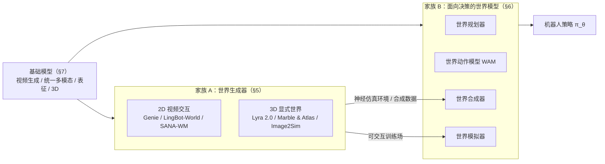

### 家族 B 的四大范式

根据 Tan et al. (2026) [[1]](#ref-1) 与 Li et al. (arXiv:2510.16732) [[2]](#ref-2)，家族 B 按世界模型与策略的耦合方式分为四大范式：

1. **世界规划器（World Planner）**：世界模型作为前向动力学引擎，预测显式未来帧或隐式潜嵌入，为下游策略提供前瞻性条件引导；
2. **世界动作模型（World Action Model, WAM）**：将世界状态演化与机器人控制动作纳入统一网络，联合建模观测与控制的联合分布；
3. **世界合成器（World Synthesizer）**：作为数据生成引擎，合成带标注的多视角、长程交互轨迹，支持大规模模仿学习；
4. **世界模拟器（World Simulator）**：将世界模型作为虚拟物理沙盒，结合强化学习（RL）算法在想象空间中优化策略参数。

### 三个建模维度

无论属于哪个家族，一个世界模型都可以在以下三个轴上定位：

- **功能耦合度（Functionality Coupling）**：
  - *决策解耦（Decision-Decoupled / General Purpose）*：世界模型独立于特定动作空间预训练（如纯视频生成），下游通过逆动力学或特征微调适配；
  - *决策耦合（Decision-Coupled / Policy-Integrated）*：世界模型与动作头深度交织，动作作为原生 Token 或条件通道共同优化。
- **时序建模方式（Temporal Modeling）**：
  - *序列自回归 / 自回归扩散（Sequential Simulation & Rollout）*：逐步展开未来状态 $$s_{t+1}, s_{t+2}, \dots$$，适合长程交互与连续物理演变；
  - *全局差分 / 跳步预测（Global Difference & Jump-Step Prediction）*：直接预测关键子目标帧或最终转移差分 $$\Delta s$$，跳过中间无关微动态。
- **空间与状态表征（Spatial & State Representation）**：
  - *全局潜向量（Global Latent Vectors）*：如 RSSM、V-JEPA 2，高度抽象、计算快，但缺少细粒度空间几何；
  - *空间潜在网格（Spatial Latent Grids）*：如 DiT Latent Patches、VAE 特征图，在感知保真度与计算效率之间折中；
  - *显式几何场（Explicit 3D Fields）*：如 3DGS、点云（Point Clouds）、占据栅格（Occupancy Grids），具备天然的 3D 空间一致性与度量约束；
  - *统一多模态画布（Unified Latent Canvas）*：如 NavWAM、Cosmos 3，将视觉、动作、状态、价值拼装为同一张时空画布。

### 代表性工作速查表

下表按本文章节顺序汇总正文详细介绍的工作，"归属"一列标注其所在家族与范式：

| 论文 / 模型 | 年份 | 归属 | 核心技术机制 | 关键结果（论文报告） | 详见 |
|:---|:---:|:---|:---|:---|:---:|
| **Genie** | 2024 | A · 交互环境生成 | 潜在动作模型 (LAM) + ST-Transformer + MaskGIT 动力学（11B） | 无动作标注学出 8 个离散潜动作，任意图像转可玩环境（160×90） | [§5.1](#paper-genie) |
| **LingBot-World** | 2026 | A · 实时交互生成 | 分层语义数据引擎 + 三阶段训练 + 动作注入 | 16 fps 实时推演（亚秒级延迟），60s 场景重访结构一致 | [§5.2](#paper-lingbot-world) |
| **SANA-WM** | 2026 | A · 高效长视频生成 | 混合线性 GDN/Softmax + 双分支相机控制 (UCPE+Plücker) + 两阶段精化 | VBench Overall 80.62/81.89；RTX 5090 上 34s 生成 60s 720p | [§5.3](#paper-sana-wm) |
| **Lyra 2.0** | 2026 | A · 3D 场景生成 | 几何记忆解耦 + 空间记忆检索路由 + 自增强去漂移 | 800 帧以上长程生成仍保持几何一致，可重建为 3DGS | [§5.4](#paper-lyra) |
| **Marble & Atlas** | 2025–2026 | A · 3D 世界 / 空间智能 | 多模态自回归流匹配 Transformer + 统一空间上下文 + 3DGS / 点云输出 | 控镜盲测偏好 75%~94%，3D 重建 AbsRel 25.3 | [§5.5](#paper-marble) |
| **Image2Sim** | 2026 | A · 神经仿真环境 | 前馈 3D 特征高斯锚定 + 单步 Pixel Flow (MeanFlow) 渲染 | 全景 RGB-D 45.6 FPS；自动构建 2 万个环境，R2R-CE 零样本 70.3% | [§5.6](#paper-image2sim) |
| **GENE-26.5** | 2026 | B · 世界规划器 | Flow Matching 联合分布 + 条件查询 | 新任务 < 1 小时真机数据即可微调 | [§6.1](#paper-gene) |
| **VLA-World** | 2026 | B · 世界规划器（自动驾驶） | 单帧未来生成 + 反思推理（Think with Generated future）+ GRPO | nuScenes 碰撞率 1.09% → 0.94% | [§6.1](#paper-vla-world) |
| **WorldVLA** | 2025 | B · WAM（自回归） | 统一自回归骨干 + 动作注意力掩码 + 视频预测预训练 | LIBERO Avg 81.8% | [§6.2](#paper-worldvla) |
| **AIM** | 2026 | B · WAM（扩散） | 空间价值图 (ASVM) + 意图因果注意力 + 价值自蒸馏 RL | RoboTwin 2.0 Avg SR 93.1% | [§6.2](#paper-aim) |
| **Motus** | 2025/2026 | B · WAM（MoT） | 三专家 MoT + 光流潜动作 + UniDiffuser 联合去噪调度 | RoboTwin 2.0 Avg 87.8%，单步 80ms | [§6.2](#paper-motus) |
| **NavWAM & WAM-Nav** | 2026 | B · WAM（导航） | 统一潜时空画布 + 非对称视界 + 双流特征融合 | 推理 205.7 ms（约 5Hz），较 NWM 快 1100×；真机成功率 79.2% / 85% | [§6.2](#paper-navwam) |
| **Qwen-RobotWorld** | 2026 | B · 世界合成器 | 双流 MMDiT + 自然语言统一动作接口 + 跨本体接地 | EWMBench 4.60 (#1)，WorldModelBench 8.99 | [§6.3](#paper-qwen-robotworld) |
| **WoVR** | 2026 | B · 世界模拟器 | 世界模型内 RL + 关键帧初始化 (KIR) + 策略协同演化 (PACE) | LIBERO 平均 SR 39.95% → 69.2%；真机 61.7% → 91.7% | [§6.4](#paper-wovr) |
| **Cosmos / Cosmos 3** | 2025–2026 | 基础模型平台 | 数据策展 + Predict / Transfer / Reason 产品线；Cosmos 3 以双塔 MoT 统一理解、生成与动作 | Cosmos3-Nano-Policy 在 RoboArena / RoboLab 真机评测第 1 | [§7.2](#cosmos) |
| **Wan2.1** | 2025 | 视频生成底座 | 时空 VAE (4×8×8) + DiT + Flow Matching + VACE | 开源 T2V/I2V 底座，1.3B 版本 RTX 4090 可跑 | [§7.4](#paper-wan) |
| **Janus-Pro** | 2025 | 统一理解与生成底座 | 理解 / 生成解耦视觉编码 + 自回归 Transformer | MMBench 79.2、GenEval 0.80（7B） | [§7.5](#paper-janus-pro) |
| **VideoGen in Robotics** | 2026 | 综述 | 视频生成在机器人中的应用分类与评测 | 梳理数据、架构与下游评测 | [§7.6](#paper-videogen) |

---

## 2.3 双系统架构

在大模型时代的具身系统中，世界模型通常被放进一种**双系统（Dual-System）架构**里，按频率分工：

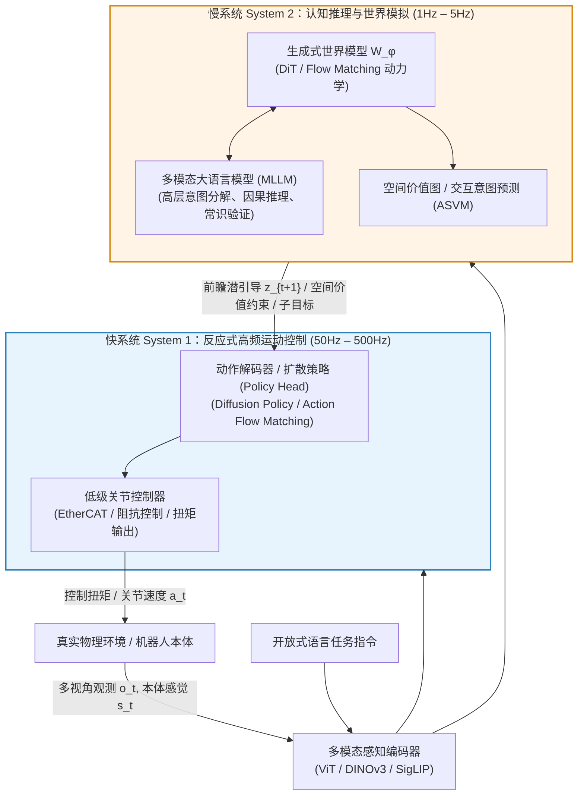

1. **慢系统（System 2，认知推理与世界模拟，1Hz–5Hz）**：
   - 由世界模型（WM）与多模态大模型（VLM）组成，负责长时程任务规划、环境动态推演、物理常识校验、意图分析以及危险评估；
   - 通过生成未来潜特征 $$z_{t+1}$$ 或空间价值热图，为底层提供物理接地的条件引导。
2. **快系统（System 1，反应式高频动作执行，50Hz–500Hz）**：
   - 由轻量级策略网络（如 Diffusion Policy、Action Flow Matching）与底层控制器构成，负责根据当前状态与 System 2 提供的物理先验，以极低延迟实时生成平滑、精确的电机扭矩或关节轨迹。

---

## 2.4 演进时间线（2018–2026）

  
<figcaption>图：具身智能世界模型演化时间线。从 2018 年潜空间梦境训练奠基，到 2023 年视频生成驱动规划，再到 2025–2026 年世界动作模型（WAM）、全模态基础模型（Cosmos 3）与可探索 3D 宇宙（Lyra 2.0 / Marble）的爆发。（图源：Tan et al., 2026）</figcaption>

**关键演进脉络**：
- **2018–2022年（MBRL 奠基期）**：World Models 提出 V-M-C 梦境训练；PlaNet 引入 RSSM；DreamerV1/V2 建立潜空间 Actor-Critic；
- **2023–2024年（视频先验与 3D 萌芽期）**：UniPi、SuSIE 探索利用视频扩散模型进行文字引导规划；GR-1 开创自回归视频动作预训练；3D-VLA 引入 3D 几何先验；DreamerV3 发表并通关 Minecraft；TD-MPC2 统一 104 种具身控制；
- **2025年（四大范式爆发期）**：WorldVLA、UniVLA 统一自回归序列建模；DreamGen、GigaWorld-0 构建数据合成飞轮；VLA-RFT、WoVR 开启世界模型内部强化学习；Cosmos 平台建立工业级数据与模型体系；
- **2026年（全模态收敛与空间智能时代）**：Cosmos 3 以 MoT 架构统一理解-生成-动作；SANA-WM 实现分钟级高效生成；Lyra 2.0 与 Marble 奠定 3DGS 可探索持久宇宙；World Labs Atlas 发布全模态自回归流匹配基座，将相机几何与 3D 深度纳为原生模态并赋能 Real-to-Sim 具身仿真；Motus、AIM、NavWAM 等推动世界动作模型走向主流。

---

# 3. 经典奠基：有模型强化学习

> 💡 **姊妹篇导读**：关于经典强化学习数学基础、Bellman 算子推导、无模型与有模型 RL（DreamerV3 / TD-MPC2）的系统性算法剖析，详见专题博文 [强化学习（RL）全景综述：从马尔可夫决策过程、价值/策略迭代到前沿具身控制](/Reinforcement-Learning-Survey/)。

在现代视频扩散基础模型爆发之前，世界模型在有模型强化学习（Model-Based Reinforcement Learning, MBRL）领域经历了数代关键演化，奠定了整个领域的数学理论与算法基石。

### World Models (2018)

David Ha 与 Jürgen Schmidhuber 提出的 **World Models** [[3]](#ref-3) 首次在深度学习框架下完整实现了认知科学中的 **V-M-C 三位一体架构**：

  
<figcaption>图：World Models (2018) 的 V-M-C 核心架构：视觉感知 V（VAE）、记忆动力学 M（MDN-RNN）与轻量控制器 C。（图源：Ha & Schmidhuber, 2018）</figcaption>

1. **V 模型（Vision Model / VAE）**：将高维输入图像帧 $$o_t$$ 压缩为 32 维连续高斯潜向量 $$z_t \sim \mathcal{N}(\mu, \sigma^2)$$，过滤与控制无关的高频视觉噪声；
2. **M 模型（Memory Model / MDN-RNN）**：基于带有混合高斯输出层（MDN）的 LSTM，自回归预测下一时刻潜状态的多分支概率分布：
   
   $$
   P(z_{t+1} \mid a_t, z_t, h_t) = \sum_{k=1}^K \pi_k(h_t) \mathcal{N}\left( z_{t+1};\; \mu_k(h_t), \Sigma_k(h_t) \right)
   $$

3. **C 模型（Controller）**：仅包含千余参数的超轻量前馈网络，直接将 $$z_t$$ 与循环隐状态 $$h_t$$ 映射为控制动作 $$a_t = W_c [z_t \; h_t] + b_c$$。

  
<figcaption>图：World Models 完整数据流：离线收集经验训练 V 与 M，随后在完全脱离真实环境的 RNN 梦境中训练控制器 C。（图源：Ha & Schmidhuber, 2018）</figcaption>

> **关键结果**：World Models 展示了**在学到的世界模型内部训练策略（Training inside the Dream）**的可行性。在 VizDoom 中，控制器完全在 M 模型自回归展开的"梦境"里用进化策略（CMA-ES）训练，随后直接迁移回真实游戏环境，仍能躲避火球；在 CarRacing-v0 中，控制器以 V、M 的特征为输入在真实环境中训练，平均得分超过 900，首次解决了该任务。

---

### Dreamer 系列 (2020–2025)

Danijar Hafner 等人开创的 **Dreamer 系列** [[4]](#ref-4)（DreamerV1 $\to$ V2 $\to$ V3；V3 于 2023 年以 *Mastering Diverse Domains through World Models* 为题发布于 arXiv，2025 年以 *Mastering diverse control tasks through world models* 为题正式发表于 *Nature*）将有模型 RL 推向了通用化。

  
<figcaption>图：DreamerV3 训练流水线：(a) 从真实经验中自监督学习 RSSM 世界模型；(b) 在潜空间自回归展开轨迹；(c) 在想象中优化 Actor-Critic 策略。（图源：Hafner et al., Nature 2025）</figcaption>

Dreamer 解决了连续世界模型长期存在的表示坍缩与数值不稳定性问题：
1. **循环状态空间模型（Recurrent State Space Model, RSSM）**：将潜状态解耦为确定性时序特征 $$h_t = f_\phi(h_{t-1}, z_{t-1}, a_{t-1})$$ 与离散随机变量 $$z_t$$（采用 32 个 32 类别的 Categorical 潜变量）。离散 Categorical 分布缓解了连续高斯分布在面对非线性突变（如门开/关、物体碎裂）时的模糊与坍缩问题；
2. **Symlog 变换与无量纲化设计**：提出对称对数变换 $$\mathrm{symlog}(x) = \mathrm{sign}(x)\ln(|x|+1)$$ 统一缩放特征与回归目标，配合自适应百分位数价值归一化，解决了跨任务奖励尺度横跨 7 个数量级导致的梯度弥散与数值发散；
3. **通用性与 Minecraft 钻石任务**：DreamerV3 使用**同一套超参数与模型架构**，在 Atari、Crafter、DMC、Procgen 等多个领域取得强性能，并成为首个在不使用人类数据与课程设计的条件下、在 Minecraft 中从零开始采集到钻石的算法——这一任务需要伐木、合成工作台、采矿、冶炼等一长串依赖步骤，且奖励极为稀疏。

  
<figcaption>图：DreamerV3 在 7 大异构领域（2D 像素、连续控制、3D 长程沙盒）中的标准化性能对比。（图源：Hafner et al., Nature 2025）</figcaption>

---

### TD-MPC2 (2024)

以往的世界模型（如 World Models、Dreamer）大多依赖逐像素的图像重建损失，大量网络算力被浪费在与下游控制无关的背景视觉细节上。Nicklas Hansen 等人提出的 **TD-MPC 系列** [[5]](#ref-5) 实现了关键的技术转向：

  
<figcaption>图：TD-MPC2 整体架构：无需逐像素解码重建，在紧凑潜空间中深度融合 MPPI 在线采样规划与时序差分（TD）长程价值学习。（图源：Hansen et al., ICLR 2024）</figcaption>

1. **纯潜空间任务驱动（Task-Driven Latent Dynamics）**：去掉像素解码器，潜状态只由三类信号约束——潜空间自洽性（预测的下一潜状态需与编码器对真实下一帧的编码一致）、即时奖励预测与 TD 价值目标；另训练一个策略先验，为规划提供初始采样；
2. **MPPI 在线规划**：推理时在 512 维潜空间中用 MPPI 采样并迭代优化一段短视界动作序列，视界之外的回报由学到的 Q 函数自举估计，兼顾在线规划精度与长程价值视野；
3. **可扩展的多任务单模型**：在 4 个领域共 104 个连续控制任务上使用同一套超参数，并训练出 317M 参数的单一智能体，在 80 个跨领域、跨本体、跨动作空间的任务上同时工作。

---

### 从经典到大模型时代

下表总结了世界模型在过去数年间的核心技术范式演进：

| 演进维度 | 经典奠基期 (2018, World Models) | 离散 RSSM 时代 (2023–2025, DreamerV3) | 隐式 MPC 时代 (2024, TD-MPC2) | 生成式基础模型时代 (2025–2026, Cosmos / WAM / SANA) |
|:---|:---|:---|:---|:---|
| **状态表征** | 连续高斯潜变量 (32D VAE) | 离散 Categorical 潜变量 (32×32) | 紧凑任务潜向量 (512D MLP/Trans.) | 时空 Latent 网格 / 3DGS 显式场 / 统一 Canvas |
| **动力学骨干** | LSTM / MDN-RNN | RSSM (GRU + Categorical) | MLP / 密集 Transformer | Diffusion Transformer (DiT) / Flow Matching / MoT |
| **重建机制** | 逐像素 2D 解码 (64×64) | 逐像素 2D 解码 (64×64) | **无像素重建**（纯潜空间任务信号） | 高压缩时空 VAE (4×8×8) / 单步生成 / 隐空间对齐 |
| **与策略关系** | 解耦：梦境中离线进化 C | 解耦：潜空间 Actor-Critic | 耦合：在线 MPPI 轨迹优化 | 四大范式并存（规划器 / WAM / 合成器 / 模拟器） |
| **动作生成频率** | 离线优化后真机部署 | 离线优化后真机部署 | 在线 MPPI 规划（每步重规划） | 5Hz–15Hz 联合去噪 (WAM) 或 500Hz 混合控制 |
| **多任务与规模** | 单任务小模型 (<1M) | 跨领域单模型 (~200M) | 104 种具身多任务 (1M $\to$ 317M) | 互联网级图文视频预训练 + 领域微调 (2B $\to$ 64B) |

---

# 4. 核心工程设计空间

§2 讲世界模型"是什么"，§5–§6 讲具体工作"做了什么"。本章处在二者之间，从工程实现角度回答：**搭一个视频 / 潜空间世界模型，需要做哪几个关键决策，每个决策的代价是什么**。本章的例子都来自后文详细介绍的工作，可作为阅读 §5–§7 时的对照索引。

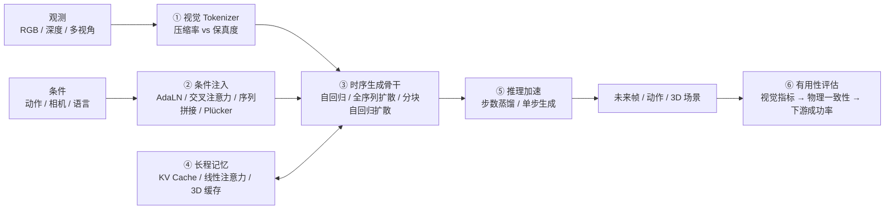

## 4.1 视觉 Tokenizer

视频世界模型的计算量几乎完全由潜空间 token 数决定。Tokenizer 的压缩率越高，同样算力下能展开的时长越长，但细小物体、夹爪接触面等对操作任务关键的细节也越容易丢失。

| Tokenizer | 表示类型 | 压缩方式 | 使用者（本文涉及） |
|:---|:---|:---|:---|
| Cosmos Tokenizer | 连续 + 离散 | 小波变换 + 因果 3D 卷积 | Cosmos-Predict1 扩散 / 自回归两条路线（§7.2） |
| Wan2.1 VAE | 连续 | 因果 3D VAE，时间×高×宽 4×8×8 | Wan2.1、Cosmos-Predict2.5（§7.2、§7.4） |
| Wan2.2 VAE（TI2V-5B） | 连续 | 更高空间压缩 | Cosmos 3 生成塔（§7.3） |
| LTX-2 VAE | 连续 | 压缩率显著高于 Wan2.1 VAE | SANA-WM（§5.3） |
| ST-ViViT VQ | 离散 | 时空 Transformer + 向量量化 | Genie（§5.1） |
| Chameleon 类图像 Tokenizer | 离散 | 逐帧 VQ | WorldVLA 等自回归 WAM（§6.2） |

**工程经验**：
- **因果（causal）结构**让首帧可以单独编码，从而支持图像与视频联合训练、按帧流式生成，这是交互式世界模型的前提；
- **高压缩会把帧内运动"压扁"**：SANA-WM 的 VAE 把 8 个原始帧压成 1 个潜帧，因此额外加了逐原始帧的 Plücker 细分支来补回相机运动细节（§5.3）；
- **离散 token** 便于直接复用 LLM 训练栈，但量化会损失细节；Cosmos-Predict2.5 最终把扩散与自回归两条路线统一到了连续潜空间的 Flow Matching（§7.2）。

## 4.2 条件注入

"动作条件"是世界模型区别于普通视频生成模型的关键。常见注入方式按粒度由粗到细排列：

| 注入方式 | 粒度 | 代表工作 | 优点 | 代价 |
|:---|:---|:---|:---|:---|
| **AdaLN 调制** | 每帧 / 全局 | LingBot-World（Plücker 嵌入经 AdaLN 注入） | 实现简单、开销极小 | 表达空间位置相关控制的能力有限 |
| **交叉注意力** | 序列级 | Cosmos-Predict2.5（Reason1 文本嵌入） | 适合语言等长条件 | 与视觉 token 的时间对齐较弱 |
| **ControlNet 分支** | 像素级 | Cosmos-Transfer（边缘 / 深度 / 分割） | 可插拔，新模态无需重训主干 | 额外参数与推理开销 |
| **逐像素相机射线（Plücker / UCPE）** | 像素级几何 | SANA-WM 双分支、LingBot-World | 6-DoF 相机控制精确 | 需要可靠的相机位姿标注（SANA-WM 为此搭建了专门的度量标注管线） |
| **动作 token 进入统一序列** | token 级 | WorldVLA、Cosmos 3、NavWAM 潜在画布 | 动作与视觉联合建模，可切换前向 / 逆向 / 策略模式 | 序列变长，注意力开销上升 |
| **潜动作（无标注）** | 离散码本 | Genie（8 个潜动作）、Motus（光流潜动作） | 可利用无动作标注的互联网视频 | 潜动作语义需再映射到真实控制量 |
| **自然语言动作** | 文本 | Qwen-RobotWorld | 跨本体、跨任务统一接口 | 难以表达精确的连续控制量 |

一条经验规律：**控制越需要几何精度（相机轨迹、末端位姿），条件就越应该以空间对齐的方式注入**，而不是只作为全局向量调制整帧。

## 4.3 生成范式

| 范式 | 代表 | 优点 | 主要问题 |
|:---|:---|:---|:---|
| **离散自回归** | Genie、WorldVLA、Cosmos-Predict1 AR | 天然流式、可交互，复用 KV Cache | 误差逐步累积；量化损失细节 |
| **全序列扩散 / 流匹配** | Wan2.1、Cosmos-Predict2.5（一次生成 93 帧） | 画质高、片段内一致性好 | 片段长度固定，难以逐步响应新动作 |
| **分块自回归扩散（混合）** | LingBot-World、SANA-WM、Lyra 2.0 | 兼顾画质与交互：块内去噪、块间自回归 | 训练时看到的是真实历史、推理时看到的是自己生成的历史（exposure bias），会产生漂移 |
| **AR + 扩散双塔** | Cosmos 3 | 理解走自回归、生成走扩散，互不干扰 | 参数量约为稠密模型的 2 倍 |

从全序列扩散模型出发改造为交互式模拟器，是 2026 年的常见路线：LingBot-World 先以 Wan2.2 做双向扩散预训练，再在后训练中改造为因果自回归系统并做蒸馏（§5.2）。要缓解 exposure bias，常见做法是**在训练时主动喂入带噪或自生成的历史**，如 Lyra 2.0 的自增强训练（§5.4）。

## 4.4 长程一致性

长程推演失败通常有两类原因：**上下文窗口有限导致"忘记"已经看过的区域**（回头看时场景变了），以及**误差累积导致画面和物理逐渐漂移**。对应的工程手段：

| 手段 | 代表工作 | 解决的问题 | 代价 |
|:---|:---|:---|:---|
| 混合线性注意力（GDN）+ 少量 Softmax 层 + attention sink | SANA-WM | 60s 720p 序列下内存保持常数 | 线性层的精确回忆能力较弱，需要 Softmax 层补足 |
| 3D 几何缓存 + 按可见度检索历史帧 | Lyra 2.0 | 重访区域时的空间一致性 | 依赖深度估计质量 |
| 显式 3D 表示（3DGS / 点云）作为状态 | Marble & Atlas、Image2Sim | 几何天然持久 | 动态物体与形变建模困难 |
| 缩短有效推演深度 | WoVR 的关键帧初始化（KIR） | RL 中的幻觉累积 | 只能在演示覆盖的状态附近探索 |
| 非对称视界（长动作 + 短视觉） | WAM-Nav | 视角剧变时的视觉预测漂移 | 视觉前瞻信息变少 |

## 4.5 推理效率

世界模型能否进入控制回路，取决于它能否满足实时预算。本文涉及工作报告的延迟 / 帧率大致如下：

| 场景 | 典型要求 | 本文涉及的数字 |
|:---|:---|:---|
| 低层关节控制（System 1） | 50Hz–500Hz | 由策略头或传统控制器承担，世界模型通常不直接进入这一回路 |
| WAM 动作块输出 | 5Hz–15Hz | NavWAM 205.7 ms（约 5Hz）；Motus 单步 80ms；Cosmos3-Nano-Policy 15Hz |
| 交互式世界生成 | 十几至几十 fps | LingBot-World 16 fps；Image2Sim 全景 RGB-D 45.6 FPS |
| 离线数据合成 | 吞吐优先 | SANA-WM 在 RTX 5090 上 34s 生成 60s 720p |

主要的加速手段：
- **步数蒸馏**：Cosmos-Predict2.5 用 rCM 把推理压缩到 4 步（§7.2）；LingBot-World 用 DMD 蒸馏实现亚秒级延迟（§5.2）；Image2Sim 用 MeanFlow 做单步生成（§5.6）；
- **减少 token**：更高压缩的 VAE（§4.1），或在潜空间而非像素空间做规划（隐式世界规划器，§6.1）；
- **减少需要生成的内容**：WAM 在训练时用未来视觉预测做正则，推理时的关键产出是动作块；NavWAM 用潜在画布取代 CEM 式的逐条候选轨迹推演（§6.2）。

## 4.6 如何判断世界模型是否有用

视觉指标好不等于对机器人有用。工程上通常按以下顺序检验，越往后越接近真实价值，成本也越高：

1. **视觉质量**：FVD、VBench 等（§8.3）——只说明"看起来像"；
2. **可控性**：改变动作 / 相机输入后，生成结果是否一致、按预期变化（CamMC、RotErr 等）；
3. **物理一致性**：物体恒存、重力、接触是否合理（WorldModelBench、Physics-IQ 等）；
4. **下游价值**：用世界模型训练或评估策略后，真实环境成功率是否提升，或世界模型内的策略排名是否与真机排名一致。

§8 的评测基准正是按这条链组织的。

---

# 5. 家族 A：世界生成器

这一家族的共同点是：条件信号是**相机位姿、键盘 / 潜动作或文本**，输出是可持续探索的视频或 3D 场景，核心指标是**时空一致性、可控性与生成速度**，而不是机器人任务成功率。它们与具身智能的关系大多是间接的——作为神经仿真环境或数据来源，被 §6 的世界合成器与世界模拟器使用。

本章按表示形式由 2D 到 3D 排列：
- **2D 视频交互**：Genie（从无标注视频学出潜动作的可玩环境）→ LingBot-World（实时长程交互）→ SANA-WM（高效分钟级生成）；
- **3D 显式 / 半显式**：Lyra 2.0（3D 几何缓存做记忆）→ Marble & Atlas（原生 3DGS / 点云输出）→ Image2Sim（3D 高斯锚定 + 单步渲染的神经仿真器）。

阅读时可对照 §4：这些工作的差异主要集中在条件注入方式（§4.2）、生成范式（§4.3）与长程记忆（§4.4）上。

## 5.1 Genie (2024) {#paper-genie}
———Generative Interactive Environments

📄 **Paper**: [arXiv:2402.15391](https://arxiv.org/abs/2402.15391) · [[6]](#ref-6)

#### 精华

Genie 是首个仅通过无标注视频学习而成的生成式交互环境（Foundation World Model），其核心贡献在于：1) **无监督动作挖掘**：通过潜动作模型（LAM）从纯视频中自动挖掘可控动作空间，解决了世界模型对真实动作标签的依赖；2) **高效时空架构**：设计了基于 ST-Transformer 的计算架构，使显存占用随帧数线性增长，支持长序列视频生成；3) **具身智能底座**：不仅能将任意图像（素描、照片等）转化为可玩的游戏世界，还展现了在机器人操作和智能体训练方面的巨大潜力，为“通向通用智能体的路径”提供了海量仿真数据。

---

#### 1. 研究背景/问题

当前的生成式 AI（如 ChatGPT, DALL-E）在文本和图像领域取得了巨大成功，但视频生成模型（如 Video Diffusion）大多缺乏细粒度的交互控制能力。传统的“世界模型”通常需要大量带有真实动作标签（Action Labels）的数据进行训练，这在互联网海量视频面前成了瓶颈。Genie 旨在通过 20+ 万小时无标注互联网视频（经过滤清洗后构建了约 3 万小时 / 680 万段 16 秒高质量 2D 平台游戏片段训练集），学习一个能实时响应用户操作、具有物理常识且能无限生成的交互式环境。

---

#### 2. 主要方法/创新点

Genie 是一个参数量达 110 亿的基础模型，其架构由三个深度集成的组件构成，全部基于改进的 **ST-Transformer**。

  
<figcaption>图：Genie 整体训练框架：包含视频分词器、潜动作模型 (LAM) 和动力学模型。（图源：Genie, 2024）</figcaption>

##### 2.1 潜动作模型 (Latent Action Model, LAM)
这是 Genie 的灵魂所在。为了在没有动作标签的情况下实现控制，LAM 采用 VQ-VAE 结构：
- **编码器**：同时接收当前帧和下一帧，输出一个离散的潜动作 $$\mathbf{a}_t$$（通常限制在 8 个离散值以内，以模拟控制器按键）。
- **瓶颈机制**：由于解码器只能通过历史帧和 $$\mathbf{a}_t$$ 来预测下一帧，模型被迫将视频中最具语义一致性的变化（如人物的左右移动、跳跃）编码进这 8 个 Token 中。
- **一致性**：实验证明，即使在不同游戏中，相同的潜动作 Token 往往对应相同的物理语义（如 Action 0 始终代表左移）。

  
<figcaption>图：潜动作模型 (LAM)：通过重构目标实现无监督动作挖掘。（图源：Genie, 2024）</figcaption>

##### 2.2 视频分词器 (Video Tokenizer)
Genie 提出了 **ST-ViViT** 架构：
- **时空压缩**：不同于常规只在空间维度压缩的分词器，ST-ViViT 在编码和解码时都引入了时间轴。
- **效率优化**：通过交替使用空间注意力和时间注意力，模型避免了计算量随时间呈平方级增长的问题，保证了在大规模数据集上的训练可行性。

##### 2.3 动力学模型 (Dynamics Model)
基于 **MaskGIT** 的掩码自回归模型：
- **输入**：接收当前视觉 Token 和用户选择的潜动作。
- **预测**：模型在隐空间内预测下一帧的 Token。通过海量数据的“喂养”，模型学习到了复杂的 2D 平台游戏规则，如碰撞、重力、敌人交互和屏幕卷轴滚动。

  
<figcaption>图：ST-transformer：交替进行空间与时间层计算，实现线性复杂度。（图源：Genie, 2024）</figcaption>

---

#### 3. 核心结果/发现

*   **“化腐朽为神奇”的生成能力**：用户可以上传一张手绘草图、真实的自然景观照片，甚至是通过文生图模型（如 Imagen）生成的图片，Genie 都能立即将其转化为一个可以“玩”的横版过关游戏环境。
*   **语义一致的操控感**：在 Platformers 数据集上，潜动作展现了极强的泛化性。用户点击对应的潜动作，角色会做出连贯的位移或跳跃，且这种操控在视觉风格迥异的环境中依然有效。
*   **机器人领域的潜力**：研究人员在 RT1 机器人数据集上验证了 Genie。模型不仅学会了控制机械臂，还学会了模拟复杂物体的物理形变（如挤压面包袋），这证明 Genie 能够捕捉真实的物理世界动态。
*   **作为强化学习的“母体”**：在 Genie 内部训练的智能体，可以极快地迁移到真实环境中。相比于从零开始训练，使用潜动作预训练的智能体在样本效率上提升了数倍。

  
<figcaption>图：在机器人操作数据上学习到的具有语义意义的潜动作。（图源：Genie, 2024）</figcaption>

---

#### 4. 局限性

*   **分辨率瓶颈**：受限于目前的计算资源，Genie 生成的视频分辨率较低（160x90），离高清沉浸式体验仍有距离。
*   **自回归发散**：由于是自回归生成，随着步数增加，视频内容可能会逐渐偏离物理真实或出现伪影。
*   **动作映射**：虽然挖掘出了潜动作，但将这些离散 Token 精确映射到人类直觉的复杂多级控制（如手柄的线性摇杆）仍需进一步研究。

---

## 5.2 LingBot-World (2026) {#paper-lingbot-world}
———首个开源、支持实时交互的长程世界模型

📄 **Paper**: [arXiv:2601.20540](https://arxiv.org/abs/2601.20540) · [[7]](#ref-7)

#### 精华
1. **LingBot-World** 是一个开源的实时交互世界模型，支持分钟级的长程生成一致性。
2. 提出了包含分层语义的数据引擎，通过叙事、静态场景和密集时间描述解决了交互数据稀缺问题。
3. 采用了三阶段进化训练策略：预训练（通用视频先验）、中训练（知识注入与 MoE 架构）和后训练（因果适配与蒸馏）。
4. 实现了亚秒级（<1s）的推理延迟，支持 16 fps 的实时生成。
5. 展示了在可控世界事件编辑、具身智能 Action Agent 和 3D 重建等领域的广泛应用潜力。

#### 1. 研究背景/问题
当前的视频生成模型虽能生成高质量短片，但本质上是“梦想家”而非“模拟器”，缺乏对物理规律（如因果性、物体恒久性）的理解，且难以实现实时交互。此外，高质量交互数据的匮乏、长程一致性的维持以及扩散模型高昂的计算开销，也是阻碍世界模型发展的核心瓶颈。

#### 2. 主要方法/创新点

  
<figcaption>图：LingBot-World 交互式世界模拟概览：支持在多种场景（写实、科学、卡通等）下通过键盘操作进行实时交互。（图源：LingBot-World, 2026）</figcaption>

##### ① 数据引擎与分层描述
为了解决高质量交互数据稀缺的问题，LingBot-World 构建了一个混合数据引擎，结合了真实世界视频、游戏录像和 Unreal Engine (UE) 合成数据。关键创新在于**分层描述策略**：
- **叙事描述 (Narrative Caption)**：描述整体环境和摄像机轨迹，作为全局语义提示。
- **静态场景描述 (Scene-Static Caption)**：仅聚焦环境，实现动作与场景的解耦。
- **密集时间描述 (Dense Temporal Caption)**：对视频事件进行细粒度的时间对齐描述。

##### ② 三阶段进化训练管线
模型采用了从视频生成器向交互式模拟器进化的三阶段策略：

  
<figcaption>图：LingBot-World 训练管线：从预训练的视频先验出发，经过中训练注入知识，最后通过后训练实现实时交互能力。（图源：LingBot-World, 2026）</figcaption>

- **Stage I: 预训练**：利用 14B 参数的 Wan2.2 扩散模型建立强大的时空相干性和视觉先验。
- **Stage II: 中训练 (MoE 知识注入)**：引入 Mixture-of-Experts (MoE) 架构（总参数 28B，激活 14B），通过 progressive curriculum 策略将训练时长从 5 秒扩展到 60 秒，并注入 Plücker 编码的动作信号。
- **Stage III: 后训练 (实时化)**：将双向扩散模型适配为因果自回归系统，并结合分布匹配蒸馏 (DMD) 和对抗优化，将推理延迟降低至亚秒级。

##### ③ 模型架构与动作注入

  
<figcaption>图：LingBot-World 模型架构：基于 DiT 块，通过 Plücker Encoder 注入动作信号，并利用 AdaLN 进行调制。（图源：LingBot-World, 2026）</figcaption>

LingBot-World 基于 DiT (Diffusion Transformer) 架构。动作信号（离散键盘输入和连续摄像机旋转）通过 **Plücker Encoder** 投影为嵌入向量，再通过 Adaptive Layer Normalization (AdaLN) 注入到 DiT 块中，实现对视频生成的精确控制。

#### 3. 核心结果/发现

  
<figcaption>图：涌现的记忆能力：模型能够记住视野外的静态地标（如巨石阵），并在 60 秒后返回时保持结构一致，且能模拟视野外物体的动态演化。（图源：LingBot-World, 2026）</figcaption>

- **长程一致性**：模型表现出显著的涌现记忆能力，即使物体长时间离开视野，返回时仍能保持结构完整。
- **实时性与质量平衡**：LingBot-World-Fast 在单 GPU 节点上实现了 16 fps 的吞吐量，同时保持了与教师模型相当的视觉质量。
- **可控编辑**：支持通过文本指令（如“Firework”、“Fish”）对生成的世界进行实时干预。

  
<figcaption>图：可控世界事件示例：通过文本提示词实时改变天气、风格或在场景中注入特定动态元素。（图源：LingBot-World, 2026）</figcaption>

#### 4. 局限性
- **记忆稳定性**：长程一致性仍是基于上下文窗口的涌现能力，缺乏显式的存储模块。
- **交互精度**：对细粒度物体操作（如抓取特定物体）的支持尚不足。
- **算力成本**：推理仍需企业级 GPU 支持。

---

## 5.3 SANA-WM (2026) {#paper-sana-wm}
———Efficient Minute-Scale World Modeling with Hybrid Linear Diffusion Transformer

📄 **Paper**: [arXiv:2605.15178](https://arxiv.org/abs/2605.15178) · [[8]](#ref-8)  
🔗 **项目主页**: [nvlabs.github.io/Sana/WM](https://nvlabs.github.io/Sana/WM/)

#### 精华

SANA-WM 最值得借鉴的核心思想是**以效率为第一设计目标的世界模型**：用 2.6B 参数、64 块 H100、15 天训练，在单 GPU 上生成分钟级 720p 视频，达到与 14B+14B 工业级模型相当的视觉质量。具体可迁移的设计包括：(1) **混合线性-Softmax Attention（Hybrid GDN/Softmax）**——以帧粒度 Gated DeltaNet 替代大多数 Softmax 层，使 KV 状态保持 $D \times D$ 常数，内存不随序列长度增长，Softmax 层仅保留 5/20 块用于长程精确回忆，巧妙平衡效率与质量；(2) **双分支相机控制（Dual-Branch Camera Control）**——粗分支 UCPE 在潜帧率上捕获全局 6-DoF 轨迹结构，细分支 Plücker 在原始帧率上补偿 VAE 压缩丢失的帧内运动细节，两者协同实现高精度连续轨迹跟随；(3) **两阶段视觉精化（Two-Stage Refiner）**——第一阶段生成结构正确但质量稍逊的视频，第二阶段用截断 Flow Matching 的 17B LoRA 精化器无缝修复细节，整体吞吐仍达 22 个 60s 视频/小时；(4) **鲁棒度量标注管线**——用 VIPE+Pi3X+MoGe-2 从公开视频恢复度量尺度 6-DoF 姿态，无需昂贵专有数据，仅 213K 片段即完成训练。

---

#### 1. 研究背景/问题

现有开源分钟级世界模型（LingBot-World 14B+14B、HY-WorldPlay 8B）普遍需要大模型参数量、海量专有数据、多 GPU 推理，对学术界和小团队门槛极高。另一种替代——用短视频生成器蒸馏长程模型——因短程教师对分钟级场景持久性和轨迹跟随的监督信号不足而效果有限。SANA-WM 的目标是：**在严格效率约束下原生训练一个高保真、可相机控制的分钟级世界模型**，使其在单 GPU 上可推理、在 64 块 H100 上 15 天可收敛。

---

#### 2. 主要方法/创新点

  
<figcaption>图：SANA-WM 概览。从单张图像和动作轨迹出发，生成分钟级 720p 世界，支持精确相机控制、64-GPU 训练与单 GPU 推理。（图源：SANA-WM，arXiv:2605.15178）</figcaption>

**整体框架**：SANA-WM 由四个核心组件构成：① 混合线性 DiT 骨干（Hybrid GDN/Softmax）负责高效长程上下文建模；② 双分支相机控制（UCPE + Plücker）负责精确 6-DoF 轨迹注入；③ 第二阶段视觉精化器（LTX-2 LoRA）负责提升最终帧质量；④ 鲁棒度量标注管线（VIPE+Pi3X+MoGe-2）负责从公开视频提取高质量训练数据。

  
<figcaption>图：SANA-WM 架构。文本、视频和姿态 Token 交替经过 GDN 块和 Softmax 块；UCPE Attention 和 Plücker Mixing 提供几何感知的相机条件；第二阶段精化器进一步提升视觉质量。（图源：SANA-WM）</figcaption>

##### ① 混合线性-Softmax Attention（Hybrid GDN/Softmax）

**输入**：时序潜帧序列（LTX2 VAE 编码，时间×高×宽压缩比远高于 Wan 2.1-VAE，尺寸缩小 8×）。

**处理**：SANA-WM 共 20 个 Transformer Block，其中 15 个为**帧粒度 Gated DeltaNet（GDN）块**，5 个（位于层 3/7/11/15/19）为标准 Softmax Attention 块。GDN 块的关键是将 token 级递推（每步一个 token）升级为**帧级递推**（每步消费一个潜帧的全部 $S$ 个空间 token），状态矩阵 $S_t \in \mathbb R^{D \times D}$ 通过衰减门 $\gamma_t$ 和 delta-rule 修正实现"遗忘旧信息、精准更新当前帧"：

$$S_t = S_{t-1} M_t + U_t, \quad M_t = \gamma_t(I - \hat K_t \beta_t \hat K_t^\top), \quad U_t = V_t \beta_t \hat K_t^\top$$

为防止空间 token 数 $S$ 导致转移矩阵 $M_t$ 膨胀，对 key 施加 $1/\sqrt{DS}$ 缩放（代替 token 级的 $1/\sqrt{D}$），确保 $\lVert M_t \rVert_2 \le \gamma_t \le 1$，训练稳定不出现 NaN。Softmax 块负责精确长程回忆，在 60s 序列中引入局部注意力窗口和 attention sink，使推理时 Softmax 内存保持常数。

**设计动机**：60s 720p 视频展开为约 961 个潜帧；纯 Softmax 的 KV Cache 随序列长度平方增长，60s 时直接 OOM；纯线性注意力（如 SANA-Video 的累积线性注意力）缺乏衰减机制，旧特征与新特征等权累积，导致分钟级建模出现漂移。混合设计兼顾了"大多数时间步高效更新 + 关键时刻精确回忆"的需求。

##### ② 双分支相机控制（Dual-Branch Camera Control）

**粗分支（Coarse - UCPE）**：在**潜帧率**上建模全局 6-DoF 轨迹。对每个潜帧 $t$ 和空间格 $s$，由相机外参计算世界空间射线，构建射线局部坐标系变换 $D_{t,s} \in \mathbb R^{4 \times 4}$，将 QKV 的几何通道经 $D^\top / D^{-1}$ 旋转，其余通道保留 RoPE——本质是将相机位姿编码进注意力位置编码。该分支有独立 QKV 投影，但与主分支共享 GDN 门，通过零初始化投影叠加到主注意力输出上。

**细分支（Fine - Plücker Mixing）**：弥补粗分支因 VAE 将 8 个原始帧压缩为 1 个潜帧而丢失的帧内运动细节。对每个原始帧 $r$ 和像素 $p$，计算 Plücker 射线 $\rho_{r,p} = (d_{r,p},\, o_r \times d_{r,p}) \in \mathbb R^6$，将 VAE 步内 8 帧的 Plücker 图堆叠为 48 通道张量，经零初始化 3D Patch Embedder 处理后逐块叠加至自注意力输出后。

**消融验证**：UCPE+Plücker 组合在 OmniWorld 验证集上 CamMC 达 0.2047，优于单独 UCPE（0.2453）和单独 Plücker（0.4742），FVD 也更低。

##### ③ 两阶段视觉精化

第一阶段（SANA-WM 主模型）生成结构正确的 60s 视频。第二阶段精化器基于 LTX-2 17B 模型，只训练秩 384 LoRA（附于 Q/K/V/O 和 FFN），用截断-$\sigma$ Flow Matching 对第一阶段噪化潜变量进行精化（3 步 Euler，推理时与主模型完全解耦）。精化后 VBench Overall 从 79.29 提升至 80.62（Simple Trajectory），同时将晚期质量退化 $\Delta IQ$ 从 3.79 压缩至 1.17。

##### ④ 鲁棒度量标注管线与数据

  
<figcaption>图：SANA-WM 数据构建管线。收集开源视频与静态 3D 资源，标注度量尺度相机姿态，用 3DGS 渲染增强 DL3DV，过滤/字幕处理后得到 213K 片段训练语料。（图源：SANA-WM）</figcaption>

标注引擎基于 VIPE，将深度估计后端替换为 Pi3X（多帧一致结构）+ MoGe-2（度量尺度锚点），支持公开视频的鲁棒度量尺度 6-DoF 姿态提取。对 DL3DV 等静态 3D 数据集，用 FCGS 拟合 3DGS 重建后渲染多样化一分钟相机路径，再经 DiFix3D 精化减少拼接伪影，生成 14,881 条合成 60s 片段。最终语料共 212,975 条片段，涵盖室内、室外、游戏、合成场景。

**渐进式训练策略**（4 阶段，共约 15 天 64× H100）：

| 阶段 | 目标 | 序列长度 | 训练步数 |
|:---|:---|:---|:---|
| Stage 1 | VAE 适配（LTX2 空间对齐） | 5s | 50K（VAE）+ 30K（DiT） |
| Stage 2 | 混合架构适配（GDN/Softmax） | 5s | 30K |
| Stage 3 | 分钟级扩展 + 相机控制 | 60s | 31K |
| Stage 4 | Chunk-Causal 微调 + 4步蒸馏 | 60s | 10K |

---

#### 3. 核心结果/发现

  
<figcaption>图：四种方法在 Hard Trajectory 60s 视频上的定性对比。绿色边框为 SANA-WM，左下角为动作轨迹叠加。SANA-WM 在复杂轨迹下仍保持场景一致性，基线方法则出现模糊、布局漂移或结构崩溃。（图源：SANA-WM）</figcaption>

**相机控制精度**（↓ 越低越好）：SANA-WM+精化器在 60s 基准上取得最优 RotErr（4.50°/8.34°，Simple/Hard），CamMC 1.41/1.44，全面优于 LingBot-World（14B+14B，RotErr 10.47°/18.99°）、Matrix-Game 3.0（5B）和 HY-WorldPlay（8B）。

**视觉质量**：精化后 VBench Overall 80.62/81.89（Simple/Hard），与 LingBot-World（81.82/81.89）相当，但 LingBot-World 需要 8 块 H100（454.1 GB 显存），SANA-WM 单 GPU 仅需 74.7 GB。

  
<figcaption>图：效率消融与扩展性分析。(a) 60s 单 GPU 推理延迟分解：经蒸馏+attention sink+NVFP4 量化，RTX 5090 上 34s 生成一条 60s 720p 视频。(b) H100 延迟与显存随视频时长的变化：混合 GDN/Softmax 线性增长，纯 Softmax 在 60s 时 OOM。（图源：SANA-WM）</figcaption>

**推理效率**：SANA-WM 生成吞吐 24.1 视频/小时（8× H100），比最快 480p 基线 Infinite-World 快 4.1×；4步蒸馏+NVFP4 量化后，单 RTX 5090 仅需 34s 生成一条完整 60s 720p 视频（**36× 高于 LingBot-World 的吞吐**）。

**渐进训练消融**（VBench-I2V）：

| 配置 | VBench Total ↑ | 峰值内存 (GB) ↓ | 推理速度 (steps/s) ↑ |
|:---|:---:|:---:|:---:|
| SANA-Video（原始） | 0.838 | 8.90 | 0.79 |
| + LTX2 VAE | 0.839 | 5.40 | 2.69 |
| + Hybrid GDN/Softmax | **0.853** | 5.68 | 2.31 |

---

#### 4. 局限性

SANA-WM 受限于规模（2.6B 参数与 213K 片段），在动态场景、罕见视角或超长序列中仍可能产生漂移，且缺乏显式 3D 场景记忆（无法像 Lyra 2.0 那样精确"重访"旧区域）。未来工作需要扩大模型与数据规模、引入机器人动作或点跟踪控制、强化持久场景记忆，以及开发鲁棒的实时或流式精化器。

---

## 5.4 Lyra 2.0 (2026) {#paper-lyra}
———Explorable Generative 3D Worlds at Scale

📄 **Paper**: [https://arxiv.org/abs/2604.13036](https://arxiv.org/abs/2604.13036) · [[9]](#ref-9)

#### 精华

NVIDIA 推出的 Lyra 2.0 解决了长程（Long-horizon）3D 一致性场景生成的两大核心痛点，值得借鉴的点包括：
1. **解耦几何与外观（Decoupled Memory）**：将显式 3D 几何（点云缓存）仅用于信息路由和建立像素级对应关系，而将外观合成交给 Diffusion Model 的强生成先验，有效避免了渲染伪影的传播。
2. **空间记忆路由（Anti-forgetting）**：通过几何感知检索机制，即便在长距离移动或重新访问（Revisit）区域时，也能通过 3D 投影检索最相关的历史帧，克服了 Transformer 有限上下文导致的"空间遗忘"。
3. **自增强训练（Self-augmentation）**：在训练阶段引入带有自身预测偏差的损坏数据，使模型学会纠正自回归生成的漂移（Temporal Drifting），而非让误差无限累积。
4. **生成式重建（Generative Reconstruction）**：展示了如何通过视频生成模型合成高一致性的多视角序列，进而驱动 Feed-forward 3DGS 模型快速重建高质量 3D 场景资产。

---

#### 1. 研究背景/问题

当前的视频生成模型在生成长视频时极易出现**空间遗忘（Spatial Forgetting）**和**时间漂移（Temporal Drifting）**。当相机移动超出模型的有限上下文窗口时，模型会丢失对早先场景的记忆，导致回看时场景结构崩溃；同时，自回归生成的微小误差会随时间累积，造成颜色偏移和几何扭曲。这限制了生成式 3D 场景重建向大规模、可探索环境的扩展。

---

#### 2. 主要方法/创新点

  
<figcaption>图：Lyra 2.0 能够从单张图像出发，支持长程、3D 一致的场景生成与探索，并能导出为高质量 3D 资产。（图源：Lyra 2.0）</figcaption>

Lyra 2.0 的核心是一个基于"检索-生成-更新"的自回归循环：

1. **抗遗忘机制（Anti-Forgetting）**：

  
<figcaption>图：方法概览：左侧为交互式探索循环，右侧展示了如何从空间记忆中检索历史帧并注入到 DiT 注意力机制中。（图源：Lyra 2.0, 2026）</figcaption>

系统维护一个 3D 缓存（3D Cache），存储每帧的深度图和点云。在生成下一段视频时，系统会根据当前相机视角，通过投影计算可见度（Visibility Score），检索出最相关的历史帧。

2. **几何引导的上下文注入**：
检索到的历史帧不会直接作为 RGB 图像输入，而是通过**正则化坐标映射（Canonical Coordinate Warping）**建立像素级对应关系。这种方式将几何约束与外观生成分离，允许视频模型在不引入渲染噪声的前提下保持空间一致性。

3. **抗漂移训练（Anti-Drifting）**：
采用了**自增强训练策略（Self-augmentation Training）**。在训练时，模型不仅在完美的高清图像上训练，还会随机在自己生成的"损坏"潜变量（Latent）上进行去噪。这教导模型在推理过程中识别并修正微小的漂移误差，而非放大它们。

4. **实时交互与 3D 导出**：

  
<figcaption>图：Lyra 2.0 应用：交互式 GUI 允许用户自定义轨迹，生成的场景可直接导入 NVIDIA Isaac Sim 进行具身智能仿真。（图源：Lyra 2.0, 2026）</figcaption>

---

#### 3. 核心结果/发现

- **长程一致性**：实验表明，Lyra 2.0 在 800 帧以上的生成序列中仍能保持极其稳定的几何结构和风格一致性，显著优于 GEN3C 和 SPMem 等基线方法。

  
<figcaption>图：视频生成对比：Lyra 2.0 在长程探索中展现了更强的真实感和更少的几何畸变。（图源：Lyra 2.0, 2026）</figcaption>

- **高质量 3D 重建**：生成的视频序列通过微调后的 feed-forward 3DGS 流程，可以生成几乎无伪影（Floater-free）的高质量 3D 高斯泼溅模型。

  
<figcaption>图：3DGS 重建对比：Lyra 2.0 生成的视频驱动的重建结果在保真度和一致性上大幅领先。（图源：Lyra 2.0, 2026）</figcaption>

- **具身智能赋能**：

  
<figcaption>图：野外场景生成：模型展现了极强的泛化能力，能够处理从室内书房到室外街道、沙漠和古建筑等多样化环境。（图源：Lyra 2.0, 2026）</figcaption>

---

#### 4. 局限性
目前 Lyra 2.0 主要聚焦于静态场景的生成，尚未显式建模动态物体（如行人和车辆）。此外，模型生成的质量仍然受限于训练数据（如 DL3DV）中的光照变化和曝光差异。

---

## 5.5 Marble & Atlas (World Labs, 2025–2026) {#paper-marble}
———大型世界模型 (LWM) 到新一代 Omni 空间智能底座 Atlas

> [!TIP]
> 💡 **姊妹篇导读**：关于 3D 几何表征（如 3D Gaussian Splatting、NeRF、点云）与具身感知的深度融合，可进一步参阅本站的 **[空间智能全景综述：从 3D 几何表征、多模态时空推演到具身物理世界交互](/Spatial-Intelligence-Survey/)**。

🔗 **产品平台**: [marble.worldlabs.ai](https://marble.worldlabs.ai)  
🔗 **官方博客**: [Marble: A Multimodal World Model](https://www.worldlabs.ai/blog/marble-world-model) · [Atlas: A World Model for Spatial Intelligence (2026-09)](https://www.worldlabs.ai/blog/atlas) · [[10]](#ref-10)  
🔗 **API 平台**: [platform.worldlabs.ai](https://platform.worldlabs.ai)

#### 精华

由李飞飞联合创立的 World Labs 代表了一种与主流 LLM 路线截然不同的 AGI 追求路径——**空间智能（Spatial Intelligence）**。其早期推出的旗舰产品 **Marble** 是首个面向大众商用的**大型世界模型（Large World Model, LWM）** 平台，能从单图、视频或文本生成可自由探索、永久持久的 3D 高斯泼溅世界；而 2026 年 9 月 1 日最新发布的 **Atlas**，则是支撑下一代 Marble 与具身物理仿真的新一代 **Omni 全模态世界模型基座**。核心突破与思想包括：

1. **全模态统一自回归流匹配架构（Multimodal AR Diffusion Transformer）**：Atlas 打破了 2D 视频生成与 3D 空间重建的长期割裂，从头（From Scratch）预训练。它融合了 LLM 的自回归序列特性（继承长上下文 KV-cache、分发调度等工程加速红利）与连续扩散模型（Rectified Flow）对高维视觉信号的高质量建模能力，将文本、图像、视频、相机位姿与 3D 深度图全部锚定在统一的**共享空间上下文（Spatial Context）**中。
2. **像素级原生相机控制（Pixel-Perfect Camera Control）**：摒弃传统视频模型依赖模糊自然语言提示词（如 "pan left", "zoom in"）的粗粒度控镜，Atlas 原生接收显式 6-DoF 相机内外参轨迹作为输入特征，支持长达 1 分钟、1440p 高清且无视角漂移与几何畸变的空间一致长视频生成。
3. **稀疏视图空间重建与显式 3D 导出**：输入仅需 1~3 张普通照片或随手拍摄的一段视频，Atlas 端到端联合推演新视角 RGB 与几何深度，输出点云（Point Clouds）与 3D 高斯泼溅（3DGS）。在 DTU、ETH3D、KITTI、ScanNet 等 7 大经典 3D 重建基准上，Atlas 作为通用生成模型全面超越了 MapAnything、VGGT-1B、Depth Anything 3 等专精重建模型。
4. **时空物理仿真与具身 Real-to-Sim-to-Real 闭环**：不仅支持用 3~5 台普通手机多视角录像免影棚实现“子弹时间”时空重定焦（Video Reframing），更直接开辟了具身导航与操控的 Real-to-Sim 路径——从 24 帧日常手机视频自动重建真实环境，并在机器人推演时实时渲染本体传感器（RGB-D）流，支持刚体、铰接体及变形软体的丰富物理交互变体。

---

#### 1. 研究背景与演进逻辑：从 Marble 平台到 Atlas 基座

李飞飞在 ImageNet 时代奠定了计算机视觉的数据基础，World Labs 的创立反映了她对 AI 下一阶段的判断：**当前 AI 缺失的核心能力是空间智能——即理解、生成和推理三维物理世界的能力**。

现有 LLM / VLM 的局限在于：它们本质上是“语言生物”，将世界压缩为 token 序列，缺乏在连续 3D 空间中感知和行动的能力；而 Sora、Wan2.1 等主流视频生成模型虽能生成逼真画面，但本质上仍是将世界压平在 2D 像素平面，无法提供确定性的 3D 度量几何、自由机位漫游与环境交互。

World Labs 的技术演进呈现出明确的“两阶段协同”逻辑：
- **阶段一：Marble（2025 年 11 月发布）——产品级验证与 3DGS 空间持久宇宙**：率先验证了以 3D 高斯泼溅（3DGS）作为核心世界表征的商业可行性，构建了 Chisel、世界扩展、合成模式等空间创作工作流，实现了“永久存在、自由漫游”的 3D 虚拟世界。
- **阶段二：Atlas（2026 年 9 月发布）——基座级突破与全模态空间智能大模型**：正式公布了底层 Omni World Model 架构规范，将文本、图像、视频、相机几何与 3D 深度无缝融合，打通了“世界生成（Generation）- 空间重建（Reconstruction）- 时空仿真（Simulation）”三位一体的统一能力，作为下一代 Marble 与具身智能仿真的基石。

---

#### 2. 主要方法与核心创新点

##### Part A: Marble 工业落地体系与 3DGS 世界表征

  
<figcaption>图：Marble 大型世界模型（LWM）整体架构：多模态输入经过空间推理与 3D 世界生成，输出为可实时渲染、自由探索的 3D 高斯泼溅世界。（图源：World Labs）</figcaption>

**Marble 多模态输入体系**

Marble 支持四类输入模态，真正实现了多模态 → 3D 世界的生成：

| 输入类型 | 说明 |
|:---|:---|
| 文本提示（Text） | 直接描述目标世界的外观、风格和内容 |
| 单张图像（Image） | 将单张室内照片、风景图或艺术插画外推为可探索 3D 世界 |
| 视频片段（Video） | 从短视频或 360° 全景视频中重建空间结构 |
| 粗糙 3D 布局（Coarse 3D Layout） | 通过 Chisel 工具手绘草图或导入 3D 资产作为结构框架 |

  
  
<figcaption>图：Image-to-World 示例：单张室内照片（左）和蘑菇森林插画（右）被 Marble 外推为完整可探索的 3D 世界。（图源：World Labs）</figcaption>

**3DGS 作为世界表示：选型的核心逻辑**

Marble 的核心技术选型为 **3D 高斯泼溅（3D Gaussian Splatting, 3DGS）**。3DGS 将 3D 场景表示为一组半透明粒子集合，在世界模型场景下具有显著优势：

  
<figcaption>图：Marble 的流式 3DGS 渲染：生成的 3D 世界以高斯粒子表示，支持跨平台（手机到 VR 头显）实时渲染与自由视角探索。（图源：World Labs）</figcaption>

| 特性 | NeRF | 3DGS（Marble）|
|:---|:---:|:---:|
| 实时渲染 | ✗ | ✓ |
| 精确相机控制 | 有限 | ✓ |
| 交互式编辑 | ✗ | ✓ |
| 跨设备兼容 | ✗ | ✓（手机→VR）|
| 物理引擎集成 | 困难 | 自然兼容 |

**四大核心功能模块**

  
<figcaption>图：Chisel 工具：用户通过盒子、平面等基础 3D 形状或导入现有 3D 资产确定世界结构，文本 prompt 控制整体风格，实现结构与风格的解耦。（图源：World Labs）</figcaption>

① **Chisel（AI 原生 3D 雕刻）**：实验性的 AI-native 3D 建模工具，允许用户在 3D 空间中直接用粗糙几何体（盒子、平面）或导入现有 3D 资产布置世界结构框架。核心设计原则是**结构与风格解耦**——粗糙 3D 场景决定世界的空间结构，文本 prompt 控制整体视觉风格，二者独立可控。  
② **World Expansion（世界扩展）**：一键扩展已生成的世界边界，用户选定需要扩展的区域，Marble 自动生成更多连续一致的内容填充选定区域，支持无限延伸。  
③ **Composition Mode（合成模式）**：将任意数量的独立世界组合为超大规模空间。各子世界的位置和衔接完全由用户控制，适用于游戏场景、VFX 大型布景或机器人仿真测试场的构建。  
④ **Video Enhancement（视频增强）**：对生成的 3D 世界渲染输出进行后处理，去除伪影、添加动态元素（如人物、粒子效果），同时保持像素级精确的相机控制和 3D 结构一致性。

**多格式导出与生态集成**

| 导出格式 | 用途 |
|:---|:---|
| Gaussian Splats | 最高保真度，用于实时渲染、VR/AR 交互漫游 |
| Collider Mesh | 低精度碰撞网格，用于物理引擎碰撞检测仿真 |
| High-Quality Mesh | 高精度三角网格，用于 CG 工业生产管线 |
| Video | 固定轨迹高清视频导出，用于影视与广告创作 |

---

##### Part B: Atlas 新一代 Omni 空间智能基座架构解析

如果说 Marble 是构筑在世界模型之上的上层交互平台，**Atlas 则是其底座的核心引擎**。Atlas 采用全模态自回归流匹配扩散 Transformer（Multimodal Autoregressive Diffusion Transformer），在统一空间上下文（Spatial Context）中构建了新一代世界模型的四大支柱：

###### 1. 统一空间上下文与多模态自回归扩散架构
- **全模态序列化（Multimodal Sequences）**：Atlas 原生处理文本、图像、精确相机位姿（Camera Poses）以及 3D 深度图（3D Depth Maps），视频被统一表征为时序排列的图像帧序列。每一帧图像与深度图都强制绑定在对应的显式相机位姿上。
- **空间上下文（Spatial Context）**：与大语言模型将词嵌入排列在 1D 线性上下文中不同，Atlas 将所有视觉与几何元素**显式锚定在 3D 空间坐标中**，构成 3D 空间工作记忆。在生成新内容时，模型基于该 3D 记忆进行时空推演。例如，用户将两张毫不相关的参考照片分别摆放在 3D 空间的不同位置，Atlas 会依据其丰富的物理世界先验，在二者之间自动推演生成合理的过渡结构（如走廊、门厅、拐角）。
- **AR + Diffusion 双重红利**：
  - **自回归（Autoregressive）特性**：按序推进多模态序列生成，能够无缝复用现代 LLM 基础设施的高性能服务技术，包括 KV-cache 状态缓存、解耦式服务调度与缓存感知路由；
  - **流匹配扩散（Rectified Flow Diffusion）特性**：采用连续流匹配扩散机制对高维连续视觉潜变量进行逐步去噪，推理时可通过调节去噪步数在生成速度与视觉质量之间自由权衡，并全面吸收分类器无引导（CFG）与扩散蒸馏（Distillation）等加速算法。

###### 2. 像素级精准相机控制（Pixel-Perfect Camera Trajectory Conditioning）
- 传统基于文本提示（如 "camera pans left slowly"）的视频模型存在严重的歧义性与累积漂移。Atlas 将相机的 6-DoF 位姿轨迹作为原生输入模态，支持对视角位置、俯仰偏航与运镜速度的完全确定性控制。
- 无论是复杂的推拉摇移（Pan, Truck, Crane）还是长距离飞越穿梭（Flythrough），Atlas 都能保证场景几何与物体结构在连续时空中保持严格一致，支持长达 **1 分钟、1440p 分辨率**的电影级受控长视频生成。

###### 3. 稀疏视图 3D 空间重建与显式资产导出
- 传统多视角立体视觉（MVS）或 NeRF 通常需要密集拍摄数十上百张视角。Atlas 将强大的通用物理常识融入隐空间，**仅需 1~3 张普通照片**即可在未见过的未知视角下联合预测 RGB 图像与空间几何深度，补全被摄物体背面与盲区环境。
- 随着输入参考图像数量的增加（从 1 张增加到数十张），Atlas 的“联想脑补”平滑退火为“高精度真实复原”，并在末端直接输出为**度量点云（Point Clouds）**或转换为**流式 3D 高斯泼溅（3DGS）**，实现工业级 3D 资产导出。

###### 4. 时空物理仿真与机器人 Real-to-Sim-to-Real 工作流
- **轻量级“子弹时间”时空重定焦（Video Reframing）**：无需造价昂贵的专业多相机阵列，科研人员仅需用 3~5 台普通智能手机配合普通三脚架随手录像，Atlas 便能重构包含动态过程的时空场，实现任意角度冻结与重构运镜。
- **具身导航大场景仿真与机载传感器模拟**：使用手机录制一段仅包含 24 帧的环境视频，Atlas 即可将其重建为大规模 3D 可漫游空间。在虚拟机器人沿规划轨迹巡航时，Atlas 能够同步且实时渲染机器人机载传感器观测到的 RGB 画面与精确深度图（RGB-D），实现“仿真场景生成与本体感知一体化”。
- **具身操控交互物理与多样性变体生成**：从少量日常真实操控视频中，Atlas 能够建模物体的物理交互规律，覆盖**刚体（Rigid）、铰接体（Articulated）以及可形变软体（Deformable）**。一旦任务在世界模型中完成仿真，开发者可程序化控制并改变物体类型、初始位置、机械臂动作扰动、环境光照与背景，为机器人策略学习源源不断注入高质量、高多样的合成数据。

---

#### 3. 核心结果/发现与量化评测

##### ① 相机受控生成能力评测（人类盲测偏好胜率）

World Labs 采用第三方独立评测人员对单图输入 + 复合运镜轨迹（Pan, Truck, Crane 等组合）进行双盲对比测试，评估各模型对预设相机轨迹的遵循精度。Atlas 以压倒性优势战胜业内主流顶尖模型：

| 对比基线模型 | 评测任务 | 选民选择 Atlas 的比例（胜率） |
|:---|:---|:---:|
| **MiniMax H3** | 单图 + 复合运镜生成 | **75%** |
| **Gemini Omni Flash** | 单图 + 复合运镜生成 | **81%** |
| **Happy Horse 1.1** | 单图 + 复合运镜生成 | **86%** |
| **FLUX 3** | 单图 + 复合运镜生成 | **93%** |
| **Seedance 2.5** | 单图 + 复合运镜生成 | **94%** |

*注：随运镜轨迹复杂度的增加，传统依赖文本提示控镜的模型漂移严重，Atlas 原生相机矩阵输入的优势进一步扩大。*

##### ② 稀疏视图 3D 空间重建误差对比（AbsRel × 10⁻³，↓ 越低越好）

在严苛的稀疏输入 3D 重建任务中，Atlas 接收输入图像及其位姿，预测对应像素的 3D 空间坐标。在统一评测协议下，Atlas 与专精 3D 重建的代表性模型（MapAnything, VGGT-1B, Depth Anything 3, Pi3X 等）在 7 大经典基准上全面对比：

| 评测基准数据集 | **Atlas (Ours)** | MapAnything | VGGT-1B | Depth Anything 3 | Pi3X | 典型代表模型 5 |
|:---|:---:|:---:|:---:|:---:|:---:|:---:|
| **全集综合均值 (Average)** | **25.3** | 28.7 | 34.7 | 36.4 | 39.3 | 47.7 |
| **DTU**（高精物体） | **8.6** | 11.1 | 16.2 | 9.7 | 11.9 | 18.2 |
| **ETH3D**（室外复杂几何） | **9.3** | 18.7 | 25.4 | 11.4 | 23.8 | 34.8 |
| **KITTI**（自动驾驶大尺度） | **60.0** | 60.2 | 74.8 | 101.4 | 93.3 | 115.3 |
| **NRGBD**（室内密集深度） | **6.5** | 13.3 | 17.5 | 10.5 | 11.3 | 20.2 |
| **7-Scenes**（室内稠密手持） | **37.8** | 39.3 | 44.4 | 45.2 | 50.8 | 47.4 |
| **Tanks & Temples (T&T)** | **42.4** | 42.4 | 47.0 | 40.2 | 55.1 | 60.8 |
| **ScanNet**（大规模室内场景） | **12.4** | 15.7 | 17.4 | 36.6 | 29.0 | 37.0 |

*评测结论：作为兼具生成与重建的全模态通用大模型，Atlas 的显式几何预测精度不仅没有出现通用泛化牺牲，反而在 7 大基准上全线超越了专精于单项重建任务的学术 SOTA 模型。*

##### ③ 模型扩展规律（Scaling Laws）
World Labs 在大规模多样化多模态语料上对 Atlas 进行由小到大的系列化预训练验证，实验表明随着模型参数规模与训练计算量（Training Compute）的持续扩展，模型在长序时空一致性、细粒度物理合理性与未知盲区空间联想能力上均展现出稳定的单调递增趋势。

##### ④ 具身智能 × 评测基础设施：与光轮智能的战略合作（2026 年 1 月）

2026 年 1 月，World Labs 与国内仿真合成数据公司光轮智能联手，系统性解决具身智能规模化评测面临的“基准过时、真机昂贵、传统仿真失真”三大行业困境：

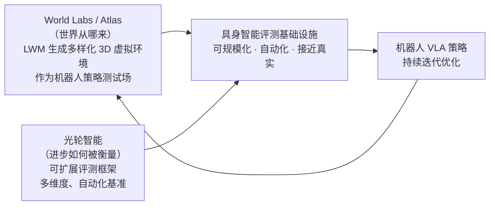

##### ⑤ 商业规模与行业认可

| 指标 | 数据 |
|:---|:---|
| Marble 发布时间 | 2025 年 11 月 |
| Atlas 发布时间 | 2026 年 9 月 1 日（Early Access） |
| 2026 年 2 月融资 | $10 亿美元（总融资 $12.3 亿） |
| 公司估值 | ~$50 亿（较创立时 $10 亿增长 5×） |
| 主要投资方 | NVIDIA、AMD、Autodesk 等 |
| 行业认可 | Forbes AI 50 2026 |
| 世界模型赛道融资变化 | $14 亿（2024）→ $69 亿（2025）|

---

#### 4. 局限性与前沿挑战

- **闭源早期访问与学术可复现性**：Atlas 目前处于定向合作伙伴的早期访问（Early Access）阶段，虽然披露了多模态自回归流匹配架构机制与详实量化评测，但核心模型权重与完整训练超参数尚未公开，开源社区自主复现与二次微调仍有门槛。
- **高动态微观接触力学边界**：虽然 Atlas 支持刚体、铰接体与软体的外观形变与运动模拟，但在机器人需要的高频微观接触力矩、精细摩擦力分布及连续流体动力学等“触觉-力学物理”层面，仍需结合传统物理引擎（如 Isaac Sim、MuJoCo）进行联合仿真验证。
- **超大场景机载端侧部署**：大规模环境下的点云与 3D 高斯泼溅高斯核数量往往达到数百万量级，在嵌入式机器人边缘计算平台（如 Jetson Orin）上进行实时流式推演时，仍需进一步结合神经高斯剪枝与 LoD 分级加载优化。

---

## 5.6 Image2Sim (2026) {#paper-image2sim}
———解耦 3D 空间锚定与单步像素流的实时神经仿真引擎

📄 **Paper**: [arXiv:2607.05765](https://arxiv.org/abs/2607.05765) · [Project Page](https://github.com/MrZihan/Image2Sim) · 清华大学 & 智源研究院 · [[11]](#ref-11)

#### 精华

构建大规模、高保真且具备物理接地的交互式仿真环境是世界模型赋能具身智能的核心使命。Image2Sim 提出了“3D 空间锚定”与“超真实图像合成”解耦的神经仿真新范式：
1. **打破几何与合成的博弈（Decoupled Geometry & Generation）**：利用前馈 3D 特征高斯（Feature Gaussian）提供显式度量几何约束，再由单步像素流（Pixel Flow）生成模型在 3D 几何 Alpha 掩码引导下补全未观测视野，彻底克服了自回归生成式世界模型的空间遗忘与几何崩溃；
2. **45.6 FPS 极速闭环仿真**：采用连续时间 MeanFlow 单步速度估计与动量自蒸馏，将传统扩散/流匹配的多步迭代采样压缩为单步前向映射，在全景 RGB-D 渲染上达到 **45.6 FPS**，首次满足具身智能在线闭环交互与大规模强化学习/DAgger 训练的实时性要求；
3. **自动化具身数据飞轮**：直接从无标注 RGB-D 视频/图像构建近 **2 万个**交互式神经环境，并自动合成了超过 **1000 万条**跨视角高保真导航轨迹与多模态指令；
4. **零样本 Sim2Real 跨域泛化**：基于纯 Image2Sim 神经环境训练的导航策略 Image2Nav，跨模拟器 zero-shot 泛化至真实 Habitat（R2R-CE 成功率 70.3%）与真实 Hello Robot Stretch 3 物理机器人上。

---

#### 1. 研究背景/问题

传统具身智能策略训练严重依赖人工手工建模的物理仿真环境（如 Matterport3D、HM3D、ProcTHOR）：
- 真实扫描环境成本极高，环境多样性受限（仅数百个场景）；
- 程序化合成环境存在严重的 Sim-to-Real 视觉与物理保真度鸿沟；
- 传统生成式视频世界模型虽然画面逼真，但缺乏显式持久的 3D 空间结构和度量坐标系，机器人走远后“回看即崩溃”，无法支持长时间自由导航闭环。

Image2Sim 旨在回答：**能否直接从现实世界采集的无约束视频中，秒级构建出兼具毫米级 3D 空间一致性、照片级视觉保真度与高帧率闭环交互的神经物理世界？**

---

#### 2. 主要方法/创新点

  
<figcaption>图：传统导航数据流水线（需昂贵人工 3D 重建）与 Image2Sim 神经仿真框架（自动从无约束数据构建 2 万个场景与千万轨迹）对比。（图源：Image2Sim, 2026）</figcaption>

Image2Sim 将神经环境仿真解耦为两级级联结构：

  
<figcaption>图：Image2Sim 架构：前馈 3D 特征高斯编码器（左）与几何感知单步 Pixel Flow 渲染器（右）。（图源：Image2Sim, 2026）</figcaption>

1. **前馈 3D 特征高斯几何构建（Feed-Forward 3D Gaussian Encoder）**：
   - 摒弃传统 3DGS 逐场景优化耗时数小时的弊端，采用双流编码器（DINOv3 高层语义流 + 几何细节流），单次前向直接预测场景的 3D 特征高斯集合 $$\mathcal{G} = \{g_j\}_{j=1}^M$$；
   - 在任意查询视角位姿 $$p$$ 下，通过可微光栅化毫秒级投影出全景几何、深度图与不透明度图 $$\tilde{\mathbf{A}}_p$$，提供不可动摇的 3D 几何锚定；
2. **几何感知单步 Pixel Flow 渲染器（Geometry-Aware One-Step Pixel Flow）**：
   - 当机器人漫游至未被扫描的死角盲区时，3DGS 投影会出现空洞与撕裂。Image2Sim 利用不透明度图 $$\tilde{\mathbf{A}}_p$$ 构造 Alpha 门控源状态：
     
     $$
     \mathbf{z}_{\mathrm{src}} = \tilde{\mathbf{A}}_p \odot \tilde{\mathbf{X}}_p + \Sigma(\tilde{\mathbf{A}}_p) \odot \boldsymbol{\epsilon}, \quad \boldsymbol{\epsilon} \sim \mathcal{N}(\mathbf{0}, \mathbf{I})
     $$

   - 在高置信度几何区域保持原始投影，在盲区由基于 Flow Matching 的生成网络智能生成物理合乎逻辑的纹理细节；
   - 配合动量自蒸馏算法，反向 ODE 积分被蒸馏为单步前向预测，实现 45.6 FPS 极速运行。

---

#### 3. 核心结果/发现

1. **渲染速度与保真度双赢**：在 20,000 个场景上，全景 RGB-D 渲染速度达到 **45.6 FPS**，显著快于同类扩散世界模型（通常 < 1 FPS），同时 PSNR 与 LPIPS 均达到一流视觉水准；
2. **纯神经仿真训练的真机策略泛化**：智能体完全在由 Image2Sim 生成的神经环境中进行大规模交互学习，零样本部署至真实世界机器人 Hello Robot Stretch 3，在包含复杂家具布局的未知房间中顺利完成多目标寻物导航，证明了神经世界模拟器替代传统仿真引擎的可行性。

---

#### 4. 局限性
- 当前主要处理室内静态刚体场景，对于可形变柔性物体及大范围流体交互的度量高斯建模尚处于探索阶段。

---

# 6. 家族 B：面向决策的世界模型

这一家族的世界模型直接服务于机器人策略：条件是机器人动作或任务指令，价值最终体现在下游任务成功率上。按世界模型与策略的耦合方式分为四大范式（§2.2）。每个范式下先给出定义与机制，再介绍代表工作。

  
<figcaption>图：VLA 世界模型的四大技术范式。(a) 世界规划器：世界模型生成潜表示 z 引导 VLA；(b) 世界动作模型：将观察与动作联合建模；(c) 世界合成器：通过模仿学习（IL）构建合成数据集；(d) 世界模拟器：通过强化学习（RL）优化策略并获取外部奖励。（图源：Tan et al., 2026）</figcaption>

## 6.1 世界规划器

> 💡 **姊妹篇导读**：关于具身策略模型（OpenVLA、$\pi_0$、Octo、RoboCat 等）的动作 Tokenization、跨本体预训练与端到端控制架构，详见专题博文 [视觉-语言-动作（VLA）全景综述：从大模型底座、数据引擎到物理落地](/VLA-Survey/)。

  
<figcaption>图：InternVLA·N1 的端到端双系统架构：前向动力学规划器提供未来潜特征引导策略执行。（图源：Intern Robotics）</figcaption>

**定义**：该范式采用世界模型 $$\mathcal{W}_\phi$$ 作为前向动力学模型，以显式未来观测帧 $$\hat{o}_{t+1}$$ 或隐式潜特征 $$z_{t+1}$$ 的形式合成前瞻引导信号，为下游策略 $$\pi_\theta$$ 提供强语义与物理条件：

$$
\max_\theta \mathbb{E}_{z_{t+1} \sim \mathcal{W}_\phi(\cdot|o_t)} \left[ \sum_t \log \pi_\theta(a_{t+1} | o_t, z_{t+1}) \right]
$$

世界规划器的核心哲学是**“预测先于行动”（Predict before Act）**：先由世界模型预见未来（显式图像或隐式潜向量），再将该前瞻信号作为输入喂给策略网络，使决策具备物理接地的未来感知与因果预判。两种主流路径的信息流如下：

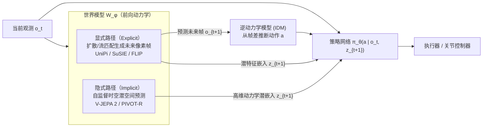

**显式规划 vs 隐式规划深度对比**：

| 维度 | 显式像素规划（Explicit Pixel Planning） | 隐式潜空间规划（Implicit Latent Planning） |
|:---|:---|:---|
| **引导信号** | 像素级未来图像/视频帧 $$\hat{o}_{t+1}$$ | 紧凑时空特征嵌入 $$z_{t+1}$$（如 V-JEPA 2 特征） |
| **代表方法** | UniPi, SuSIE, GR-MG, Vidar, 3D-VLA, FLIP | V-JEPA 2, PIVOT-R, VPP, MinD, TriVLA, MoWM |
| **主要优势** | 人类直观可解释、视觉调试方便、可直接接入通用 VLM | 过滤光照/纹理等与控制无关的视觉噪声，计算速度快，不易产生像素级伪影 |
| **主要劣势** | 扩散反向去噪采样耗时大、易在细小接触面出现像素级变形 | 缺乏直观可解释性、下游策略需与特定潜空间强对齐 |
| **动作推导机制** | 逆动力学模型（IDM）从帧间变化解算动作，或由策略网络条件读取 | 策略网络直接在潜空间 cross-attend 读取前瞻潜特征 |

**演进路径**：早期工作（UniPi [[12]](#ref-12)、SuSIE [[13]](#ref-13)、GR-MG、Vidar、3D-VLA [[14]](#ref-14)、FLIP）将规划视为高保真条件视频生成任务，通过视频扩散模型合成像素级未来状态，再经逆动力学模型导出动作。然而，像素级生成面临严重的推理延迟与细微物理接触模糊。近期 V-JEPA 2 [[15]](#ref-15)、PIVOT-R [[16]](#ref-16) 和 TriVLA 转向隐式规划，直接在自监督潜空间预测未来特征，减少了与动力学无关的背景细节干扰，提升了引导信号的信噪比与计算吞吐量。MoWM 则融合多模态动力学先验形成混合方案，进一步降低动作推导误差。

### GENE-26.5 (2026) {#paper-gene}

[Genesis AI 于 2026 年发布的 GENE-26.5](https://www.genesis.ai/blog/gene-26-5-advancing-robotic-manipulation-to-human-level)  [[17]](#ref-17) 是世界规划器范式在灵巧操作领域的一个工业案例。它最核心的技术突破在于：**新任务仅需 < 1 小时（约 200 episodes、< 20 秒技能）的真机数据即可完成微调**，而支撑这一极高样本效率的，正是“以世界模型为低层动作策略注入物理常识先验”的设计哲学。

**三个功能角色，一个统一模型**

从系统分工看，GENE-26.5 呈现出三个功能层：
- **语义感知层（VLM）**：编码自然语言指令与场景语义，负责高层逻辑任务链分解；
- **物理预测层（World Model）**：动作条件视频生成模型，从海量无标注视频中预先习得“未来几秒内物体如何受力、形变、断裂与滑动”，提供强物理常识先验；
- **执行转化层（Action Model）**：高频底层控制，将语义+物理条件直接翻译为连续关节扭矩。

在工程实现上，**GENE-26.5 并非三个孤立串联的模块**，而是采用 **Flow Matching** 统一建模 language、vision、proprioception、tactile 和 action 的**联合多模态分布**。VLM 与 World Model 是被吸收进来的预训练组件，下游通过**条件查询（Conditional Queries）**从同一联合分布中无缝采样出 control、generative simulation、state estimation、IDM 或 value estimation 等不同子任务。

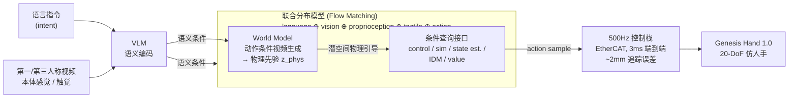

**训练范式与硬件协同**：
- **异构多模态预训练（> 200,000 小时）**：覆盖手套捕捉数据（轨迹+触觉）、第一人称自然交互视频、第三人称互联网物理交互视频以及图文语料。模型直接从非完美对齐的异构数据中习得“感知-物理-动作”耦合先验，因而下游任务只需 20–30 分钟数据微调；
- **500Hz / 3ms 超低延迟硬件控制栈**：世界规划器的物理轨迹在下发到真机时，往往因控制栈延迟导致误差放大。GENE-26.5 自研 EtherCAT 中间件，将端到端通信延迟压缩至 3ms，结合 20 个主动可反驱（Back-drivable）自由度的 Genesis Hand 1.0，将跟踪误差压至 ~2mm，确保了世界模型预测的物理轨迹在物理执行端得到高保真复现。

---

### VLA-World (2026) {#paper-vla-world}
———Learning Vision-Language-Action World Models for Autonomous Driving

📄 **Paper**: [https://vlaworld.github.io](https://vlaworld.github.io) · [[18]](#ref-18)

##### 精华

VLA-World 的核心思想在于通过在单帧未来预测的基础上进行反思性推理，将世界模型的生成能力与 VLA 模型的推理能力相结合。最值得借鉴的设计是其“分步走”的流程：首先根据预测的动作生成一张未来图，再让模型去观察这张自己生成的图，从而识别潜在的碰撞风险并修正动作。这种“脑内模拟后二次评估”的机制（Think with Generated future）极大地增强了端到端驾驶系统的安全性和可解释性。

---

##### 1. 研究背景/问题

现有的端到端自动驾驶模型（如 VLA）通常缺乏显式的时空建模，难以预测环境中其他交通参与者的演变。而纯世界模型虽然能生成连贯的未来场景，却往往缺乏推理能力，难以评估所生成未来的安全性或优劣。VLA-World 通过统一预测性想象与反思性推理，提升了驾驶前瞻性。

---

##### 2. 主要方法/创新点

VLA-World 提出了一个结合了感知、动作衍生预测、图像生成、反思推理和规划的完整流程。

  
<figcaption>图：VLA-World 三阶段训练与性能概览。（图源：VLA-World, 2026）</figcaption>

###### 三阶段训练策略
1. **阶段 1：视觉预训练**：在大规模图像-指令数据集上激活图像生成知识。
2. **阶段 2：监督微调 (SFT)**：通过 nuScenes-GR-20K 混合任务数据集，建立感知、未来生成与规划的逻辑链接。
3. **阶段 3：强化学习 (RL)**：利用 GRPO 算法探索类人推理，使模型能更深入地反思生成的未来是否安全。

  
<figcaption>图：VLA、世界模型与 VLA-World 三种范式的对比。（图源：VLA-World, 2026）</figcaption>

###### 反思推理机制 (Think with Generated future)
模型首先输出一个 0.5 秒内的轨迹预测，并据此生成对应的未来图。随后，模型再次“审阅”这张自生成的图，识别重要物体和潜在风险，最终修正决策，输出最终的长程轨迹。这种机制类似于人类驾驶员遇到突发状况时的二次反思过程。

---

##### 3. 核心结果/发现

- **性能表现**: 在 nuScenes 等基准测试中，VLA-World 达到了比现有 VLA 和世界模型更低的碰撞率（Collision Rate 从 1.09% 降至 0.94%）和更高的 FID 视频生成质量。
- **可解释性**: 通过让模型写下对“自己生成的未来”的推理过程（如识别某卡车的碰撞风险），系统的决策过程变得更加透明。

  
<figcaption>图：VLA-World 在复杂场景下的多视角图像预测可视化。（图源：VLA-World, 2026）</figcaption>

---

##### 4. 局限性

由于模型需要先生成图像再进行推理，系统的端到端延迟仍然是一个挑战。未来研究将聚焦于提高实时推理速度。

---

## 6.2 世界动作模型（WAM）

**定义**：该范式采用生成式序列模型或扩散模型，将未来观测状态与控制动作纳入统一网络，直接建模观测与控制的联合时空分布：

$$
\max_\phi \mathbb{E}_{\tau \sim \mathcal{D}} \left[ \sum_t \log \mathcal{W}_\phi(o_{t+1}, a_{t+1} \mid o_{\le t}, a_{< t}) \right]
$$

与世界规划器“前瞻预测与策略解码前后串联”不同，世界动作模型将两者**统一在同一个骨干网络中联合优化**：模型既要预测未来帧（自监督物理演化目标），又要直接解码控制动作（策略执行目标）。

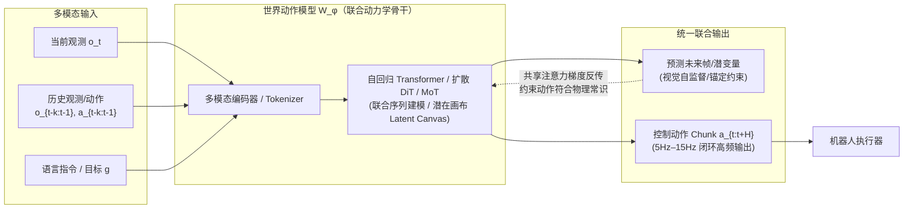

### 为什么 WAM 受到关注

传统的世界模型在推理时往往需要依赖外挂的轨迹搜索算法（如交叉熵方法 CEM、蒙特卡洛树搜索 MCTS、模型预测路径积分 MPPI），在成百上千条随机候选动作序列中逐一推演评分，导致单步决策耗时高达数秒，无法满足高频动态交互。

**WAM 的主要工程优势是省去了测试时的在线搜索**：
1. **单次前向直接生成动作**：在测试阶段，WAM 可以直接以 Policy 模式单次前向去噪输出可执行动作块（Action Chunk），控制频率可达 **5Hz–15Hz**，省去了 CEM 式的大量候选轨迹推演（NavWAM 报告较 NWM 提速约 1100×，见下文）；
2. **未来视觉预测作为强正则化与路标锚定**：在训练阶段，模型被迫在预测未来画面的同时生成动作。由于视觉去噪包含密集的像素级自监督信号，动作头获得了深度的物理动力学约束，有效缓解了反应式策略在长程控制中的“策略漂移（Policy Drift）”；
3. **架构的统一与灵活性**：通过灵活的掩码机制（Masking）或加噪调度，同一个 WAM 权重即可自由切换为前向动力学模拟器、逆动力学标注器、纯策略控制器或跨模态编辑工具。

**细粒度分类**（根据建模范式和实现机制）：

| 建模范式 | 核心机制 | 代表性方法 | 核心技术亮点 |
|:---|:---|:---|:---|
| **自回归（AR）** | 视频预训练 | GR-1 [[19]](#ref-19), HMA, UniVLA [[20]](#ref-20), GR-2 | 大规模视频先验转化为端到端动作预测 |
| **自回归（AR）** | 统一序列建模 | WorldVLA [[21]](#ref-21), RynnVLA-002, UP-VLA | 将图像、动作、文本离散化为统一 Token 流 |
| **自回归（AR）** | 前瞻与思维链推理 | Seer, FlowVLA [[22]](#ref-22), CoT-VLA [[23]](#ref-23), DreamVLA [[24]](#ref-24) | 引入多模态思维链与未来光流引导结构化决策 |
| **扩散 / 流匹配** | 混合专家（MoT） | Motus [[25]](#ref-25), Cosmos 3 [[26]](#ref-26) | 共享自注意力 + 解耦 FFN，UniDiffuser 多模式切换 |
| **扩散 / 流匹配** | 空间价值接口 | AIM [[27]](#ref-27) | 空间价值图（ASVM）显式解耦意图，自蒸馏 RL 优化 |
| **扩散 / 流匹配** | 潜在画布（Canvas） | NavWAM [[28]](#ref-28) | 9帧世界-动作潜在画布，消除 CEM 实现 5Hz 实时导航 |
| **扩散 / 流匹配** | 非对称视界 | WAM-Nav [[29]](#ref-29) | 动作长视界（24步）+ 视觉短视界（1步），防止视角剧变漂移 |

---

### WorldVLA (2025) {#paper-worldvla}
———Towards Autoregressive Action World Model

📄 **Paper**: [https://arxiv.org/abs/2506.21539](https://arxiv.org/abs/2506.21539) · [[21]](#ref-21)

##### 精华

这篇论文的核心亮点在于将 Vision-Language-Action (VLA) 模型与世界模型（World Model）统一在单个自回归框架中。值得借鉴的思想包括：利用世界模型预测未来图像的能力来学习环境底层物理规律，从而增强动作生成的准确性；反之，动作模型也辅助视觉理解，提升了图像生成的质量。此外，针对自回归动作序列生成中的误差累积问题，提出的动作注意力掩码策略（Action Attention Masking）能够显著提升动作块（Action Chunk）的生成性能。

---

##### 1. 研究背景/问题

当前的 VLA 模型主要关注从图像和文本生成动作，但往往缺乏对动作深层次的理解，因为动作仅作为输出而未作为输入。相比之下，世界模型能够通过预测未来视觉状态来理解物理动力学，但通常无法直接生成动作。WorldVLA 旨在打破这一界限，通过统一架构实现动作与图像的协同理解与生成。

---

##### 2. 主要方法/创新点

WorldVLA 采用自回归架构，集成了图像、文本和动作三种模态的 Tokenizer。

  
<figcaption>图：WorldVLA 与传统动作模型、世界模型的对比。（图源：WorldVLA, 2025）</figcaption>

###### 统一架构
模型初始化自 Chameleon，一个统一的图像理解与生成模型。它包含：
- **图像 Tokenizer**: VQ-GAN 模型，将图像离散化为 Token。
- **动作 Tokenizer**: 将 7 维机器人动作（位置、角度、夹具状态）离散化为 256 个 Bin 的 Token。
- **文本 Tokenizer**: 标准的 BPE Tokenizer。

  
<figcaption>图：WorldVLA 整体架构图。（图源：WorldVLA, 2025）</figcaption>

###### 训练策略
训练过程混合了动作模型数据和世界模型数据：
1. **动作预测 ($L_{action}$)**: 给定指令和多帧图像，预测后续动作。
2. **未来预测 ($L_{world}$)**: 给定当前观察和动作，预测下一帧图像。

###### 动作注意力掩码 (Action Attention Masking)
论文发现，由于预训练模型在动作域的泛化能力有限，传统的因果掩码会导致前一动作的错误迅速传播。为此，WorldVLA 设计了一种特殊的掩码：在生成当前动作块时，遮蔽之前的动作，使动作生成仅依赖于视觉和文本输入，从而支持并行生成动作块并减少误差累积。

  
<figcaption>图：WorldVLA 的注意力掩码机制。（图源：WorldVLA, 2025）</figcaption>

---

##### 3. 核心结果/发现

- **LIBERO 基准测试**: WorldVLA 在 256x256 和 512x512 分辨率下均显著优于 OpenVLA。
- **协同效应**: 加入世界模型数据后，动作生成的成功率（SR）有明显提升（例如在 LIBERO-Goal 上从 67.3% 提升至 73.1%）；同时，动作模型也帮助降低了视频生成的 FVD 值。
- **动作块生成**: 采用新掩码策略后，动作块生成的鲁棒性大幅增强。

  
<figcaption>图：动作模型可视化：WorldVLA 能在失败后多次尝试抓取。（图源：WorldVLA, 2025）</figcaption>

  
<figcaption>图：世界模型可视化：WorldVLA 生成的未来图像更符合物理逻辑。（图源：WorldVLA, 2025）</figcaption>

---

##### 4. 局限性

目前使用的离散图像 Tokenizer 在感知表现力上仍有局限。未来工作将探索更大规模的数据和模型，以及设计能够更平衡理解与生成的统一 Tokenizer。

---

### AIM (2026) {#paper-aim}
———Intent-Aware Unified World Action Modeling with Spatial Value Maps

📄 **Paper**: https://arxiv.org/abs/2604.11135 · [[27]](#ref-27)

##### 精华

这篇论文最值得借鉴的是**用显式的空间价值图（Spatial Value Map, ASVM）作为世界模型（World Model）和动作头（Action Head）之间的中间接口**，把“未来视觉预测”与“动作解码”之间缺失的“在哪里交互、为什么交互”这一操作意图（Manipulation Intent）补齐，从而避免动作头从稠密 RGB 像素未来中隐式反推逆动力学。具体可迁移的设计包括：(1) **意图因果注意力（Intent-Causal Attention）**——通过显式注意力掩码（Attention Mask）强制动作分支只能经由空间价值图访问未来信息，而不能直接读取未来 RGB Tokens，形成结构化的信息瓶颈；(2) **混合专家 Transformer（Mixture-of-Transformers, MoT）**的共享自注意力 + 分支 FFN 让视频、价值图、动作三个数据流既紧密耦合又各自保留专有特征空间；(3) **自蒸馏强化学习后训练（Self-Distillation RL Post-Training）**——冻结视频生成与价值图分支，仅利用投影空间价值图响应所产生的稠密奖励训练动作头，相当于让预训练的价值头自监督指导动作头，无需额外人工标签。这种“把语义意图落地为空间热图”的抽象在具身 VLA 控制领域具有极强的通用迁移价值。

---

##### 1. 研究背景/问题

预训练视频生成模型为机器人控制提供了强大的视觉先验，但已有的统一世界动作模型（Unified World Action Models）在不做海量机器人专有数据微调的情况下难以解码出高精度动作。作者指出这并非纯粹的数据统计问题，而是**结构性失配（Structural Mismatch）**：视频生成模型捕获的是“物理场景如何演化”，而动作生成还需要显式推理“在哪里交互（Where）”以及“背后的操作意图（Intent）”；直接从未来 RGB 潜特征解码动作，会迫使模型从一个并非为控制优化的视觉表征中隐式恢复操作意图。

---

##### 2. 主要方法/创新点

  
<figcaption>图：典型统一世界动作模型（左）直接从共享未来视觉表征解码动作；AIM（右）在世界模型与动作头间引入空间价值图接口并通过自蒸馏优化。（图源：AIM, 2026）</figcaption>

**核心思路：显式空间接口（Explicit Spatial Interface）。** AIM 不直接从未来视觉特征解码动作，而是联合预测未来视频帧 $X^+$ 与与之空间几何对齐的动作空间价值图（Action-aligned Spatial Value Map）$M^+ \in [0,1]^{H \times W \times 3}$；空间价值图高亮任务相关的交互区域（例如抓取任务的抓取可操作性 Grasp Affordance 区域、放置任务的放置接触 Placement Contact 区域），作为操作意图的控制抽象。条件联合分布被分解为：

$$p(X^+, M^+, A^+ \mid \mathcal H_t) = p(X^+, M^+ \mid \mathcal H_t)\, p(A^+ \mid \mathcal H_t, M^+).$$

动作生成**仅通过预测出的空间价值图**获取未来信息，而不直接访问未来 RGB Tokens。

  
<figcaption>图：AIM 整体框架：Stage I 联合训练未来帧、空间价值图与动作；意图因果注意力将任务意图传递至动作分支；Stage II 冻结视频与价值分支，通过 GRPO 强化学习优化动作头。（图源：AIM, 2026）</figcaption>

**架构设计（Architecture）。** 基于预训练视频生成模型 **Wan2.2-TI2V-5B** 初始化视频分支，加入一个与之同深度但隐藏层宽度更紧凑的动作解码头。采用 **Mixture-of-Transformers (MoT)**：视频、价值图、动作三个流在每个 Transformer Block 共享自注意力子层，但各自拥有独立的 $W_{Q,s}^\ell, W_{K,s}^\ell, W_{V,s}^\ell$ 投影与独立的前馈网络（FFN）。T5 编码的自然语言指令仅通过交叉注意力注入视频分支，保证动作头仅经由共享的世界表征接收任务语义。Token 化时将三个视角（头顶俯视 / 左腕 / 右腕）拼接为 T-pose Canvas 画布，并复用 Wan2.2 VAE 同时编码 RGB 观测 $z_t^o$ 与空间价值图 $z_t^m$，使价值 Tokens 与视觉 Tokens 天然保持几何对齐。

**意图因果自注意力（Intent-Causal Self-Attention）。** 这是 AIM 的关键结构创新，通过对共享自注意力的可见性掩码（Visibility Mask）实现：

$$\mathcal V_x = [z_t^o,\, z_{t-k:t-1}^o,\, z_{t-k:t-1}^a,\, z^\ell,\, z^x],$$

$$\mathcal V_m = [z_t^o,\, z_{t-k:t-1}^o,\, z^x,\, z^m],$$

$$\mathcal V_a = [z_t^o,\, z_{t-k:t-1}^a,\, z^o,\, z^a].$$

语义上：未来视频 Tokens 能看到当前观测、指令、历史观测动作，从而预测任务条件下的未来物理演化；未来价值 Tokens 能看到当前/历史观测与**未来视频 Tokens**，从而将空间价值预测锚定到推演出的未来状态；**动作 Tokens 只能看到当前观测、历史动作和未来价值 Tokens，而看不到未来 RGB Tokens**——这一掩码机制的作用是将任务语义先经过 T5 交叉注意力进入视频流 → 再凝聚沉淀到空间价值流 → 最后才被动作解码头读取，形成严密的“视频 $\to$ 价值 $\to$ 动作”因果信息瓶颈。

**训练目标。** 整体损失函数是 RGB 流匹配（Flow Matching）、空间价值图流匹配与动作逆动力学损失的加权和：

$$\mathcal L = \mathcal L_{rgb} + \lambda_m \mathcal L_{map} + \lambda_a \mathcal L_{act}.$$

未来 RGB 与未来价值图 Tokens 由视频生成主干沿同一条流匹配轨迹联合去噪，动作 Tokens 由动作头去噪为连续双臂控制向量 $\hat A^+$。推理时 AIM 采用自回归 Chunk-wise Rollout 并利用 KV 缓存复用历史 Tokens，显著提升长时程推理效率。

**自蒸馏强化学习后训练（Self-Distillation RL Post-Training）。** 监督学习（SFT）只能模仿动作分布而无法直接优化闭环任务成功率。因此引入第二阶段：**冻结视频生成主干与空间价值图预测头，仅用 GRPO 算法更新动作头**。单步奖励函数由稠密与稀疏两部分构成：

$$r_t = \lambda_d r_t^{dense} + \lambda_s r_t^{sparse},\qquad r_t^{dense} = M_t(\Pi(p_t)),$$

其中 $r_t^{sparse}$ 为任务完成的稀疏奖励信号，$p_t$ 为预测动作的落点或末端执行器目标位置，$\Pi(\cdot)$ 为相机几何投影矩阵，$M_t$ 为冻结价值头预测的空间价值图。直观而言，动作头因将动作精确投射到高价值交互区域而获得正向奖励——这是一种**利用模型自身的空间价值先验作为稠密奖励的自蒸馏机制**，免除了繁重的人工标注。GRPO 优化目标：

$$\mathcal L_{GRPO}(\phi) = \mathbb E_t\left[\min\!\Big(\rho_t(\phi)\hat A_t,\, \mathrm{clip}(\rho_t(\phi), 1-\epsilon, 1+\epsilon)\hat A_t\Big)\right].$$

**空间价值图标注方案。** 针对抓取（Pick）任务，在夹爪与目标物体建立有效物理接触时记录接触表面点云，经相机投影矩阵映射至图像平面并施加高斯平滑，构建抓取可操作性区域（Grasp Affordance Region）；高斯核宽度根据相机内参及深度距离动态调整，保证不同视角与距离下的几何尺度一致。针对放置（Place）任务，检测被操作物体达到静止构型时的接触区域，生成放置接触区域（Placement Contact Region）。作者在 RoboTwin 2.0 仿真平台构建了 30K 轨迹的大规模数据集，包含同步多视角视频、精确动作序列及逐帧空间价值图标注。

---

##### 3. 核心结果/发现

在 RoboTwin 2.0 的 50 个双臂精细操作任务上进行评测，Easy / Hard 难度均以任务成功率（SR %）为主指标：

- **平均成功率：AIM 达到 94.0% / 92.1%（Easy / Hard），综合平均成功率达 93.1%**，全面领先 $\pi_0$ (62.2%)、X-VLA (72.8%)、$\pi_{0.5}$ (79.8%)、GigaWorld-0 (86.0%)、Motus (87.8%)、Fast-WAM (91.8%)、LingBot-VA (92.2%) 等主流基线模型。
- **强化学习后训练增益显著**：Stage 1（SFT 监督微调）已达到 93.0% / 92.0%（平均 92.5%）；Stage 2 RL 阶段进一步带来 +0.6 个百分点的平均提升（达到 94.0% / 92.1%，平均 93.1%），在 *Place Mouse Pad* (97%/95%)、*Scan Object* (100%/98%)、*Turn Switch* (100%/98%) 等接触敏感和阶段依赖任务上增益尤为突出。
- **大幅领先同类方法**：相对同类统一世界动作模型 Motus，AIM 在 Easy / Hard 难度分别提升 **+4.8 / +5.7 个百分点**（平均提升 +5.3%）；相对 $\pi_{0.5}$ 提升 **+12.7 / +13.9 个百分点**（平均提升 +13.3%）。这证明将“空间交互意图”显式化建模带来的增益，显著超越了单纯扩大动作模型或视频模型参数量。
- **定性可视化验证**：未来帧预测与操作阶段时序高度对齐，空间价值图精准聚焦于具有明确物理交互语义的区域（而非一般的视觉显著性 Saliency），机械臂投影动作落点严密落在高价值区域内，表明性能突破确实源于所设计的“空间桥梁”机制。

  
<figcaption>图：RoboTwin 2.0 代表性任务执行过程（置鼠标垫/压订书机/扫物体/扳开关/开笔记本），左列为 Easy 设置，右列为 Hard 设置。（图源：AIM, 2026）</figcaption>

---

##### 4. 局限性

目前该工作主要在 RoboTwin 2.0 仿真环境中构建数据并评测，尚需在真实双臂机器人平台上做进一步闭环迁移验证；此外，空间价值图的自动标注依赖仿真器的碰撞检测 API 与接触物理状态，在真实无标注视频中如何以无监督方式高效挖掘同等精度的空间接触标签仍是开放课题。

---

### Motus (2025/2026) {#paper-motus}
———统一隐动作世界模型：Mixture-of-Transformers 与光流动作金字塔

📄 **Paper**: [arXiv:2512.18876](https://arxiv.org/abs/2512.18876) · [Project Page](https://motubrain.com) · [Code](https://github.com/PKU-YuanGroup/Motus) · 清华大学 & 生数科技 · [[25]](#ref-25)

##### 精华

Motus 是首个将**混合专家 Transformer（Mixture-of-Transformers, MoT）**与**统一扩散生成调度（UniDiffuser）**引入机器人双臂操作的统一世界动作模型（WAM）。最值得借鉴的核心设计包括：
1. **解耦 FFN 的三专家 MoT 架构**：在单个 DiT 骨干中集成多模态理解专家、视频生成专家与连续动作专家。三类 token 在每层共享自注意力实现深层信息互通，但在前馈网络（FFN）处解耦，既杜绝了模态特征干扰，又赋予模型在世界模型、VLA 策略、逆动力学和联合仿真之间任意切换的能力；
2. **基于光流的潜动作模型（Latent Action VAE）**：彻底摆脱对真机机械臂特定关节角（Joint Angles）标签的强依赖！提出直接从视频像素光流（Optical Flow）中自监督提取潜动作向量，使互联网海量无标注人类交互视频能够无缝转化为机器人可用的预训练数据；
3. **六层数据金字塔**：构建了从通用视频、带相机位姿视频、人类手部交互视频到真机遥操作的逐级蒸馏数据金字塔，利用像素级“差分动作（Delta Action）”实现跨本体知识迁移；
4. **RoboTwin 2.0 双臂仿真与真机 SOTA**：在极具挑战性的细粒度双臂操作基准 RoboTwin 2.0 上，Motus 平均成功率 87.8%，较 X-VLA（72.8%）高出 15.0 个百分点、较 $$\pi_{0.5}$$（79.8%）高出 8.0 个百分点，其后续演进版 Motubrain 更实现了 10× 推理加速。

---

##### 1. 研究背景/问题

具身智能系统长期面临严重的技术割裂：VLA 策略模型（如 OpenVLA、$$\pi_0$$）仅关注从图像映射到动作，缺乏对物理世界演变的前瞻理解；而视频世界模型（如 Sora、Wan2.1）擅长视频生成，却不懂如何输出精确的力控动作；两者的简单串联又存在高延迟与误差累积。

核心问题在于：**如何构建一个统一的生成式骨干，既能吸收互联网无标注视频的通用物理先验，又能精确生成机器人连续双臂动作，并在毫秒级内完成闭环推理？**

---

##### 2. 主要方法/创新点

  
<figcaption>图：Motus 整体架构图：基于 MoT（Mixture-of-Transformers）三专家网络，统一建模多模态理解、视频生成与机器人连续动作控制。（图源：Motus, 2025）</figcaption>

###### ① 三专家 Mixture-of-Transformers（MoT）架构

Motus 在每个 Transformer Block 内部引入了分流设计：
- **Token 组织**：输入序列由视觉潜 Token $$z_v$$（来自 Wan-VAE）、文本 Token $$z_t$$（来自 T5）与连续动作 Token $$z_a$$（来自 Latent Action VAE）拼接而成；
- **共享自注意力（Shared Self-Attention）**：视觉、文本与动作三种异构 Token 共享同一组注意力权重，允许动作 Token 自由查询场景未来的物理演化趋势，同时让未来视觉生成受到预定操作意图的约束；
- **解耦专家 FFN（Decoupled FFNs）**：在注意力交互之后，视觉 Token 路由至 Video FFN，文本 Token 路由至 Text FFN，动作 Token 路由至 Action FFN。这种解耦避免了视频生成的大梯度破坏精细动作的数值敏感性。

  
<figcaption>图：Motus 的 Latent Action VAE：通过自编码光流场自监督提取连续潜动作空间。（图源：Motus, 2025）</figcaption>

###### ② 光流动作提取与 UniDiffuser 联合去噪调度

为了利用互联网海量无控制标签的视频，Motus 设计了 **Latent Action VAE**：
- 输入相邻两帧的稠密光流场 $$F_{t \to t+1}$$，经编码器压缩为低维连续潜动作向量 $$a_t \in \mathbb{R}^{d_a}$$；
- 在训练阶段，采用类似 UniDiffuser 的联合去噪调度器，对视频潜变量 $$z_v$$ 与动作变量 $$a_t$$ 分配独立的加噪时间步；
- 通过在训练中动态 Mask 掉某些通道，模型天然支持四种运行模式：
  1. **世界模型模式**：给定观测 $$o_t$$ 与动作 $$a_t$$，去噪生成未来帧 $$o_{t+1}$$；
  2. **策略（Policy）模式**：给定观测 $$o_t$$ 与指令，单次前向直接去噪生成执行动作 $$a_t$$；
  3. **逆动力学（IDM）模式**：给定前后两帧 $$o_t, o_{t+1}$$，反推执行动作 $$a_t$$；
  4. **联合仿真模式**：同时去噪动作与未来画面，既给出决策又呈现预想后果。

---

##### 3. 核心结果/发现

  
<figcaption>图：Motus 在双臂操作仿真基准 RoboTwin 2.0 上的性能对比，在多种高精度接触任务中大幅领先基线。（图源：Motus, 2025）</figcaption>

1. **RoboTwin 2.0 刷新记录**：在双臂协调操作基准测试中，Motus 的平均任务成功率达到 **87.8%**，大幅超越 X-VLA（72.8%）和 $$\pi_{0.5}$$（79.8%）；
2. **真机跨本体泛化**：在单臂 Franka 与双臂移动机器人真机上执行 20 余项日常复杂技能（如开箱、倒水、折叠毛巾），平均成功率突破 **85%**；
3. **消除在线规划延迟**：Policy 模式下单步动作生成延迟仅需 **80ms**，实现了真正可部署的高频闭环伺服。

  
<figcaption>图：Motus 真机多任务操控执行轨迹。（图源：Motus, 2025）</figcaption>

---

##### 4. 局限性

- 隐动作空间从光流中提取，虽然摆脱了硬件标签依赖，但在面对手部严重自遮挡或极速运动导致的光流伪影时，潜动作可能产生短暂失真；
- 模型参数量较大，端侧部署依赖 TensorRT 量化与显存优化。

---

### NavWAM & WAM-Nav (2026) {#paper-navwam}
———导航世界动作模型：潜在画布（Latent Canvas）与非对称时空视界

📄 **NavWAM (2026)**: [arXiv:2606.13494](https://arxiv.org/abs/2606.13494) · [Project Page](https://dachii-azm.github.io/navwam/) · [[28]](#ref-28)  
📄 **WAM-Nav (2026)**: [arXiv:2606.04907](https://arxiv.org/abs/2606.04907) · WAM-Nav: Asymmetric Latent World-Action Modeling for Unified Visual Navigation · [[29]](#ref-29)

##### 精华

在长程视觉导航（Visual Navigation）领域，传统的导航世界模型（Navigation World Models, NWM）长期受困于测试时极高昂的在线规划开销（使用 CEM 算法采样数千条候选轨迹，单步耗时甚至高达数分钟）。2026 年最新涌现的 **NavWAM** 与 **WAM-Nav** 彻底颠覆了这一范式，其最核心的技术突破包括：
1. **统一潜在画布（9-Frame Latent Canvas，NavWAM）**：将当前状态、目标图像、当前视觉观测、未来动作 Chunk、未来状态预测、未来视觉前瞻与目标进度价值（Value）全部打包为固定 9 帧的时空潜在画布，通过联合去噪一次性完成动作生成与物理预测，彻底消除了推理时 CEM 搜索开销，控制频率可达 **5Hz**，计算量降低数千倍；
2. **非对称时空视界（Asymmetric Horizon，WAM-Nav）**：深刻揭示了导航与操作的根本差异——导航中机器人的自我中心视角变换剧烈，长程视觉展开极易导致累积误差爆炸！WAM-Nav 创造性地采用**“动作长视界（$$H_{act}=24$$ 步保轨迹平滑）+ 视觉短视界（$$H_{vis}=1$$ 步提供可靠近未来几何锚定）”**的非对称设计；
3. **纯隐空间前瞻与零解码自监督**：视觉预测全部在预训练 VAE 隐空间进行，无需昂贵的逐像素渲染，通过隐空间速度匹配损失惩罚动作与物理几何的不一致；
4. **真实物理轮式/双足机器人验证**：在 Diablo 轮足机器人和宇树 Unitree G1 人形机器人上完成多场景闭环实测，成功率达 **79.2%–85%**。

---

##### 1. 研究背景/问题

在视觉目标导航（Image-Goal / Point-Goal Navigation）中，环境通常是高度复杂且局部可观测的。传统的规划式世界模型（NWM）仅充当前向预测器，在执行每一步动作前，必须在内存中通过交叉熵方法（CEM）闭环展开上千条视觉轨迹并逐一评分，导致**单步推理延迟高达数十秒至数百秒**（FLOPs 超过 14,000 TF），根本无法用于移动机器人避障。

核心问题在于：**能否在单个生成式网络中，将未来视觉预测、价值评估与连续动作决策深度熔合，实现既有物理前瞻视野又具备实时高频闭环的统一导航模型？**

---

##### 2. 主要方法/创新点

  
<figcaption>图：传统规划式导航世界模型（NWM，左）与导航世界动作模型（NavWAM，右）的决策流对比：NavWAM 彻底剔除繁重的在线 CEM 采样优化，实现高频闭环。（图源：NavWAM, 2026）</figcaption>

###### ① NavWAM 的 9 帧世界-动作潜在画布（Latent Canvas）

NavWAM 基于预训练 Cosmos-Predict2（2B）底座，构建了一个统一的 9 帧时空潜在画布：

  
<figcaption>图：NavWAM 的 9 帧潜在画布布局：将状态、目标、当前观测、动作 Chunk、未来状态、未来图像及进度价值统一排布并联合去噪。（图源：NavWAM, 2026）</figcaption>

- **画布排布**：
  - *帧 0–3（已观测条件）*：时空 VAE 边界 Pad、标准化机器人位姿 $$s_t$$、目标图像 $$g$$ 与第一人称当前观测 $$o_t$$；
  - *帧 4–8（待预测输出）*：可执行动作 Chunk $$a_{t:t+H-1}$$（$$H=4$$ 局部航向增量）、未来状态 $$s_{t+H}$$、未来连续观测预测 $$o_{t+H-1}, o_{t+H}$$，以及反映局部到终点进度的归一化距离价值 $$v_{t+H} \in [0, 1]$$。
- **空间广播与平均**：标量/向量特征（动作、状态、价值）经归一化后广播填充为整张特征图，解码时通过空间平均池化恢复，完美复用标准视频 DiT 架构；
- **Policy 模式单步直出**：推理时输入帧 0–3，单次去噪前向即可同时输出高精度的未来动作 Chunk 与预期视觉画面，推理延迟仅 **205.7 ms**（5Hz 控制），较 NWM 的 233.8 秒快了 **1100 倍**！

###### ② WAM-Nav 的非对称视界与双流上下文融合（DSCC）

针对剧烈旋转下的长程漂移，WAM-Nav 提出了两大核心创新：

  
<figcaption>图：WAM-Nav 架构：统一目标对齐解耦为视觉查询 gV 与几何查询 gG，DSCC 双流融合历史观测与运动动量，共享 DiT 联合去噪动作与近未来隐特征。（图源：WAM-Nav, 2026）</figcaption>

1. **非对称视界设计（Asymmetric Horizon）**：
   - 动作时域设定为长程（$$H_{act}=24$$ 步），保证机器人运动学轨迹平滑且具有足够前瞻；
   - 视觉时域设定为极短程（$$H_{vis}=1$$ 步），在 Stable Diffusion VAE 的潜空间中预测近未来特征 $$z_{t+1}$$，为动作去噪提供立竿见影的近场几何障碍碰撞约束，同时彻底避免了长程自回归视频生成带来的发散伪影；
2. **双流上下文条件（DSCC）**：
   - 目标调制视觉流：用视觉查询 $$g_V$$ 残差强化 DINOv2 提取的视觉空间记忆；
   - 相对运动历史流：将历史轨迹转换为坐标无关的相对位移 $$(\Delta x_i, \Delta y_i, \Delta \theta_i)$$，保证运动动量平滑。

---

##### 3. 核心结果/发现

1. **离线基准与未来视觉一致性**：在 GO STANFORD 测试集上，NavWAM 在无需 CEM 动作搜索的前提下，轨迹误差 ATE 仅为 0.192，显著优于传统 NWM（0.453），未来视觉预测一致性（0.668）大幅领先；
2. **实机机器人部署突破**：
   - **NavWAM**：在 Diablo 轮足机器人室内多场景（办公室、仓库、会议室、大厅）24 次盲测中，取得 **79.2%** 的高成功率，远超 OmniVLA（58.3%）与 NWM（16.7%）；
   - **WAM-Nav**：在 Unitree G1 人形机器人真机实测中取得 **85%** 的平均导航成功率，展示出极强的 Sim2Real 零样本泛化能力。

  
<figcaption>图：Diablo 机器人实机运行期间的实测相机画面与预测未来画面对比。（图源：NavWAM, 2026）</figcaption>

---

##### 4. 局限性

- 当前主要聚焦于静态/准静态室内环境，对于穿梭行人等动态障碍物的复杂物理交互仍需引入动态流场建模；
- 目标输入主要针对图像目标导航（Image-Goal），未来需与全模态语言指令进一步深度融合。

---

## 6.3 世界合成器

**定义**：该范式将世界模型构建为可无限扩展的**生成式数据飞轮（Data Engine）**，通过联合生成器 $$\mathcal{G}_{\theta,\phi}$$ 自主合成包含交错观测与控制标注的大规模轨迹数据集 $$\mathcal{D}_{syn}$$，用以支撑大规模模仿学习（IL）：

$$
\mathcal{D}_{syn} \triangleq \left\{ \tilde{\tau} \sim p(o_0) \prod_t \mathcal{G}_{\theta,\phi}(\hat{o}_{t+1}, a_{t+1} \mid \hat{o}_t, \text{instruction}) \right\}
$$

世界合成器主要用来缓解机器人领域“数据长尾、采集昂贵”的问题。根据是否依赖真实动作标注，演化出两条核心合成路径：

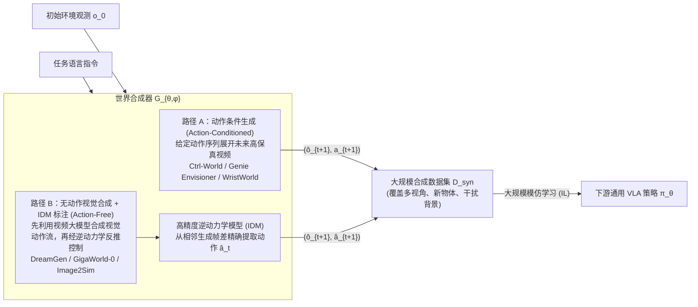

**细粒度分类与核心路径**：

1. **动作条件生成路径（Action-Conditioned Rollouts）**：
   - *代表方法*：Ctrl-World [[30]](#ref-30), Genie Envisioner, WristWorld [[31]](#ref-31), Qwen-RobotWorld [[32]](#ref-32)（以自然语言描述的动作为条件，见下文）；
   - *机制*：基于真实采集的轨迹动作序列作为输入条件，通过世界模型生成对应视角的未来演变视频（如 WristWorld 生成 4D 手腕视角动态），实现对现有数据的视角扩充与背景泛化；
2. **无动作合成与逆动力学标注路径（Action-Free Video Synthesis + IDM）**：
   - *代表方法*：DreamGen [[33]](#ref-33), GigaWorld-0 [[34]](#ref-34), Image2Sim [[11]](#ref-11)；
   - *机制*：不依赖真机动作标签。直接利用大规模视频生成底座（如 Wan2.1、Sora、Image2Sim）在给定任务指令下合成视觉上物理合理的交互视频轨迹，随后通过高精度逆动力学模型（IDM）从生成的视频帧差中反推出机器人关节控制动作 $$\hat{a}_t$$。该路径能够利用互联网规模的视频知识，是缓解机器人长尾数据瓶颈的重要方向。

---

### Qwen-RobotWorld (2026) {#paper-qwen-robotworld}
———用自然语言统一具身世界模型：机械臂操作、自动驾驶、室内导航和人到机器人迁移

📄 **Paper**: [arXiv:2606.17030](https://arxiv.org/abs/2606.17030) · [[32]](#ref-32)

##### 精华

把"语言指令"当成唯一的统一动作接口，不同具身领域（操作、驾驶、导航、人到机器人迁移）的视频生成任务就能被改写成同一个 $s_{t+1} = f(s_t, a_t)$ 问题，从而联合训练而不互相冲突。用冻结的 MLLM（Qwen2.5-VL）做动作编码器，比 T5/CLIP 更能利用其内部世界知识（刚体约束、关节限制）隐式约束生成的物理合理性。双流 MMDiT 通过逐层联合注意力，让语言条件与视觉隐变量在每一层都双向融合，而不是只在输入端拼接一次。Scene2Robot 用"分段拼接 + 仅对生成段计损失"的方式，在不改架构的前提下把同一个 TI2V 骨干复用成跨具身视频编辑工具。数据侧的核心是把 20+ 机器人本体、500+ 动作类别全部映射到统一的自然语言描述，这比堆数据量本身更关键。

---

##### 1. 研究背景/问题

通用视频生成模型（Sora2、Veo3 等）从互联网数据学到了丰富的视觉先验，但不懂接触动力学、刚体约束等具身物理规律；而 Cosmos、LVP 等领域专用具身世界模型虽然懂物理，却依赖关节角、路径点等机器人专属动作表示，无法跨本体、跨任务泛化。Qwen-RobotWorld 希望用自然语言作为统一动作接口，把操作、驾驶、导航、人到机器人迁移这四类互补的物理知识在同一个骨干网络里联合训练，相互增强而不是各自为战。

---

##### 2. 主要方法/创新点

Qwen-RobotWorld 由三部分构成：**架构**（双流 MMDiT + MLLM 动作编码）、**数据**（EWK 具身世界知识数据集）、**训练**（通用先验+专家能力的渐进式课程）。这三者紧密耦合：数据提供统一语言接口下的多领域监督信号，架构保证语言语义和视觉状态在每一层都能融合，训练策略则决定先学什么再学什么。

  
<figcaption>图：EWK 训练语料概览：通用世界数据提供外观、几何、动力学先验；结构化具身数据沿 Multi-Embodiment、Multi-Task、Multi-Scenario、Multi-View 四个维度组织，共同支撑语言条件下的动作理解和未来状态生成。</figcaption>

**① 整体框架概述**

模型核心是一个 60 层的双流 Multimodal Diffusion Transformer（MMDiT）：理解流（understanding stream）处理冻结 Qwen2.5-VL 抽取的语言语义特征，代表动作 $a_t$；生成流（generation stream）处理视频 VAE 编码出的视觉隐变量，代表状态 $s_t$。两条流在每一个 block 都通过联合注意力交互，而不是只在输入层做一次拼接，这样去噪的每一步都能让视觉隐变量同时关注语义动作信号。

  
<figcaption>图：双流 MMDiT 架构：冻结的 Qwen2.5-VL 编码语言动作，VAE 编码视频观测/预测帧的隐变量，二者在每层 MMDiT block 中联合注意力交互。</figcaption>

**② 逐模块讲解**

- **MLLM 动作编码器**：输入是一句自然语言指令（如"用右手拿起粉色瓶子，把水倒在花上"），通过冻结的 Qwen2.5-VL 提取末层隐藏状态 $h = \phi(S)$ 作为条件信号。用 MLLM 而非轻量编码器（T5、CLIP）的原因有两点：(1) 深层语言理解能把复杂的组合式指令精确解析为细粒度的状态转移条件；(2) MLLM 内部沉淀的世界知识（例如机械臂是刚体、有固定连杆长度和关节约束）能隐式约束生成空间中物理合理的状态转移，配合 T2I 联合训练可以防止视频帧间的物体形变，这是缺乏语义接地的模型常见的失败模式。
- **VAE 状态编码/解码器**：采用 Wan-VAE 架构，把视频帧编码为隐变量 $z = \mathcal{E}(x)$，并把预测的隐变量解码回视觉观测，同时支持图像和视频两种模态。
- **MMDiT 转移函数**：双流设计中，理解流接收经可训练 connector 投影后的 MLLM 编码，生成流接收 VAE 输出的带噪状态隐变量。骨干共 60 个双流 block，24 个注意力头（每头维度 128），隐藏维度 3072，patch size 2×2；总参数量 MLLM 7B、VAE 127M（编码器 54M+解码器 73M）、MMDiT 20B，最长支持 48,360 个视频 token。
- **3D RoPE 位置编码**：时间、空间高、空间宽三个维度独立编码，采用非对称划分（pe_axes_dim = [16, 56, 56]）——时间轴维度少是因为相邻帧强相关，空间轴维度多是为了捕捉更丰富的物体位置和场景布局差异；同时配合 Scalable RoPE 支持推理时泛化到不同分辨率和时长。

**③ Scene2Robot：跨具身视频编辑**

人到机器人迁移本质是一个视频编辑问题：模型需要同时参考场景上下文（背景、物体布局、光照）和目标机器人的运动轨迹。Scene2Robot 在不改架构的前提下，把输入组织成三个连续分段：场景条件段（人类示范视频，人手已被遮罩处理，F 帧）、机器人参考段（MuJoCo 渲染的仿真机器人执行，F 帧）、生成段（待去噪的噪声隐变量，F 帧）。前两段都被赋予时间步 $t=0$ 并排除在去噪损失之外，只有生成段参与梯度更新；3D RoPE 给每个分段分配各自的时间索引范围。每一层 MMDiT 的联合注意力让生成段同时关注场景外观、机器人运动轨迹和语言动作语义，从而合成既保留场景上下文又遵循指令操作的逼真机器人执行视频。

  
<figcaption>图：Scene2Robot 多分段条件机制：场景条件段、机器人参考段仅提供条件（赋时间步 0、不计损失），生成段通过联合注意力同时关注场景外观与机器人运动轨迹，实现跨具身视频合成。</figcaption>

**④ 数据：EWK 数据集与动作-语言映射**

核心数据贡献是**动作-语言映射框架**：把 20+ 机器人本体类型、500+ 动作类别统一投射到自然语言空间，使 Franka 夹爪、自动驾驶车辆、室内导航 agent 的视频都变成"同一种语言条件视频生成任务"的实例。最终构成约 860 万视频-文本对、超过 2 亿观测帧的 EWK 数据集：操作领域约 590 万样本（20+ 机器人形态、1300+ 技能）为核心，自动驾驶约 20 万样本（Waymo、NVIDIA PhysicalAI-AD、Bench2Drive、Sekai），室内导航 6000+ 语言引导轨迹（VLNVerse），以及通过 MANO 重建+逆动力学渲染自动生成的人到机器人迁移数据（覆盖 14 种机器人形态）。

标注上采用**五层分层标注框架**：任务目标层（要发生什么状态转移）→ 动作细节层（拆解为时空轨迹、微动作、速度力度，并显式声明视角：第一人称主视角/手腕视角/外部视角/多视角拼接）→ 物理反馈层（物体位移、形变、接触状态等可视化验证的后果）→ 综合描述（50-100词）和简要描述（15-30词）两种粒度，训练时按 50%/50% 概率采样，让模型既能执行详细轨迹指令也能响应简短高层命令。

**⑤ 训练目标**

采用 flow matching 目标，输入视频经 VAE 编码到隐空间，噪声采样自标准正态分布；时间步采用基于视频序列长度自适应偏移的对数正态分布采样；TI2V 任务中首帧时间步固定为 0 以确保生成过程以给定观测帧为条件。训练分两阶段：**预训练阶段**联合训练 T2I/T2V/TI2V 任务建立通用视觉先验（T2I 锚定几何正确的物体形态，迁移到视频生成防止形变）；**SFT 阶段**按四阶段课程逐步注入具身数据（70%具身/30%通用混合）：单视角操作 → 多视角扩展 → 多视角拼接生成 → 复杂任务与跨域数据，具身部分中操作任务占约 90% 采样权重保证物理理解深度，多视角拼接和导航/驾驶各占约 5% 保证广度。

---

##### 3. 核心结果/发现

在四个基准上评测：**EWMBench** 综合得分 4.60 排名第一（领先第二名 LVP 的 4.05 达 +0.55），其中运动保真度 HSD 达 0.566，比第二名高 33%。**DreamGen Bench**（GR1 机器人三个子集）总分 4.952 排名第一，物体级组合泛化能力（GR1-Object IF 0.878）最强。**PBench** 总分 0.804，超过所有开源模型，领域理解 0.857 排第 3，运动平滑度 0.990 在开源模型中排第 2。**WorldModelBench** 总分 8.99，超过所有开源模型（仅次于闭源 Wan2.6、Veo3），物理符合性（牛顿定律、质量守恒、流体动力学、重力）四项均满分。

定性结果显示该模型支持细粒度语言接地（仅改变指令中的一个关键词即可产生不同的操作视频）、跨本体泛化（同一指令驱动单臂夹爪、双臂系统、人形机器人、灵巧手等四种形态而无需专门适配）、多视角一致性，以及人到机器人迁移、自动驾驶场景合成、室内导航生成等跨域能力。在 RoboTwin-IF 零样本基准上，尽管训练时只混入了少量 RoboTwin 开源数据，仍展现出较强的零样本指令跟随和多视角一致性，优于 LVP 和 Cosmos2.5-14B 两个强基线。

---

##### 4. 局限性

由于模型专为具身任务设计且输出分辨率低于通用视频生成器，PBench 上的美学质量（0.455）和成像质量（0.649）相对较低；WorldModelBench 上的常识维度（帧/时序质量）也因分辨率原因落后于通用模型。DreamGen Bench 的长时程行为泛化（GR1-Behavior IF 0.832）略逊于 LVP 和 GigaWorld，仍有提升空间。

---

## 6.4 世界模拟器

**定义**：该范式将动作条件世界模型 $$\mathcal{W}_\phi$$ 作为**神经虚拟物理仿真器**，智能体在世界模型展开的“想象空间”中执行交互试错，并结合外部奖励评估器 $$\mathcal{R}_{ext}$$，利用强化学习（RL）算法端到端优化策略参数：

$$
\max_\theta \mathbb{E}_{\substack{a \sim \pi_\theta(\cdot|o) \\ \hat{o} \sim \mathcal{W}_\phi(\cdot|o,a)}} \left[ \mathcal{R}_{ext}(\hat{o}, a) \right]
$$

世界模拟器实现了“脱离昂贵真机与传统物理引擎，在神经仿真器中直接进行大规模强化学习”的闭环：

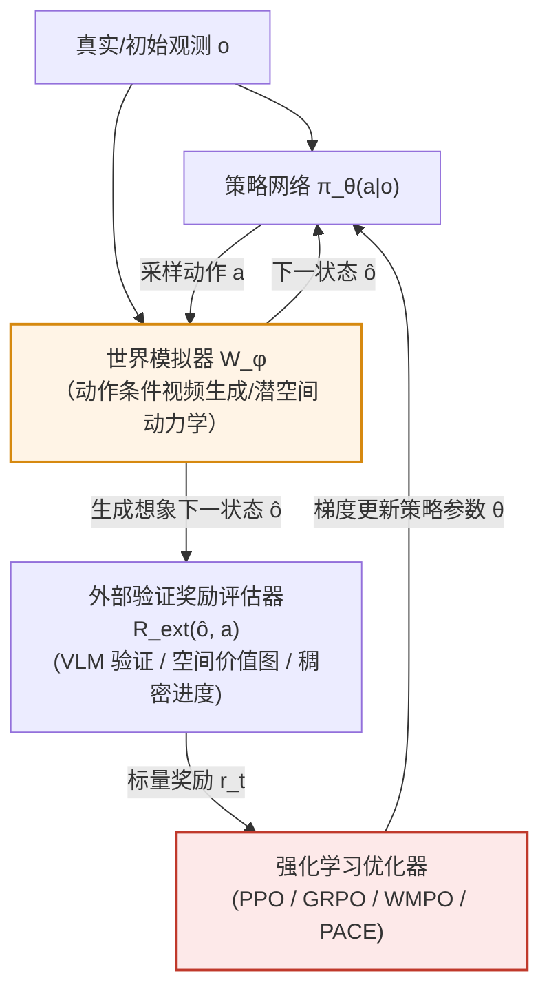

### 两大挑战与应对

将生成式世界模型用作 RL 模拟器时，存在两个核心理论难题：
1. **物理幻觉累积（Hallucination Accumulation）**：自回归生成的多步误差随时间累积，出现物体凭空消失、重力失效等虚假动态，RL 策略容易利用模型的物理漏洞获得虚假高分（Adversarial Exploitation）；
2. **策略演化与环境动力学的分布漂移（Distribution Shift）**：随着策略 $$\pi_\theta$$ 持续更新，其探索出的动作序列逐渐脱离世界模型预训练时的数据分布，导致世界模型对新动作的预测精度急剧下降。

**最新破局技术方案**：
- **关键帧初始化回放（Keyframe-Initialized Rollouts, KIR，如 WoVR）**：从专家演示的关键帧（如抓取前夕、对准瞬间）附近初始化短程探索，缩短有效预测深度，限制误差累积；
- **策略对齐协同演化（Policy-Aligned Co-Evolution, PACE，如 WoVR）**：在 RL 策略演化过程中，定期收集当前策略生成的动作轨迹，对世界模型进行在线增量微调，动态保持模拟器与策略动作分布的同步对齐；
- **基于 MLLM 的可验证与稠密进度奖励（Verified & Dense Progress Rewards，如 VLA-RFT [[35]](#ref-35), PRBench, SRPO [[36]](#ref-36)）**：利用经过专门物理推理训练的 VLM（如 Cosmos-Reason1）或空间价值图（ASVM）提供每一步的稠密进度奖励，而非易受欺骗的简单图像相似度；
- **测试时适应（Test-Time Adaptation, TTA，如 VLA-Reasoner [[37]](#ref-37), AdaPower [[38]](#ref-38)）**：在真实部署测试阶段，允许策略根据环境反馈动态微调世界模型参数，实现在线即时校准。

---

### WoVR (2026) {#paper-wovr}
———World Models as Reliable Simulators for Post-Training VLA Policies with RL

📄 **Paper**: [https://arxiv.org/abs/2602.13977](https://arxiv.org/abs/2602.13977) · [[39]](#ref-39)

##### 精华

WoVR 提出了一种基于世界模型的机器人强化学习（RL）框架，核心贡献在于解决了世界模型中的“幻觉（Hallucination）”问题对 RL 优化信号的干扰。值得借鉴的三个机制包括：**稳定的动作调节视频模型**（Stabilized Action-conditioned Video World Model）通过双通道动作注入提升稳定性；**关键帧初始化回放（Keyframe-Initialized Rollouts, KIR）**通过在任务关键点附近初始化轨迹，缩短了有效预测深度并限制误差累积；以及**世界模型与策略的协同演化策略（PACE）**，通过迭代精调世界模型来恢复策略更新带来的分布漂移，确保了在想象空间中 RL 训练的可靠性。

---

##### 1. 研究背景/问题

利用学习到的世界模型作为仿真器进行强化学习是机器人领域的热门方向，但闭环想象中的“幻觉”——即模型生成的视觉序列与真实物理规律不符——会误导 RL 优化，使其利用模型的错误而非真实的任务进度。随着策略演化，动作分布发生漂移，进一步加剧了幻觉问题。

---

##### 2. 主要方法/创新点

WoVR 并不假设世界模型是完美的，而是通过三个层面显式地调节 RL 与不完美模拟器的交互。

  
<figcaption>图：世界模型中的幻觉问题及其对 RL 的干扰。（图源：WoVR, 2026）</figcaption>

###### 稳定的世界模型架构
WoVR 引入了一种增强型 DiT（Diffusion Transformer）世界模型，通过双通道动作注入机制实现更稳定的动作控制，减少了长程漂移和结构崩溃。

###### 关键帧初始化回放 (KIR)
为了防止自回归生成的误差随时间累加，WoVR 采用了 Keyframe-Initialized Rollouts。它利用人类演示中的关键帧作为起始点，在这些状态附近进行短程想象探索。这种做法大大限制了有效预测深度，抑制了幻觉的积累。

  
<figcaption>图：WoVR 核心三步走架构：稳定模型、关键帧初始化、协同演化。（图源：WoVR, 2026）</figcaption>

###### 策略对齐协同演化 (PACE)
为了应对策略更新导致的动作分布漂移（Distribution Shift），PACE 策略会定期在当前演化策略生成的动作轨迹上对世界模型进行微调。这种协同演化机制使模拟器能够动态适应新的动作分布，保持了策略与模拟器的对齐。

---

##### 3. 核心结果/发现

- **LIBERO 基准测试**: WoVR 将 LIBERO 的平均成功率从 39.95% 提升至 69.2%（+29.3个百分点）。
- **真机验证**: 在真实机器人操作任务中，成功率从 61.7% 提升至 91.7%。
- **生成效率**: WoVR 达到了 23 FPS 的生成速度，使其成为一种高效的训练模拟器。

  
<figcaption>图：WoVR 在 LIBERO 任务上的想象生成与策略执行可视化。（图源：WoVR, 2026）</figcaption>

---

##### 4. 局限性

虽然 WoVR 缓解了幻觉，但对于极其复杂的多步长程任务，其稳定性仍有待提升。此外，协同演化过程中的计算开销也是一个需要优化的方向。

---

# 7. 基础模型与平台

世界模型很少从零训练：视频生成底座提供外观与运动先验，统一多模态模型提供语言与推理能力，表征模型与 3D 模型提供几何约束。本章先按功能列出常用底座（§7.1），再展开 NVIDIA Cosmos 平台与 Cosmos 3（§7.2–§7.3），以及 Wan2.1、Janus-Pro 两个代表性底座（§7.4–§7.5），最后介绍一篇关于视频生成模型在机器人中应用的综述（§7.6）。

## 7.1 基础模型总览

具身智能世界模型的飞速发展，高度仰赖于底层多模态生成、表征学习与空间几何基础模型的支撑。根据功能定位，可划分为四大基础模型支柱：

### 视频生成模型

作为世界模型的“想象引擎”，负责在自然语言、历史图像或动作条件控制下，高保真生成连续的时空未来视频，参数规模从轻量级 0.6B 到工业级 17B：

| 模型 | 参数规模 | 建模骨干 | 典型应用与具身角色 |
|:---|:---:|:---|:---|
| **Wan2.1** | 1.3B / 14B | DiT + Flow Matching | 主流开源底座；WristWorld, DreamGen, Motus, AIM |
| **Cosmos-Predict2.5** | 2B / 14B | DiT + Flow Matching | 物理 AI 专用底座；NavWAM, AdaPower, Prophet |
| **SANA-WM** | 2.6B | Hybrid GDN/Softmax | 分钟级 720p 高效生成，单卡低显存交互仿真 |
| **LingBot-World** | 14B+14B MoE | MoE DiT | 分钟级实时交互世界模拟器，支持事件编辑与指令干预 |
| **LTX-Video / LTX-2** | 2B / 17B | DiT + Flow Matching | SANA-WM 两阶段精化器底座，超高帧率视频生成 |
| **HunyuanVideo** | 13B | 双流 DiT | 高视觉保真度与精细动作先验建模 |
| **Stable Video Diffusion** | 1.5B | UNet 扩散模型 | Ctrl-World, MoWM, HMA, VPP 等早期探索 |
| **iVideoGPT / NOVA** | 0.6B | 自回归 Transformer | VLA-RFT, WMPO [[40]](#ref-40) 等轻量级仿真评估 |

### 统一理解与生成模型

打破感知理解（VLM）与图像/视频生成（Diffusion）的人为割裂，在单一自回归或混合专家网络中同时支持指令理解、物理推理与动作/图像生成：

| 模型 | 参数规模 | 核心架构 | 典型应用与具身角色 |
|:---|:---:|:---|:---|
| **Cosmos 3** | 4B / 16B / 64B | 双塔 MoT (AR + DM) | 全模态统一 Physical AI 骨干；兼任 VLM、WAM、模拟器与标注器 |
| **Motus** | ~3B | MoT + UniDiffuser | 统一双臂操作 WAM，支持策略生成、正向模拟与逆动力学 |
| **Janus-Pro** | 1B / 7B | 解耦视觉编码 AR | 理解与生成解耦编码，多模态物理常识问答与规划 |
| **Chameleon** | 7B | 早期融合全自回归 | WorldVLA, RynnVLA-002 的原生多模态 Tokenizer 底座 |
| **Emu3** | 8.5B | 纯自回归序列预测 | FlowVLA, UniVLA, UD-VLA 端到端 Token 化策略 |
| **Show-o / VILA-U** | 1.3B / 7B | 统一 Transformer | UP-VLA, CoT-VLA 视觉思维链与前瞻推理 |

### 表征学习模型

将连续的高维感觉输入抽象编码为紧凑、具备动力学不变性与物理因果性的潜空间表征，而非直接生成易受高频噪声干扰的像素：

| 模型 | 参数规模 | 预训练目标 | 典型应用与具身角色 |
|:---|:---:|:---|:---|
| **V-JEPA 2** | 1B | 联合嵌入预测 (JEPA) | NORA-1.5 [[41]](#ref-41), MoWM, SRPO 隐式潜空间规划与稠密奖励提取 |
| **DINOv2 / DINOv3** | 300M / 1B | 自监督视觉特征 | WAM-Nav, Image2Sim 空间几何与物体语义记忆检索 |
| **SigLIP / SigLIP-2** | 400M / 1B | Sigmoid 对比学习 | Janus-Pro, OpenVLA 多模态高层指令对齐与场景语义解析 |

### 3D 几何模型

为世界模型提供三维度量坐标系、深度几何与空间持久性约束，是实现“可探索空间智能（Spatial Intelligence）”的基石：

| 模型 / 技术 | 空间表示 | 核心能力 | 典型应用与具身角色 |
|:---|:---|:---|:---|
| **3D Gaussian Splatting (3DGS)** [[42]](#ref-42) | 显式高斯粒子 | 毫秒级可微渲染、跨设备漫游 | Lyra 2.0, Marble, Image2Sim 场景持久化资产与碰撞检测 |
| **Depth Anything 2 / 3** | 单目深度 / 点云 | 极高精度的度量几何估计 | Cosmos-Transfer1, SANA-WM 几何条件图与相机姿态恢复 |
| **VGGT / MapAnything** | 3D 几何拓扑 | 大范围度量地图与 3D 场景重建 | 长程具身导航地图构建与物理边界约束 |

---

## 7.2 NVIDIA Cosmos 平台 {#cosmos}
———World Simulation with Video Foundation Models for Physical AI

📄 **Cosmos-Predict1 (2025)**: [arxiv.org/abs/2501.03575](https://arxiv.org/abs/2501.03575) · [[43]](#ref-43)  
📄 **Cosmos-Predict2.5 (2025/2026)**: [arxiv.org/abs/2511.00062](https://arxiv.org/abs/2511.00062)  
🔗 **代码**: [nvidia-cosmos](https://github.com/nvidia-cosmos) · [Cosmos Cookbook](https://github.com/nvidia-cosmos/cosmos-cookbook) [[44]](#ref-44)

Cosmos 是 NVIDIA 发布的**物理 AI 世界基础模型平台**，目标是用生成式视频模型部分替代真实数据采集与物理仿真，为机器人、自动驾驶等系统提供可控的"世界模拟"能力。与单一视频生成模型不同，它是一套**分层平台**：数据策展基础设施 → 三条预训练模型产品线 → 面向具体场景的后训练工作流。

  
<figcaption>图：Cosmos WFM 平台核心组件：视频数据策展流水线、多模态 Tokenizer、预训练 WFM 与后训练应用样例。</figcaption>

### 数据策展

物理 AI 世界模型的训练瓶颈首先是**数据质量**。Cosmos Video Curator 分七个阶段把原始视频转为训练数据：镜头感知切分 → GPU 转码 → 裁剪 → **多级过滤**（美学、运动、OCR、DOVER 感知质量、VTSS 语义伪影、VLM 精筛，最终仅约 **4%** 的片段通过）→ 多粒度字幕（Qwen2.5-VL-7B 生成短 / 中 / 长三种描述）→ 语义去重 → 按内容类型、分辨率、宽高比、时长四维分片（支持课程学习与域平衡采样）。

  
<figcaption>图：Cosmos Video Curator 流水线：原始多领域视频经切分、转码、裁剪、多级过滤、字幕生成、语义去重、结构化分片七个阶段，输出可直接用于大规模预训练的高质量数据集。（图源：Cosmos-Predict2.5）</figcaption>

Predict2.5 时代流水线处理了数亿条原始片段，保留数千万条（Predict1 时代为 1000 万条）；此外针对机器人操作（AgiBot、GR00T、DROID、OpenX 等）、自动驾驶（约 310 万条 7 路环视视频）、智能空间、人类动力学、物理现象五个领域构建了专属数据。

### 三条模型产品线

| 模型 | 核心能力 | 典型输入 | 典型输出 |
| --- | --- | --- | --- |
| **Cosmos-Predict** | 未来世界状态预测 | Text / Image / 历史视频 | 未来多秒视频 |
| **Cosmos-Transfer** | 结构化世界翻译（Sim2Real） | 边缘 / 深度 / 分割图 | 照片级真实视频 |
| **Cosmos-Reason** | 物理推理 VLM | 视频 + 文本问题 | 带 CoT 的自然语言回答 |

#### Cosmos-Predict：前向预测引擎

**Cosmos-Predict1（2025）** 同时提供两种架构：**扩散模型**（DiT + EDM + T5 文本编码器，画质与 3D 一致性更好）和**自回归模型**（因果 Transformer 预测离散视频 token，适合长序列交互式展开）。二者共用 **Cosmos Tokenizer**——小波变换 + 因果 3D 卷积，同时输出连续 token（供扩散）与离散 token（供自回归）。

  
<figcaption>图：Cosmos-Predict1 扩散模型架构：DiT 主干 + T5 文本编码器 + 3D RoPE 位置编码。</figcaption>

  
<figcaption>图：Cosmos Tokenizer：基于小波变换的编解码结构，通过因果 3D 卷积捕获时间相关性，同时输出连续 token（供扩散模型）与离散 token（供自回归模型）。</figcaption>

**Cosmos-Predict2.5（2025/2026）** 的主要改动：

- 扩散与自回归两条路线**统一为单一 Flow Matching 模型**，Text2World / Image2World / Video2World 共用一套权重；
- 视觉 Tokenizer 换用 **Wan2.1 VAE**（4×8×8 压缩，每次生成 93 帧约 5.8 秒）；
- 文本编码器由 T5 换为 **Cosmos-Reason1**（多层激活拼接后投影至 1024 维）；
- 去掉绝对位置编码、保留相对 3D RoPE，提升对训练外分辨率与时长的泛化；
- 提供 **2B / 14B** 两种规模，以及机器人操作、自动驾驶等领域专属后训练版本。

  
<figcaption>图：Cosmos-Predict2.5 整体架构：右侧为 DiT 主干，在潜空间中以"自注意力 → 交叉注意力 → 前馈 MLP"堆叠的 Block 预测去噪速度场，时间步以 AdaLN-LoRA 注入；左侧为 Cosmos-Reason1 文本编码器，跨多层激活拼接后投影为 1024 维文本嵌入，通过交叉注意力层引导视频生成。（图源：Cosmos-Predict2.5）</figcaption>

#### Cosmos-Transfer：结构化世界翻译

📄 **Cosmos-Transfer1 (2025)**: [arXiv:2503.14492](https://arxiv.org/abs/2503.14492) · [[45]](#ref-45)

Cosmos-Transfer 把**结构化世界表示**翻译成**照片级视频**，典型用途是把 Isaac Sim、CARLA 等仿真器的几何 / 语义输出提升为真实感画面（Sim2Real）。Transfer1 在 Predict1-7B 基础上后训练，核心是**自适应多模态 ControlNet**：

- **多分支 ControlNet**：每种控制模态（Blur/Vis、Canny 边缘、DepthAnything2 深度、GroundingDino + SAM2 分割）一条独立分支，可单独训练、推理时融合，新增模态无需重训主干；
- **时空控制图**：用 $N \times X \times Y \times T$ 维权重张量 $\mathbf{w}$ 为每个模态在每个时空位置分配权重——例如前景用边缘图保细节、背景允许自由生成；
- 自动驾驶版本额外支持 **HDMap** 与 **LiDAR** 条件，另有 4K 超分 ControlNet。

  
<figcaption>图：Cosmos-Transfer1 自适应多模态 ControlNet 架构：每种控制模态对应一条独立控制分支，通过时空控制图 w 加权后注入主 DiT 生成分支，实现位置自适应的多模态融合。（图源：Cosmos-Transfer1）</figcaption>

**Cosmos-Transfer2.5** 继承全部模态，模型缩小 **3.5×**（7B → ~2B），PAIBench-Transfer 整体质量评分从 6.56 提升至 9.75，并新增 **RNDS** 指标衡量长视频质量退化。

#### Cosmos-Reason：物理推理 VLM

📄 **Cosmos-Reason1 (2025)**: [arXiv:2503.15558](https://arxiv.org/abs/2503.15558) · [[46]](#ref-46)

Cosmos-Reason1 是面向物理 AI 的视觉语言模型，输出带 `<think>...</think>` 推理链的回答。它用两套本体定义能力边界：**物理常识本体**（Space / Time / Fundamental Physics 三大类、16 个子类，如物体恒存、因果、力学）与**具身推理本体**（重点考察任务完成验证、动作可操作性、下一步动作预测）。

  
<figcaption>图：Cosmos-Reason1 物理常识本体：三大类（Space、Time、Fundamental Physics）划分为 16 个细粒度子类，定义 Physical AI 模型应具备的感知与推理能力边界。（图源：Cosmos-Reason1）</figcaption>

| 配置 | Cosmos-Reason1-7B | Cosmos-Reason1-56B |
| --- | --- | --- |
| Vision Encoder | ViT-676M（动态分辨率） | ViT-300M（固定 448×448） |
| LLM 架构 | 密集 Transformer（28 层） | Mamba-MLP-Transformer 混合（118 层） |
| LLM 预训练底座 | Qwen2.5-VL | Nemotron-H |

训练分两步：**Physical AI SFT**（约 4M 视频-文本对，其中约 1.93M 为 DeepSeek-R1 蒸馏的 CoT 标注）与 **Physical AI RL**（GRPO + 可自动校验的多选题奖励，含"还原打乱的时空块""判断视频播放方向"等自监督题目）。在平台内，Reason1 同时承担**物理合理性裁判、Predict2.5 的文本编码器、高层任务规划器与合成数据质检**四种角色。

### 训练流程

  
<figcaption>图：Cosmos 训练范式：通用物理知识大规模预训练 → 领域 SFT → 模型融合 → RL 后训练，最终微调适配各类下游 Physical AI 任务。</figcaption>

Cosmos-Predict2.5 采用四阶段渐进范式：

1. **预训练**：课程学习，从 256p Text2Image 逐步过渡到 720p（1280×704）、93 帧的 Text/Image/Video2World；
2. **领域 SFT**：在物体恒存（10.4M）、高动态（1.0M）、复杂场景（1.6M）、驾驶（3.1M）、机器人操作（730K）五类数据上分别训练专域模型；
3. **模型融合**：用 Model Soup、TIES、DARE-TIES 等参数插值方法把专域模型合为一个，人类偏好评测中融合模型在所有领域均优于任一单独 SFT 模型；
4. **RL 后训练**：以 **VideoAlign**（文本对齐 + 运动质量 + 视觉质量）为奖励、GRPO 为算法，人类评测胜率提升约 20 个百分点。

推理侧用 rCM 蒸馏压缩到 **4 步**，PAI-Bench 总分损失 < 0.005。训练使用 4096 张 H100，2B / 14B 模型 MFU 约 36.5% / 33.1%。

### 典型应用

- **机器人策略视觉增强**：用 Transfer2.5 替换背景、改物体颜色、加干扰物，提升策略在视觉扰动下的成功率；
- **自动驾驶多视角仿真**：以 HD map + 语义为条件生成 7 路同步环视视频；
- **相机可控多视角生成**：对 Predict2.5 做相机位姿条件化后训练；
- **VLA 合成数据**：单帧 + 动作条件生成操作视频，再由 Reason1 自动打标与过滤；
- **动作条件世界生成**：以关节角 / 末端轨迹为条件预测未来视频，用于策略闭环评估。

  
<figcaption>图：Cosmos-Predict2.5-2B post-trained 模型在 PAI-Bench 上的生成样本：覆盖自动驾驶（上两行）、工业机器人操纵（中三行）、人类动力学（下行）等多个物理 AI 场景，展示了模型在时序一致性与物理合理性上的能力。（图源：Cosmos-Predict2.5）</figcaption>

官方 Cosmos Cookbook [[44]](#ref-44) 提供三条产品线的推理脚本、相机控制 / 机器人操作 / 自动驾驶后训练模板、数据策展接入流程、安全护栏（Guardrail）调用示例，以及与 NeMo、Isaac Sim、TensorRT-LLM 的集成示例。对具身 AI 研究者而言，Cosmos 的实用价值在于：**不必从头训练，可直接用 Predict 做滚动仿真、用 Transfer 做 Sim2Real 数据增强、用 Reason 做物理合理性评估**。

---

## 7.3 Cosmos 3 (2026) {#cosmos-3}
———Omnimodal World Models for Physical AI

📄 **Cosmos 3 (2026)**: [arxiv.org/abs/2606.02800](https://arxiv.org/abs/2606.02800) · [[26]](#ref-26)  
🔗 **代码/权重**: [github.com/nvidia/cosmos](https://github.com/nvidia/cosmos) · [huggingface.co/collections/nvidia/cosmos3](https://huggingface.co/collections/nvidia/cosmos3)（OpenMDW-1.1 License）  
💡 **专题详解**: 关于 Mixture-of-Transformers (MoT) 架构的详细数学拆解与分析，可参考我的专题博客 [Mixture-of-Transformers (MoT) 架构详解](/mixture-of-transformers/)。

如果说 §7.2 的 Cosmos 平台是用**一条工具链串起多个专用模型**（Predict 预测、Transfer 翻译、Reason 推理各司其职），那么 2026 年 6 月 NVIDIA 发布的 **Cosmos 3** 则把这条路线推到了终点：**用单一网络架构同时完成理解与生成、并原生覆盖语言、图像、视频、音频、动作五大模态**。它把视觉语言模型（VLM）、视频生成 / 前向动力学模型（对应 §6 的世界合成器 / 模拟器）与世界动作模型（WAM / VLA）**吸收进同一个模型**，是"单模型、多范式角色"趋势（参见 §6.1 的 GENE-26.5 与 §9.3）目前最完整的一次工程实现。

  
<figcaption>图：Cosmos 3 作为 Physical AI 的通用骨干。仅通过改变输入-输出配置，同一套权重即可化身视觉语言模型、图像生成模型、音视频生成模型、策略/世界动作模型、前向动力学模型、逆动力学模型，无需任何结构改动。（图源：Cosmos 3）</figcaption>

#### 核心动机：终结"范式割裂"

论文的出发点是一个尖锐的判断：**理解与生成被人为割裂是根本性的局限**。以"晚餐后清理餐桌"的家用机器人为例，当前范式需要拼装一条割裂的流水线——VLM 定位餐具并生成计划、VLA/WAM 生成动作序列、前向动力学模型（"世界模型"）仿真并评估未来状态。这种碎片化架构既不优雅也浪费算力。Cosmos 3 的主张是：理解本就需要推理"世界如何演化、动作有何后果"，而生成本就依赖"对世界与行为的紧凑结构化表示"——两者应当统一在**一个可扩展框架**里。

#### 架构：双塔 Mixture-of-Transformers（MoT）

Cosmos 3 的核心是一个 **MoT 双塔**结构：把一条 token 序列切成两段——前段是**自回归（AR）子序列**负责理解推理，后段是**扩散（DM）子序列**负责生成。每个 Transformer 解码层内部都并行持有**两套独立参数**（Reasoner 塔 + Generator 塔），二者均从预训练 VLM 权重初始化，从而继承强语言/视觉推理能力。

  
<figcaption>图：Cosmos 3 的 MoT 架构。同一条序列由 AR 子序列（语言 + ViT 视觉 token，以 EOS/BOG 收尾）与 DM 子序列（VAE 视觉、音频、动作 token，训练时加噪）拼接而成；层内 AR 与 DM token 各用独立 LayerNorm 与 MLP（均由预训练 VLM 共同初始化），仅在共享自注意力处交汇。右图为注意力掩码：AR 为因果三角、DM 为全注意力。（图源：Cosmos 3）</figcaption>

两塔虽参数独立，却通过**双流联合注意力（Dual-Stream Joint Attention）**耦合：

- **AR 子序列**使用**因果自注意力**，只能看到自身前序 token——完整保留了从 VLM 继承的自回归文本生成能力（语言走 next-token prediction）；
- **DM 子序列**使用**全双向注意力**，以 AR 与 DM token 的并集为 Key/Value，使每个扩散 token 都能自由"读取"文本提示与所有条件帧（生成走迭代去噪，Flow Matching 预测速度场）；
- **关键约束**：AR token 永远不会被 DM token 更新——保证了条件通路的因果完整性。

这种设计的精妙之处在于：**理解（AR）为生成（DM）提供语义条件，而生成不污染理解**，二者在同一张注意力图里完成协作，却互不破坏各自的归纳偏置。

**编码器**：视觉理解用与语言对齐预训练的 **ViT**（随骨干联合训练），视觉生成用 **Wan2.2-TI2V-5B 的视频 VAE**（冻结，时间 4×、空间 32×32 压缩）；音频用冻结的音频 VAE（48kHz 立体声，25 token/秒）；动作用域感知投影层。位置编码采用带**绝对时间调制的 3D MRoPE**，把不同帧率/采样率的视频、音频、动作 token 对齐到同一条物理时间轴上。

#### 把"动作"当作一等模态

与多数工作把动作当作附属输出不同，Cosmos 3 显式引入一类**动作 token**，作为连接物理世界与语言推理、视频建模的桥梁。它用一套**统一动作表示**容纳异构本体（自动驾驶、相机运动、第一人称人体、单臂/双臂/人形机器人）：自我位姿（Ego Pose 9D）与执行器位姿（Effector Pose 9D）以"3D 平移 + 6D 旋转"的相对位姿伪动作表示，抓取状态（Grasp State）直接编码当前操作状态。各本体用**域感知的输入/输出投影**适配不同维度，同时共享 MoT 骨干。动作 token $a_t$ 表示从视频状态 $v_{t-1}$ 到 $v_t$ 的转移。

  
<figcaption>图：统一动作表示。异构本体的控制被映射为由共享几何分量构成的紧凑动作向量——Ego/Effector 运动编码为相对位姿伪动作（3D 平移 + 6D 旋转），抓取状态直接编码指尖位置或夹爪开合。（图源：Cosmos 3）</figcaption>

正因为动作与视频被纳入同一序列模型，Cosmos 3 仅靠"哪些 token 干净、哪些 token 加噪"的不同配置，就统一了三种动作生成模式：

  
<figcaption>图：三种动作模式由 token 加噪配置决定。前向动力学（给定干净动作去噪视频）、逆动力学（给定干净视频去噪动作）、策略（同时去噪视频与动作）。（图源：Cosmos 3）</figcaption>

- **前向动力学（Forward Dynamics）**：以观测上下文 + 干净动作为条件，预测未来视觉状态——即 §6.4 的世界模拟器；
- **逆动力学（Inverse Dynamics）**：从观测到的视觉转移反推动作——即 §6.3 世界合成器中常用的 IDM 标注器；
- **策略（Policy）**：同时预测动作与视频，既给出"干预"又给出"预期视觉后果"——即 §6.2 的世界动作模型。

加上作为 VLM 的纯语言理解、Text2Image、Text2Video（可联合生成音频）、Image/Video2Video、Video Transfer 等生成模式，**四大范式在 Cosmos 3 中第一次由同一套权重原生支持**。

#### 模型变体：Edge / Nano / Super

三个尺度覆盖从端侧部署到数据中心推理。注意总参数约为稠密 Transformer 的 2 倍——这正是双塔（Reasoner + Generator 各持一套参数）的代价：

| 变体 | 总参 / 稠密骨干 | 层数 | 隐藏维 | 注意力头 | KV 头 | FFN 维 | 初始化 |
|:---|:---|:---:|:---:|:---:|:---:|:---:|:---|
| Cosmos3-Edge | 4B / 2B | 28 | 2,048 | 16 | 8 | 9,216 | 从零训练（类 Qwen3-1.7B） |
| Cosmos3-Nano | 16B / 8B | 36 | 4,096 | 32 | 8 | 12,288 | Qwen3-VL 8B |
| Cosmos3-Super | 64B / 32B | 64 | 5,120 | 64 | 8 | 25,600 | Qwen3-VL 32B |

本次发布 Nano 与 Super，Edge 留待后续。Reasoner 在约 **24.2M** 样本（22.0M 预训练 + 2.2M SFT）的图文/视频-文本对上训练；Generator 在大规模图像/视频/音频/动作语料上以重建目标（Flow Matching）训练，经历预训练 → 中训练（mid-training）→ T2I 后训练 → I2V 后训练 → 机器人策略后训练的多阶段课程。

#### 训练范式与 Physical AI 角色

  
<figcaption>图：Cosmos 3 是训练 Physical AI 智能体的强起点。预训练 + 中训练得到通用底座后，可在目标数据上无结构改动地后训练，分别服务于合成数据生成、任务专域特化、闭环训练环境三类用途。（图源：Cosmos 3）</figcaption>

Cosmos 3 把自己定位为破解"数据与环境扩展瓶颈"的三重起点：(i) **合成数据生成**——后训练为更强的 T2I / I2V 生成器，低成本合成高保真多样视觉数据；(ii) **任务专域特化**——在共享底座上做本体/任务特定微调，保留统一世界表示；(iii) **训练环境**——长期目标是生成高质量、可交互的复杂环境用于闭环训练。论文同时开源了 5 个合成数据集（SDG-PhyxSim / RobotSim / DriveSim / SynHuman / Warehouse）与评测基准 **Cosmos-HUE**。

#### 核心结果

撰写技术报告时，Cosmos 3 的后训练变体取得多项 SOTA：

- **Cosmos3-Super-Text2Image**：Artificial Analysis 文生图榜单**开源权重第 1**（含闭源模型计第 4，日期 2026-05-28）；
- **Cosmos3-Super-Image2Video**：Artificial Analysis 图生视频榜单**开源权重第 1**，整体优于 Veo-3.1 等强闭源模型；
- **Cosmos3-Nano-Policy-DROID**：在 RoboLab 与 **RoboArena** 真机策略评测中**均排名第 1**（从中训练 Nano 续训，在 DROID 76k 轨迹上后训练，15Hz 联合输出动作与未来视频帧）；
- 在机器人、智能空间、自动驾驶领域的推理任务上同时超越开源与闭源模型（机器人仅略逊 Gemini 3.1 Pro），且两代视频生成均显著优于前代 Cosmos-Predict2.5。

#### 与四大范式的关系

Cosmos 3 是本文叙事的一个**收敛点**。GENE-26.5（§6.1）已展示"联合分布 + 条件查询"如何让单模型兼任多角色，而 Cosmos 3 把这一思路推广到全模态、并以双塔 MoT 给出更清晰的工程边界：**Reasoner 塔承担世界规划器的高层语义推理，Generator 塔以前向动力学/视频生成承担世界合成器与世界模拟器，Policy 模式则是世界动作模型**。§2.4 时间线中 2025–2026 年世界合成器/模拟器的爆发，最终汇流为"理解-生成-动作一体化"的全模态世界模型——这与 §9.3"从想象到验证再到规划"的判断完全一致，也指向 §9.1 中长航程前瞻、4D 感知、物理一致性等方向的统一载体。

---

## 7.4 Wan2.1 (2025) {#paper-wan}
———阿里巴巴开源的高效视频生成基础模型家族

📄 **Paper**: https://arxiv.org/abs/2503.20314 · [[47]](#ref-47)

#### 精华

- 提出了 **Wan2.1** 视频生成模型家族，采用主流的 Diffusion Transformer (DiT) 架构，包含 1.3B 和 14B 参数两个版本，开源了全部代码与权重。
- 引入了创新的 **Spatio-Temporal VAE (Wan-VAE)**，能够将视频在时空维度上压缩 4x8x8 倍，并引入 RMSNorm 和特征缓存机制以支持任意长度的长视频流式重建与低内存推理。
- 针对 DiT 训练，优化了特征调制（AdaLN）参数共享设计，不仅使模型参数量减少约 25%，还显著加快了收敛速度并提升了指令遵循能力。
- 采用 **2D 上下文并行（Ulysses + Ring Attention）** 和 FSDP 混合分布式并行策略，解决了超长序列（达 1M 级别 tokens）所带来的显存和计算瓶颈。
- 构建了统一的视频控制与编辑框架 **VACE**，通过对掩码区域和非掩码区域的“概念解耦”时空编码，实现了高质量的局部视频编辑、视频外扩等下游任务。

---

#### 1. 研究背景/问题

- 现有的视频生成模型在生成大幅度动作、高保真画面、超长视频以及复杂的文本提示词理解上仍面临巨大挑战。
- 同时，大模型的高显存消耗和计算复杂度使得它们难以在消费级显卡（如 RTX 4090）上运行，极大地限制了开源社区的二次开发与应用。
- 此外，时空自编码器（VAE）往往缺乏良好的时空因果性保证，且在流式长视频生成中面临内存溢出和边界不连续等缺陷。

---

#### 2. 主要方法/创新点

##### Wan-T2V (Text-to-Video) 整体架构

  
<figcaption>图：Wan 文本到视频生成（T2V）的整体架构图。（图源：Wan2.1, 2025）</figcaption>

**① 整体框架概述**
Wan2.1 整体架构基于 Diffusion Transformer (DiT) 范式，包含三个核心模块：用于将视频/图像从像素空间压缩到低维潜空间的 **Wan-VAE**、执行流匹配去噪过程的 **Diffusion Transformer (DiT)** 以及用于文本理解的 **umT5 文本编码器**。

**② 逐模块讲解**

- **Wan-VAE (Spatio-Temporal VAE)**：
  - **输入**：大小为 $(1+T) \times H \times W \times 3$ 的高维原始视频。
  - **处理**：采用 3D 因果卷积结构，其中第一帧仅进行空间压缩（以保留图像先验），其余帧进行时空联合压缩。模型将所有 GroupNorm 替换为 RMSNorm 以保持严格的临时因果性，并支持特征缓存机制（Feature Cache Mechanism）。在空间上采样层中，将输入特征通道减半，以降低 33% 的推理显存。
  - **输出**：时空维度压缩了 $4 \times 8 \times 8$ 倍、通道数为 16 的低维潜空间表征 $x \in \mathbb{R}^{(1+T/4) \times H/8 \times W/8 \times 16}$。
  - **特征缓存推理**：在处理超长视频时，将视频按 Latent 帧拆分为 Chunks（每块最多 4 帧），在块与块之间传递和复用前一阶段的最后两帧特征缓存，确保在受限的显存内实现连续、无缝的流式重建。

  
<figcaption>图：Wan-VAE 时空压缩自编码器架构图。（图源：Wan2.1, 2025）</figcaption>

- **umT5 文本编码器**：
  - **输入**：用户输入的自然语言提示词（支持中英双语以及复杂的排版描述）。
  - **处理**：利用双向注意力机制编码，相比于单向注意力 LLM 更加注重全局语义表示与空间排版。
  - **输出**：长度为 512 的语义 Token 序列 $ctxt \in \mathbb{R}^{512 \times D_{text}}$。

- **Diffusion Transformer (DiT)**：
  - **输入**：经由 3D 卷积（Patchify，核大小为 $(1, 2, 2)$，步长为 $(1, 2, 2)$）打块并展平后的潜空间序列 $x_{flat} \in \mathbb{R}^{B \times L \times D}$，以及文本 Token 和时间步 $t$。
  - **处理**：由 $N$ 层堆叠的 Wan Transformer Block 构成。在 Block 内部，通过自注意力（Self-Attention）机制捕获时空关系，通过交叉注意力（Cross-Attention）将文本 Token 注入到图像 Token 中。时间步 $t$ 编码经由一个全局共享的 MLP (Linear + SiLU) 映射为调制参数，以调节各 LayerNorm 的尺度与偏置。
  - **输出**：预测的去噪速度向量 $v_t$。

  
<figcaption>图：Wan Transformer Block 结构细节。（图源：Wan2.1, 2025）</figcaption>

**③ 端到端数据流**
训练时，原始视频经 Wan-VAE 编码为 Latent 状态，与高斯噪声进行 Flow Matching（流匹配）线性插值得到 $x_t$，通过 Patchify 模块转换为 1D Token 序列；同时文本经 umT5 编码为文本 Embedding。在 DiT Blocks 中，文本与时空 Token 通过 Cross-Attention 进行交互。最后，利用预测的 Velocity $v_t$ 引导 ODE 求解去噪，生成的 Latent 再由 Wan-VAE Decoder 恢复出清晰的视频画面。

**④ 训练目标 / 损失函数**
基于 Rectified Flows (RFs) 框架，中间潜空间 $x_t$ 通过对干净视频潜特征 $x_1$ 和高斯噪声 $x_0 \sim \mathcal{N}(0, I)$ 实施线性插值获得：
$$x_t = tx_1 + (1-t)x_0$$
真值变化速率为 $v_t = x_1 - x_0$。模型学习参数 $\theta$ 以拟合这个变化率 $u(x_t, ctxt, t; \theta)$，损失函数采用均方误差 (MSE)：
$$\mathcal{L} = \mathbb{E}_{x_0, x_1, ctxt, t} \left[ \lVert u(x_t, ctxt, t; \theta) - v_t \rVert^2 \right]$$

##### Wan-I2V (Image-to-Video) 架构与控制框架

  
<figcaption>图：Wan-I2V 图生视频模型框架。（图源：Wan2.1, 2025）</figcaption>

**① 整体框架概述**
为了兼容图片生成视频（I2V）、视频续写（Video Continuation）以及首尾帧过渡（First-Last Frame Transition）等多种下游任务，Wan 引入了掩码（Mask）机制和双编码器联合调节策略。

**② 模块与数据流详解**
- **双图像编码器**：同时输入第一帧像素，一方面经由 **Wan-Encoder** 编码为 Latent，作为与噪声等维度的掩码提示，并和掩码矩阵 $M$ 一起与嘈杂的潜空间特征 $x_t$ 进行 Channel-wise Concatenation（通道级拼接）作为 DiT 的主轴输入；另一方面，通过 **CLIP Image Encoder** 提取全局语义特征，在 DiT 的 **Decoupled Cross-Attention（解耦交叉注意力）** 中与 umT5 文本 Embedding 一起分别与时空特征进行交互，提供高保真视觉细节与空间语义。
- **掩码通道设计**：对第一帧画面（或已知参考帧）赋予值为 0 的掩码（代表需要被重建的区域），对其余生成帧赋予值为 1 的掩码（代表生成区域）。该设计使用户能自由指定参考帧的空间与时间排布。

##### VACE：统一的可控生成与编辑框架

  
<figcaption>图：VACE 可控生成与编辑模型框架与概念解耦机制。（图源：Wan2.1, 2025）</figcaption>

**① 整体框架概述**
**VACE (Video Condition Unit)** 旨在将局部重绘（Repainting）、Canny 边缘提取、深度估计（Depth）、姿态引导（Pose）以及线稿引导（Scribble）等多种编辑和生成条件统一到同一种输入范式中。

**② 数据流与概念解耦 (Concept Decoupling) 详解**
- **概念解耦策略**：为保证在各种不同控制任务下模型能够平稳收敛，VACE 将输入视频 $F$ 和掩码 $M$ 解耦为两个相同尺寸的序列：**活性帧** $F_c = F \times M$（包含所有需要被修改的像素）与 **惰性帧** $F_k = F \times (1-M)$（保留所有需要保持原样的像素）。
- **编码与注入**：$F_c$ 和 $F_k$ 分别通过同一个冻结的 Wan-VAE Encoder 映射到潜空间，并在通道维度与噪声拼接后输入到 DiT 中。VACE 提供两种训练模式：**Fully Fine-tuning**（全参数微调）以及 **Context Adapter Tuning**（通过外挂的 Context Block 以残差形式集成到原 DiT block 中，支持无损基础权重插拔）。

---

#### 3. 核心结果/发现

- **性能优异**：14B 模型在大规模图像与视频数据集上训练，在各项内部和外部基准测试中超越了当时的主流开源模型（如 CogVideoX、Hunyuan Video 等）及闭源商业模型。
- **高压缩比与高质量**：Wan-VAE 的时空压缩比达到 $4 \times 8 \times 8$，潜表征维度为 16 维。在 720p 分辨率及 25 帧的视频重建测试中，重建质量（PSNR）与 Hunyuan Video 相当甚至更好，同时重建速度快了 **2.5 倍**。
- **极低的计算硬件门槛**：1.3B 模型专门为消费级 GPU（如 RTX 4090）设计，开启 int8 甚至 TensorRT 量化后，推理时仅需 **8.19 GB** 显存，却在 T2V 任务上能产生媲美更大模型的流畅度和一致性。
- **首创双语字符生成**：在视频中实现了中英双语的高清、正确字符排版生成能力（如生成包含 "Wan2.1" 和中文牌匾的视频）。

---

#### 4. 局限性

- 模型在处理极其复杂的极速物理交互（如破碎、流体变化等细微碰撞细节）时，依然会出现一定程度的幻觉或时空扭曲。
- 尽管 1.3B 模型实现了消费级显卡部署，但 14B 参数模型在单卡推理时仍具有较高的计算延迟，在大规模生产部署中仍然需要多卡 Context Parallel 协同。

---

## 7.5 Janus-Pro (2025) {#paper-janus-pro}
———Unified Multimodal Understanding and Generation with Data and Model Scaling

📄 **Paper**: https://arxiv.org/abs/2501.17811 · [[48]](#ref-48)

#### 精华

Janus-Pro 最值得借鉴的核心思想是**解耦视觉编码**：理解任务与生成任务对视觉表征的需求本质不同，强行共享编码器会造成任务冲突，解耦后两路可独立优化。此外，训练策略的精细化同样重要——Stage I 充分训练像素依赖建模、Stage II 去除低效的 ImageNet 预热、Stage III 调整多模态数据比例，每一步都针对已知痛点而非盲目堆量。合成数据（1:1 比例）对生成质量的稳定性提升至关重要，是解决真实数据噪声问题的实用路径。模型规模从 1.5B 扩展到 7B 验证了解耦编码方法的强可扩展性，为统一理解与生成框架的规模化提供了实证支撑。

---

#### 1. 研究背景/问题

当前统一多模态理解与生成的模型通常共享同一视觉编码器处理两类任务，但理解与生成对视觉表征的需求存在本质冲突，导致多模态理解性能受损。前代模型 Janus 虽通过解耦视觉编码验证了该思路，但受限于训练数据量少和模型容量小，在短提示图像生成质量和生成稳定性上表现欠佳。

---

#### 2. 主要方法/创新点

Janus-Pro 从三个维度对 Janus 进行系统性增强：训练策略优化、数据扩展和模型规模扩展。

**架构**（与 Janus 相同，解耦视觉编码）：

  
<figcaption>图：Janus-Pro 整体架构：理解侧使用 SigLIP Understanding Encoder，生成侧使用 VQ Generation Encoder，共享同一个 Auto-Regressive Transformer。（图源：Janus-Pro, 2025）</figcaption>

为便于理解，下图是我对 Janus-Pro 架构的手绘版本整理（核心：自回归统一框架，图像侧解耦为理解与生成两条编码路径）：

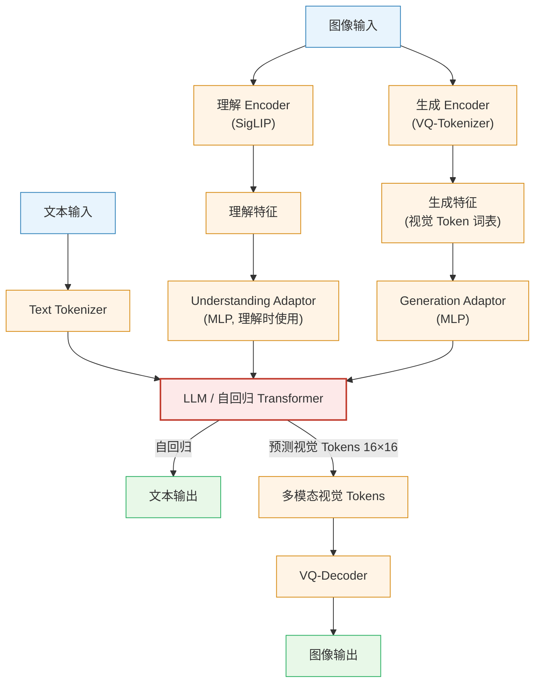

整体框架基于统一的自回归 Transformer。对于多模态理解任务，使用 SigLIP-Large-Patch16-384 编码器提取高维语义特征，经 Understanding Adaptor（两层 MLP）映射到 LLM 输入空间；对于视觉生成任务，使用来自 **LlamaGen** 的 VQ tokenizer 将图像离散化为 ID 序列，经 Generation Adaptor 映射 codebook embedding 输入 LLM，最终通过 Image Decoder 输出 $384 \times 384$ 图像。

**三阶段训练流程**：

Janus 与 Janus-Pro 均采用三阶段训练范式，下图（取自原 Janus 论文）展示了每个阶段中各模块的冻结（❄️）与可训练（🔥）状态：

  
<figcaption>图：Janus / JanusFlow 三阶段训练流程图：火焰标记代表可训练模块，雪花标记代表冻结模块。Janus-Pro 沿用该流程，但在 Stage 1 和 Stage 2 做出关键调整。（图源：Janus, 2024）</figcaption>

- **Stage 1 — Adaptation（适配）**：目标是让新引入的模块与预训练组件协同工作。此阶段冻结 **LLM** 与 **图像理解编码器（Und. Enc.）**，仅训练将图像编码映射到 LLM 输入空间的 **Linear 映射层** 和 **图像生成头（Gen. Dec.）**。训练数据为 ImageNet（基于类别名提示生成图像）。**Janus-Pro 的改动：显著增加 Stage 1 的训练步数**，让模型在 LLM 参数固定的情况下更充分地建模像素依赖。

- **Stage 2 — Unified Pre-Training（统一预训练）**：在继续训练新模块的基础上，**解冻 LLM 及其文本预测头（Text De-Token）**，使其能够处理多模态嵌入序列。训练样本包括多模态理解、图像生成与纯文本数据三类。**Janus-Pro 的改动：完全移除 ImageNet 数据**，直接使用密集描述的真实文生图数据——原版 Janus 在此阶段以 ImageNet 开始并逐步提升文生图数据比例，Janus-Pro 则跳过该预热阶段，训练效率显著提升。此外，图像编码器的表征会与图像生成潜在输出做对齐，以增强生成过程的语义一致性。

- **Stage 3 — Supervised Fine-Tuning（监督微调）**：在指令微调数据（对话 + 高质量文生图样本）上进行 SFT。此阶段**图像理解编码器（Und. Enc.）也加入训练**，即除 VAE 编码器外的全部模块都被解冻。Janus-Pro 在此阶段与原版 Janus 流程一致。

**Stage 3 数据比例调整**：将多模态理解数据、纯文本数据、文生图数据的比例从原版 Janus 的 7:3:10 调整为 5:1:4，在保持生成能力的同时提升多模态理解性能。

**数据扩展**：

- **多模态理解**：参考 DeepSeek-VL2，增加约 9000 万样本（图像描述、表格、图表、文档理解等），Stage III 额外加入 MEME 理解、中文对话等数据；
- **视觉生成**：引入约 7200 万合成图像样本，将真实与合成数据比例调整为 1:1，有效解决原始真实数据噪声大、生成不稳定的问题。

**模型扩展**：

将基础 LLM 从 1.5B 扩展至 7B（使用 DeepSeek-LLM），形成 Janus-Pro-1B 和 Janus-Pro-7B 两个版本。实验表明更大规模 LLM 使两类任务的 loss 收敛速度均显著加快。

  
<figcaption>图：Janus-Pro 在多模态理解（左，四个基准平均分 vs LLM 参数量）和文生图指令跟随（右，GenEval 和 DPG-Bench）上的性能对比，Janus-Pro-7B 在两类任务上均达到最优。（图源：Janus-Pro, 2025）</figcaption>

---

#### 3. 核心结果/发现

**多模态理解**（Table 3）：
- Janus-Pro-7B 在 MMBench 上达到 79.2，超越同类统一模型 Janus（69.4）、TokenFlow-XL（68.9，13B）、MetaMorph（75.2，8B）
- MMMU 得分 50.0，GQA 62.0，全面领先统一理解+生成类模型

**文生图生成**（Table 4 & 5）：
- GenEval 整体得分 0.80，超越 Janus（0.61）、DALL-E 3（0.67）、SD3-Medium（0.74）
- DPG-Bench 得分 84.19，超越所有对比方法（含生成专用模型）

**定性结果**：

  
<figcaption>图：Janus-Pro-7B 的多模态理解（图像描述、地标识别、通识问答、文字识别）和文生图生成定性结果，生成分辨率为 384×384。（图源：Janus-Pro, 2025）</figcaption>

---

#### 4. 局限性

多模态理解输入分辨率限制在 $384 \times 384$，影响 OCR 等细粒度任务性能；VQ tokenizer 的重建损失导致生成图像中小面部区域等细节欠缺，提升分辨率是解决上述两个问题的主要方向。

---

## 7.6 机器人视频生成综述 (2026) {#paper-videogen}
———Applications, Research Challenges, Future Directions

📄 **Paper**: [arXiv:2601.07823](https://arxiv.org/abs/2601.07823) · [[49]](#ref-49)

#### 精华

1. **核心价值**：视频生成模型作为**高保真物理世界模拟器**，能克服物理仿真器的简化假设，为机器人提供精细的交互感知。
2. **具身世界模型**：视频模型不仅是视觉输出工具，更是能够预测时空演变的"具身世界模型"，支持策略学习与视觉规划。
3. **关键应用**：涵盖模仿学习（数据增强）、强化学习（动力学建模）、策略评估（免真实环境部署）和视觉规划。
4. **主要挑战**：包括违反物理规律的幻觉（Hallucinations）、指令遵循能力弱、长视频生成的连贯性以及极高的推理成本。
5. **未来方向**：整合物理先验（物理引擎作为约束）、不确定性量化、更高效的推理架构（如 DiT）以及长序列生成。

---

#### 1. 研究背景/问题

传统的机器人研究依赖物理仿真器进行策略验证和训练，但仿真器通常需要复杂的参数调整且难以模拟柔性体或精细物理交互。与此同时，仅依赖语言抽象的大模型（LLMs）缺乏对物理世界细粒度时空动态的理解。视频生成模型（Video Generation Models）凭借其在互联网规模数据上学习到的丰富视觉和动作知识，展现出作为**具身世界模型（Embodied World Models）**的巨大潜力。

  
<figcaption>图：视频生成模型在机器人领域的应用框架，包括策略学习、视觉规划和策略评估。（图源：Robot-Video-Gen, 2026）</figcaption>

---

#### 2. 主要方法/创新点

论文系统地梳理了视频生成模型在机器人中的架构分类、应用范式及评估体系。

##### 核心分类学 (Taxonomy)
视频生成模型在机器人中的角色主要分为：
- **模仿学习中的数据生成器**：合成多样化的专家演示，缓解数据稀缺问题。
- **强化学习中的动力学/奖励模型**：预测未来状态并提供视觉反馈。
- **视觉规划器**：通过合成未来视频序列来辅助机器人进行任务分解和搜索。

  
<figcaption>图：论文的组织架构，展示了背景、应用、评估及开放挑战的分类体系。（图源：Robot-Video-Gen, 2026）</figcaption>

##### 模型架构演进
从传统的基于 RNN/CNN 的预测模型演进到如今主流的基于 **Diffusion** 和 **Flow-matching** 的架构。
- **扩散模型 (Diffusion Models)**：利用逐步去噪过程合成高质量视频帧，结合 Transformer (DiT) 或 U-Net 实现条件控制。
- **联合嵌入预测架构 (JEPA)**：通过学习隐藏特征空间中的动态，实现更鲁棒的非像素级世界建模。

  
<figcaption>图：基于扩散的视频模型架构示意图，展示了条件输入（文本、图像、动作）如何指导合成。（图源：Robot-Video-Gen, 2026）</figcaption>

##### 显式与隐式世界模型
- **隐式模型**：通过视觉像素或潜空间表示世界状态。
- **显式模型**：输出如点云（Point Cloud）、体素网格（Voxel Map）或 3D 高斯泼溅（3DGS）等显式 3D 表示，以增强物理一致性。

  
<figcaption>图：具身世界模型的两种表示形式：隐式表示（如视频潜空间）与显式表示（如点云、3DGS）。（图源：Robot-Video-Gen, 2026）</figcaption>

---

#### 3. 核心结果/发现

- **性能评估标准**：除了传统的视觉指标（PSNR, SSIM, FVD），机器人领域更关注物理一致性（Physics-IQ）、指令遵循度（VBench [[50]](#ref-50)）和策略部署后的成功率。
- **跨模态优势**：视频模型能整合文本指令、参考图像和动作序列，生成的视频轨迹可直接用于训练 VLA（Vision-Language-Action）策略。
- **成本效益**：通过视频生成进行大规模策略评估，可减少对真实物理站点的依赖，降低硬件损耗和人工成本。

---

#### 4. 局限性

- **Hallucinations**：生成的视频常出现物体凭空消失或违反重力等现象，限制了其在安全敏感场景的应用。
- **长序列漂移**：随着生成步数增加，视频的物理真实度和连贯性会迅速下降。
- **实时性瓶颈**：扩散模型的采样过程极其耗时，难以满足机器人闭环控制的需求。

---

# 8. 评测基准与指标体系

具身智能世界模型的评估已从单纯的像素视频质量，扩展到物理规律符合性、空间一致性与下游机器人任务闭环控制性能（对应 §4.6 的检验链）。

## 8.1 评测基准概览

评测环境分为**仿真交互基准**与**真实世界多任务数据集**两大类：

### 仿真基准

| 基准 | 场景类型 | 任务特点 | 机器人本体 | 轨迹数 | 任务数 | 适用评估范式 |
|:---|:---|:---:|:---|---:|---:|:---|
| **RoboTwin 2.0** [[51]](#ref-51) | 桌面/台面 | 双臂协调、接触密集、空间价值热图 | 双臂 Franka / 移动底座 | 30k+ | 50 | 世界动作模型 (WAM)、空间意图评估 |
| **LIBERO** [[52]](#ref-52) | 桌面 | 空间、目标、长程多任务知识迁移 | Franka Panda | 6.5k | 130 | 策略规划器、自回归 WAM |
| **CALVIN** [[53]](#ref-53) | 桌面 | 连续 5 步子任务链、开环/闭环测试 | Franka Panda | 24k | 34 | 长程前瞻与思维链推理 |
| **WorldArena 2.0** | 多场景 | 物理常识与牛顿定律符合性 | 多种实体 | — | 100+ | 物理一致性与因果逻辑审计 |
| **RoboCasa** | 厨房/室内 | 大规模日常复杂家务、移动操控 | Franka（移动） | 100k+ | 100 | 长航程任务分解与策略泛化 |
| **SimplerEnv** | 真实渲染 | 逼真 Sim2Real 评估环境 | Google Robot, WidowX | — | 8 | 真机部署策略前置验证 |

### 真实世界数据集与竞技场

| 数据集 / 竞技场 | 场景与形态 | 长航程 | 规模 | 适用评估范式 |
|:---|:---|:---:|---:|:---|
| **RoboArena / RoboLab** | 真实机械臂多任务盲测竞技场 | ✓ | 持续评测 | 真机闭环策略横向对比（Cosmos 3 等） |
| **DROID** | 室内多元真实场景（双臂/单臂） | ✓ | 76k 轨迹 | 策略预训练与真机微调评估 |
| **Open X-Embodiment (OXE)** | 跨 22 种机器人形态混合数据 | ✓ | 1M+ 轨迹 | 通用具身预训练表征评测 |
| **RT-1 / BridgeData V2** | 厨房、桌面真实操作轨迹 | ✓ | 130k / 60k | 基础动作模仿与泛化测试 |

---

## 8.2 性能对比

> **可比性说明**：表 1–3 的数字取自各论文自己的报告，演示数量、场景随机化与评测协议并不统一，仅供了解量级与相对位置，不宜据此做严格排名。

### 1. RoboTwin 2.0（双臂操作）

RoboTwin 2.0 是当前评估世界动作模型（WAM）双臂协调与物理接触精度的权威基准：

| 模型 / 方法 | 核心技术架构 | Easy 难度 SR | Hard 难度 SR | **平均成功率 Avg. SR ↑** |
|:---|:---|:---:|:---:|:---:|
| $\pi_0$ | 反应式流匹配策略 | 64.5 | 59.8 | 62.2 |
| X-VLA | 跨模态动作大模型 | 75.2 | 70.4 | 72.8 |
| $\pi_{0.5}$ | 增强型 VLA 策略 | 81.3 | 78.2 | 79.8 |
| GigaWorld-0 | 世界合成器数据增强 | 88.0 | 84.0 | 86.0 |
| Motus | 混合专家 WAM + 光流潜动作 | 89.2 | 86.4 | 87.8 |
| Fast-WAM | 极速流匹配 WAM | 93.0 | 90.6 | 91.8 |
| LingBot-VA | 交互式视听动作模型 | 93.5 | 90.9 | 92.2 |
| **AIM (Stage 1 SFT)** | 空间价值图 (ASVM) + 意图因果掩码 | 93.0 | 92.0 | 92.5 |
| **AIM (Stage 2 RL)** | **价值自蒸馏强化学习后训练** | **94.0** | **92.1** | **93.1** |

### 2. LIBERO（桌面操作）

| 方法 | 范式类型 | Spatial | Object | Goal | Long | **Avg. ↑** |
|:---|:---|:---:|:---:|:---:|:---:|:---:|
| World-Env | 世界模拟器 (RL) | 87.6 | 86.6 | 86.4 | 57.8 | 79.6 |
| VLA-Reasoner | 规划器 (TTA) | 91.2 | 90.6 | 82.4 | 59.8 | 81.0 |
| WorldVLA | 自回归 WAM (因果掩码) | 87.6 | 96.2 | 83.4 | 60.0 | 81.8 |
| CoT-VLA | 自回归 WAM (思维链) | 87.5 | 91.6 | 87.6 | 69.0 | 83.9 |
| TriVLA | 规划器 (隐式潜引导) | 91.2 | 93.8 | 89.8 | 73.2 | 87.0 |
| FlowVLA | 自回归 WAM (流感知) | 93.2 | 95.0 | 91.6 | 72.6 | 88.1 |
| VLA-RFT | 世界模拟器 (稠密奖励 RL) | 94.4 | 94.4 | 95.4 | 80.2 | 91.1 |
| DreamVLA | 自回归 WAM (世界梦境) | 97.5 | 94.0 | 89.5 | 85.2 | 91.6 |
| UD-VLA | 扩散 WAM (离散扩散) | 94.1 | 95.7 | 91.2 | 89.6 | 92.7 |
| UniVLA | 自回归 WAM (潜动作) | 95.4 | 98.8 | 93.6 | 94.0 | 95.5 |
| dVLA | 扩散 WAM | 97.4 | 97.9 | 98.2 | 92.2 | 96.4 |
| RynnVLA-002 | 统一序列 WAM | **99.0** | 99.8 | 96.4 | 94.4 | 97.4 |
| **SRPO（在线）** | **世界模拟器 (脚手架 RL)** | 98.8 | **100.0** | **99.4** | **98.6** | **99.2** |

### 3. CALVIN ABC→D（长程序列）

| 方法 | 范式类型 | 任务 1 | 任务 2 | 任务 3 | 任务 4 | 任务 5 | **Avg. Len. ↑** |
|:---|:---|:---:|:---:|:---:|:---:|:---:|:---:|
| GR-1 | 早期自回归 WAM | 85.4 | 71.2 | 59.6 | 49.7 | 40.1 | 3.06 |
| GR-MG | 规划器 (显式像素) | 96.8 | 89.3 | 81.5 | 72.7 | 64.4 | 4.04 |
| MoWM | 混合规划器 | 94.3 | 87.3 | 81.2 | 75.0 | 67.5 | 4.05 |
| UP-VLA | 自回归 WAM | 92.8 | 86.5 | 81.5 | 76.9 | 69.9 | 4.08 |
| Seer | 预测逆动力学 | 96.3 | 91.6 | 86.1 | 80.3 | 74.0 | 4.28 |
| VPP | 规划器 (隐式潜表示) | 95.7 | 91.2 | 86.3 | 81.0 | 75.0 | 4.29 |
| UniVLA | 统一自回归 WAM | **98.9** | **94.8** | 89.0 | 82.8 | 75.1 | 4.41 |
| TriVLA | 规划器 | 96.8 | 92.4 | 86.8 | 83.2 | **81.8** | 4.41 |
| **DreamVLA** | **世界梦境增强 WAM** | 98.2 | 94.6 | **89.5** | **83.4** | 78.1 | **4.44** |

### 4. 生成质量（各论文自报）

与前三张下游策略表不同，世界模型"生成侧"目前**没有统一的横向榜单**——各工作的评测集、分辨率、视频时长与指标口径都不一致。下表只汇总各论文自己报告的数字，便于定位来源，**不构成横向可比排名**：

| 模型 / 架构 | 生成质量指标（论文口径） | 相机 / 几何控制精度 | 效率与部署 | 出处 |
|:---|:---|:---|:---|:---:|
| **Cosmos-Predict2.5** (2B/14B) | RL 后训练人类偏好胜率较 RL 前 +约 20 个百分点 | — | rCM 蒸馏至 4 步，PAI-Bench 总分损失 < 0.005；4096×H100 训练 | §7.2 |
| **Cosmos-Transfer2.5** (~2B) | PAIBench-Transfer 整体质量 6.56 → **9.75** | 控制信号遵循度优于 Transfer1-7B | 模型尺寸缩小 3.5×（7B → ~2B） | §7.2 |
| **Cosmos 3** (Nano/Super) | Artificial Analysis T2I / I2V 榜单**开源权重第 1**（T2I 含闭源计第 4） | — | Nano-Policy 15Hz 联合输出动作与未来帧；RoboArena / RoboLab 真机第 1 | §7.3 |
| **SANA-WM** (2.6B) | VBench Overall **80.62 / 81.89**（Simple / Hard 轨迹） | RotErr **4.50° / 8.34°**，CamMC **1.41 / 1.44**（↓ 越低越好） | 单 GPU 74.7 GB；RTX 5090 上 34s 生成 60s 720p | §5.3 |
| **LingBot-World** (14B+14B MoE) | VBench Overall 81.82 / 81.89 | RotErr 10.47° / 18.99° | 8×H100（454.1 GB）；16 fps，亚秒级延迟 | §5.2 / §5.3 |
| **Qwen-RobotWorld** (20B MMDiT) | EWMBench **4.60（第 1）**、WorldModelBench **8.99**、PBench 0.804、DreamGen Bench 4.952 | 物理符合性四项满分（牛顿定律 / 质量守恒 / 流体 / 重力） | 美学与成像质量因分辨率偏低（0.455 / 0.649） | §6.3 |
| **Wan2.1** (1.3B/14B) | 720p·25 帧重建 PSNR 与 HunyuanVideo 相当，重建速度 **2.5×** | — | 1.3B int8 量化后 **8.19 GB**，RTX 4090 可跑 | §7.4 |
| **Image2Sim** | 全景 RGB-D 渲染 **45.6 FPS**（同类扩散世界模型通常 < 1 FPS） | 前馈 3D 特征高斯提供显式度量几何锚定 | 自动构建 2 万个交互式神经环境；R2R-CE 零样本 70.3% | §5.6 |
| **Marble & Atlas** (World Labs) | 控镜盲测偏好 **75%~94%** 胜出；3D 重建误差 AbsRel **25.3**（全基准超越 MapAnything / VGGT / Depth Anything 3） | 原生 6-DoF 相机轨迹输入，像素级控镜；端到端输出 RGB-D + 3DGS / 点云 | 1440p / 60s 分钟级生成；多平台 3DGS 实时流式渲染 | §5.5 |

---

## 8.3 评估指标

现代世界模型评估体系由**视觉保真度**、**物理几何一致性**与**闭环控制表现**三维交织构成：

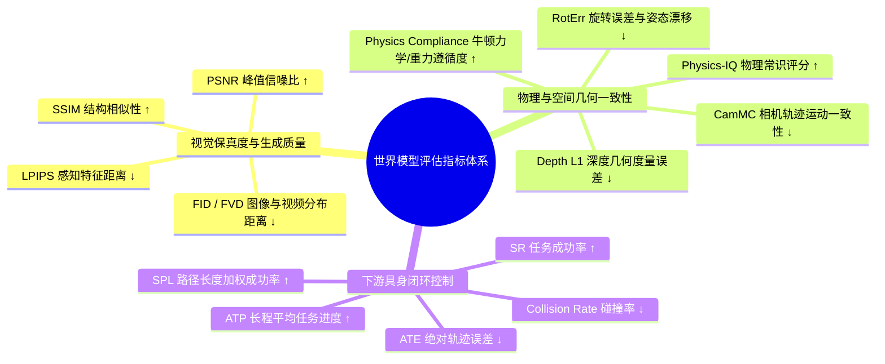

**专项综合基准体系**：

| 综合基准 | 主要评估维度与考察重点 | 代表评测模型 |
|:---|:---|:---|
| **WorldModelBench** | 物理规律遵循度（牛顿定律、质量守恒、流体动力学、重力常识） | Qwen-RobotWorld, Wan2.6, Veo3 |
| **EWMBench** | 复杂具身操作物理仿真、多视角几何一致性与运动真实度 | Genie Envisioner, Qwen-RobotWorld |
| **DreamGen Bench** | 复杂指令遵循（Instruction Following）与跨物体长时程泛化 | DreamGen, GigaWorld-0 |
| **PAI-Bench (PBench)** | 文本到物理世界生成的质量分（Quality）与领域分（Domain） | Cosmos-Predict2.5, GigaWorld-0 |
| **PRBench (进度奖励基准)** | 阶段进度单调性对齐（SC/Mono）与目标判别灵敏度（MMD/JS） | SRPO, NORA-1.5 |
| **TransferBench** | Sim2Real 翻译控制遵循度（Adherence）、生成多样性与视觉质量 | Cosmos-Transfer1 / 2.5 |

---

# 9. 开放挑战与实践启示

## 9.1 六大开放挑战

世界模型在 2025–2026 年进展很快，但要在工业级机器人系统中可靠工作，仍有以下问题待解决：

### 物理一致性

当前生成式世界模型在微观运动上已较逼真，但在刚体碰撞冲量守恒、弹性 / 塑性形变、流体飞溅与不可穿模约束等规律上仍依赖统计拟合，容易产生物理幻觉。
- **前沿方向**：将**可微物理仿真（Differentiable Physics Simulators）**嵌入去噪过程，以物理残差作为损失正则项；
- **因果推理与反事实推演**：结合因果发现（Causal Discovery），让世界模型能回答"如果机械臂多施加 2N 的侧向力，杯子是否会倾倒"这类假设性问题。

### 3D/4D 空间表示

2D 像素流难以持久保留 3D 空间结构，智能体大范围移动时容易出现"空间遗忘"与几何失真（§4.4）。
- **前沿方向**：以 **3D 高斯泼溅（3DGS）**、**持久点跟踪（Persistent Point Tracking）**与**连续占据场（Occupancy Fields）**作为原生状态表示；
- **趋势**：World Labs 的 Marble / Atlas 与 Image2Sim（§5.5、§5.6）展示了从"2D 视频预测"走向"可持续探索、可交互的 3D 世界"的路线，使世界模型具备度量几何。

### 安全与不确定性

世界模型用于真机控制前，必须知道自己什么时候不可信。
- **前沿方向**：引入**共形预测（Conformal Prediction）**与**认知不确定性（Epistemic Uncertainty）量化**（如模型集成），在遇到分布外场景或碰撞风险过高时主动报警并切换到人工遥操作；
- **自动化物理合理性审计**：用物理推理 VLM（如 Cosmos-Reason1）充当"物理裁判"，在生成结果交给策略前检查几何干涉与力学合理性。

### 长时程推演

标准 Softmax 自注意力的显存与计算随序列长度二次增长，分钟级前瞻推演难以在端侧部署。
- **前沿方向**：**混合线性 / 门控注意力**（如 SANA-WM 的 Gated DeltaNet）与 **attention sink**，使内存保持常数级（§4.4）；
- **分层动力学抽象（Hierarchical Dynamics）**：高层以低频跳步预测子目标，底层以高频展开精细力控轨迹。

### 失败数据与 Sim2Real

多数机器人数据集只包含专家的成功演示，模型对"失败状态"几乎没有经验。
- **前沿方向**：**主动生成失败模式**——用世界模型定向合成打翻、滑脱、卡死等失败轨迹，训练具备纠错与恢复能力的策略；
- **Sim2Real 域桥接**：用结构化世界翻译器（如 Cosmos-Transfer，§7.2）把仿真渲染提升为真实感画面，缩小感知域差。

### 全模态统一

理解、生成、预测与控制分模块拼装的做法正在被统一模型取代。
- **前沿方向**：以 **Mixture-of-Transformers（MoT）**、**全模态流匹配**为骨干（如 Cosmos 3、Motus），把语言、第一 / 第三人称视觉、本体感觉、触觉、几何与动作纳入同一 token 流，由同一套权重按需充当感知、生成、规划与控制模块。

---

## 9.2 五条工程经验

对于致力于具身智能、VLA 与机器人开发的科研与工程团队，可以从前文提炼出以下五条经验：

1. **“数据质量与策展”重于“盲目扩大参数”**：Cosmos Video Curator 与 EWK 数据集的经验表明，严格的镜头切分、多级物理过滤、多视角空间与时间分层描述对物理世界模型的贡献，往往不亚于单纯增加 DiT 参数；
2. **优先拥抱世界动作模型（WAM）以消除在线搜索开销**：在对实时性要求严苛的闭环控制中，应优先采用 WAM 或 Latent Canvas 架构，将未来视觉预测作为自监督锚定，实现单步前向 5Hz–15Hz 高频输出，规避昂贵的 CEM 采样；
3. **重视隐空间规划与非对称时空视界**：在视角剧烈变化的移动导航或复杂操作中，切忌无节制拉长自回归像素生成；采用“长动作视界 + 短隐空间视觉前瞻”能以极低成本提供最可靠的几何约束；
4. **警惕强化学习模拟器中的“分布漂移与幻觉漏洞”**：在虚拟世界模型中做 RL 后训练时，必须配合关键帧初始化（KIR）、策略协同演化（PACE）以及基于物理推理 VLM 的可验证稠密奖励，防止策略过拟合于生成器的物理 bug；
5. **布局 3D 显式表示与空间智能基础**：2D 像素是 3D 物理世界的降维投影，长期来看，深度融合 3DGS、点云及度量几何的 Large World Models（LWM）是解决空间泛化问题的重要方向。

## 9.3 技术路线研判 {#sec-9-3-future-roadmap}

具身智能世界模型的发展历程，折射出 AI 对物理世界认知能力的根本跃迁。纵观 2018 至 2026 年的技术演化，我们可以清晰地梳理出三条交织演进的技术主线：

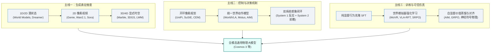

### 四大范式的融合趋势

回顾 **§6 的四大范式** 与 **§5–§7 的代表工作**，四大范式并非互相替代的竞争关系，而是正加速走向深层互补：

| 范式定位 | 典型代表 | 核心优势 | 核心瓶颈 | 未来融合方向 |
|:---|:---|:---|:---|:---|
| **① 世界规划器** (Planner) | UniPi, SuSIE, GENE-26.5 | 目标驱动、可解释性强、灵活泛化 | 采样延迟高 (CEM 达秒级)、不适合高频控制 | 隐空间梯度规划、扩散蒸馏采样 |
| **② 世界动作模型** (WAM) | WorldVLA, Motus, AIM, NavWAM | 5–15Hz 高频闭环、无缝融合前瞻与控制 | 多视角时空对齐难、长程轨迹漂移 | MoT 解耦架构、空间价值图 (ASVM) 中介 |
| **③ 世界合成器** (Synthesizer) | Genie, DreamGen, Image2Sim | 无限扩充边缘工况长尾数据、泛化性强 | 仿真与真实域差 (Sim2Real)、物理幻觉 | 4D 动态流生成、光流差分动作迁移 |
| **④ 世界模拟器** (Simulator) | WoVR, VLA-RFT, SRPO | 免真机损耗的低成本强化学习母体 | 策略过拟合于生成器幻觉漏洞 | 关键帧回放 (KIR)、策略协同演化 (PACE) |

### 三个突破方向

1. **从“像素直推动作”到“空间意图显式化（Spatial Intent as Bridge）”**：AIM 与 NavWAM 的成功表明，像素与动作之间存在天然的物理鸿沟。引入显式的 3D 几何、点云接触面或 2D 空间价值图作为结构化中间层，是消除反向动力学（Inverse Dynamics）学习困难的关键抓手；
2. **从“2D 纯视频梦境”到“3DGS 空间智能宇宙（3D Spatial Grounding）”**：以 Marble 和 Lyra 2.0 为代表的 3D 显式世界模型显著缓解了 2D 视频生成中的视角不一致与物体恒久性丧失问题，使世界模型兼具“可微分生成”与“物理引擎级几何持久性”；
3. **从“单向开环生成”到“慢思考与快反应双系统（System 1 & System 2 Co-Design）”**：高频电机控制（50Hz–500Hz，见 §2.3）由轻量化策略或 WAM 动作头负责（System 1），而宏观场景推演、危险审计与长程任务拆解由大型世界模型在后台异步运行（System 2），是目前较常见的工程组织方式。

---

# 10. 参考文献 {#sec-10-references}

正文中的 [[n]](#sec-10-references) 角标可直接跳转至下方对应条目。

1. Tan, Z., et al. (2026). *Towards Generalist Embodied AI: A Survey on World Models for VLA Agents*. TechRxiv. [arXiv/TechRxiv 链接](https://www.techrxiv.org/)
2. Li, X., et al. (2025/2026). *A Comprehensive Survey on World Models for Embodied AI*. [arXiv:2510.16732](https://arxiv.org/abs/2510.16732) · [AwesomeWorldModels](https://github.com/Li-Zn-H/AwesomeWorldModels)
3. Ha, D., & Schmidhuber, J. (2018). *World Models*. NeurIPS 2018. [arXiv:1803.10122](https://arxiv.org/abs/1803.10122) · [Project Page](https://worldmodels.github.io/)
4. Hafner, D., Pasukonis, J., Ba, J., & Lillicrap, T. (2025). *Mastering Diverse Control Tasks through World Models (DreamerV3)*. Nature 640, 647–653. [Nature 论文](https://www.nature.com/articles/s41586-025-08744-2) · [arXiv:2301.04104](https://arxiv.org/abs/2301.04104)
5. Hansen, N., et al. (2024). *TD-MPC2: Scalable, Robust World Models for Continuous Control*. ICLR 2024 (Oral). [arXiv:2310.16828](https://arxiv.org/abs/2310.16828) · [Project Page](https://tdmpc2.github.io/)
6. Bruce, J., et al. (2024). *Genie: Generative Interactive Environments*. Google DeepMind. [arXiv:2402.15391](https://arxiv.org/abs/2402.15391)
7. *LingBot-World: Open-Source Minute-Scale Interactive World Model* (2026). [arXiv:2601.20540](https://arxiv.org/abs/2601.20540)
8. Zhu, H., et al. (2026). *SANA-WM: Efficient Minute-Scale World Modeling with Hybrid Linear Diffusion Transformer*. [arXiv:2605.15178](https://arxiv.org/abs/2605.15178) · [Project Page](https://nvlabs.github.io/Sana/WM/)
9. NVIDIA. (2026). *Lyra 2.0: Explorable Generative 3D Worlds at Scale*. [arXiv:2604.13036](https://arxiv.org/abs/2604.13036)
10. World Labs Team. (2025–2026). *Marble: A Multimodal World Model* & *Atlas: A World Model for Spatial Intelligence*. [worldlabs.ai/blog/marble-world-model](https://www.worldlabs.ai/blog/marble-world-model) · [worldlabs.ai/blog/atlas](https://www.worldlabs.ai/blog/atlas)
11. *Image2Sim: Decoupled 3D Gaussian Geometry and One-Step Pixel Flow for Real-Time Neural Simulation* (2026). [arXiv:2607.05765](https://arxiv.org/abs/2607.05765)
12. Du, Y., et al. (2023). *Learning Universal Policies via Text-Guided Video Generation (UniPi)*. NeurIPS 2023.
13. Black, K., et al. (2024). *Zero-Shot Robotic Manipulation with Pre-trained Image-Editing Diffusion Models (SuSIE)*. ICLR 2024.
14. Zhen, H., et al. (2024). *3D-VLA: A 3D Vision-Language-Action Generative World Model*. ICML 2024.
15. Assran, M., et al. (2025). *V-JEPA 2: Self-Supervised Video Models Enable Understanding, Prediction and Planning*. Meta AI.
16. Gao, C., et al. (2024). *PIVOT-R: Primitive-Driven Waypoint-Aware World Model for Robotic Manipulation*.
17. Genesis AI. (2026). *GENE-26.5: Advancing Robotic Manipulation to Human-Level*. [genesis.ai](https://www.genesis.ai/blog/gene-26-5-advancing-robotic-manipulation-to-human-level)
18. *VLA-World: Learning Vision-Language-Action World Models for Autonomous Driving* (2026). [项目主页](https://vlaworld.github.io)
19. Wu, H., et al. (2023). *Unleashing Large-Scale Video Generative Pre-training for Visual Robot Manipulation (GR-1)*. ICLR 2024.
20. Bu, Q., et al. (2025). *UniVLA: Learning to Act Anywhere with Task-centric Latent Actions*.
21. Cen, J., et al. (2025). *WorldVLA: Towards Autoregressive Action World Model*. [arXiv:2506.21539](https://arxiv.org/abs/2506.21539)
22. Zhang, Z., et al. (2025). *FlowVLA: Thinking in Flow for Vision-Language-Action Models*.
23. Liu, J., et al. (2025). *CoT-VLA: Visual Chain-of-Thought Reasoning for Vision-Language-Action Models*.
24. Zhang, W., et al. (2025). *DreamVLA: A Vision-Language-Action Model Dreamed with Comprehensive World Knowledge*.
25. *Motus: A Unified Latent Action World Model for Robotic Manipulation* (2025/2026). 清华大学 & 生数科技. [arXiv:2512.18876](https://arxiv.org/abs/2512.18876) · [Code](https://github.com/PKU-YuanGroup/Motus)
26. NVIDIA. (2026). *Cosmos 3: Omnimodal World Models for Physical AI*. [arXiv:2606.02800](https://arxiv.org/abs/2606.02800) · [GitHub](https://github.com/nvidia-cosmos)
27. *AIM: Intent-Aware Unified World Action Modeling with Spatial Value Maps* (2026). [arXiv:2604.11135](https://arxiv.org/abs/2604.11135)
28. *NavWAM: Navigation World Action Models for Autonomous Embodied Agents* (2026). [arXiv:2606.13494](https://arxiv.org/abs/2606.13494) · [Project Page](https://dachii-azm.github.io/navwam/)
29. *WAM-Nav: Asymmetric Latent World-Action Modeling for Unified Visual Navigation* (2026). [arXiv:2606.04907](https://arxiv.org/abs/2606.04907)
30. *Ctrl-World: A Controllable Generative Framework for Robotic Manipulation* (2025).
31. *WristWorld: Generating Wrist-Views via 4D World Models for Robotic Manipulation* (2025).
32. Alibaba. (2026). *Qwen-RobotWorld: Unifying Embodied World Models via Natural Language*. [arXiv:2606.17030](https://arxiv.org/abs/2606.17030)
33. Zhao, J., et al. (2025). *DreamGen: Unlocking Generalization in Robot Learning through Neural Trajectories*. NVIDIA.
34. *GigaWorld-0: World Models as Data Engine to Empower VLA Models* (2025).
35. *VLA-RFT: Vision-Language-Action Reinforcement Fine-tuning with Verified Rewards in World Simulators* (2025).
36. *SRPO: Scaffolded Reinforcement Policy Optimization for Robotic Manipulation* (2025).
37. *VLA-Reasoner: Empowering Vision-Language-Action Models for Complex Tasks with Future Imagination* (2025).
38. *AdaPower: Adaptive Test-Time Scaling for Vision-Language-Action Models* (2025).
39. *WoVR: World Models as Reliable Simulators for Post-Training VLA Policies with RL* (2026). [arXiv:2602.13977](https://arxiv.org/abs/2602.13977)
40. *WMPO: World Model-based Policy Optimization for Vision-Language-Action Models* (2025).
41. *NORA-1.5: A Small Open Vision-Language-Action Model for Embodied Tasks with Flow-Matching Action Expert* (2025).
42. Kerbl, B., et al. (2023). *3D Gaussian Splatting for Real-Time Radiance Field Rendering*. SIGGRAPH 2023.
43. NVIDIA. (2025). *Cosmos World Foundation Model Platform for Physical AI*. [arXiv:2501.03575](https://arxiv.org/abs/2501.03575)
44. NVIDIA Cosmos Cookbook — [github.com/nvidia-cosmos/cosmos-cookbook](https://github.com/nvidia-cosmos/cosmos-cookbook).
45. NVIDIA. (2025). *Cosmos-Transfer1: Conditional World Generation with Adaptive Multimodal Control*. [arXiv:2503.14492](https://arxiv.org/abs/2503.14492)
46. NVIDIA. (2025). *Cosmos-Reason1: From Physical Common Sense To Embodied Reasoning*. [arXiv:2503.15558](https://arxiv.org/abs/2503.15558)
47. Alibaba. (2025). *Wan: Open and Advanced Large-Scale Video Generative Models*. [arXiv:2503.20314](https://arxiv.org/abs/2503.20314)
48. Chen, X., et al. (2025). *Janus-Pro: Unified Multimodal Understanding and Generation with Data and Model Scaling*. [arXiv:2501.17811](https://arxiv.org/abs/2501.17811)
49. *Video Generation Models in Robotics: Applications, Research Challenges, Future Directions* (2026). [arXiv:2601.07823](https://arxiv.org/abs/2601.07823)
50. Huang, Z., et al. (2024). *VBench: Comprehensive Benchmark Suite for Video Generative Models*.
51. *RoboTwin 2.0: Dual-Arm Benchmark for Scalable Embodied Manipulation* (2025). Tsinghua University.
52. Liu, B., et al. (2023). *LIBERO: Benchmarking Knowledge Transfer for Lifelong Robot Learning*. [libero-project.github.io](https://libero-project.github.io/)
53. Mees, O., et al. (2022). *CALVIN: A Benchmark for Language-Conditioned Policy Learning for Long-Horizon Robot Manipulation Tasks*. [github.com/mees/calvin](https://github.com/mees/calvin)

---

本文所有示意图、架构图、实验对比图均来自上述公开论文或对应官方项目主页，版权归原作者所有，仅用于学术交流与学习整理。
