# 一、从研究脚本到可安装项目

## 1.1 本文要解决的问题

绝大多数 AI 与机器人方向的代码，都是从一个 `train.py` 开始的。它在你的机器上跑得很好。三个月后，事情通常会变成这样：

| 阶段 | 典型症状 | 根因所在层 |
| --- | --- | --- |
| 交给师弟复现 | `ModuleNotFoundError`，或者装完依赖精度对不上 | 环境与依赖声明 |
| 换一台带 GPU 的服务器 | `torch.cuda.is_available()` 返回 `False` | GPU 依赖栈分层 |
| 想被另一个项目导入 | 只能靠 `sys.path.append("../..")` | 项目结构与安装方式 |
| 加进 CI | 本地过、CI 挂，或者反过来 | 可复现性边界 |
| 半年后自己回来改 | 不敢升级任何一个包 | 缺锁文件与测试 |

这些症状看起来互不相干，实际上只对应一件事：**代码从来没有被当作「一个可安装的项目」来组织过**，它一直是「一堆恰好能跑的文件」。

本文的目标很具体：**把研究脚本整理成别人能安装、能运行、能维护的 Python 项目**。不是 Python 语言教程，也不是工具百科。凡是与这个目标关系不大的话题（Web 框架、异步编程范式、元编程技巧），本文一概不碰。

## 1.2 贯穿全文的示例项目

为了避免各章示例互相打架，全文只用一个项目：`navkit` —— 一个小型航点导航工具库。它刻意包含了真实项目的全部关键元素：

- 一个可被导入的包（库的一面）
- 一个命令行入口（应用的一面）
- 一份配置文件（需要处理路径与优先级）
- 一套测试（需要区分要不要 GPU）
- 一个可选的 PyTorch 功能（需要处理 CUDA 依赖）

后面每一章都在 `navkit` 上加一层能力，第九章给出它的最终完整形态。

先看目标 —— 读完本文后，任何人拿到这个仓库，三条命令就能进入可开发状态：

```bash
git clone https://github.com/example/navkit && cd navkit
uv sync                 # 创建环境 + 按锁文件精确安装
uv run pytest           # 跑测试
```

注意这里**没有** `conda create`、没有 `pip install -r requirements.txt`、没有 `export PYTHONPATH=`、也没有「请先手动安装 torch」。每减少一条这样的口头约定，复现失败率就下降一截。

## 1.3 阅读方式

本文的组织原则是：**正文只给一条默认路径，替代方案放在紧邻的短说明里**。

默认路径的技术选型是：

```
Python 3.12+  ·  uv 管环境与依赖  ·  src 布局  ·  hatchling 构建
Ruff 检查与格式化  ·  pytest 测试  ·  GitHub Actions 跑 CI
```

这套组合适用于**新建的、以 Python 依赖为主的项目**。如果你的项目已经深度绑定 conda，或者必须活在 ROS 2 的工作空间里，第四章 4.9 节和第八章 8.4 节专门讨论这两种情况 —— **它们不是「迁移到 uv 就完事了」的问题**。

本文所有可直接抄的配置块，都在开头注明适用条件。写作时的版本基准：Python 3.14.7（当前稳定版，3.15 处于 RC 阶段）、uv 0.11.x。

---

# 二、环境与解释器边界：当前到底跑的是哪个 Python

几乎所有「装了包却导不进来」的问题，最终都归结为同一个答案：**你装包的那个 Python，和你运行代码的那个 Python，不是同一个**。所以这一章只回答一个问题 —— **当前究竟运行了哪个解释器，它会去哪里找包**。

## 2.1 一次导入到底发生了什么

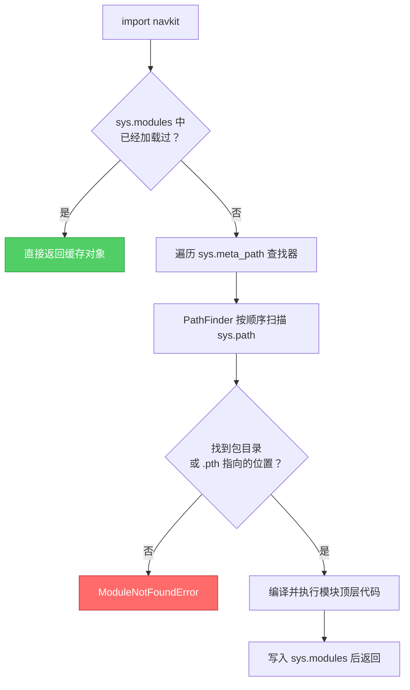

要点只有两个：

1. **`sys.path` 是一个有序列表，先找到的赢**。这解释了为什么「明明装了正式版，却导入了当前目录下的同名源码副本」。
2. **`sys.path` 不是固定的**，它的第一项由启动方式决定。下一节展开。

## 2.2 sys.path 是怎么被拼出来的

**不存在一个「通用的 sys.path 顺序」**。它的第一项取决于你怎么启动 Python，这正是大量诡异问题的来源：

| 启动方式 | 第一项是什么 | 实际后果 |
| --- | --- | --- |
| `python script.py` | **脚本所在目录**（不是当前目录） | 脚本旁边的同名 `.py` 会遮蔽已安装的包 |
| `python -m pkg.mod` | **当前工作目录** | 在项目根目录下运行时，会优先找到源码树 |
| `python -c "..."` / 交互式 | **当前工作目录** | 同上 |
| `pytest` | 取决于 rootdir 与 importmode 配置，见 §5.4 | 最容易「测到了源码而不是安装产物」 |
| Jupyter 内核 | **Notebook 文件所在目录** | 与你在终端里的当前目录往往不是一回事 |

拼完第一项之后，剩余顺序大致是：

```
第一项（见上表，可用 -P 或 PYTHONSAFEPATH=1 关闭）
  → PYTHONPATH 环境变量中的各项
  → 标准库 zip、标准库目录、lib-dynload
  → site 模块添加的 site-packages
      └── 其中 .pth 文件可以再追加路径（可编辑安装就藏在这里）
```

> **Python 3.11+ 的 `-P` 开关值得记住。** `python -P script.py`（或设 `PYTHONSAFEPATH=1`）会阻止把脚本目录或当前目录加进 `sys.path`。当你怀疑「导入了错误的副本」时，加上 `-P` 跑一次，问题会立刻现形。

排查时这一条命令就够用：

```bash
python -c "import sys, navkit; print(sys.executable); print(navkit.__file__)"
```

第一行告诉你**跑的是哪个解释器**，第二行告诉你**导入的是哪份代码**。大部分环境问题在这两行输出面前会直接暴露。

## 2.3 venv 的真相：它只做了三件事

虚拟环境经常被当成某种魔法容器，其实它非常朴素：

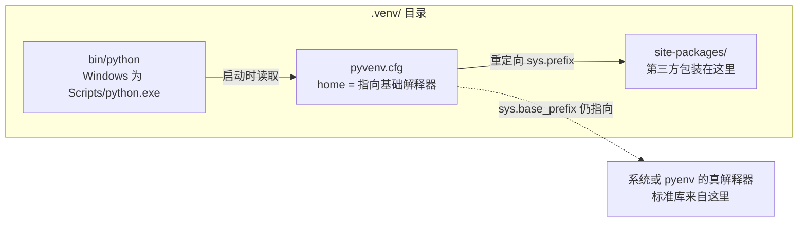

1. 放一个 `pyvenv.cfg`，里面的 `home` 指向真正的基础解释器；
2. 提供一个 `python` 可执行文件，它启动时读到 `pyvenv.cfg`，把 `sys.prefix` 指向 venv 自己，而 `sys.base_prefix` 仍指向基础解释器（**标准库是共享的，没有被复制**）；
3. 于是 `site-packages` 解析到 venv 内部，第三方包被隔离。

由此得到一个很有用的推论：**`activate` 不是必需的**。激活脚本干的事情基本只有「把 venv 的 bin 目录塞到 `PATH` 最前面、设置 `VIRTUAL_ENV`」。直接调用绝对路径完全等价，而且在脚本、cron、systemd、CI 里更可靠：

```bash
.venv/bin/python -m pytest          # Linux / macOS
.venv\Scripts\python.exe -m pytest  # Windows
```

用 uv 时，`uv run pytest` 会自动挑对解释器，连这一步都省了。

> **一条戒律：永远用 `python -m pip install`，不要裸用 `pip install`。** 裸 `pip` 用的是 `PATH` 里第一个 `pip`，它未必属于你正在运行的那个 Python；`python -m pip` 则保证「装进的就是这个解释器」。

## 2.4 pyenv / venv / conda / uv 的职责分层

这四者常被拿来「二选一」，但它们解决的并不是同一层问题。下图表达的是**主要职责**，不是能力互斥 —— 实际上它们有明显的重叠区：

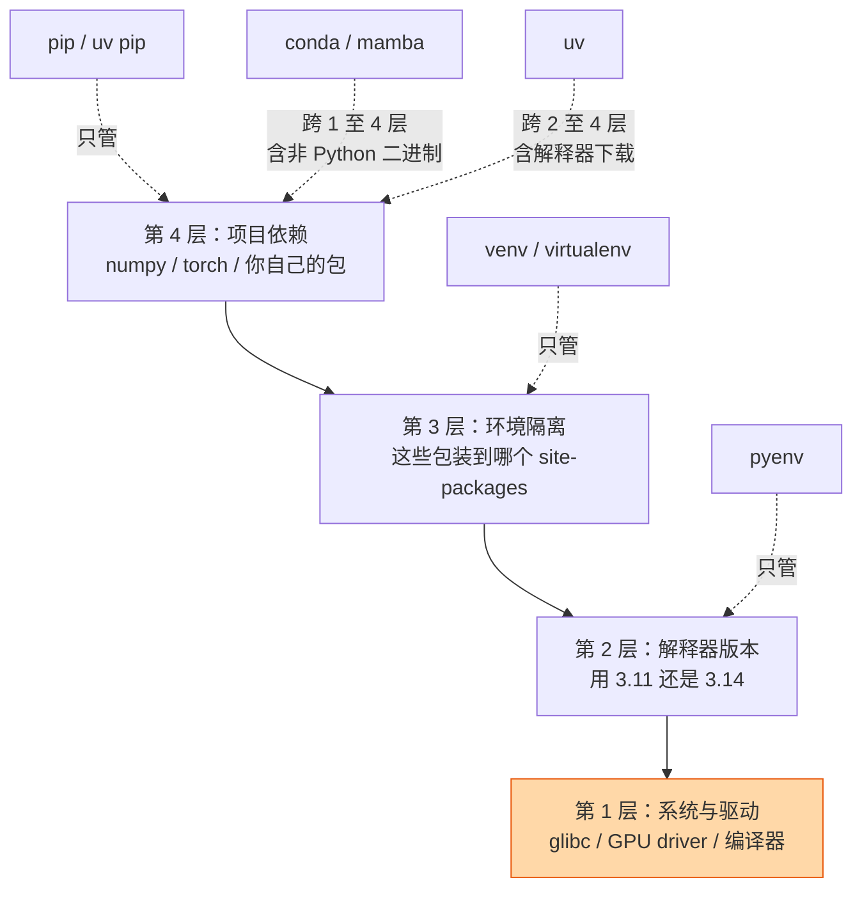

| 工具 | 主要职责 | 会不会装解释器 | 能不能管非 Python 二进制 |
| --- | --- | --- | --- |
| `pip` | 装 Python 包 | 否 | 只能装已打包进 wheel 的那部分 |
| `venv`（标准库） | 隔离 site-packages | 否 | 否 |
| `pyenv` | 安装与切换解释器版本 | 是（本地编译） | 否 |
| `conda` / `mamba` | 环境 + 包 + 部分系统库 | 是 | **能**（独立的二进制分发体系） |
| `uv` | 环境 + 包 + 解释器 + 项目工作流 | 是（下载预编译版） | 只能装已打包进 wheel 的那部分 |

**uv 之所以能当主线，是因为它同时覆盖了第 2、3、4 层**：`uv sync` 一条命令里包含了「确保有正确版本的解释器 → 建 venv → 按锁文件装依赖」。这就是 §1.2 里三条命令能成立的原因。

但请注意上图最底下那块橙色：**第 1 层（系统库与驱动）谁都管不了**。GPU 驱动、glibc 版本、ROS 2 的系统安装，都在所有 Python 工具的能力边界之外。第八章会专门处理这条边界。

## 2.5 PEP 668：系统 Python 为什么拒绝你装包

在较新的 Ubuntu / Debian / Fedora 上执行 `pip install requests`，你会撞上：

```
error: externally-managed-environment
× This environment is externally managed
```

这不是 bug。[PEP 668](https://peps.python.org/pep-0668/) 允许发行版在解释器目录下放一个 `EXTERNALLY-MANAGED` 标记文件，声明「**这个 Python 的 site-packages 由系统包管理器（apt/dnf）负责，安装器请不要往里写**」。

原因很实在：系统里有一批工具（包括 apt 自身的某些组件）依赖特定版本的 Python 库。你升级一个公共依赖，可能直接让系统工具崩掉。

**正确的应对是换个环境，而不是绕过标记。**

| 场景 | 该怎么做 |
| --- | --- |
| 做项目开发 | 建虚拟环境（`uv venv` / `uv sync`）—— 默认答案 |
| 装一个全局命令行工具（ruff、httpie） | `uv tool install ruff`，装进独立环境并暴露命令 |
| 临时跑一次某个工具 | `uvx ruff check .`（不留痕迹） |
| 确实要动系统环境 | 用 `apt install python3-xxx`，而不是 pip |

`--break-system-packages` 这个标志的名字就是它的文档：**它真的会破坏系统包**。不要把它写进任何文档或 Dockerfile 模板。

## 2.6 Notebook、IDE 与终端：三处解释器不一致

这是本领域最高频的困惑之一：**「我在终端明明装好了，Notebook 里就是导入不了。」**

根因是 Jupyter 的**内核与前端是解耦的**。你在终端激活的环境，和 Notebook 实际连上的内核，完全是两回事：

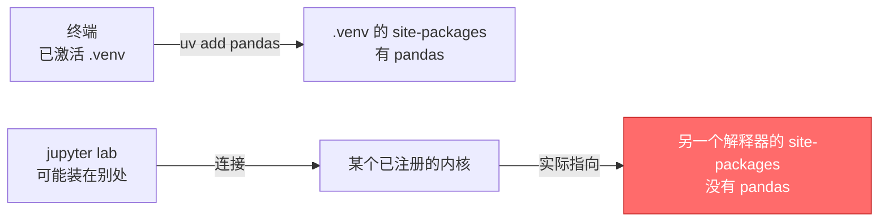

**诊断** —— 在 Notebook 的单元格里跑（不要在终端里跑）：

```python
import sys
print(sys.executable)     # 内核真正用的解释器
print(sys.prefix)         # 它认为自己在哪个环境
```

把这一行的输出和终端里 `uv run python -c "import sys; print(sys.executable)"` 的输出比对。不一致就是答案。

**修复** —— 把项目环境注册成一个内核：

```bash
uv add --group dev ipykernel
uv run python -m ipykernel install --user --name navkit --display-name "Python (navkit)"
```

然后在 Notebook 右上角切换到 `Python (navkit)`。

> **一个常见误区**：在 Notebook 里用 `!pip install pandas`。开头的 `!` 表示交给系统 shell 执行，用的是 `PATH` 里的 `pip`，**不一定是当前内核的解释器**。如果非要在 Notebook 里装，写成 `%pip install pandas` —— `%` 开头的魔法命令会绑定到当前内核。

VS Code 的情况类似：它有独立的「Python 解释器」选择（`Ctrl+Shift+P` → *Python: Select Interpreter*），与你在集成终端里激活的环境是两套状态。调试器用前者，终端用后者。

## 2.7 Windows 与 WSL 的额外坑

本机实测 —— 这台机器上 `where python` 指向：

```
C:\Users\<user>\AppData\Local\Microsoft\WindowsApps\python.exe
```

这不是 Python，而是 **Microsoft Store 的应用执行别名**：一个存根程序，未安装时会把你弹到商店页面。它导致的现象是 `python --version` 没有任何输出，或者行为莫名其妙。

处理方式：*设置 → 应用 → 高级应用设置 → 应用执行别名*，关掉 `python.exe` 与 `python3.exe` 两项。用 uv 管解释器的话，这个存根本来也不该出现在 `PATH` 前面。

其余几条 Windows / WSL 差异：

| 差异点 | Linux / macOS | Windows |
| --- | --- | --- |
| venv 可执行文件 | `.venv/bin/python` | `.venv\Scripts\python.exe` |
| 路径分隔符 | `:` | `;` |
| 文件名大小写 | 敏感 | **不敏感**，`import Navkit` 在 Windows 能过、Linux 挂 |
| 符号链接 | 默认可用 | 需开发者模式，否则 uv 退化为复制或硬链接 |

> **跨越 WSL 边界是纯粹的陷阱。** 不要在 `/mnt/c/...` 下建 venv，也不要让 WSL 里的 Python 去用 Windows 侧的 `.venv`。二进制格式不同（ELF 与 PE），文件系统性能差一个数量级，行尾与权限语义也不一致。**在 WSL 里开发，就把仓库放在 WSL 的原生文件系统里**（如 `~/code/navkit`），用 VS Code 的 Remote-WSL 打开。

---

# 三、项目结构与项目声明

这一章把目录树和 `pyproject.toml` 对照着讲 —— 它们描述的是同一件事的两面：**磁盘上的文件怎么摆**，以及**安装器该把哪些文件搬进 site-packages**。

## 3.1 先分类：应用、库、实验仓库

在动手建目录之前，先回答一个问题：**这个仓库是三类中的哪一类？** 它决定了后面几乎所有决策。

| 维度 | 应用 / 服务 | 可发布的库 | 实验仓库 |
| --- | --- | --- | --- |
| 交付物 | 一个能跑起来的运行环境 | 一个装到别人环境里的包 | 可复现的实验记录 |
| 依赖版本策略 | **锁死**（越精确越好） | **放宽**（声明兼容区间） | 锁死 + 记录实验元数据 |
| 锁文件要不要提交 | **要** | **要，但只用于开发/CI** | **要** |
| 版本号 | 常用日期或 Git 描述 | 严格语义化版本 | 往往不需要 |
| 典型例子 | 机器人上位机、推理服务 | `navkit` 作为依赖被引用 | 某篇论文的代码仓库 |

**最容易搞错的一条**：你的锁文件**约束不了下游**。

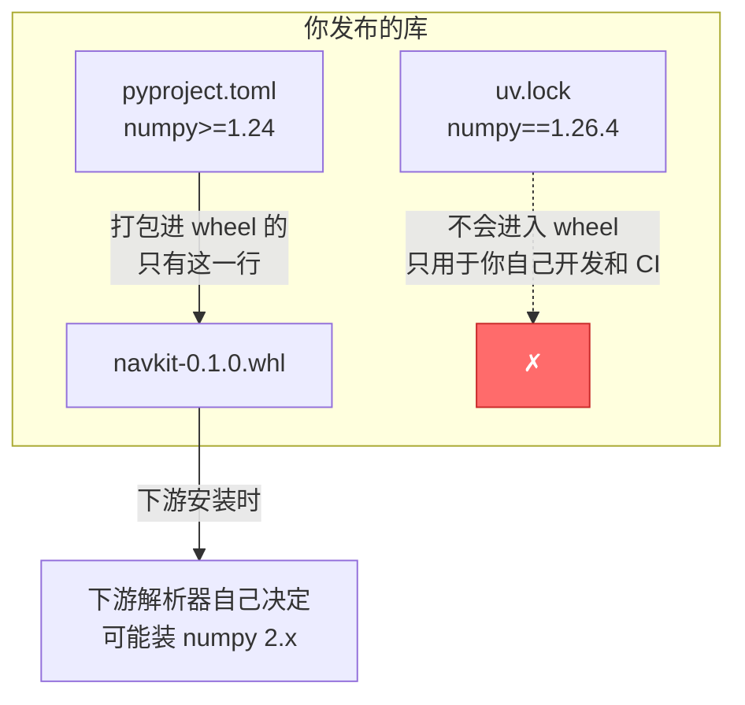

所以：**库的 `pyproject.toml` 里写兼容区间，应用的锁文件里写精确版本**。把库的依赖写成 `numpy==1.26.4` 会让所有下游用户陷入版本冲突地狱；反过来，应用不锁版本则等于放弃可复现性。

`navkit` 同时具备库和应用两面 —— 这很常见。做法是：`pyproject.toml` 里声明宽松区间（服务库的一面），同时提交 `uv.lock`（服务开发与 CI 的一面）。两者不冲突。

## 3.2 src 布局 vs 扁平布局

两种布局的区别只有一处：**包目录在不在仓库根目录下**。

```
扁平布局                          src 布局
navkit/                          navkit/
├── navkit/          ← 包         ├── src/
│   └── __init__.py              │   └── navkit/      ← 包
├── tests/                       │       └── __init__.py
└── pyproject.toml               ├── tests/
                                 └── pyproject.toml
```

差别看着微不足道，后果却不小。回忆 §2.2：**在项目根目录下运行 `python -m ...` 或 `pytest` 时，当前目录会被塞进 `sys.path` 的第一项**。

- **扁平布局**：`navkit/` 就在根目录下，于是 `import navkit` 命中的是**源码树**，而不是你刚安装的那份。
- **src 布局**：根目录下只有 `src/`，`import navkit` 在根目录里找不到东西，只能走 site-packages。

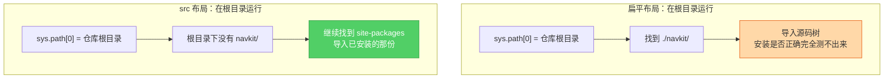

**但要把话说准确**，这里有两个常见的过度宣传：

1. **src 布局不保证你测的是最终 wheel 的内容**。开发时用的是可编辑安装（§3.6），它通过 `.pth` 把路径指回 `src/`，导入的仍然是源码。src 布局真正消除的是「**工作目录导致的意外导入**」，不是「源码与产物的差异」。
2. **要验证 wheel 真的完整**，唯一可靠的办法是构建后在干净环境里装一遍，见 §7.3。比如漏配了包数据文件（`.yaml`、`.pyi`），只有这一步能抓出来。

结论：**新项目一律用 src 布局**，成本为零，收益是排除一整类幽灵问题。

## 3.3 navkit 的目录树

```
navkit/
├── src/
│   └── navkit/
│       ├── __init__.py          # 包的公开 API，控制对外暴露什么
│       ├── py.typed             # 空文件，声明本包带类型标注（PEP 561）
│       ├── cli.py               # 命令行入口
│       ├── planner.py           # 核心算法
│       ├── geometry.py
│       ├── models/              # 可选的 torch 功能
│       │   ├── __init__.py
│       │   └── policy.py
│       └── data/
│           └── default_params.yaml   # 包数据文件，随 wheel 一起分发
├── tests/
│   ├── conftest.py              # 共享 fixture
│   ├── test_planner.py
│   └── gpu/
│       └── test_policy.py       # 需要 GPU，默认跳过
├── configs/                     # 运行时配置，不随包分发
│   └── default.yaml
├── scripts/                     # 一次性脚本，不属于包
│   └── convert_dataset.py
├── docs/
├── .github/workflows/ci.yml
├── .gitignore
├── .pre-commit-config.yaml
├── pyproject.toml               # 项目声明 + 工具配置
├── uv.lock                      # 锁文件，提交进仓库
└── README.md
```

几条容易被忽略的约定：

- **`configs/` 与 `src/navkit/data/` 是两回事**。前者是用户会改的运行时配置，不进 wheel；后者是包自带的默认值，必须随 wheel 分发（§3.7 讲怎么读它）。
- **`scripts/` 里的东西不是包的一部分**。它们是一次性工具，不要让 `src/navkit/` 里的代码去 import 它们。
- **`py.typed` 是个空文件**，但没有它，下游的类型检查器会直接忽略你包里的所有类型标注。
- **数据集和模型权重不进 Git**。`.gitignore` 里加 `data/`、`*.ckpt`、`*.pth`、`outputs/`，版本化交给 §8.6 讲的方案。

## 3.4 pyproject.toml 逐区块对照

`pyproject.toml` 常被称作「唯一事实源」，这个说法**不准确**，值得先纠正：它描述不了锁定结果（那是 `uv.lock`）、描述不了系统库与 GPU 驱动（§8.1）、也描述不了运行时配置。

更准确的定位是：**Python 项目声明与工具配置的中心入口**。下面是 `navkit` 的完整配置，逐块对照目录树来看：

```toml
# 适用：Python 3.12+ · uv 0.11.x · src 布局 · 纯 Python 包
# ---------- 1. 构建系统：谁来把源码变成 wheel ----------
[build-system]
requires = ["hatchling"]              # 构建时才需要的依赖（PEP 518）
build-backend = "hatchling.build"     # 构建后端接口（PEP 517）

# ---------- 2. 项目元数据：会被打进 wheel，下游能看到 ----------
[project]
name = "navkit"
version = "0.1.0"
description = "Waypoint navigation toolkit"
readme = "README.md"
requires-python = ">=3.12"            # 约束下游可用的解释器版本
license = "MIT"
authors = [{ name = "Tingde Liu" }]

dependencies = [                      # 运行时依赖，宽松区间（PEP 508 语法）
    "numpy>=1.24",
    "pyyaml>=6.0",
    "typer>=0.12",
]

[project.optional-dependencies]       # 可选功能，下游用 navkit[torch] 安装
torch = ["torch>=2.4"]

[project.scripts]                     # 安装后生成的命令行入口
navkit = "navkit.cli:app"

# ---------- 3. 开发依赖：不打进 wheel，下游看不到（PEP 735）----------
[dependency-groups]
dev = ["ruff>=0.6", "mypy>=1.11", "pre-commit>=3.8"]
test = ["pytest>=8.0", "pytest-cov>=5.0"]

# ---------- 4. 工具配置：与打包无关，只是借这个文件存放 ----------
[tool.hatch.build.targets.wheel]
packages = ["src/navkit"]             # 告诉 hatchling 包在 src/ 下面

[tool.ruff]
line-length = 100
```

**四个区块的归属完全不同，混淆它们是常见错误来源：**

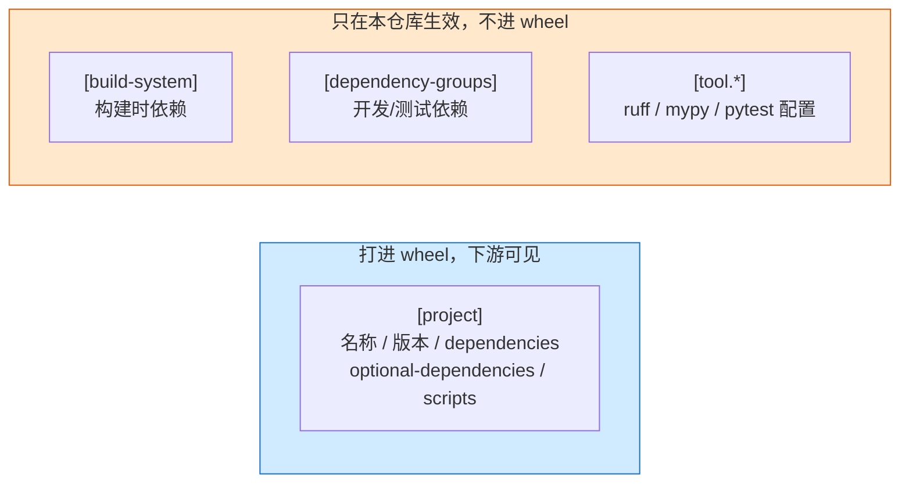

相关 PEP 各管一段，**不要混为一谈**：

| PEP | 它解决什么问题 | 落在配置的哪个位置 |
| --- | --- | --- |
| [PEP 517](https://peps.python.org/pep-0517/) | 定义构建前端与后端之间的调用接口 | `build-backend` |
| [PEP 518](https://peps.python.org/pep-0518/) | 声明构建时需要哪些依赖 | `[build-system] requires` |
| [PEP 621](https://peps.python.org/pep-0621/) | 统一项目元数据字段 | `[project]` 整块 |
| [PEP 660](https://peps.python.org/pep-0660/) | 让后端支持可编辑安装 | 后端行为，无对应字段（§3.6） |
| [PEP 735](https://peps.python.org/pep-0735/) | 开发依赖分组的标准写法 | `[dependency-groups]` |
| [PEP 440](https://peps.python.org/pep-0440/) | 版本号的合法格式与排序规则 | `version` 的取值 |
| [PEP 508](https://peps.python.org/pep-0508/) | 依赖字符串的语法（含环境标记） | `dependencies` 每一项 |
| [PEP 561](https://peps.python.org/pep-0561/) | 声明包内含类型标注 | `py.typed` 文件 |

## 3.5 构建前端与后端：谁在干什么

这是初学者最容易含糊的一组概念，其实分工很清晰：

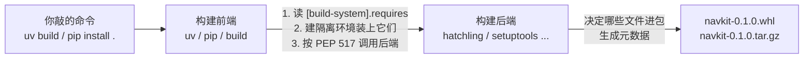

- **前端**（uv、pip、build）：不知道怎么造包，只负责准备环境、调用后端。
- **后端**（hatchling、setuptools 等）：真正决定哪些文件进包、如何生成元数据。

后端选型，按项目实际情况取一个就好：

| 后端 | 什么时候选它 |
| --- | --- |
| **hatchling** | **纯 Python 包的默认选择** —— 配置少、src 布局开箱即用 |
| setuptools | 老项目迁移，或需要某些历史插件 |
| flit-core | 极简单文件包 |
| maturin | 包含 Rust 扩展（PyO3） |
| scikit-build-core | 包含 C/C++/CUDA 扩展，走 CMake |

`navkit` 是纯 Python 的，用 hatchling。**带原生扩展的项目是另一个量级的话题**（交叉编译、ABI 兼容、manylinux 镜像），本文只在 §7.2 讲清楚产物层面的兼容规则，完整的扩展构建流程不展开。

## 3.6 可编辑安装：原理与陷阱

开发时你不希望每改一行代码就重新构建安装。可编辑安装（`pip install -e .`，或 uv 自动做的事）解决这个问题。

它的实现并不神秘 —— 往 site-packages 里塞一个 `.pth` 文件（或一个动态查找器），把 `src/navkit` 的真实路径接进 `sys.path`：

```
.venv/lib/python3.12/site-packages/
├── __editable__.navkit-0.1.0.pth      →  指向 /home/you/navkit/src
└── navkit-0.1.0.dist-info/            →  元数据（版本、依赖、入口点）
```

于是 `import navkit` 直接读到你的源码，改完即生效。

**三个必须知道的陷阱：**

1. **改了 `pyproject.toml` 必须重新安装。** 新增依赖、改入口点、改包含规则，都不会自动生效 —— 因为 `.pth` 只接了路径，元数据是安装时定格的。用 uv 的话 `uv sync` 会处理；手工管理时记得 `pip install -e .` 再跑一次。
2. **新增的子包可能不被识别。** 不同后端的 `.pth` 策略不同：有的接的是整个 `src/` 目录（新子包自动可见），有的是精确映射（必须重装）。遇到「新建的模块导不进来」，先重装一次。
3. **可编辑安装不能验证打包正确性。** 它绕过了「哪些文件该进 wheel」这个判断，所以 §3.3 里那个 `default_params.yaml` 就算漏配了 `[tool.hatch.build]`，可编辑安装下也照样能读到。**这正是 §7.3 那步干净环境验证不可省略的原因。**

## 3.7 导入、工作目录与资源路径

**一条铁律：永远不要用相对路径读包内的数据文件。**

下面这种写法在研究代码里极其常见，也极其脆弱：

```python
# ✗ 错误示范
with open("src/navkit/data/default_params.yaml") as f:   # 依赖当前工作目录
    params = yaml.safe_load(f)

# ✗ 同样脆弱 —— 安装成 zip 或用了特殊加载器就会挂
HERE = os.path.dirname(os.path.abspath(__file__))
with open(os.path.join(HERE, "data/default_params.yaml")) as f:
    ...
```

第一种写法只在「恰好从仓库根目录启动」时能用：换成 IDE 启动、`cd` 到别处、或者装到别人机器上，立刻失效。

**正确做法**是用标准库的 `importlib.resources`，它按包名定位，与工作目录和安装形态都无关：

```python
# ✓ 推荐：Python 3.9+
from importlib.resources import files
import yaml

def load_default_params() -> dict:
    resource = files("navkit.data").joinpath("default_params.yaml")
    return yaml.safe_load(resource.read_text(encoding="utf-8"))
```

同时要在打包配置里确认这个文件真的被包含（hatchling 默认包含 `packages` 指定目录下的非 Python 文件，但漏了 `__init__.py` 的子目录可能不被当作包）：

```toml
[tool.hatch.build.targets.wheel]
packages = ["src/navkit"]
```

**至于用户可改的运行时配置**（`configs/default.yaml`），它不属于包，处理方式完全不同 —— 通过命令行参数或环境变量传入路径，详见 §6.1。

## 3.8 循环导入：先看是不是设计问题

```
navkit/planner.py  →  import navkit.geometry
navkit/geometry.py →  import navkit.planner     ← ImportError
```

顺序是这样的：Python 执行 `planner.py` 的顶层代码，走到 `import geometry`，转去执行 `geometry.py`，后者又回头 `import planner` —— 此时 `planner` 已在 `sys.modules` 里但**只执行了一半**，需要的名字还不存在。

三种解法，**优先级从高到低**：

| 方案 | 做法 | 适用场景 |
| --- | --- | --- |
| **1. 拆出公共层**（首选） | 把双方都要的东西抽到 `navkit/types.py`，两边都只依赖它 | 大多数情况 —— 循环导入通常是分层没做对的信号 |
| **2. 只为类型标注而导入** | 用 `if TYPE_CHECKING:` 包住，运行时不执行 | 纯粹为了类型标注产生的循环 |
| 3. 延迟到函数内导入 | 把 `import` 放进函数体 | 临时止血，会掩盖设计问题 |

方案 2 的写法：

```python
from __future__ import annotations
from typing import TYPE_CHECKING

if TYPE_CHECKING:                  # 只有类型检查器会走这个分支
    from navkit.planner import Planner

def describe(planner: "Planner") -> str:   # 标注是字符串，运行时不求值
    return f"planner with {len(planner.waypoints)} waypoints"
```

> 方案 3 能救急，但它把「模块之间有环」这个事实藏了起来。**如果你发现自己反复使用方案 3，那说明真正该做的是方案 1。**

---

# 四、依赖管理与 uv 工作流

## 4.1 工具全景：各自解决哪一层问题

`pip → pip-tools → Poetry/PDM → uv` 这个排列容易让人误以为它们是依次淘汰的同类产品。实际上它们的职责范围差别很大，共存是常态：

| 工具 | 解决哪一层 | 有没有跨平台锁文件 | 适合什么项目 | 迁移成本 |
| --- | --- | --- | --- | --- |
| `pip` + `requirements.txt` | 只管安装 | **没有**（手写清单不是锁文件） | 极简脚本 | — |
| `pip-tools` | 给 pip 补上锁 | 有，但**按平台分别生成** | 已有 pip 流程、只想补锁 | 低 |
| `Poetry` | 环境 + 依赖 + 打包 | 有（`poetry.lock`） | 成熟项目，团队已熟悉 | 中 |
| `PDM` | 同上，标准跟得紧 | 有 | 想用 PEP 标准特性 | 中 |
| `conda` / `mamba` | 环境 + Python 与非 Python 二进制 | 有（`environment.yml` 需配合导出） | 依赖大量非 Python 二进制 | 高 |
| **`uv`** | **解释器 + 环境 + 依赖 + 打包** | 有（`uv.lock`，**跨平台**） | **新建的 Python 为主项目** | 低到中 |

**「跨平台锁文件」这一列是关键差异。** `pip-tools` 生成的 `requirements.txt` 绑定生成它的那台机器的平台与 Python 版本 —— 在 Linux 上生成，Windows 同事就用不了。`uv.lock` 记录的是**解析结果的全集**，包含各平台各 Python 版本对应的分支，因此一份文件全队通用。

## 4.2 uv 的两套工作流：不要混用

这是 uv 最容易踩的坑，**一定要先分清**。uv 提供了两套语义完全不同的命令：

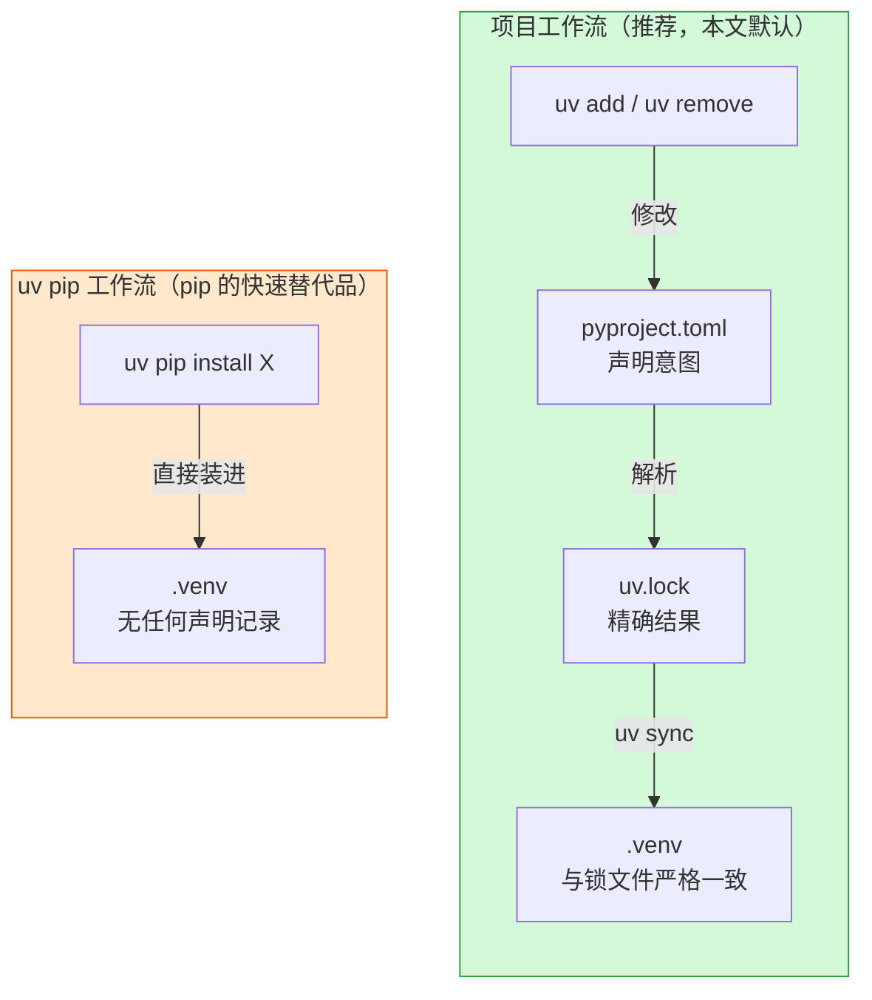

| | 项目工作流 | `uv pip` 工作流 |
| --- | --- | --- |
| 代表命令 | `uv add` / `uv sync` / `uv run` | `uv pip install` / `uv pip compile` |
| 会不会改 `pyproject.toml` | **会** | **不会** |
| 会不会更新 `uv.lock` | **会** | **不会** |
| 定位 | 管理「项目声明的依赖」 | 「更快的 pip」，管理临时装进环境的包 |
| 什么时候用 | **默认用这套** | 迁移过渡期、CI 里装一次性工具、不想引入 lock 的老仓库 |

**混用的后果**：你用 `uv pip install some-pkg` 装了个包，代码开始依赖它，但 `pyproject.toml` 里没有任何记录。同事 `uv sync` 之后代码跑不起来 —— 而且下一次你自己跑 `uv sync`，这个包**会被删掉**。原因见下一节。

> **规则：一个项目里只用一套。** 本文后续全部使用项目工作流。

## 4.3 uv sync 的精确语义

这一条值得单独拿出来 —— 以下为 uv 0.11.18 的官方说明原文：

> By default, an exact sync is performed: uv removes packages that are not declared as dependencies of the project. Use the `--inexact` flag to keep extraneous packages.

翻译过来：**`uv sync` 默认是「精确同步」，会删掉环境里一切没在项目里声明过的包。**

这是个特性不是 bug —— 它保证「环境状态 == 锁文件状态」，消除环境漂移。但如果你不知道这一点，就会出现「我手动装的东西怎么每次都消失」的困惑。

两个例外也要知道：

- 加 `--inexact` 可保留额外的包；
- 用了 `--no-build-isolation` 时，uv **不会**删除多余的包（避免误删构建依赖）。

| 你想做的事 | 正确命令 |
| --- | --- |
| 让环境严格匹配锁文件 | `uv sync`（默认） |
| 保留手动装的额外包 | `uv sync --inexact` |
| 让某个包成为项目的正式依赖 | `uv add <pkg>` —— 不要用 `uv pip install` |

## 4.4 日常任务对应命令

不做命令全集罗列（那是官方文档的事），只给任务到命令的映射：

```bash
# ---- 起步 ----
uv init --package navkit          # 新建项目骨架（--package 生成 src 布局）
uv python install 3.12            # 按需下载解释器，无需 pyenv
uv sync                           # 建 .venv + 按锁文件安装（默认含 dev 组）

# ---- 改依赖 ----
uv add "numpy>=1.24"              # 加运行时依赖，自动更新 pyproject + lock
uv add --group test pytest        # 加到 test 依赖组
uv add --optional torch "torch>=2.4"   # 加到可选功能 extras
uv remove numpy

# ---- 跑东西（不需要手动激活环境）----
uv run pytest                     # 在项目环境里执行
uv run python -m navkit.cli
uv run --group test pytest        # 临时带上某个依赖组

# ---- 升级 ----
uv lock --upgrade-package numpy   # 只升一个包（日常首选）
uv lock --upgrade                 # 全部升到允许范围内最新（谨慎）

# ---- CI 与部署 ----
uv sync --locked                  # 断言锁文件是最新的，过期直接报错（CI 首选）
uv sync --frozen                  # 直接以锁文件为准，不检查是否与 pyproject 一致
uv sync --no-dev                  # 生产环境，不装开发依赖

# ---- 与项目无关的工具 ----
uv tool install ruff              # 全局安装命令行工具
uvx ruff check .                  # 临时跑一次，不留痕迹
```

**`--locked` 与 `--frozen` 的区别必须分清**，它们不是同义词（以下为 uv 0.11.18 的官方说明）：

| 参数 | 语义 | 用在哪 |
| --- | --- | --- |
| `--locked` | **断言锁文件已是最新**。若锁文件缺失或需要更新，直接报错退出 | **CI 首选** —— 能抓出「改了 `pyproject` 却忘了重新锁」 |
| `--frozen` | 不检查锁文件是否与 `pyproject` 一致，**直接以锁文件为准**安装 | 部署镜像、离线环境 |

不加任何参数时，uv 发现两者不一致会**自动重新解析** —— 于是 CI 悄悄测了一份和你本地不同的依赖。所以 CI 里请用 `--locked`：它把「依赖声明漂移」变成一次显式的构建失败，而不是一个无人察觉的差异。

## 4.5 四种依赖的区别

把所有东西塞进一个 `dependencies` 列表，是研究代码的通病。结果是：用户为了跑推理，被迫装上 pytest、ruff 和一整套文档工具。

`navkit` 的分法：

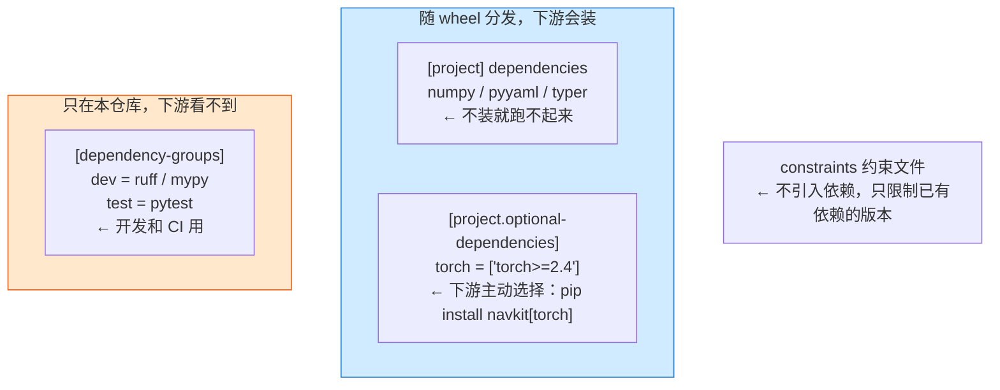

| 类别 | 写在哪 | 下游可见 | 判断标准 |
| --- | --- | --- | --- |
| 运行时依赖 | `[project] dependencies` | ✅ | 不装它，核心功能就挂 |
| 可选功能 | `[project.optional-dependencies]` | ✅ | 只有部分用户需要（GPU、可视化） |
| 开发依赖 | `[dependency-groups]` | ❌ | 只有开发者和 CI 需要 |
| 约束文件 | `constraints.txt` | ❌ | 不新增依赖，只对已有依赖设版本上下限 |

**extras 和 dependency-groups 的区别，一句话讲清**：extras 是**给用户的开关**（`pip install navkit[torch]`），dependency-groups 是**给开发者的工具箱**（下游根本安装不到）。ruff 放进 extras 是错的，torch 放进 dependency-groups 也是错的。

## 4.6 锁文件：能保证什么，不能保证什么

「有锁文件就能复现」是个过于乐观的说法。锁文件的保证是**分维度的**，笼统地给一个「可复现等级」反而会误导：

| 维度 | `requirements.txt`（手写） | `pip-tools` 编译产物 | `poetry.lock` | `uv.lock` |
| --- | --- | --- | --- | --- |
| 记录直接依赖的精确版本 | 视你怎么写 | ✅ | ✅ | ✅ |
| 记录**传递依赖**的精确版本 | ❌ 常见遗漏 | ✅ | ✅ | ✅ |
| 记录哈希值（防篡改） | 需手工加 | 可选 `--generate-hashes` | ✅ | ✅ |
| **跨平台通用** | ❌ | ❌ 每平台一份 | ✅ | ✅ |
| 跨 Python 版本通用 | ❌ | ❌ | 部分 | ✅ |
| 记录依赖来自哪个索引 | ❌ | 部分 | ✅ | ✅ |

**而无论用哪种锁文件，下面这些都锁不住**——这是最需要写进团队文档的一段：

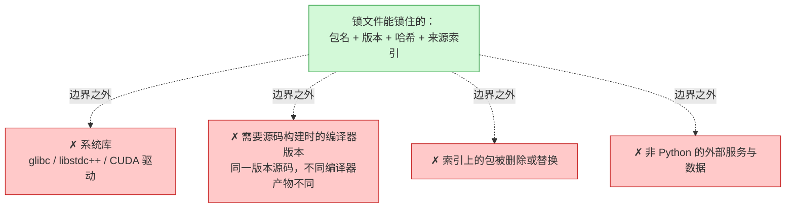

具体到 `uv.lock`，还有三条使用条件：

1. **锁文件受 `requires-python` 约束。** 如果锁是在 `>=3.12` 下解析的，拿到 Python 3.10 的机器上是装不了的。
2. **锁文件里的平台分支取决于解析时的假设。** 某个包在 aarch64 上没有 wheel，锁文件不会替你变出来 —— 到了那台机器只能走源码构建，或者直接失败。
3. **`uv.lock` 是 uv 专有格式**，不要手工编辑，也不要指望别的工具能读（除非导出，见下节）。

## 4.7 PEP 751：正在成形的通用锁文件

各家锁文件互不兼容的局面，[PEP 751](https://peps.python.org/pep-0751/) 正在收拾 —— 它定义了一个工具中立的 `pylock.toml` 格式，目前已被接受。

截至 2026 年中的落地进度：

| 工具 | 生成 | 安装 |
| --- | --- | --- |
| uv | ✅ `uv export --format pylock.toml` | ✅ 可通过 `uv pip install` 安装 |
| pip | ⚠️ `pip lock`（25.1 起，实验性） | ⚠️ `pip install -r pylock.toml`（26.1 起，实验性） |
| PDM | ✅ | ✅ |

**现在该怎么用？** 建议保守：

- **`uv.lock` 继续作为主锁文件**（跨平台能力更强，是 uv 的一等公民）；
- 需要把依赖交给不用 uv 的下游（审计、SBOM、别的构建系统）时，用 `uv export` 导出 `pylock.toml` 或 `requirements.txt`；
- **不要现在就把 `pylock.toml` 当作唯一事实源** —— pip 侧两端都还是实验状态，且已知暂不支持 extras 与 dependency groups。

## 4.8 uv 为什么快

uv 的速度提升是真实的，但把它归因成一句「Rust 写的」会错过重点。实际上四个阶段各有优化，且**收益分布很不均匀**：

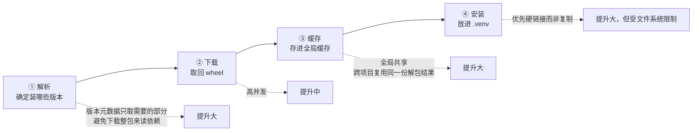

需要注意的边界：

- **第 4 步的链接方式受平台和文件系统制约。** 硬链接要求缓存目录与 `.venv` 在同一个文件系统上。跨盘、跨 Docker 层、跨 WSL 边界时会退化为复制，速度优势大幅缩水。这也是「为什么我的 uv 在 Docker 里没那么快」的常见答案 —— 解法见 §7.5。
- **第 1 步在遇到没有 wheel、必须源码构建的包时会失去优势**，因为要真的去执行构建。
- 具体实现细节随版本演进，**以你实际使用的版本行为为准**（本文基准 uv 0.11.x）。

## 4.9 从旧项目迁移

大多数读者不是从空目录开始的，而是手上有一个混装了 conda、pip、`sys.path` hack 的仓库。**迁移的第一步不是换命令，而是先弄清现状。**

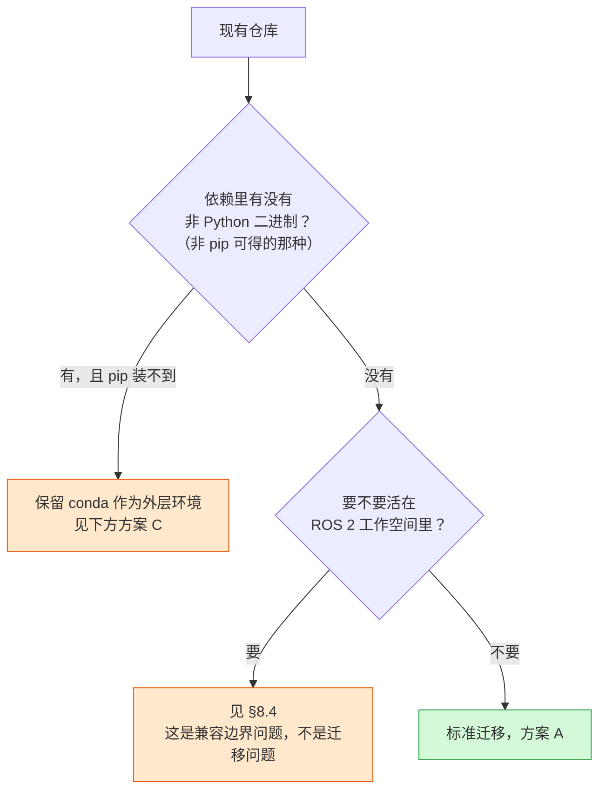

**方案 A：标准迁移**（纯 Python 依赖）

```bash
# 1. 先把现状固化下来，作为回退基准
python -m pip freeze > /tmp/before.txt

# 2. 生成项目骨架（不要覆盖已有文件）
uv init --package --no-workspace

# 3. 把直接依赖搬进 pyproject —— 注意是「直接依赖」，不是 freeze 的全部输出
uv add numpy pyyaml typer
uv add --group test pytest

# 4. 解析并建环境
uv sync

# 5. 对照验证
uv run python -m pip freeze > /tmp/after.txt
diff /tmp/before.txt /tmp/after.txt
```

**第 3 步是关键，也是最常做错的地方。** 不要把 `pip freeze` 的输出整个塞进 `dependencies` —— 那里面混着传递依赖。你应该只声明**你的代码真正 import 的那些包**，传递依赖交给解析器。分不清的话，`uv pip compile` 或 `pipdeptree` 可以帮你看清依赖树。

**方案 B：只想要更快的 pip**（不引入锁文件，过渡期用）

```bash
uv venv
uv pip install -r requirements.txt     # 语义与 pip 一致，只是快很多
```

零迁移成本，随时可回退。但它不解决可复现性，**只是过渡态**。

**方案 C：保留 conda 作为外层**

conda 负责非 Python 二进制，uv 或 pip 负责 Python 包，见下一节。

## 4.10 conda 还有没有位置

有。但理由需要说准确 —— 「conda 在某些依赖上不可替代」这个说法**过于绝对**，而且经常被用错例子。

更准确的表述是：

> **conda 的价值在于统一管理 Python 与非 Python 的二进制依赖。** 它尤其适合已有 conda 环境的团队，以及依赖其二进制生态（conda-forge）的项目。是否采用，取决于所需依赖在 PyPI 上的可用性、目标平台，以及团队既有流程。

几个常被误举的例子，值得逐个厘清：

| 依赖 | 常见说法 | 实际情况 |
| --- | --- | --- |
| PyTorch 所需的 CUDA 运行时 | 「必须 conda 装 cudatoolkit」 | **不必**。PyTorch 的 CUDA wheel 已把所需运行时打包成 `nvidia-*` 依赖，pip/uv 直接可得（§8.2） |
| Open3D | 「只能 conda」 | PyPI 上有官方 wheel |
| PCL | 「只能 conda」 | 它本质是 C++ 库，Python 绑定的分发情况因平台而异，需要按平台实测 |
| 完整 CUDA Toolkit（含 `nvcc`） | 「conda 能装」 | conda-forge 确实提供，但**若只是运行预编译包则根本不需要它**（§8.3） |

**判断流程**，按顺序问自己三个问题：

1. 我需要的东西，PyPI 上有没有可用的 wheel？→ 有，就不需要 conda。
2. 需要的非 Python 二进制，能不能交给容器镜像或系统包管理器？→ 能，优先用它们（边界更清晰）。
3. 团队已经在用 conda 了吗？→ 是，那么**迁移成本本身就是一个正当的保留理由**。

**如果确实要混用**，只有一条规则值得记住：

> **conda 负责外层环境（解释器 + 非 Python 二进制），pip/uv 负责 Python 包，且两者不要管同一个包。**

```bash
conda create -n navkit python=3.12 <某个只有 conda 有的二进制包>
conda activate navkit
uv pip install -e .        # 注意：用 uv pip 工作流，不是 uv sync
```

这里**必须用 `uv pip`** —— `uv sync` 会去创建并接管自己的 `.venv`，那就绕开了你刚建的 conda 环境。这正是 §4.2 里「两套工作流」区分的实际意义。

反过来的做法（先 pip 装，再 conda 装同一个包）会导致两套元数据互相覆盖，环境进入无法修复的状态。**遇到这种环境，重建比修复快。**

---

# 五、质量与测试：从本地检查到 CI 的同一条流程

这一章的核心主张是：**本地和 CI 必须跑完全相同的检查**。任何「CI 上多跑了一项」或「本地用了不同配置」的设计，最终都会演变成「本地过了 CI 挂」的日常内耗。

实现方式是把检查定义在 `pyproject.toml` 与 `.pre-commit-config.yaml` 里，本地和 CI 都去调它们：

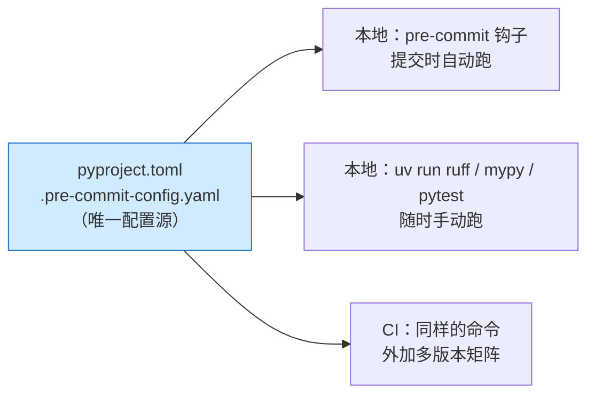

## 5.1 Ruff：检查与格式化

Ruff 用 Rust 实现，速度比传统工具快一到两个数量级，并且**一个工具同时做 lint 和格式化**，这让「格式化器和检查器互相打架」的经典问题消失了。

**关于「Ruff 取代 flake8 + isort + black」这个说法，需要说准确**：Ruff 覆盖了这些工具的绝大多数常用规则与格式化行为，但不是逐位等价的替换 ——

- 部分 flake8 插件的规则尚无对应实现；
- 格式化结果与 black 在少数边缘情况下有差异；
- 迁移一个有大量 `# noqa` 的老仓库时，需要核对规则编号的对应关系。

**对新项目，直接用 Ruff，没有任何理由犹豫。** 对老项目，先跑一遍看 diff 规模再决定。

```toml
# 适用：Ruff 0.6+ · 追加到 pyproject.toml
[tool.ruff]
line-length = 100
src = ["src", "tests"]        # 让 isort 规则能正确区分第一方/第三方包

[tool.ruff.lint]
select = [
    "E", "W",    # pycodestyle
    "F",         # pyflakes：未使用导入、未定义名字
    "I",         # isort：导入排序
    "UP",        # pyupgrade：用上新语法
    "B",         # flake8-bugbear：常见陷阱（可变默认参数等）
    "SIM",       # flake8-simplify
    "PTH",       # 建议用 pathlib 取代 os.path
    "RUF",       # Ruff 自有规则
]
ignore = ["E501"]             # 行长交给 formatter 管，不重复报

[tool.ruff.lint.per-file-ignores]
"tests/*" = ["S101"]          # 测试里允许用 assert
```

日常使用：

```bash
uv run ruff check --fix .     # 检查并自动修复
uv run ruff format .          # 格式化
```

> **`B` 这组规则对研究代码价值最高**。它能抓出可变默认参数（`def f(x=[])`）、循环里的闭包捕获等 —— 这些是数值代码里最阴险的一类 bug，不会报错，只会让结果悄悄不对。

## 5.2 渐进式类型化

**不要试图一次性给整个仓库加类型标注。** 那是一场必输的战役 —— 成本集中在前期，收益却要很久才显现，通常在完成度 30% 的时候就被放弃了。

正确的策略是分层设防：

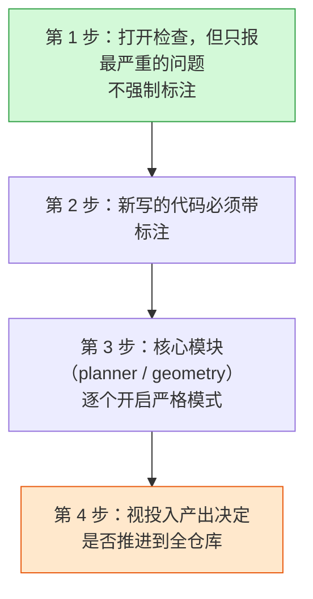

```toml
# 适用：mypy 1.11+
[tool.mypy]
python_version = "3.12"
files = ["src", "tests"]
# 第 1 步：温和起步
warn_unused_ignores = true
warn_redundant_casts = true
warn_return_any = true
ignore_missing_imports = true      # 第三方包没类型标注时不报错

# 第 3 步：对已经整理好的模块单独收紧
[[tool.mypy.overrides]]
module = ["navkit.planner", "navkit.geometry"]
disallow_untyped_defs = true
strict_equality = true
```

**mypy 还是 pyright？** 简单说：

| | mypy | pyright / Pylance |
| --- | --- | --- |
| 定位 | 参考实现，规则最贴近 PEP | 速度快，VS Code 内置体验好 |
| 建议 | **CI 里用它**（结果稳定、可复现） | **编辑器里用它**（实时反馈） |

两者同时用是常见且合理的组合：编辑器里 pyright 给你即时提示，CI 里 mypy 做最终把关。

> 对数值代码有个现实的提醒：`numpy` 与 `torch` 的类型标注覆盖有限，张量形状更是类型系统管不了的东西。**类型检查在这类代码里的收益，主要来自函数边界（输入输出是什么类型的对象），而不是数组内部。** 别期望它能帮你抓形状不匹配。

## 5.3 pre-commit：把检查前移到提交时

```yaml
# .pre-commit-config.yaml
repos:
  - repo: https://github.com/pre-commit/pre-commit-hooks
    rev: v4.6.0
    hooks:
      - id: trailing-whitespace
      - id: end-of-file-fixer
      - id: check-yaml
      - id: check-added-large-files       # 防止误提交模型权重
        args: ["--maxkb=1024"]
      - id: check-merge-conflict

  - repo: https://github.com/astral-sh/ruff-pre-commit
    rev: v0.6.9
    hooks:
      - id: ruff
        args: ["--fix"]
      - id: ruff-format

  - repo: https://github.com/astral-sh/uv-pre-commit
    rev: 0.4.20
    hooks:
      - id: uv-lock                        # pyproject 改了就自动更新锁文件
```

```bash
uv run pre-commit install        # 装钩子，只需一次
uv run pre-commit run --all-files   # 首次全量跑一遍
```

> **`check-added-large-files` 对这个领域特别有用。** 一旦 `.ckpt` 被提交进 Git 历史，仓库体积就永久性地上去了 —— 后续清理需要重写历史，代价极高。这个钩子是少数「装上就再也不用想」的收益。

## 5.4 pytest：三个真正重要的机制

pytest 功能很多，但对研究项目来说，**掌握下面三件事就够覆盖九成场景**。

### 配置与导入模式

```toml
# 适用：pytest 8.0+
[tool.pytest.ini_options]
testpaths = ["tests"]
addopts = "-ra --strict-markers --import-mode=importlib"
markers = [
    "slow: 耗时较长的测试",
    "gpu: 需要 CUDA 设备",
]
```

`--import-mode=importlib` 值得专门说 —— 它让 pytest 用标准导入机制找测试模块，**不再往 `sys.path` 里插入路径**。配合 src 布局，这就保证了「测试导入的是已安装的包」。这是 §3.2 那个问题在测试侧的解法。

`--strict-markers` 则让拼错的标记直接报错，而不是静默地当成未知标记忽略掉。

### fixture 的作用域

fixture 是 pytest 的核心抽象：**声明测试需要什么，而不是在测试里手工搭建**。作用域决定了它多久重建一次：

| 作用域 | 重建频率 | 典型用途 |
| --- | --- | --- |
| `function`（默认） | 每个测试函数 | 临时目录、可变的测试数据 |
| `module` | 每个测试文件 | 小型只读数据集 |
| `session` | 整轮测试一次 | **加载模型权重、启动仿真器** |

```python
# tests/conftest.py —— 这个文件里的 fixture 对同目录及子目录所有测试可见
import pytest
import numpy as np
from navkit.planner import Planner

@pytest.fixture(scope="session")
def heavy_model():
    """整轮测试只加载一次 —— 对 AI 项目这个作用域很关键。"""
    return load_pretrained("checkpoints/policy.pt")

@pytest.fixture
def planner() -> Planner:
    """每个测试拿到全新实例，互不污染。"""
    return Planner(waypoints=np.zeros((4, 2)))

@pytest.fixture
def tmp_config(tmp_path):
    """tmp_path 是 pytest 内置 fixture，自动创建并清理临时目录。"""
    cfg = tmp_path / "config.yaml"
    cfg.write_text("max_speed: 1.5\n", encoding="utf-8")
    return cfg
```

> **`conftest.py` 是分层的**：`tests/conftest.py` 的 fixture 对所有测试可见，`tests/gpu/conftest.py` 的只对该子目录可见。用这个特性把 GPU 相关的 fixture 隔离在 `tests/gpu/` 里，普通测试完全不受影响。

### 参数化

```python
import pytest
from navkit.geometry import normalize_angle

@pytest.mark.parametrize(
    "raw, expected",
    [
        (0.0, 0.0),
        (3.5 * 3.14159, -0.5 * 3.14159),
        (-3.5 * 3.14159, 0.5 * 3.14159),
    ],
)
def test_normalize_angle(raw, expected):
    assert normalize_angle(raw) == pytest.approx(expected, abs=1e-5)
```

**对浮点结果一律用 `pytest.approx`**，不要用 `==`。这在数值代码里不是风格问题，是正确性问题。

## 5.5 测试分层：让大部分验证不需要 GPU

研究项目的测试常常因为「需要 GPU / 需要数据集 / 需要仿真器」而整体无法在 CI 上跑，最后退化成没人跑。

**解法是分层**，让昂贵的部分可以被单独跳过：

```python
# tests/gpu/conftest.py
import pytest

def pytest_collection_modifyitems(config, items):
    """没有可用 CUDA 时，自动跳过本目录下所有测试。"""
    try:
        import torch
        has_cuda = torch.cuda.is_available()
    except ImportError:
        has_cuda = False
    if has_cuda:
        return
    skip = pytest.mark.skip(reason="需要 CUDA 设备")
    for item in items:
        item.add_marker(skip)
```

于是形成三层：

| 层次 | 命令 | 跑在哪 | 耗时目标 |
| --- | --- | --- | --- |
| 快速单元测试 | `uv run pytest -m "not slow and not gpu"` | 每次提交、CI 全矩阵 | < 30 秒 |
| 完整 CPU 测试 | `uv run pytest -m "not gpu"` | PR 合并前 | 几分钟 |
| GPU 集成测试 | `uv run pytest tests/gpu` | 有 GPU 的机器 / 夜间任务 | 不设限 |

**关键收益**：CI 上没有 GPU 也能跑掉九成验证，而不是因为一个 `import torch` 失败就整体红掉。

## 5.6 覆盖率与多版本矩阵

```toml
[tool.coverage.run]
source = ["src/navkit"]
branch = true

[tool.coverage.report]
exclude_lines = [
    "pragma: no cover",
    "if TYPE_CHECKING:",          # 这个分支运行时永远不执行
    "raise NotImplementedError",
]
```

```bash
uv run pytest --cov --cov-report=term-missing
```

> **不要把覆盖率当 KPI。** 它只能告诉你哪些代码**从没被执行过** —— 那是有价值的信息；它说明不了被执行到的代码是否被真正验证过。把精力放在 `--cov-report=term-missing` 列出的未覆盖行上，比盯着百分比有用得多。

**多 Python 版本测试**曾经是 tox / nox 的地盘。有了 uv 之后，本地做矩阵测试变得很简单：

```bash
for v in 3.12 3.13 3.14; do
  uv run --python $v --isolated pytest -m "not gpu"
done
```

`--isolated` 让每个版本用独立环境，互不干扰。真正的矩阵测试仍然交给 CI（§7.6），本地这个循环用来在推送前快速自查。

---

# 六、配置、日志与命令行

研究代码里，这三件事通常是这样的：配置靠改源码里的常量，日志靠 `print`，命令行靠 `sys.argv[1]`。三者都能跑，也都在项目长大时同时崩掉。

## 6.1 配置：先确定优先级链

在选工具之前，先确定一件事：**同一个参数在多个地方出现时，谁说了算**。这个顺序应当是固定且公开的：


**越靠近使用现场的，优先级越高。** 这个顺序不是随便定的 —— 它保证了「临时改一个参数跑一次实验」永远不需要去改文件。

用 `pydantic-settings` 实现，它自带环境变量读取与类型校验：

```python
# src/navkit/config.py
from pathlib import Path
from pydantic import Field
from pydantic_settings import BaseSettings, SettingsConfigDict

class NavConfig(BaseSettings):
    model_config = SettingsConfigDict(
        env_prefix="NAVKIT_",      # NAVKIT_MAX_SPEED=2.0 会自动覆盖 max_speed
        env_file=".env",
        extra="forbid",            # 拼错的字段直接报错，不静默忽略
    )

    max_speed: float = Field(default=1.0, gt=0, description="最大速度 m/s")
    goal_tolerance: float = Field(default=0.25, gt=0)
    output_dir: Path = Field(default=Path("outputs"))
```

> **`extra="forbid"` 是这段配置里最有价值的一行。** 没有它，`NAVKIT_MAXSPEED`（少了下划线）会被静默忽略，你会花半小时怀疑代码有问题。有了它，程序启动时立刻报错。

**pydantic-settings 还是 Hydra？**

| | pydantic-settings | Hydra / OmegaConf |
| --- | --- | --- |
| 强项 | 类型校验、环境变量、IDE 补全 | 配置组合、多组实验扫描（multirun） |
| 适合 | **应用与库的常规配置** | **大规模实验管理** |
| 代价 | 不擅长配置组合 | 学习曲线陡，`sys.argv` 被接管，调试稍麻烦 |

**判断标准很简单**：你是否需要「一条命令跑 20 组超参组合」？需要就上 Hydra，不需要就用 pydantic-settings。`navkit` 属于后者。

**路径处理**再强调一次 §3.7 的区分：

```python
# 包内默认值 —— 用 importlib.resources，与工作目录无关
from importlib.resources import files
defaults = yaml.safe_load(files("navkit.data").joinpath("default_params.yaml").read_text())

# 用户配置 —— 由用户传入路径，代码不做任何假设
def load_user_config(path: Path | None) -> dict:
    if path is None:
        return {}
    return yaml.safe_load(path.read_text(encoding="utf-8"))
```

## 6.2 日志：为什么不能用 print

`print` 的问题不是「不够专业」，而是三件具体的事做不到：

1. **分不了级别** —— 调试信息和错误混在一起，生产环境没法只看重要的；
2. **关不掉** —— 库里的 `print` 会污染调用方的输出，而调用方无权干预；
3. **带不上上下文** —— 没有时间戳、模块名、行号，出问题无从定位。

**库和应用的日志职责完全不同**，这是最容易搞错的一点：

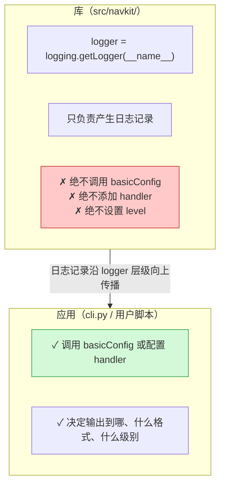

原因是**传播机制**：`navkit.planner` 这个 logger 产生的记录，会自动向上传给 `navkit`，再传给根 logger。**配置只在根部做一次，全局生效。** 如果库自己也配了 handler，调用方就会看到重复输出，且无法关闭。

```python
# src/navkit/planner.py —— 库的正确写法
import logging

logger = logging.getLogger(__name__)      # 名字自动是 "navkit.planner"

def plan(waypoints):
    logger.debug("开始规划，航点数 %d", len(waypoints))   # 注意用 %s 惰性格式化
    if len(waypoints) < 2:
        logger.warning("航点不足 2 个，无法规划")
        return None
    ...
```

```python
# src/navkit/cli.py —— 应用的正确写法
import logging

def setup_logging(verbose: bool) -> None:
    logging.basicConfig(
        level=logging.DEBUG if verbose else logging.INFO,
        format="%(asctime)s | %(levelname)-8s | %(name)s:%(lineno)d | %(message)s",
    )
    logging.getLogger("matplotlib").setLevel(logging.WARNING)   # 压掉吵闹的第三方库
```

> **用 `logger.debug("x = %s", x)` 而不是 `logger.debug(f"x = {x}")`。** 前者只在该级别真的被输出时才格式化字符串。在训练循环里每步都打日志时，这个差别是可测量的。

## 6.3 命令行：typer

```python
# src/navkit/cli.py
from pathlib import Path
from typing import Annotated
import typer
from navkit.config import NavConfig
from navkit.planner import Planner

app = typer.Typer(help="Waypoint navigation toolkit")

@app.command()
def plan(
    waypoints: Annotated[Path, typer.Argument(help="航点文件路径")],
    max_speed: Annotated[float | None, typer.Option(help="覆盖配置中的最大速度")] = None,
    verbose: Annotated[bool, typer.Option("--verbose", "-v")] = False,
) -> None:
    """根据航点文件规划一条轨迹。"""
    setup_logging(verbose)
    cfg = NavConfig()
    if max_speed is not None:          # 命令行优先级最高，见 §6.1
        cfg.max_speed = max_speed
    Planner.from_file(waypoints, cfg).run()

if __name__ == "__main__":
    app()
```

配合 §3.4 里的 `[project.scripts]`，安装后就有了 `navkit plan ...` 这个命令。

| 工具 | 什么时候用 |
| --- | --- |
| `argparse`（标准库） | 不想引入依赖，或只有一两个参数 |
| **`typer`** | **默认选择** —— 从类型标注自动生成参数解析与帮助文本 |
| `click` | typer 的底层；需要精细控制时直接用它 |

> **入口点函数要薄。** `cli.py` 只做「解析参数 → 组装配置 → 调用核心逻辑」。真正的算法留在 `planner.py` 里，这样它既能被命令行调用，也能被别的 Python 代码导入 —— 这正是 §3.1 里「同时是库和应用」的实现方式。

---

# 七、构建、交付与 CI

## 7.1 两种产物：wheel 与 sdist

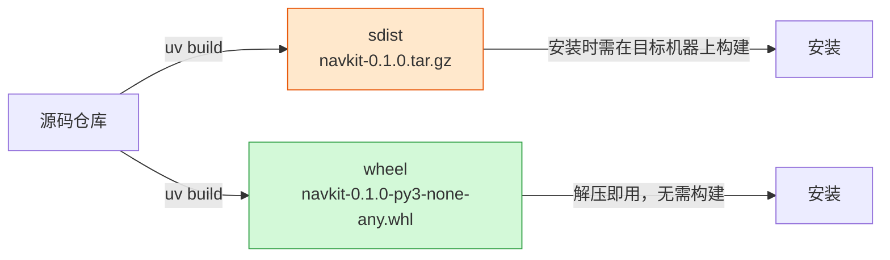

| | sdist（源码分发） | wheel（二进制分发） |
| --- | --- | --- |
| 本质 | 打包后的源码 | 预构建好的安装产物 |
| 安装时 | **需要在目标机器上执行构建** | 解压即可 |
| 带原生扩展时 | 目标机器必须有编译器和头文件 | 无需编译环境 |
| 作用 | 保底、可审计、支持冷门平台 | 日常安装的实际来源 |

**两个都要发布。** wheel 覆盖常见平台，sdist 保证冷门平台（或需要自行编译的用户）还有路可走。

## 7.2 文件名里的三段 tag

`navkit-0.1.0-py3-none-any.whl` 这个文件名不是随便起的，末尾三段是**机器可读的兼容性声明**：

```
navkit - 0.1.0 - py3      - none     - any
  包名   版本    Python tag  ABI tag   平台 tag
```

三段各自约束一个维度，**不要混为一谈**：

| 段 | 回答什么问题 | 取值举例 |
| --- | --- | --- |
| **Python tag** | 需要哪种/哪版解释器 | `py3`（任意 Python 3）、`cp312`（CPython 3.12） |
| **ABI tag** | 对解释器二进制接口的要求 | `none`（无原生扩展）、`cp312`（绑定该版 ABI）、`abi3`（稳定 ABI） |
| **平台 tag** | 操作系统与 CPU 架构 | `any`、`manylinux_2_28_x86_64`、`win_amd64`、`macosx_11_0_arm64` |

纯 Python 包是 `py3-none-any` —— 三个维度都不挑，一份产物走天下。带原生扩展的包则会是 `cp312-cp312-manylinux_2_28_x86_64` 这种，需要为每个「Python 版本 × 平台」组合各出一份。

**两个高频误解，必须澄清：**

> **误解一：`manylinux` = 「所有 Linux 通用」。**
> 不是。`manylinux_2_28` 的含义是「**要求 glibc ≥ 2.28**」，它是一条有明确数值的下界。老于这个版本的系统装不上；使用 musl 的 Alpine 更是完全另一套（对应 `musllinux`）。这正是「Alpine 镜像里 pip 装什么都要现场编译」的原因。
>
> **而且：`manylinux` 只约束 C 运行时，不承诺任何 GPU 驱动兼容性。** 一个 manylinux wheel 里的 CUDA 代码能不能跑，取决于目标机器的驱动版本（§8.1），与这个 tag 无关。

> **误解二：`abi3` = 「所有 Python 通用」。**
> 不是。`abi3` 表示该扩展只用了 CPython 的**稳定 ABI 子集**，因而可以在**声明的最低版本及以上**的 CPython 上运行。它仍然绑定 CPython（PyPy 不适用），且有下界。

## 7.3 构建并在干净环境里验证

这一步是 §3.6 留下的那个作业 —— **可编辑安装验证不了打包正确性，只有这步能。**

```bash
# 1. 构建两种产物
uv build                      # 产物落在 dist/

# 2. 在一个全新的、隔离的环境里安装 wheel
uv venv /tmp/verify --python 3.12
uv pip install --python /tmp/verify dist/navkit-0.1.0-py3-none-any.whl

# 3. 关键验证：从「不是仓库目录」的地方导入
cd /tmp
/tmp/verify/bin/python -c "import navkit; print(navkit.__file__)"
/tmp/verify/bin/python -c "from navkit.config import load_default_params; print(load_default_params())"
/tmp/verify/bin/navkit --help
```

**第 3 步的 `cd /tmp` 不能省。** 留在仓库根目录验证的话，§2.2 那个「当前目录进 `sys.path`」的机制会让你误以为一切正常。

这一步能抓出的典型问题：

- 包数据文件（`default_params.yaml`）没被打进 wheel；
- `py.typed` 漏了；
- `[project.scripts]` 入口点写错，命令生成不出来；
- 某个子包缺 `__init__.py`，没被后端识别为包。

> 想更严格的话，`twine check dist/*` 可以校验元数据格式是否符合 PyPI 要求 —— 在真的上传之前跑一次，比上传失败后再改版本号省事。

## 7.4 发布：优先用可信发布

传统做法是生成一个 PyPI API token，存进 CI secrets。**这个方案的问题是 token 长期有效**：一旦泄露，在你手工吊销之前一直可用。

**可信发布（Trusted Publishing）** 换了个思路：在 PyPI 上登记「哪个 GitHub 仓库的哪个工作流有权发布 `navkit`」，发布时由 CI 提供一个短时效的身份凭证换取临时令牌。**仓库里不存任何长期密钥。**

要分清两件事（这里最容易混）：

| | 身份与权限 | 上传动作 |
| --- | --- | --- |
| 在哪配置 | **PyPI 项目设置页** + CI 工作流的 `permissions: id-token: write` | 工作流里的一条命令 |
| 谁决定能不能发 | PyPI 端的登记规则 | — |
| 常见误解 | 以为换个上传命令就算配好了 | `uv publish` 只是执行上传，它不负责建立信任关系 |

```yaml
# .github/workflows/release.yml
name: release
on:
  release:
    types: [published]

jobs:
  publish:
    runs-on: ubuntu-latest
    environment: pypi           # 可选，配合 environment 保护规则
    permissions:
      id-token: write           # 必需：允许工作流获取 OIDC 身份凭证
    steps:
      - uses: actions/checkout@v4
      - uses: astral-sh/setup-uv@v3
      - run: uv build
      - run: uv publish         # 无需 token，凭证由上面的 id-token 提供
```

> **先发到 TestPyPI 演练一次。** PyPI 上**同一个版本号只能上传一次**，删除后也不能重用。第一次发布时用 `0.1.0rc1` 这类预发布版本试水，比在正式版本号上翻车强。

## 7.5 Docker：让依赖层真正被缓存

朴素写法的问题是：`COPY . /app` 放在装依赖之前，于是**改一行代码就会让依赖层缓存全部失效**，每次构建都重装一遍 torch。

正确的做法是**把依赖安装和项目安装拆成两层**：

```dockerfile
# 适用：uv 0.11.x · 已提交 uv.lock · 需要 BuildKit（Docker 23+ 默认开启）
FROM python:3.12-slim-bookworm

# 从官方 distroless 镜像取 uv，钉死版本以保证可复现
COPY --from=ghcr.io/astral-sh/uv:0.11.18 /uv /uvx /bin/

# 缓存挂载与目标环境不在同一文件系统上，硬链接不可用 —— 显式改为复制，
# 否则每次构建都会刷一屏警告（原理见 §4.8）
ENV UV_LINK_MODE=copy \
    UV_COMPILE_BYTECODE=1

WORKDIR /app

# ---- 第 1 层：只装依赖 ----
# 用 bind 挂载而不是 COPY，避免这两个文件进入镜像层；
# --no-install-project 表示此时先不装 navkit 自身
RUN --mount=type=cache,target=/root/.cache/uv \
    --mount=type=bind,source=uv.lock,target=uv.lock \
    --mount=type=bind,source=pyproject.toml,target=pyproject.toml \
    uv sync --locked --no-install-project --no-dev

# ---- 第 2 层：装项目本身 ----
# 只有这一层会因源码改动而失效，上面的依赖层保持缓存
COPY . /app
RUN --mount=type=cache,target=/root/.cache/uv \
    uv sync --locked --no-dev

ENV PATH="/app/.venv/bin:$PATH"
ENTRYPOINT ["navkit"]
```

三个要点，每一个都对应一个真实的坑：

1. **`UV_LINK_MODE=copy`** —— 回应 §4.8 提到的「硬链接要求同一文件系统」。缓存挂载是独立的文件系统，不设这个变量会刷满警告。
2. **`--no-install-project`** —— 这是分层的关键。没有它，两层就没有区别，依赖缓存形同虚设。
3. **`--locked`** —— 与 CI 一致（§4.4）。锁文件过期时构建失败，而不是悄悄装一套别的版本。

> **缓存不等于正确。** 依赖层被缓存，只说明「`uv.lock` 和 `pyproject.toml` 没变」。它不验证环境是否正确 —— 那是 §7.3 那步干净安装验证的职责，两者不能互相替代。

## 7.6 GitHub Actions


```yaml
# .github/workflows/ci.yml
name: ci
on:
  push:
    branches: [main]
  pull_request:

jobs:
  lint:
    runs-on: ubuntu-latest
    steps:
      - uses: actions/checkout@v4
      - uses: astral-sh/setup-uv@v3
        with:
          enable-cache: true
      - run: uv sync --locked          # 锁文件过期即失败
      - run: uv run ruff check .
      - run: uv run ruff format --check .
      - run: uv run mypy

  test:
    runs-on: ${{ matrix.os }}
    strategy:
      fail-fast: false                 # 一个组合挂掉不影响其他组合继续跑
      matrix:
        os: [ubuntu-latest, windows-latest]
        python: ["3.12", "3.13", "3.14"]
    steps:
      - uses: actions/checkout@v4
      - uses: astral-sh/setup-uv@v3
        with:
          enable-cache: true
      - run: uv sync --locked --python ${{ matrix.python }}
      - run: uv run pytest -m "not gpu" --cov    # CI 无 GPU，见 §5.5

  build:
    runs-on: ubuntu-latest
    steps:
      - uses: actions/checkout@v4
      - uses: astral-sh/setup-uv@v3
      - run: uv build
      - run: uvx twine check dist/*
      - uses: actions/upload-artifact@v4
        with:
          name: dist
          path: dist/
```


几处刻意的设计：

- **`lint` 和 `test` 分开**，格式问题能在几秒内反馈，不必等完整矩阵跑完。
- **`fail-fast: false`** —— 默认值 `true` 会在第一个组合失败时掐掉其余任务，于是你只能看到「Windows 挂了」，却不知道 Linux 是不是也挂。对跨平台矩阵，这个默认值基本总是错的。
- **`-m "not gpu"`** —— GitHub 的标准 runner 没有 GPU。GPU 测试交给自托管 runner 或夜间任务。

## 7.7 版本号与依赖安全

**版本号**方面，按 §3.1 的分类采取不同策略：

| 项目类型 | 建议方案 |
| --- | --- |
| 可发布的库 | 严格[语义化版本](https://semver.org/lang/zh-CN/)，在 `pyproject.toml` 里手工维护 |
| 应用 / 服务 | 日期版本（`2026.9.1`）或直接用 Git 描述 |
| 实验仓库 | 不需要版本号，**用 commit hash 标识**（§8.6） |

想避免「改代码和改版本号两处同步」的麻烦，可以让版本号从 Git tag 派生：

```toml
[build-system]
requires = ["hatchling", "hatch-vcs"]
build-backend = "hatchling.build"

[project]
dynamic = ["version"]        # 声明 version 由后端动态提供

[tool.hatch.version]
source = "vcs"               # 从 git tag 读取
```

**依赖安全**方面，加一条例行检查：

```bash
uvx pip-audit                       # 对照已知漏洞库检查当前依赖
```

```yaml
  audit:
    runs-on: ubuntu-latest
    steps:
      - uses: actions/checkout@v4
      - uses: astral-sh/setup-uv@v3
      - run: uv sync --locked
      - run: uvx pip-audit
```

> 学术项目常觉得漏洞扫描无关紧要。但**一旦代码要部署到真实机器人或对外服务上，它就直接相关了** —— 而那通常是在项目后期才发现的。定期跑一次的成本接近于零。

---

# 八、AI 与机器人项目的特殊实践

前七章的内容适用于任何 Python 项目。这一章处理的是本领域独有的问题 —— 它们几乎全部发生在 §2.4 那张图**最底下那块橙色区域**：Python 工具管不到的系统与驱动层。

## 8.1 GPU 依赖栈：谁管哪一层

「`torch.cuda.is_available()` 返回 False」之所以难查，是因为 GPU 依赖是一个**四层结构**，而 pip/uv 只能碰其中一层：

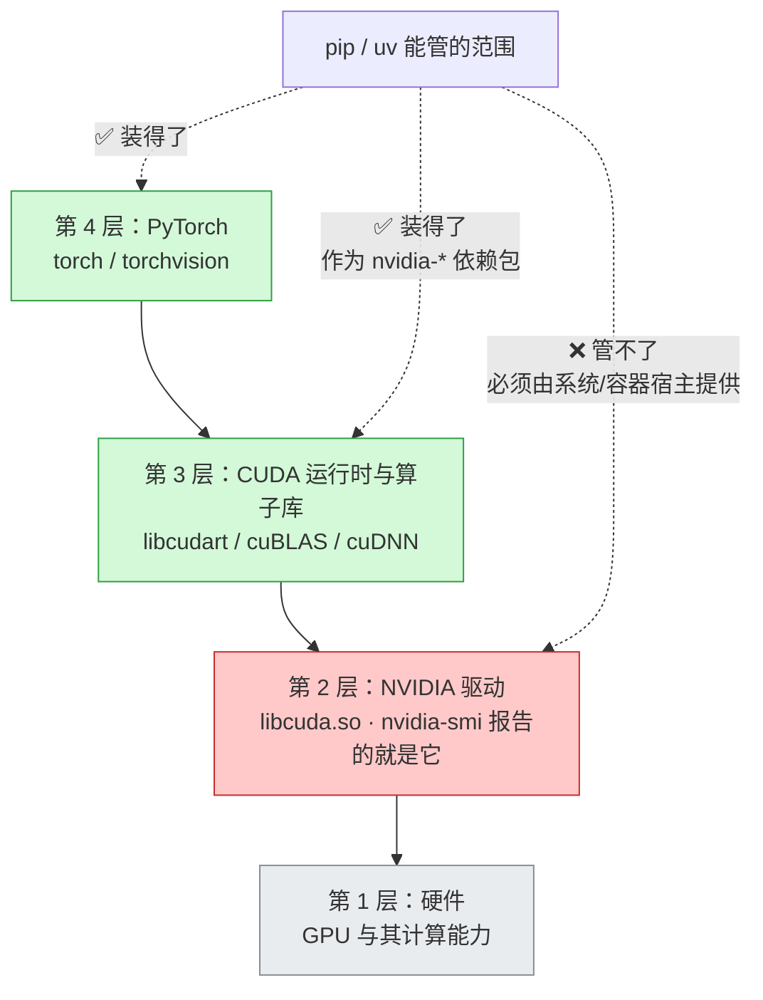

**这张图澄清了一个流传很广的误解。** 现代 PyTorch 的 CUDA wheel **已经把第 3 层打包进去了** —— 它们以 `nvidia-cuda-runtime-cu12`、`nvidia-cudnn-cu12` 等形式作为依赖自动安装。因此：

> **只是要运行 PyTorch 的话，不需要在系统里装 CUDA Toolkit，也不需要用 conda 装 `cudatoolkit`。** 你只需要一个足够新的**驱动**。

驱动向后兼容：**较新的驱动可以运行较旧的 CUDA 运行时**，反之不行。所以升级驱动通常安全，而「CUDA 版本不匹配」的报错，多数时候是驱动太旧。

**一个必须澄清的读数问题：**

```bash
nvidia-smi        # 右上角显示 "CUDA Version: 12.6"
nvcc --version    # 可能显示 12.1，也可能命令根本不存在
```

这两个数字**含义完全不同，不一致是正常的**：

| 命令 | 报告的是什么 |
| --- | --- |
| `nvidia-smi` 的 `CUDA Version` | **驱动所能支持的最高 CUDA 运行时版本**，不是你装了什么 |
| `nvcc --version` | 系统里 CUDA Toolkit 的版本（**只在要编译时才需要**） |
| `torch.version.cuda` | **PyTorch 是针对哪个 CUDA 版本构建的** —— 排查时该看这个 |

排查三连：

```bash
uv run python -c "import torch; print(torch.__version__, torch.version.cuda, torch.cuda.is_available())"
nvidia-smi --query-gpu=driver_version --format=csv
```

如果 `torch.version.cuda` 输出 `None`，说明你装的是 **CPU 版** —— 这是最常见的情况，解法见下节。

## 8.2 用 uv 精确控制 torch 的来源

CPU 版和 CUDA 版的 torch **包名完全相同**，区别只在来源索引。如果不做任何配置，你拿到的是 PyPI 上的默认版本 —— 在 Linux 上通常是 CUDA 版，但在其他平台或某些版本组合下可能是 CPU 版，而且完全不受你控制。

**显式声明索引，把这件事变成确定的。** 以下 TOML 依据 uv 官方文档：

```toml
# 适用：uv 0.11.x · 目标 CUDA 13.0 · Linux 与 Windows 用 CUDA，macOS 回落到 PyPI
[project]
dependencies = ["torch>=2.11.0", "torchvision>=0.26.0"]

[[tool.uv.index]]
name = "pytorch-cu130"
url = "https://download.pytorch.org/whl/cu130"
explicit = true       # 关键：只有被显式指名的包才从这里取，其余照常走 PyPI

[tool.uv.sources]
torch = [
  { index = "pytorch-cu130", marker = "sys_platform == 'linux' or sys_platform == 'win32'" },
]
torchvision = [
  { index = "pytorch-cu130", marker = "sys_platform == 'linux' or sys_platform == 'win32'" },
]
```

**`explicit = true` 这一行不能省。** 没有它，uv 会把这个索引当作所有包的候选来源 —— PyTorch 的索引里有一批同名的镜像包，可能把你的 `numpy` 之类也从那里拉过来，导致解析结果莫名其妙。

常用索引 URL：

| 目标 | URL 后缀 |
| --- | --- |
| CUDA 11.8 | `/whl/cu118` |
| CUDA 12.6 | `/whl/cu126` |
| CUDA 12.8 | `/whl/cu128` |
| CUDA 13.0 | `/whl/cu130` |
| ROCm 7.2 | `/whl/rocm7.2` |
| CPU 版 | `/whl/cpu` |

**如果要让同一个仓库支持 CPU 和 GPU 两种安装**，用互斥 extras：

```toml
[project.optional-dependencies]
cpu  = ["torch>=2.11.0", "torchvision>=0.26.0"]
cu130 = ["torch>=2.11.0", "torchvision>=0.26.0"]

[tool.uv]
conflicts = [
  [{ extra = "cpu" }, { extra = "cu130" }],   # 声明两者互斥，禁止同时安装
]
```

```bash
uv sync --extra cpu      # 笔记本、CI
uv sync --extra cu130    # 训练服务器
```

> **改完索引配置后，记得重新解析。** 索引变更不一定会自动触发锁文件更新 —— 必要时删掉 `uv.lock` 再 `uv sync`。这是配置改了却「装的还是老东西」的常见原因。

## 8.3 运行预编译包 vs 编译自定义 CUDA 扩展

这是两个**完全不同的场景**，需求差别很大，混为一谈会导致大量无用功（比如为了跑推理而折腾装 CUDA Toolkit）：

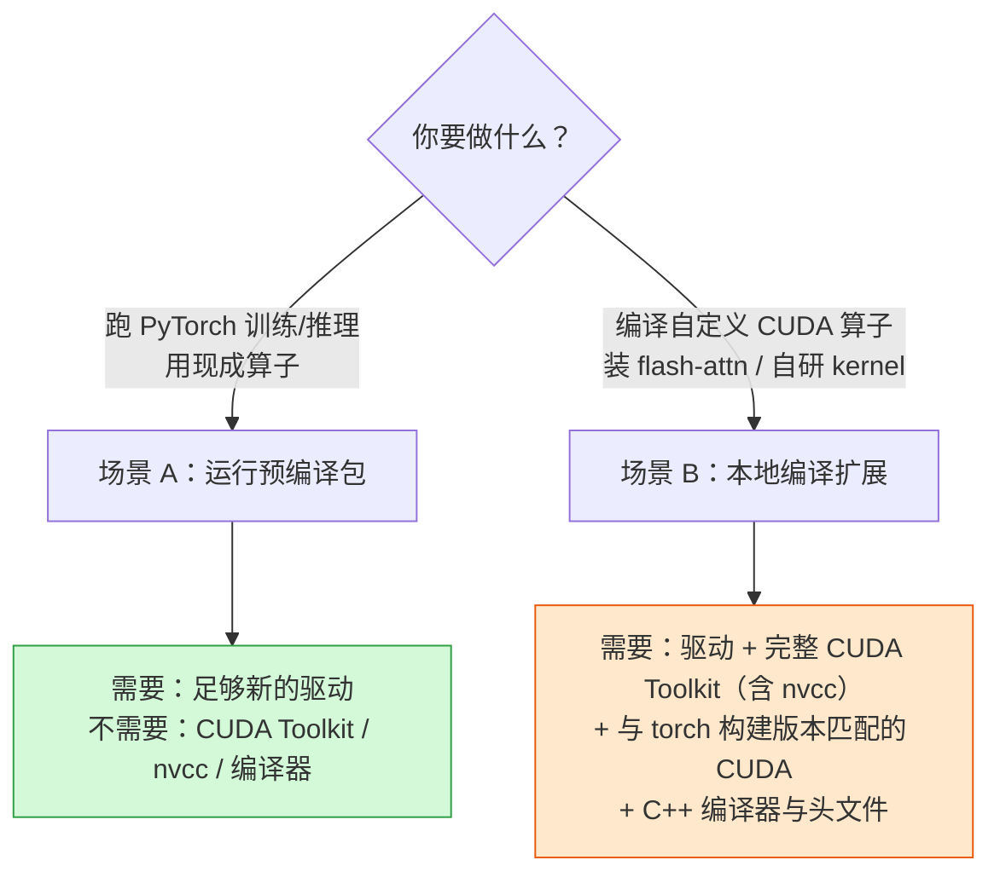

| | 场景 A：运行预编译包 | 场景 B：本地编译扩展 |
| --- | --- | --- |
| 典型操作 | `uv sync` 后直接训练 | `pip install flash-attn --no-build-isolation` |
| 需要 `nvcc` | ❌ | ✅ |
| 需要系统 CUDA Toolkit | ❌ | ✅ |
| CUDA 版本要求 | 只需驱动够新 | Toolkit 版本要与 `torch.version.cuda` **匹配** |
| 耗时 | 几分钟 | 十几分钟到数小时 |
| 建议 | **默认路径** | 尽量先找官方预编译 wheel |

**场景 B 有个必须知道的坑**：像 `flash-attn` 这类包，构建时需要 `import torch` 来获取编译参数。而 PEP 517 默认在**隔离的构建环境**里执行构建，那个环境里没有 torch，于是构建失败。所以这类包的安装说明里总是带着 `--no-build-isolation` —— 它让构建过程直接使用当前环境（torch 已经在里面）。

对应到 uv：

```toml
[tool.uv]
# 声明这些包的构建不使用隔离环境
no-build-isolation-package = ["flash-attn"]
```

> 回忆 §4.3：**使用 `--no-build-isolation` 时，`uv sync` 不会删除多余的包**（怕误删构建依赖）。这意味着这类项目的环境会逐渐偏离锁文件的严格状态 —— 定期重建环境是值得的。

## 8.4 ROS 2 与虚拟环境的兼容边界

「ROS 2 的 Python 装不进 venv」这句话把好几个不同的问题混成了一句，导致排查时无从下手。**实际上是三个独立的约束**，逐个拆开就清楚了。

```mermaid
flowchart TB
    C1["约束 1：解释器版本必须匹配<br/>ROS 2 发行版绑定特定 Python 小版本"]
    C2["约束 2：C 扩展带 ABI 标签<br/>_rclpy_pybind11.cpython-312-....so"]
    C3["约束 3：ROS 通过 PYTHONPATH 注入<br/>其优先级高于 venv 的 site-packages"]
    C1 --> R["能不能在 venv 里 import rclpy"]
    C2 --> R
    C3 --> S["venv 里的包会不会被 ROS 的同名包遮蔽"]
    style C2 fill:#ffc9c9,stroke:#c92a2a
    style C3 fill:#ffe8cc,stroke:#e8590c
```

**约束 1 与 2：为什么 `import rclpy` 会挂**

`rclpy` 不是纯 Python 包，它带一个 C 扩展。该扩展的文件名里嵌了 ABI 标签：

```
_rclpy_pybind11.cpython-312-x86_64-linux-gnu.so
                        ↑ 只能被 CPython 3.12 加载
```

如果你的 venv 用的是 Python 3.13，这个 `.so` 根本不会被识别为可加载的模块 —— 报错就是那个著名的：

```
ModuleNotFoundError: No module named 'rclpy._rclpy_pybind11'
```

**这个报错具有误导性**：它看起来像「包没装」，实际是「解释器版本不对」。

> **推论：venv 的 Python 版本必须与 ROS 2 发行版所用的一致**（例如 Jazzy on Ubuntu 24.04 对应 Python 3.12）。这也意味着**不要让 uv 下载它自带的独立解释器来建这个 venv** —— 应当明确基于系统解释器创建。

**约束 3：`--system-site-packages` 只解决可见性**

`ros2 setup.bash` 做的事情之一是往 `PYTHONPATH` 里追加 ROS 的 site-packages 目录。回忆 §2.2 的顺序：

```
sys.path[0] → PYTHONPATH → 标准库 → venv 的 site-packages
                  ↑                        ↑
            ROS 的包在这里           你的包在这里（更靠后）
```

**PYTHONPATH 的优先级高于 venv 的 site-packages。** 后果是：如果 ROS 带了一个 `numpy`，而你在 venv 里装了另一个版本，**代码实际用到的是 ROS 那个**。这解释了「我明明装了新版 numpy，运行时却还是老版本」。

而 `--system-site-packages` 这个标志，只是让 venv 能看到**系统解释器的** site-packages —— 它处理的是可见性问题，**既不能解决版本不匹配，也不能改变 PYTHONPATH 的优先级**。

**可行的工作方式**，按推荐程度排序：

| 方案 | 做法 | 适用 |
| --- | --- | --- |
| **A. 不要 venv，用容器** | 整个 ROS 2 工作空间放进 Docker 镜像，依赖在镜像里定死 | **推荐** —— 边界最清晰，可复现性最好 |
| **B. 版本对齐的 venv** | 用系统解释器建 venv，版本与 ROS 一致，加 `--system-site-packages` | 需要在宿主机上加装少量纯 Python 依赖时 |
| C. 彻底分离 | ROS 节点只做通信，算法跑在独立进程/独立环境，用话题或 IPC 通信 | 算法依赖与 ROS 依赖严重冲突时 |

方案 B 的具体命令：

```bash
source /opt/ros/jazzy/setup.bash
# 明确用系统解释器，不要让 uv 下载自带的那个
uv venv --python /usr/bin/python3 --system-site-packages .venv
uv pip install -e .        # 注意用 uv pip 工作流（§4.2），不要用 uv sync
```

`uv sync` 在这里不合适 —— 它会创建并接管自己的 `.venv`，绕开你刚才精心配置的这个。这与 §4.10 里 conda 混用的道理完全相同。

> **方案 C 值得认真考虑。** 当你的算法要用 torch 2.x + 新版 numpy，而 ROS 发行版锁在旧版依赖上时，与其和依赖解析搏斗，不如接受「它们本来就该是两个进程」这个事实。这也正是本博客 [ROS 2 综述]({{ site.baseurl }}/ROS2-Survey/) 与[具身驾驭系统]({{ site.baseurl }}/Embodied-Agent-Harness-Survey/) 两篇文章里讨论的分层解耦思路。

## 8.5 环境可复现 ≠ 实验可复现

这是研究项目最该建立的一个认知：**锁住依赖、设好种子，离「实验可复现」还差两层**。

```mermaid
flowchart TB
    L1["第 1 层：依赖可复现<br/>装出来的包完全一致"] --> L2["第 2 层：输入可复现<br/>数据、配置、随机种子一致"]
    L2 --> L3["第 3 层：计算可复现<br/>同样的输入产生同样的数值"]
    L3 --> L4["第 4 层：结论可复现<br/>指标差异在可接受范围内"]

    T1["uv.lock"] -.-> L1
    T2["数据版本 + 配置快照 + seed"] -.-> L2
    T3["确定性算子设置<br/>固定硬件与库版本"] -.-> L3
    T4["多种子重复 + 报告方差"] -.-> L4
    style L1 fill:#d3f9d8,stroke:#2f9e44
    style L3 fill:#ffe8cc,stroke:#e8590c
    style L4 fill:#ffc9c9,stroke:#c92a2a
```

**每一层都有它锁不住的东西：**

| 层 | 工具能做到 | 工具做不到 |
| --- | --- | --- |
| 1 依赖 | 精确到版本与哈希 | 系统库、驱动、编译器（§4.6） |
| 2 输入 | 种子、配置快照 | 数据集本身若被改动，种子毫无意义 |
| 3 计算 | 开启确定性算子 | **换一块型号不同的 GPU，结果就会变** |
| 4 结论 | 多次重复取统计量 | 单次运行的数值完全一致 |

**第 2 层：种子要设全**

```python
import os, random
import numpy as np
import torch

def seed_everything(seed: int) -> None:
    os.environ["PYTHONHASHSEED"] = str(seed)   # 必须在解释器启动前生效才完全有效
    random.seed(seed)
    np.random.seed(seed)
    torch.manual_seed(seed)
    torch.cuda.manual_seed_all(seed)
```

> **DataLoader 的多进程 worker 需要单独处理。** 每个 worker 是独立进程，有自己的随机状态。用 `worker_init_fn` 给每个 worker 播种，并给 DataLoader 传一个显式的 `generator`，否则多进程加载的数据顺序或增强结果仍然不可复现。

**第 3 层：计算确定性的代价**

```python
torch.use_deterministic_algorithms(True)     # 遇到没有确定性实现的算子会直接报错
torch.backends.cudnn.benchmark = False       # 关掉自动算法选择（它会因机器而异）
# 某些 cuBLAS 操作还需要在进程启动前设置：
# export CUBLAS_WORKSPACE_CONFIG=:4096:8
```

**必须知道的三条代价与边界：**

1. **会变慢。** 关掉 `cudnn.benchmark` 和使用确定性算子实现通常有性能损失。
2. **有些算子没有确定性实现。** 开启后它们会直接抛异常，而不是静默退化 —— 这是设计如此，你得自己决定怎么办。
3. **跨硬件依然不可复现。** 不同的 GPU 架构、不同的 cuDNN 版本、不同的并行规约顺序，都会产生浮点差异。**「同一台机器上可复现」和「换台机器也可复现」是两个难度完全不同的目标**，后者在深度学习里基本不可达。

还有一条容易忽略的：**TF32**。较新的 NVIDIA GPU 上，PyTorch 可能默认用 TF32 做矩阵乘法 —— 它更快，但精度低于 FP32。这会让你的数值结果在换机器时对不上。要严格对齐的话需要显式关闭它。

**第 4 层：诚实地报告**

单次运行的指标不构成结论。**跑 3–5 个种子，报告均值与标准差** —— 如果你的改进幅度小于种子间的方差，那它还不是一个结论。

## 8.6 实验产物管理

代码和依赖只是可复现的一半。**另一半是：这次运行到底用了什么、产出了什么。**

建议每次运行都落一份元数据：

```python
# src/navkit/provenance.py
import json, platform, subprocess, sys
from datetime import datetime, timezone
from pathlib import Path

def dump_provenance(out_dir: Path, config: dict) -> None:
    """记录本次运行的完整来源信息，与结果放在一起。"""
    meta = {
        "timestamp": datetime.now(timezone.utc).isoformat(),
        "git_commit": _git("rev-parse", "HEAD"),
        "git_dirty": bool(_git("status", "--porcelain")),   # 有未提交改动就是红旗
        "python": sys.version,
        "platform": platform.platform(),
        "config": config,
    }
    try:
        import torch
        meta["torch"] = {
            "version": torch.__version__,
            "cuda": torch.version.cuda,
            "gpu": torch.cuda.get_device_name(0) if torch.cuda.is_available() else None,
        }
    except ImportError:
        pass
    (out_dir / "provenance.json").write_text(
        json.dumps(meta, indent=2, ensure_ascii=False), encoding="utf-8"
    )

def _git(*args: str) -> str:
    try:
        return subprocess.check_output(["git", *args], text=True).strip()
    except Exception:
        return "unknown"
```

> **`git_dirty` 这个字段的价值超过其他所有字段之和。** 它回答的是「这次结果对应的代码，到底是不是仓库里那个 commit」。带着未提交改动跑出来的结果，半年后是无法追溯的 —— 有这个标记，至少你知道它不可信。

配套的存储约定：

| 产物 | 放哪 | 进不进 Git |
| --- | --- | --- |
| 代码 | 仓库 | ✅ |
| 依赖锁 | `uv.lock` | ✅ |
| 配置快照 | 随输出目录一起保存 | ❌（原始配置模板进，快照不进） |
| 模型权重 | 对象存储 / Git LFS / 专用工具 | ❌ |
| 数据集 | 外部存储，**记录版本标识** | ❌ |
| 运行元数据 | `outputs/<run_id>/provenance.json` | ❌ |

## 8.7 高频故障排查表

这张表按**症状**索引，而不是按工具。遇到问题从这里开始，比搜索报错信息快。

| 症状 | 先查什么 | 常见原因与出处 |
| --- | --- | --- |
| `ModuleNotFoundError`，但明明装了 | `python -c "import sys; print(sys.executable)"` | 装包和运行不是同一个解释器（§2.2） |
| 导入成功但行为像旧版本 | `print(mod.__file__)` | 导入了源码副本或 PYTHONPATH 上的同名包（§2.2、§8.4） |
| 在项目根目录能跑，换目录就挂 | 有没有 `sys.path.append` 或相对路径 | 扁平布局 + 依赖当前目录（§3.2、§3.7） |
| 改了 `pyproject.toml` 不生效 | 有没有重新安装 | 可编辑安装的元数据是定格的（§3.6） |
| 新建的子模块导不进来 | 重装一次试试 | 可编辑安装的路径映射策略（§3.6） |
| `externally-managed-environment` | 是不是在动系统 Python | PEP 668 保护（§2.5） |
| Notebook 里导不进来，终端可以 | 在单元格里打印 `sys.executable` | 内核指向别的环境（§2.6） |
| `uv sync` 后手动装的包消失 | 是不是用了 `uv pip install` | `uv sync` 默认精确同步（§4.3） |
| CI 与本地装出不同版本 | CI 有没有加 `--locked` | 锁文件漂移被自动重解析掩盖（§4.4） |
| `.so` 加载失败 / `undefined symbol` | 扩展文件名里的 ABI 标签 | 解释器版本或 ABI 不匹配（§7.2、§8.4） |
| `torch.cuda.is_available()` 为 False | `torch.version.cuda` 是不是 `None` | 装成 CPU 版了（§8.2） |
| `torch.version.cuda` 正常但仍 False | `nvidia-smi` 能不能跑通 | 驱动缺失或太旧（§8.1） |
| 容器里看不到 GPU | 启动有没有 `--gpus all` | 驱动由宿主提供，容器只是透传（§8.1） |
| `No module named 'rclpy._rclpy_pybind11'` | venv 的 Python 版本 | 与 ROS 2 发行版版本不一致（§8.4） |
| 同种子，两台机器结果不同 | GPU 型号、cuDNN 版本、TF32 | 跨硬件不可复现（§8.5） |
| Docker 构建每次都重装依赖 | 依赖层有没有和源码层分开 | 缺 `--no-install-project` 分层（§7.5） |

---

# 九、落地清单与决策树

## 9.1 决策树：先确定你走哪条路

```mermaid
flowchart TB
    Q0{"这是新项目<br/>还是已有仓库？"}
    Q0 -->|新项目| N1{"要不要发布给别人用？"}
    Q0 -->|已有仓库| E1{"当前依赖能否<br/>全部由 pip 获得？"}

    N1 -->|要发布| NA["库：宽松依赖区间<br/>严格语义化版本<br/>§3.1 + §7.4"]
    N1 -->|自用/服务| NB["应用：锁死依赖<br/>日期或 Git 版本号"]
    NA --> P["都走 §9.2 的从零清单"]
    NB --> P

    E1 -->|能| M1["方案 A：标准迁移<br/>§4.9"]
    E1 -->|不能，有非 Python 二进制| M2{"能不能交给<br/>容器或系统包管理器？"}
    M2 -->|能| M1
    M2 -->|不能| M3["保留 conda 作外层<br/>uv pip 管 Python 包<br/>§4.10"]

    E1 -->|要活在 ROS 2 工作空间里| M4["不是迁移问题<br/>是兼容边界问题 → §8.4"]

    style P fill:#d3f9d8,stroke:#2f9e44
    style M3 fill:#ffe8cc,stroke:#e8590c
    style M4 fill:#ffe8cc,stroke:#e8590c
```

## 9.2 从零新建：十分钟清单

```bash
# 1. 骨架（--package 生成 src 布局）
uv init --package navkit && cd navkit

# 2. 固定解释器版本
uv python pin 3.12

# 3. 依赖分类声明（§4.5）
uv add "numpy>=1.24" "pyyaml>=6.0" "typer>=0.12"
uv add --group dev ruff mypy pre-commit
uv add --group test pytest pytest-cov

# 4. 把 §5.1 / §5.2 / §5.4 的 [tool.*] 配置粘进 pyproject.toml

# 5. 装钩子
uv run pre-commit install

# 6. 验证整条链路能跑通
uv run ruff check . && uv run mypy && uv run pytest

# 7. 构建并在干净环境验证（§7.3）—— 不要跳过
uv build && uv venv /tmp/verify && \
  uv pip install --python /tmp/verify dist/*.whl && \
  cd /tmp && /tmp/verify/bin/python -c "import navkit; print(navkit.__file__)"
```

提交进 Git 的：`pyproject.toml`、**`uv.lock`**、`.pre-commit-config.yaml`、`.github/workflows/`、`src/`、`tests/`。
不提交的：`.venv/`、`outputs/`、`data/`、`*.ckpt`、`__pycache__/`。

## 9.3 改造旧项目：按顺序做，不要一次全改

改造的失败模式几乎都是「一次改太多，出问题不知道是哪一步引入的」。按下面的顺序，**每一步都能独立验证、独立回退**：

| 步骤 | 做什么 | 验证方式 | 能否单独停在这 |
| --- | --- | --- | --- |
| 1 | 加 `pyproject.toml`，声明直接依赖 | `uv sync && 跑一次主流程` | ✅ |
| 2 | 提交 `uv.lock` | 同事能 `uv sync` 复现 | ✅ **收益最大的一步** |
| 3 | 改 src 布局，删掉所有 `sys.path.append` | 换个目录仍能运行 | ✅ |
| 4 | 接入 Ruff（先只 `check`，不 `--fix`） | 看 diff 规模再决定是否全量格式化 | ✅ |
| 5 | 补最小测试集（先覆盖主流程） | `uv run pytest` | ✅ |
| 6 | 接 CI，加 `--locked` | PR 上能看到结果 | ✅ |
| 7 | 补类型标注（只做新代码与核心模块） | `uv run mypy` | ✅ |

> **如果只能做一步，做第 2 步。** 提交锁文件是投入产出比最高的单项改动：成本是一条命令，收益是「同事能装出和你一样的环境」—— 这解决了本文开头那张表里一半的症状。

## 9.4 自查清单

**项目结构**

- [ ] 用 src 布局，包在 `src/<name>/` 下
- [ ] 代码里没有任何 `sys.path.append`
- [ ] 包内数据文件用 `importlib.resources` 读，不用相对路径
- [ ] 有 `py.typed`（如果包含类型标注）

**依赖**

- [ ] 运行时依赖 / 可选功能 / 开发依赖三者分开（§4.5）
- [ ] 库用宽松区间，应用锁死（§3.1）
- [ ] `uv.lock` 已提交
- [ ] 一个项目只用一套工作流，没有混用 `uv add` 与 `uv pip install`

**质量**

- [ ] 本地和 CI 跑的是同一组命令
- [ ] CI 里用了 `--locked`
- [ ] 测试分层，不带 GPU 的机器能跑掉大部分
- [ ] 浮点断言用 `pytest.approx`

**交付**

- [ ] 构建后在干净环境里验证过安装（§7.3）
- [ ] Dockerfile 里依赖层与源码层分开
- [ ] 发布用可信发布，仓库里没有长期 token

**AI / 机器人专项**

- [ ] torch 的索引来源是显式声明的，不靠默认行为
- [ ] 记录了 `provenance.json`（含 `git_dirty`）
- [ ] 清楚自己处在「环境可复现」的哪一层，并在论文/报告里如实说明
- [ ] ROS 2 项目：venv 的 Python 版本与发行版一致，或干脆用容器

---

# 附录 A：性能与并发（简版）

性能优化本身是另一个话题。这里只收录**与工程化直接咬合**的部分：剖析工具怎么接进项目，以及并发模型怎么选。

## A.1 先测量，再优化

```bash
uv add --group dev py-spy memray

# 挂到一个正在运行的进程上采样，不需要改代码、不需要重启
uv run py-spy top --pid <PID>
uv run py-spy record -o profile.svg --pid <PID>      # 生成火焰图

# 内存分析
uv run memray run -o out.bin scripts/train.py
uv run memray flamegraph out.bin
```

| 工具 | 定位 | 什么时候用 |
| --- | --- | --- |
| `cProfile`（标准库） | 函数级耗时统计 | 快速看一眼热点 |
| **`py-spy`** | 采样式，**可挂到运行中的进程** | **训练卡住了、线上进程变慢** —— 最实用 |
| `scalene` | 区分 CPU / GPU / 内存，能分辨 Python 与原生代码耗时 | 想知道时间花在 Python 还是底层库 |
| `memray` | 内存分配追踪 | DataLoader 内存持续增长这类问题 |

> **`py-spy` 在这个领域的价值特别高**，因为训练任务往往已经跑了几小时，你不可能重启它加个 profiler。它能直接附着到进程上采样。

## A.2 并发模型选型

流传很广的那条规则 ——「CPU 密集用多进程，I/O 密集用异步」—— **对 AI 项目来说过于粗糙，经常给出错误结论**。

原因是：**AI 项目的大量计算并不在 Python 里**。NumPy 的矩阵运算、PyTorch 的算子、图像解码库，在执行时都会**释放 GIL**。对这类工作，多线程是有效的：

```mermaid
flowchart TB
    Q{"这段代码的时间<br/>主要花在哪？"}
    Q -->|"纯 Python 循环与对象操作"| A["多进程<br/>GIL 确实是瓶颈"]
    Q -->|"NumPy / torch / 图像解码<br/>等原生库内部"| B["多线程即可<br/>这些库执行时会释放 GIL"]
    Q -->|"等待网络或磁盘"| C["asyncio 或线程池"]
    Q -->|"GPU 计算"| D["单进程 + 异步流水线<br/>多进程反而会争抢显存"]
    style B fill:#d3f9d8,stroke:#2f9e44
    style D fill:#d3f9d8,stroke:#2f9e44
```

**比这张图更常见的实际瓶颈**，通常是下面这些工程问题：

| 现象 | 真实原因 | 处理方向 |
| --- | --- | --- |
| GPU 利用率忽高忽低 | 数据加载跟不上 | 调 DataLoader 的 `num_workers`、`prefetch_factor` |
| worker 数量越调越慢 | 线程池嵌套 —— 每个 worker 里的 BLAS 又开了满核线程 | 在 worker 里限制 `OMP_NUM_THREADS` |
| 多进程启动就卡住 / 显存翻倍 | 进程启动方式（`fork` 与 `spawn`）与 CUDA 的交互 | CUDA 场景用 `spawn`，注意子进程会各自建 CUDA 上下文 |
| 内存随训练缓慢增长 | worker 复制了大对象，或缓存没释放 | `memray` 定位；考虑 `persistent_workers` |

**「线程池嵌套」这条值得专门记住。** 你开 8 个 DataLoader worker，每个 worker 里的 NumPy 又默认开满物理核数的 BLAS 线程 —— 实际线程数是乘积关系，CPU 全在做上下文切换。解法是显式设上限：

```bash
export OMP_NUM_THREADS=1        # 在 DataLoader worker 场景下通常就该设成 1
```

## A.3 GIL 与 free-threading 的现状

这一节的内容随版本变化快，**请以你实际使用的 Python 版本为准**。以下为写作时（2026 年 9 月）的状态：

- **Python 3.13** 首次提供了 free-threaded 构建，标记为**实验性**。
- **[PEP 779](https://peps.python.org/pep-0779/) 于 2025 年 6 月被接受**，其效果是从 **Python 3.14** 起去掉 free-threaded 构建的「实验性」标签。这对应 [PEP 703](https://peps.python.org/pep-0703/) 三阶段计划中的**第二阶段：正式支持，但仍是可选构建**。
- 第三阶段（成为默认构建）**尚未到来，也没有确定时间表**。
- 接受 PEP 779 的硬性条件之一是单线程性能回退不超过 15%，到 3.14 时差距已收窄到 **5–10%**。

**所以，准确的说法是：**

> ❌ 「Python 已经没有 GIL 了」
> ✅ 「Python 3.14 起提供**官方支持的、可选的** free-threaded 构建；默认构建仍然有 GIL」

用 uv 获取 free-threaded 解释器：

```bash
uv python install 3.14+freethreaded
uv venv --python 3.14+freethreaded
# 注意：该变体的可执行文件带 t 后缀（python3t），以便与常规构建区分
```

**现在该不该用？对 AI/机器人项目，建议是「先观望，可以试」**，原因是：

1. **C 扩展必须显式声明支持。** 未声明的扩展在 free-threaded 解释器上加载时，会导致解释器重新启用 GIL —— 于是你付出了单线程性能代价，却没换来并行收益。
2. **本领域的核心依赖（torch、numpy 及其整条原生依赖链）的支持程度需要按版本实测**，不能假设。
3. **如前所述，这些库的重计算本来就会释放 GIL** —— 也就是说，free-threading 对典型 AI 负载的边际收益，可能比对纯 Python 服务小得多。

值得关注，但**不要在生产项目上抢跑**。

---

# 参考资料

**标准（PEP）**

- [PEP 440](https://peps.python.org/pep-0440/) — 版本标识与依赖规范
- [PEP 508](https://peps.python.org/pep-0508/) — 依赖字符串语法
- [PEP 517](https://peps.python.org/pep-0517/) / [PEP 518](https://peps.python.org/pep-0518/) — 构建后端接口与构建依赖
- [PEP 561](https://peps.python.org/pep-0561/) — 分发类型信息
- [PEP 621](https://peps.python.org/pep-0621/) — `pyproject.toml` 项目元数据
- [PEP 660](https://peps.python.org/pep-0660/) — 可编辑安装
- [PEP 668](https://peps.python.org/pep-0668/) — 外部管理环境标记
- [PEP 703](https://peps.python.org/pep-0703/) / [PEP 779](https://peps.python.org/pep-0779/) — 可选 GIL 与 free-threading 支持标准
- [PEP 735](https://peps.python.org/pep-0735/) — 依赖组
- [PEP 751](https://peps.python.org/pep-0751/) — 通用锁文件格式 `pylock.toml`

**工具文档**

- [uv 官方文档](https://docs.astral.sh/uv/) — 尤其是 [PyTorch 集成](https://docs.astral.sh/uv/guides/integration/pytorch/)与 [Docker 集成](https://docs.astral.sh/uv/guides/integration/docker/)两页
- [Ruff](https://docs.astral.sh/ruff/) · [pytest](https://docs.pytest.org/) · [mypy](https://mypy.readthedocs.io/)
- [Python Packaging User Guide](https://packaging.python.org/) — 打包规范的权威入口
- [Python 3.14 更新说明](https://docs.python.org/3/whatsnew/3.14.html)
- [Python Free-Threading Guide](https://py-free-threading.github.io/) — 生态支持进度追踪

**本站相关**

- [ROS 2 核心架构指南]({{ site.baseurl }}/ROS2-Survey/) — ROS 2 侧的工程实践
- [具身驾驭系统（Embodied Agent Harness）综述]({{ site.baseurl }}/Embodied-Agent-Harness-Survey/) — 分布式系统与分层解耦

---

> 本文的默认路径（uv + src 布局 + Ruff + pytest）适用于新建的、以 Python 依赖为主的项目。如果你的项目深度绑定 conda（§4.10）或必须活在 ROS 2 工作空间里（§8.4），请优先按那两节的边界讨论来处理 —— **它们不是「换个工具」能解决的问题**。
>
> 写作时的版本基准：Python 3.14.7、uv 0.11.x。涉及版本行为的结论请以你实际使用的版本为准。
